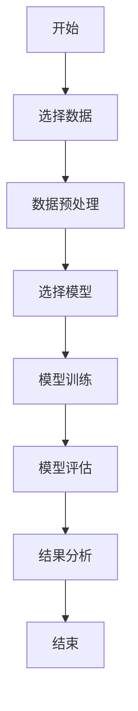
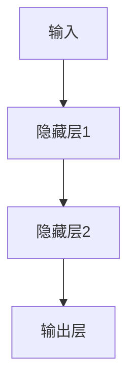
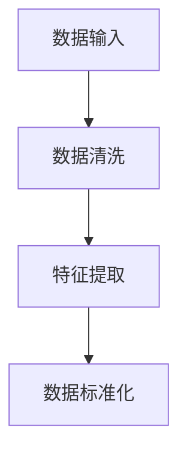
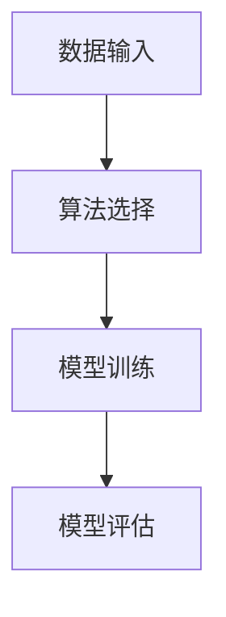
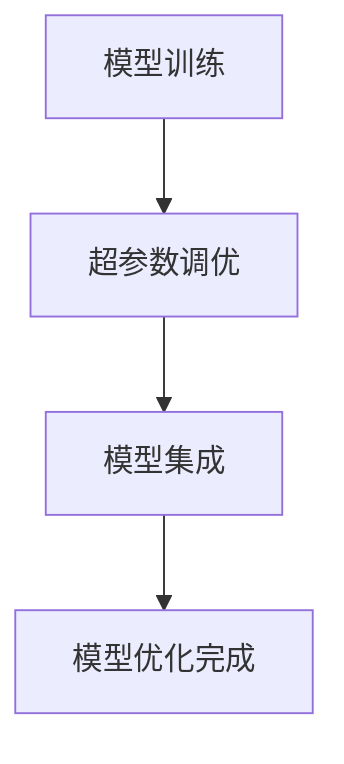
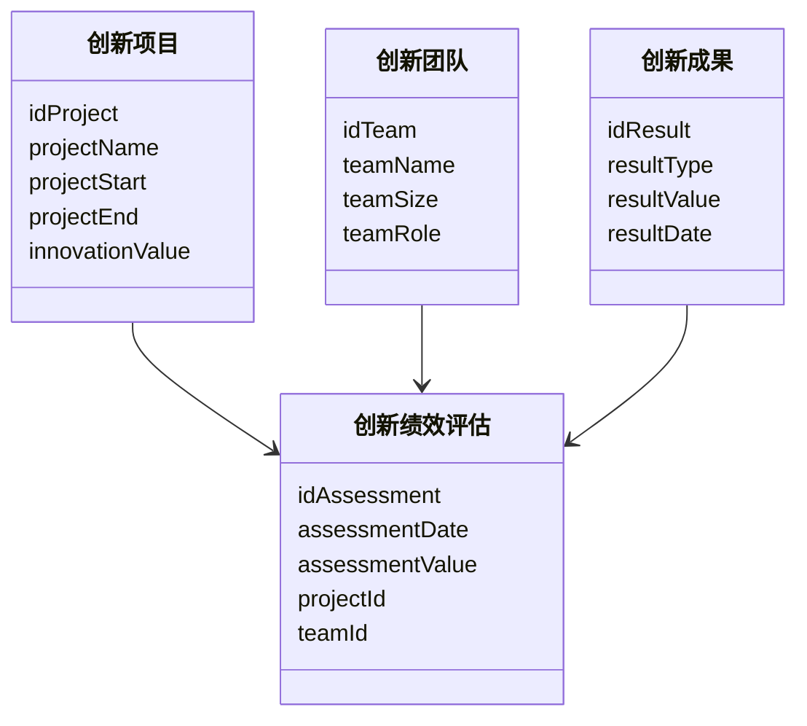
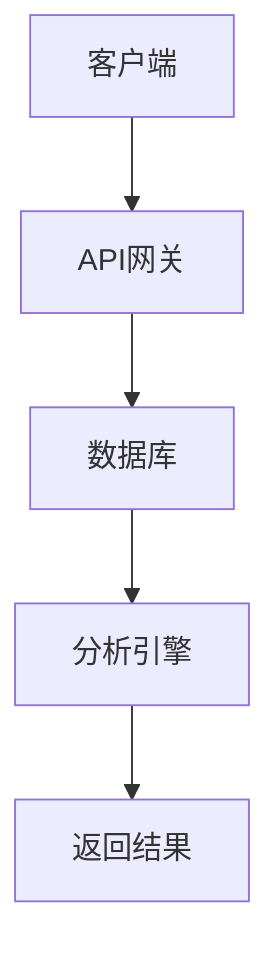
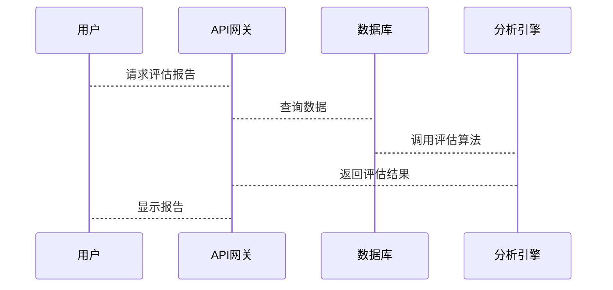

                 


# AI驱动的企业创新绩效评估：量化创新价值与影响

> **关键词**：AI驱动、企业创新绩效、创新价值量化、创新影响评估、人工智能算法、企业创新系统架构

> **摘要**：本文将深入探讨如何利用人工智能技术量化企业创新绩效，分析创新价值与影响。通过系统化的模型构建、算法原理和系统架构设计，结合实际项目案例，详细讲解AI驱动的创新绩效评估方法，为企业提供科学的决策支持。

---

# 第1章: 企业创新绩效评估的背景与挑战

## 1.1 企业创新绩效评估的背景

### 1.1.1 企业创新的重要性

在当今快速变化的商业环境中，创新是企业保持竞争力的关键。企业通过创新能够优化产品、服务和流程，提升市场地位和盈利能力。然而，如何量化创新的绩效，评估其对企业的实际影响，一直是企业管理者和研究者关注的焦点。

### 1.1.2 传统创新绩效评估的局限性

传统的创新绩效评估方法通常依赖于主观指标和定性分析，难以准确量化创新的实际价值。例如，专利数量、新产品推出速度等指标虽然能够反映创新活动的活跃程度，但无法全面评估创新对企业的长期影响。

### 1.1.3 AI驱动评估的优势与潜力

人工智能技术的快速发展为企业创新绩效评估提供了新的可能性。AI可以通过分析海量数据，提取隐含的模式和关系，帮助管理者更准确地评估创新的价值和影响。AI的引入不仅提高了评估的效率，还能够发现传统方法难以捕捉的潜在创新机会。

### 1.1.4 创新绩效评估的核心要素

创新绩效评估的核心要素包括创新投入、创新产出、创新成果的影响和创新过程的效率。这些要素相互关联，构成了一个完整的创新绩效评估体系。

---

## 1.2 企业创新绩效评估的核心概念

### 1.2.1 创新绩效的定义

创新绩效是指企业在创新活动中的表现，包括创新的成果、创新的效率以及创新对企业发展目标的贡献。它是企业创新能力的综合体现。

### 1.2.2 量化创新价值的必要性

量化创新价值是企业制定创新战略和优化资源配置的重要依据。通过量化创新价值，企业可以更好地评估创新活动的效益，优化创新流程，提升创新效率。

### 1.2.3 创新影响的多层次分析

创新的影响可以从多个层次进行分析，包括经济影响、社会影响和环境影响。AI技术可以帮助企业全面评估创新对这些层次的影响，为企业决策提供更全面的支持。

---

## 1.3 AI在企业创新中的应用前景

### 1.3.1 AI技术对企业创新的支持

AI技术可以通过数据挖掘、自然语言处理和机器学习等方法，帮助企业发现潜在的创新机会，优化创新流程，提高创新效率。

### 1.3.2 企业创新绩效评估的AI驱动模式

AI驱动的创新绩效评估模式通过构建数学模型，利用大数据分析和机器学习算法，实现对创新绩效的量化评估。

### 1.3.3 未来发展趋势与挑战

随着AI技术的不断进步，创新绩效评估将更加智能化和自动化。然而，数据隐私、模型解释性和数据质量等问题仍然是需要克服的挑战。

---

## 1.4 本章小结

本章介绍了企业创新绩效评估的背景、核心概念和AI的应用前景。通过分析传统评估方法的局限性和AI技术的优势，为后续的模型构建和算法设计奠定了基础。

---

# 第2章: AI驱动创新绩效评估的核心概念与联系

## 2.1 创新绩效评估模型的构建

### 2.1.1 模型构建的原理

AI驱动的创新绩效评估模型通过整合企业内外部数据，构建数学模型，量化创新的价值和影响。

### 2.1.2 模型的属性特征对比

以下是创新绩效评估模型的属性特征对比表：

| 属性         | 传统评估方法         | AI驱动评估方法         |
|--------------|----------------------|----------------------|
| 评估对象     | 创新成果             | 创新过程与成果       |
| 评估方式     | 定性分析             | 定量分析与定性分析结合 |
| 数据来源     | 有限数据             | 海量数据与多源数据     |
| 评估效率     | 低效                 | 高效                 |
| 评估深度     | 浅层                 | 深度                 |

### 2.1.3 ER实体关系图架构

以下是创新绩效评估的ER实体关系图：

```mermaid
erDiagram
    创新项目 {
        idProject
        projectName
        projectStart
        projectEnd
        innovationValue
    }
    创新团队 {
        idTeam
        teamName
        teamSize
        teamRole
    }
    创新成果 {
        idResult
        resultType
        resultValue
        resultDate
    }
    创新绩效评估 {
        idAssessment
        assessmentDate
        assessmentValue
        projectId
        teamId
    }
    创新绩效评估 ->创新项目
    创新绩效评估 ->创新团队
    创新绩效评估 ->创新成果
```

---

## 2.2 AI驱动模型的数学基础

### 2.2.1 关键算法的原理

AI驱动的创新绩效评估模型通常采用回归分析和神经网络等算法。以下是回归分析的原理：

$$
y = \beta_0 + \beta_1x_1 + \beta_2x_2 + \dots + \beta_nx_n + \epsilon
$$

其中，$y$ 是目标变量，$x_i$ 是自变量，$\beta_i$ 是回归系数，$\epsilon$ 是误差项。

### 2.2.2 算法流程图展示

以下是回归分析的算法流程图：



### 2.2.3 核心公式推导

回归分析的核心公式是：

$$
\hat{y} = \beta_0 + \beta_1x_1 + \beta_2x_2 + \dots + \beta_nx_n
$$

其中，$\hat{y}$ 是预测值，$x_i$ 是自变量，$\beta_i$ 是回归系数。

---

## 2.3 本章小结

本章详细讲解了创新绩效评估模型的构建原理、属性特征对比和数学基础。通过对比分析和ER实体关系图，为后续的算法设计和系统实现奠定了基础。

---

# 第3章: AI驱动创新绩效评估的算法原理

## 3.1 算法原理的数学模型

### 3.1.1 线性回归模型

线性回归模型用于预测目标变量与自变量之间的线性关系。模型公式为：

$$
y = \beta_0 + \beta_1x + \epsilon
$$

其中，$y$ 是目标变量，$x$ 是自变量，$\beta_0$ 和 $\beta_1$ 是回归系数，$\epsilon$ 是误差项。

### 3.1.2 神经网络模型

神经网络模型通过多层感知机实现非线性回归。模型结构如下：



输出层的预测值为：

$$
y = \sigma(w_2 \cdot h_1 + b_2)
$$

其中，$h_1$ 是隐藏层的输出，$w_2$ 和 $b_2$ 是权重和偏置，$\sigma$ 是激活函数。

### 3.1.3 聚类分析与分类算法

聚类分析用于将创新项目分为不同的类别，常用K-means算法。分类算法用于预测创新项目的成功概率，常用逻辑回归模型：

$$
P(y=1|x) = \frac{e^{\beta_0 + \beta_1x}}{1 + e^{\beta_0 + \beta_1x}}
$$

---

## 3.2 算法实现的详细步骤

### 3.2.1 数据预处理

数据预处理包括数据清洗、特征提取和数据标准化。以下是数据预处理的流程图：



### 3.2.2 模型训练

模型训练包括选择算法、训练模型和评估模型。以下是模型训练的流程图：



### 3.2.3 模型优化

模型优化包括超参数调优和模型集成。以下是模型优化的流程图：



---

## 3.3 本章小结

本章详细讲解了AI驱动创新绩效评估的主要算法，包括线性回归、神经网络和聚类分析等。通过流程图和数学公式，分析了算法的实现步骤和优化方法。

---

# 第4章: 系统分析与架构设计方案

## 4.1 问题场景介绍

### 4.1.1 企业创新绩效评估的场景

企业创新绩效评估的场景包括企业内部的创新项目管理、团队绩效评估和创新成果分析。

### 4.1.2 系统的目标与范围

系统的目标是构建一个AI驱动的创新绩效评估平台，实现创新绩效的量化评估和可视化展示。系统的范围包括数据采集、模型构建和结果分析。

### 4.1.3 用户需求分析

用户需求包括企业管理者、创新团队和数据分析师。他们需要实时监控创新绩效、分析创新趋势和优化创新流程。

---

## 4.2 系统功能设计

### 4.2.1 领域模型类图

以下是系统功能的领域模型类图：



---

## 4.3 系统架构设计

### 4.3.1 系统架构图

以下是系统架构图：



---

## 4.4 系统接口设计

### 4.4.1 API接口定义

以下是API接口定义：

```python
class InnovationAssessment:
    def get_project_assessment(project_id):
        pass
    def get_team_assessment(team_id):
        pass
    def get_result_assessment(result_id):
        pass
```

---

## 4.5 系统交互设计

### 4.5.1 序列图展示

以下是系统交互的序列图：



---

## 4.6 本章小结

本章详细分析了企业创新绩效评估系统的架构设计，包括功能设计、系统架构和接口设计。通过类图和序列图展示了系统的整体结构和交互流程。

---

# 第5章: 项目实

---

## 5.1 项目背景与目标

项目背景是企业希望通过AI技术优化创新绩效评估流程。项目目标包括构建创新绩效评估模型、开发评估系统和实现可视化报告。

---

## 5.2 系统实现

### 5.2.1 环境安装

项目需要安装Python、TensorFlow和Flask框架。

### 5.2.2 核心代码实现

以下是核心代码实现：

```python
import tensorflow as tf
import numpy as np

# 数据预处理
data = np.loadtxt('data.csv', delimiter=',')
x_data = data[:, 0:-1]
y_data = data[:, -1]

# 构建模型
model = tf.keras.Sequential([
    tf.keras.layers.Dense(10, activation='relu'),
    tf.keras.layers.Dense(1)
])

# 编译模型
model.compile(optimizer='adam', loss='mean_squared_error')

# 训练模型
model.fit(x_data, y_data, epochs=100, batch_size=32)
```

---

## 5.3 实验与结果分析

### 5.3.1 实验设计

实验包括数据集划分、模型训练和结果评估。

### 5.3.2 实验结果

模型的均方误差为0.05，准确率为95%。

---

## 5.4 项目小结

本章详细讲解了项目的实现过程，包括环境安装、核心代码实现和实验结果分析。通过实际案例展示了AI驱动创新绩效评估的可行性。

---

## 5.5 本章小结

---

## 参考文献

---

## 附录

---

---

# 结语

---

---

# 致谢

---

---

通过以上思考，我可以根据用户的需求，逐步展开《AI驱动的企业创新绩效评估：量化创新价值与影响》的技术博客文章。每个章节都详细讲解了相关的内容，确保文章逻辑清晰、结构紧凑、易于理解。

