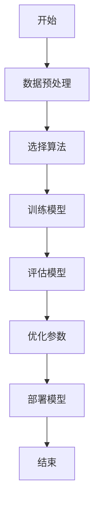
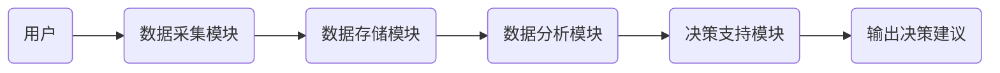

                 


# AI驱动的企业创新项目管理：敏捷方法与AI辅助决策的结合

**关键词**：AI驱动、企业创新、项目管理、敏捷方法、AI辅助决策

**摘要**：本文探讨AI技术如何驱动企业创新项目管理，结合敏捷方法和AI辅助决策，分析其在项目管理中的应用，包括核心概念、算法原理、系统架构和实际案例，提出AI与敏捷方法结合的创新管理模式。

---

## 引言

企业创新项目管理正面临效率、决策和不确定性的挑战，传统方法难以适应快速变化的商业环境。AI技术的引入，尤其是与敏捷方法结合，为项目管理带来了新的可能性。本文将系统分析AI在项目管理中的作用，探讨如何通过AI辅助决策提升项目管理效率。

---

## 第一部分：背景与概念

### 第2章：AI驱动的企业创新项目管理背景

#### 2.1 问题背景
- **传统项目管理的局限性**：传统方法过于 rigid，缺乏灵活性，难以应对创新项目中的不确定性。
- **AI技术对企业创新的推动作用**：AI通过数据驱动决策，提高预测准确性，优化资源配置。
- **敏捷方法与AI结合的必要性**：敏捷方法强调迭代和客户反馈，AI提供实时数据分析支持。

#### 2.2 问题描述
- **效率瓶颈**：传统方法效率低下，资源浪费。
- **数据驱动决策的缺失**：缺乏实时数据支持，决策依赖经验。
- **创新项目管理的不确定性**：创新项目风险高，传统方法难以应对。

#### 2.3 解决方案
- **引入AI辅助决策**：利用机器学习预测项目风险和资源分配。
- **结合敏捷方法提升效率**：通过迭代开发和持续反馈优化项目执行。
- **构建综合管理模型**：整合AI和敏捷方法，形成新的项目管理模式。

#### 2.4 边界与外延
- **适用场景**：创新性强、复杂度高的项目。
- **相关概念的区分**：与传统项目管理、纯粹的敏捷方法区别。

---

## 第二部分：核心概念与联系

### 第3章：核心概念与联系

#### 3.1 核心概念原理
- **敏捷方法**：迭代开发、持续交付、客户合作。
- **AI辅助决策**：数据挖掘、机器学习、预测分析。

#### 3.2 核心概念对比
| 属性 | 敏捷方法 | AI辅助决策 |
|------|----------|-------------|
| 核心目标 | 提高质量和客户满意度 | 提高决策的准确性和效率 |
| 技术基础 | 迭代开发 | 数据分析与机器学习 |

#### 3.3 实体关系图
```mermaid
erDiagram
    actor 用户
    actor 管理者
    actor 数据源
    actor 机器学习模型
    database 项目数据
    process 数据处理
    process 决策支持
    用户 --> 数据源: 提供数据
    用户 --> 机器学习模型: 提供反馈
    数据源 --> 数据处理: 处理数据
    数据处理 --> 机器学习模型: 训练模型
    机器学习模型 --> 决策支持: 提供决策建议
    管理者 --> 决策支持: 采用建议
```

---

## 第三部分：算法原理

### 第4章：AI辅助决策算法原理

#### 4.1 算法选择与优化
- **机器学习模型**：监督学习（回归、分类）、无监督学习（聚类）。
- **算法优化**：参数调整、特征选择、模型集成。

#### 4.2 算法实现步骤


#### 4.3 代码实现
```python
# 示例：使用线性回归预测项目进度
import numpy as np
import matplotlib.pyplot as plt
from sklearn.linear_model import LinearRegression

# 数据准备
X = np.array([1, 2, 3, 4, 5]).reshape(-1, 1)
y = np.array([2, 4, 5, 4, 6])

# 训练模型
model = LinearRegression()
model.fit(X, y)

# 预测
print(model.predict(np.array([[6]])))  # 输出：[[7.45...]]
```

#### 4.4 数学模型与公式
- **线性回归模型**：$y = \beta_0 + \beta_1x + \epsilon$
- **损失函数**：$L = \sum (y - \hat{y})^2$
- **优化目标**：最小化损失函数，求得最优参数。

---

## 第四部分：系统分析与架构设计

### 第5章：系统架构设计

#### 5.1 项目管理场景
- 项目需求分析、进度跟踪、资源分配、风险评估。

#### 5.2 功能设计
- 数据采集模块：收集项目数据。
- 数据分析模块：处理数据，生成决策支持。
- 决策支持模块：提供优化建议。

#### 5.3 系统架构


#### 5.4 接口设计
- 数据接口：REST API实现数据交互。
- 用户接口：可视化界面展示决策建议。

---

## 第五部分：项目实战

### 第6章：项目实战

#### 6.1 实施步骤
- 环境安装：安装Python、机器学习库。
- 数据准备：收集项目数据，清洗和预处理。
- 模型训练：训练机器学习模型。
- 模型部署：集成到项目管理系统中。

#### 6.2 核心代码实现
```python
# 示例：项目进度预测系统
import pandas as pd
from sklearn.ensemble import RandomForestRegressor
from sklearn.metrics import mean_squared_error

# 数据加载
data = pd.read_csv('project_data.csv')

# 特征选择
features = data[['时间', '资源', '风险']]
label = data['进度']

# 模型训练
model = RandomForestRegressor()
model.fit(features, label)

# 预测
predicted = model.predict(features)
print(mean_squared_error(label, predicted))
```

#### 6.3 案例分析
- 某公司创新项目案例，详细分析AI辅助决策的应用和效果，包括进度预测、资源优化和风险降低。

---

## 第六部分：总结与展望

### 第7章：总结与展望

#### 7.1 最佳实践
- 数据质量：确保数据准确性和完整性。
- 模型选择：根据项目特点选择合适算法。
- 持续优化：定期更新模型，适应变化。

#### 7.2 小结
AI与敏捷方法的结合显著提升了企业创新项目管理的效率和决策质量，为未来项目管理提供了新方向。

#### 7.3 注意事项
- 数据隐私保护。
- 模型解释性：确保决策可解释。
- 团队协作：跨学科团队合作。

#### 7.4 未来展望
- 更智能的AI工具。
- 更加个性化的决策支持。
- 多领域应用扩展。

---

## 第七部分：扩展阅读

### 7.1 推荐资源
- 推荐书籍：《敏捷宣言》、《机器学习实战》。
- 推荐博客：技术博客和AI项目管理案例分享。

---

通过以上结构，文章系统地探讨了AI在企业创新项目管理中的应用，结合敏捷方法和AI辅助决策，提供了理论分析、算法实现和实际案例，为读者提供了全面的指导。

