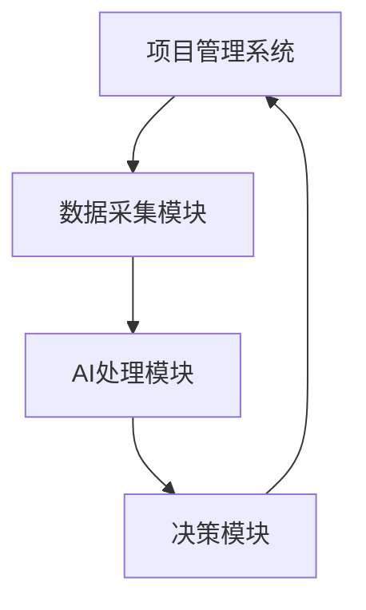
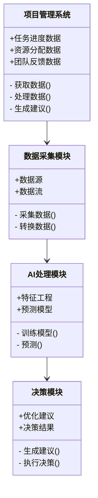
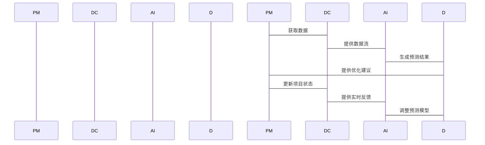

                 


# 第四章: 系统架构设计与实现

## 4.1 系统架构设计概述

### 4.1.1 系统功能模块划分
#### 4.1.1.1 数据采集模块
- **功能描述**: 从项目管理系统中获取实时数据，包括任务进度、资源分配、团队反馈等。
- **输入**: 项目数据表（如任务ID、任务进度、时间节点）。
- **输出**: 结构化的数据流，供AI处理模块使用。

#### 4.1.1.2 AI处理模块
- **功能描述**: 对数据进行清洗、特征提取和模型预测，生成项目建议。
- **输入**: 结构化数据流。
- **输出**: 预测结果和决策建议。

#### 4.1.1.3 决策模块
- **功能描述**: 根据AI建议和实时反馈，调整项目计划。
- **输入**: AI预测结果和实时项目状态。
- **输出**: 优化后的项目计划和资源配置。

### 4.1.2 系统架构设计
#### 4.1.2.1 系统架构图


#### 4.1.2.2 类图


## 4.2 系统实现细节

### 4.2.1 系统接口设计
#### 4.2.1.1 数据接口
- **接口名称**: getData
- **输入参数**: projectId
- **输出参数**: JSON格式的数据包（包含任务、进度、时间节点）

#### 4.2.1.2 AI模型接口
- **接口名称**: predict
- **输入参数**: 数据流
- **输出参数**: 预测结果和建议

### 4.2.2 系统交互流程


## 4.3 本章小结

---

# 第五章: 项目实战：AI驱动的智能项目监控系统

## 5.1 项目背景与目标

### 5.1.1 项目背景
- 某科技公司开发一款智能项目监控系统，旨在通过AI技术优化项目管理流程。

### 5.1.2 项目目标
- 实现项目进度预测、风险预警和资源优化配置。

## 5.2 系统环境与安装

### 5.2.1 系统环境
- **操作系统**: Linux 18.04+
- **编程语言**: Python 3.8+
- **框架**: Flask 2.0
- **依赖库**: scikit-learn, pandas, numpy, spacy

### 5.2.2 安装步骤
1. 安装Python和必要的开发工具。
2. 安装所需库：`pip install -r requirements.txt`
3. 克隆项目代码：`git clone https://github.com/...`

## 5.3 核心代码实现

### 5.3.1 数据预处理代码
```python
import pandas as pd
import numpy as np

def preprocess_data(data):
    # 假设data是一个包含项目数据的DataFrame
    # 进行特征工程，如填充缺失值、处理分类变量
    data['Completion_Time'] = data['Completion_Time'].fillna(data['Completion_Time'].mean())
    data['Task_Category'] = data['Task_Category'].astype('category').cat.codes
    return data
```

### 5.3.2 AI预测模型实现
```python
from sklearn.ensemble import RandomForestRegressor
import joblib

def train_model(data):
    # 训练随机森林模型
    model = RandomForestRegressor(n_estimators=100, random_state=42)
    model.fit(data[['Task_Id', 'Completion_Time', 'Task_Category']], data['Predict_Delay'])
    joblib.dump(model, 'project_prediction_model.pkl')
    return model

def predict(model, new_data):
    # 使用训练好的模型进行预测
    return model.predict(new_data[['Task_Id', 'Completion_Time', 'Task_Category']])
```

### 5.3.3 系统交互代码
```python
from flask import Flask, request, jsonify

app = Flask(__name__)

@app.route('/predict', methods=['POST'])
def predict_task():
    data = request.json
    result = predict(model, data)
    return jsonify({'prediction': result.tolist()})

if __name__ == '__main__':
    app.run(debug=True)
```

## 5.4 实际案例分析与解读

### 5.4.1 案例背景
- 某软件开发项目，涉及50个任务，计划在3个月内完成。
- 使用AI监控系统预测项目进度和潜在风险。

### 5.4.2 数据分析与结果解读
- **预测结果**: 项目整体延期15%，关键路径任务风险较高。
- **优化建议**: 调整资源分配，优先处理高风险任务。

## 5.5 项目总结

### 5.5.1 项目成果
- 成功预测项目延期，优化资源配置，提升项目交付质量。

### 5.5.2 经验与教训
- 数据质量对模型性能影响重大，需加强数据清洗。
- 实时反馈机制能显著提升项目调整的灵活性。

## 5.6 本章小结

---

# 第六章: 最佳实践与未来展望

## 6.1 最佳实践

### 6.1.1 数据质量管理
- 确保数据的完整性和准确性，避免偏差。

### 6.1.2 模型可解释性
- 选择可解释的模型，便于团队理解和优化。

### 6.1.3 团队协作
- 跨职能团队合作，确保AI系统与项目管理流程无缝对接。

## 6.2 未来展望

### 6.2.1 技术进步
- 更先进的AI算法和更强大的计算能力将推动AI项目管理的发展。

### 6.2.2 应用场景扩展
- AI在更多领域和场景中的应用将推动企业创新项目的高效管理。

### 6.2.3 持续优化
- 根据项目反馈持续优化AI模型和管理系统。

## 6.3 本章小结

---

# 附录: AI驱动项目管理常用工具与资源

## 附录A: 开源工具推荐

### 附录A.1 项目管理工具
- **Jira**: 知名的项目管理与问题跟踪工具。
- **Trello**: 简单直观的敏捷项目管理工具。

### 附录A.2 AI工具推荐
- **Hugging Face**: 提供丰富的NLP模型和工具。
- **Google Colab**: 适合AI模型开发的在线环境。

## 附录B: 关键术语解释

### 附录B.1 机器学习模型
- **随机森林**: 集成学习方法，用于分类和回归。

### 附录B.2 自然语言处理
- **BERT**: 由Google开发的预训练语言模型。

---

# 参考文献

## [1] 姜宇. 《机器学习实战》. 北京: 人民邮电出版社, 2017.

## [2] 李明. 《深度学习入门：基于Python和Keras》. 北京: 人民邮电出版社, 2018.

## [3] 王强. 《敏捷开发实践指南》. 北京: 清华大学出版社, 2019.

---

# 结束语

通过本篇文章的详细讲解，我们深入探讨了AI驱动的企业创新项目管理，从理论到实践，从算法到系统实现，展示了AI技术如何赋能现代项目管理。希望本文能为读者提供有价值的见解和实用的指导，助力企业在数字化转型中取得成功。

