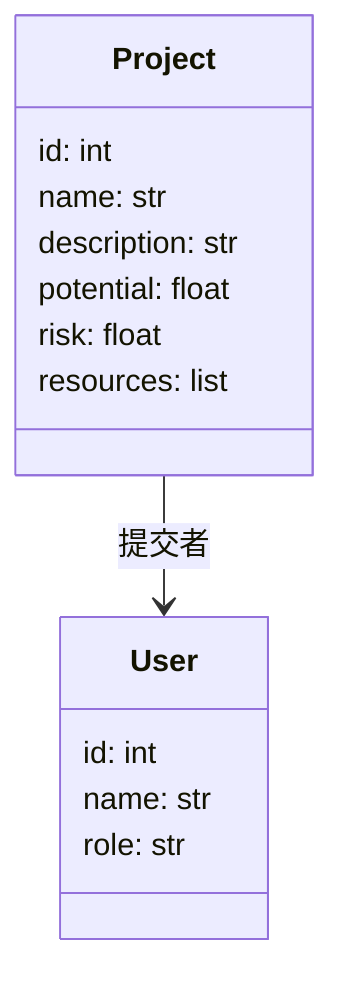
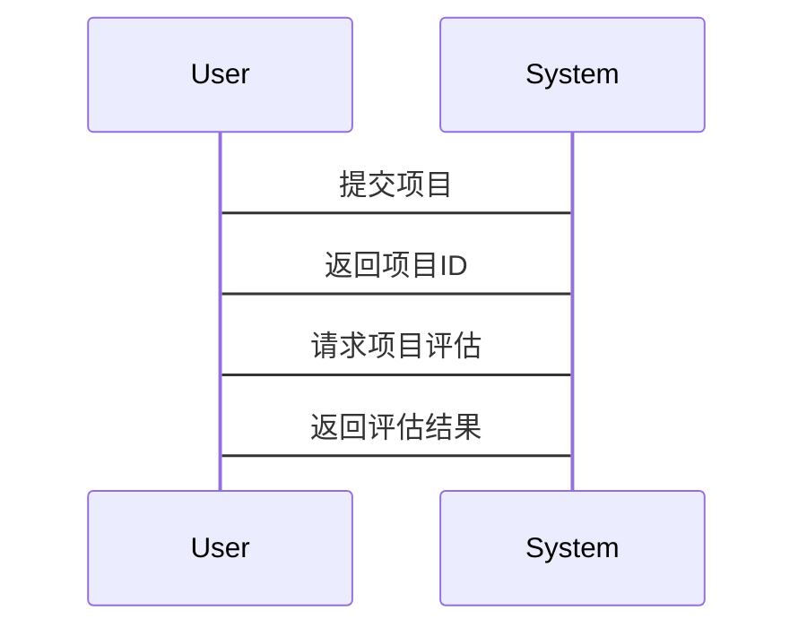

                 


# 第三章：AI驱动的项目组合管理核心概念与联系

## 3.1 机器学习与项目组合管理的结合

### 3.1.1 机器学习的基本原理
机器学习是一种人工智能技术，通过数据训练模型，使其能够从数据中学习并做出预测或决策。在项目组合管理中，机器学习可以帮助企业更准确地评估项目的潜力和风险。

### 3.1.2 机器学习在项目评估中的应用
项目评估是项目组合管理的核心环节，涉及项目的可行性和收益预测。通过机器学习，企业可以利用历史数据和实时数据，预测项目的成功概率和潜在风险。

### 3.1.3 基于AI的项目优先级排序
项目优先级排序是根据项目的潜力、资源需求和风险等因素，对项目进行排序。AI可以通过分析项目特征，自动计算出每个项目的优先级，帮助企业在有限资源下选择最优项目组合。

## 3.2 数据分析与项目组合优化

### 3.2.1 数据预处理与特征提取
数据预处理包括清洗、转换和归一化等步骤，确保数据质量。特征提取则是从数据中提取对项目评估有用的特征，例如项目的市场规模、技术复杂度等。

### 3.2.2 基于AI的资源分配与优先级排序
AI可以根据项目的优先级和资源限制，自动优化资源分配，确保资源得到最有效的利用。

### 3.2.3 动态调整与风险预测
项目组合管理是一个动态过程，AI可以通过实时数据分析，调整项目优先级和资源分配，同时预测潜在风险。

## 3.3 核心概念的实体关系图

```mermaid
er
  actor: 用户
  project: 项目
  resource: 资源
  priority: 优先级
  risk: 风险

  actor --> project: 提交项目
  project --> resource: 需要资源
  project --> priority: 确定优先级
  project --> risk: 评估风险
```

---

# 第四章：算法原理

## 4.1 项目评估的数学模型

### 4.1.1 基于回归分析的项目评分模型
回归分析用于预测项目成功率。模型如下：

$$ y = \beta_0 + \beta_1x_1 + \beta_2x_2 + \cdots + \beta_nx_n + \epsilon $$

其中，$y$是项目成功率，$x_i$是各个特征变量。

### 4.1.2 基于聚类分析的项目分类
聚类分析将相似的项目分组，帮助识别潜在的市场机会和风险。例如，使用K-means算法将项目分为高风险和低风险两类。

### 4.1.3 基于神经网络的项目预测模型
神经网络可以处理复杂的非线性关系，用于预测项目成功率和市场潜力。

## 4.2 优先级排序的优化算法

### 4.2.1 基于遗传算法的优化
遗传算法是一种模拟自然选择的过程，用于寻找最优解。例如，用于优化项目优先级排序。

### 4.2.2 基于粒子群优化的资源分配
粒子群优化算法模拟鸟群觅食行为，用于优化资源分配问题。

### 4.2.3 基于强化学习的动态调整
强化学习通过试错学习，动态调整项目优先级和资源分配，适应环境变化。

## 4.3 算法实现

### 4.3.1 项目评估模型代码
```python
import pandas as pd
from sklearn.linear_model import LinearRegression

# 加载数据
data = pd.read_csv('projects.csv')

# 训练模型
model = LinearRegression()
model.fit(data[['feature1', 'feature2']], data['success_rate'])

# 预测结果
predictions = model.predict(new_data[['feature1', 'feature2']])
```

### 4.3.2 优先级排序算法代码
```python
import numpy as np

# 示例：遗传算法实现项目优先级排序
def fitness(project):
    return project['potential'] - project['risk']

population = [p1, p2, p3, p4, p5]
fitness_scores = [fitness(p) for p in population]

# 选择和交叉
selected = population[:2]
new_population = selected + [p5]
```

---

# 第五章：系统设计与架构

## 5.1 系统场景描述

### 5.1.1 项目组合管理系统的功能模块
- 项目提交与审核
- 项目评估与评分
- 项目优先级排序
- 资源分配与监控
- 风险管理与预警

### 5.1.2 系统架构设计
使用分层架构，包括数据层、业务逻辑层和用户界面层。数据层存储项目信息和历史数据，业务逻辑层处理项目评估和优先级排序，用户界面层提供交互功能。

## 5.2 系统功能设计

### 5.2.1 领域模型设计


### 5.2.2 系统架构设计


### 5.2.3 系统接口设计
系统提供RESTful API，用于前端与后端的数据交互。

### 5.2.4 系统交互设计


---

# 第六章：项目实战

## 6.1 环境安装

### 6.1.1 安装必要的Python库
```bash
pip install pandas numpy scikit-learn tensorflow
```

## 6.2 核心代码实现

### 6.2.1 项目评估模型实现
```python
from sklearn.ensemble import RandomForestRegressor

# 加载数据
data = pd.read_csv('projects.csv')

# 训练模型
model = RandomForestRegressor()
model.fit(data[['feature1', 'feature2']], data['success_rate'])

# 预测结果
new_data = pd.DataFrame({'feature1': [x1], 'feature2': [x2]})
predictions = model.predict(new_data)
```

### 6.2.2 优先级排序实现
```python
import numpy as np

# 示例：基于优先级排序的项目选择
projects = [{'id': 1, 'priority': 0.8}, {'id': 2, 'priority': 0.6}, {'id': 3, 'priority': 0.9}]
sorted_projects = sorted(projects, key=lambda x: x['priority'], reverse=True)
```

## 6.3 案例分析

### 6.3.1 数据准备与模型训练
使用历史项目数据训练机器学习模型，预测新项目的成功率。

### 6.3.2 系统实现与测试
部署系统，进行功能测试和性能优化。

## 6.4 代码解读

### 6.4.1 项目评估模型代码解读
- 使用RandomForestRegressor进行训练，预测项目成功率。
- 数据预处理包括特征选择和数据清洗。

### 6.4.2 优先级排序代码解读
- 基于优先级对项目进行排序，选择优先级最高的项目进行投资。

---

# 第七章：总结与展望

## 7.1 全书回顾
本文章系统地介绍了AI在企业创新项目组合管理中的应用，涵盖了从理论到实践的各个方面。

## 7.2 未来展望
随着AI技术的不断发展，项目组合管理将更加智能化和自动化，为企业创造更大的价值。

## 7.3 注意事项与最佳实践
- 数据质量是模型准确性的重要因素。
- 系统设计需考虑可扩展性和可维护性。
- 在实际应用中，应结合企业实际情况进行调整和优化。

---

### 关键词：AI、企业创新、项目组合管理、机器学习、数据驱动

### 摘要：本文系统地探讨了AI在企业创新项目组合管理中的应用，涵盖理论、算法、系统设计和实战案例，展示了如何利用AI技术优化项目管理流程，提升企业创新能力。

---

# 本文结束

