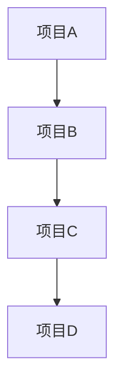
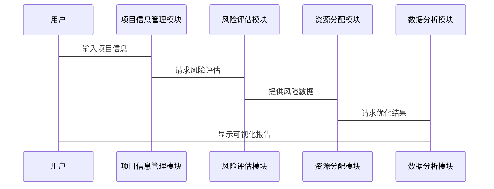

                 


# AI驱动的企业创新项目组合管理：风险平衡与资源优化

## 关键词：人工智能、项目组合管理、风险平衡、资源优化、创新项目、企业战略

## 摘要：本文探讨了如何利用人工智能技术优化企业创新项目的组合管理，重点关注风险平衡与资源优化的核心问题。通过分析AI算法、系统架构设计和实际案例，本文详细阐述了AI在项目组合管理中的应用，为企业在创新项目管理中提供新的思路和方法。

---

## 第1章: AI驱动的企业创新项目组合管理概述

### 1.1 项目组合管理的背景与重要性

#### 1.1.1 项目组合管理的基本概念
项目组合管理（Portfolio Management）是指企业在有限资源约束下，对多个项目进行选择、优先排序和管理的过程，旨在实现企业战略目标的最大化。传统的项目组合管理依赖人工决策，存在效率低、主观性强、难以量化等问题。

#### 1.1.2 传统项目组合管理的局限性
- **信息不全**：传统方法依赖主观判断，缺乏数据支持。
- **计算复杂**：多个项目的组合优化需要复杂的数学计算，人工难以高效完成。
- **动态调整困难**：市场环境和项目需求变化快，传统方法难以快速响应。

#### 1.1.3 AI驱动项目组合管理的必要性
AI技术的引入可以弥补传统方法的不足：
- **数据驱动决策**：利用历史数据和实时数据，进行精准预测和优化。
- **自动化与智能化**：通过机器学习算法自动优化项目组合，提升效率。
- **动态调整能力**：AI能够实时分析变化，快速调整项目组合。

### 1.2 企业创新项目的挑战与机遇

#### 1.2.1 企业创新项目的复杂性
- 创新项目具有高度不确定性，失败率高。
- 各项目之间可能存在资源竞争，需平衡优先级。
- 创新项目的成功往往依赖于外部环境和内部资源的动态变化。

#### 1.2.2 创新项目组合管理的核心问题
- **风险平衡**：如何在高风险和高回报之间找到最佳平衡点。
- **资源分配**：如何在有限资源下最大化项目组合的总体价值。
- **动态调整**：如何应对市场变化和项目执行中的突发情况。

#### 1.2.3 AI技术在创新项目管理中的应用前景
- **预测模型**：基于历史数据预测项目成功概率和回报。
- **优化算法**：通过强化学习优化项目组合的优先级和资源分配。
- **实时监控**：利用自然语言处理技术分析项目执行中的风险。

### 1.3 本章小结
本章介绍了AI驱动的项目组合管理的基本概念、传统方法的局限性以及AI技术在创新项目管理中的应用前景。通过AI技术，企业可以更高效地进行项目组合管理，实现风险平衡与资源优化。

---

## 第2章: AI驱动项目组合管理的核心算法与数学模型

### 2.1 项目组合管理的数学模型

#### 2.1.1 项目组合管理的基本数学框架
项目组合管理可以看作是一个多目标优化问题，目标函数通常包括最大化项目组合的总体价值、最小化风险等。

$$\text{目标函数：} \quad \max \sum_{i=1}^n w_i v_i - \lambda \sum_{i=1}^n w_i r_i$$

其中：
- \(w_i\) 表示项目 \(i\) 的权重。
- \(v_i\) 表示项目 \(i\) 的价值。
- \(r_i\) 表示项目 \(i\) 的风险。
- \(\lambda\) 表示风险惩罚系数。

#### 2.1.2 项目组合优化的数学表达
项目组合优化的目标是在资源约束下选择最优的项目组合。

$$\text{约束条件：} \quad \sum_{i=1}^n w_i c_i \leq C$$

其中：
- \(c_i\) 表示项目 \(i\) 的成本。
- \(C\) 表示总预算。

#### 2.1.3 风险平衡的数学模型
风险平衡可以通过调整权重来实现。

$$\text{风险平衡：} \quad \sum_{i=1}^n w_i r_i = R$$

其中：
- \(R\) 表示企业可接受的总体风险水平。

### 2.2 基于AI的项目组合优化算法

#### 2.2.1 基于机器学习的项目预测模型
机器学习模型可以用于预测项目成功概率。常用的算法包括逻辑回归（Logistic Regression）和随机森林（Random Forest）。

##### 逻辑回归模型
$$P(\text{成功}) = \frac{1}{1 + e^{-\beta x}}$$

其中：
- \(x\) 表示项目特征向量。
- \(\beta\) 表示模型参数。

##### 随机森林模型
随机森林通过集成学习提高预测准确性。

#### 2.2.2 基于强化学习的决策优化算法
强化学习可以用于动态调整项目组合。

##### Q-Learning算法
$$Q(s, a) = Q(s, a) + \alpha [r + \gamma \max Q(s', a') - Q(s, a)]$$

其中：
- \(s\) 表示状态（当前项目组合）。
- \(a\) 表示动作（调整项目优先级）。
- \(\alpha\) 表示学习率。
- \(\gamma\) 表示折扣因子。

#### 2.2.3 基于图论的项目依赖关系分析
图论可以用于分析项目之间的依赖关系。

##### 项目依赖关系图


### 2.3 算法实现与案例分析

#### 2.3.1 算法实现步骤
1. 数据预处理：清洗数据，提取特征。
2. 模型训练：训练机器学习模型，预测项目成功概率。
3. 优化计算：使用强化学习算法优化项目组合。

#### 2.3.2 案例分析与结果解读
假设某公司有三个创新项目，分别为A、B、C，每个项目有不同的价值、成本和风险。通过AI算法优化，最终选择项目B和C，总成本为预算上限，风险在可接受范围内。

#### 2.3.3 算法的优缺点与改进方向
- **优点**：自动化、高效、精准。
- **缺点**：依赖数据质量，模型可能过拟合。
- **改进方向**：结合领域知识，优化模型解释性。

### 2.4 本章小结
本章详细介绍了AI驱动项目组合管理的核心算法和数学模型，包括机器学习、强化学习和图论的应用。通过案例分析，展示了AI技术在项目组合优化中的实际应用。

---

## 第3章: 系统架构与项目组合管理平台设计

### 3.1 系统功能需求分析

#### 3.1.1 项目信息管理模块
- **功能**：录入、管理项目信息。
- **输入**：项目名称、预算、时间、团队等。
- **输出**：项目信息列表。

#### 3.1.2 风险评估与预警模块
- **功能**：评估项目风险，生成预警。
- **输入**：项目特征、市场数据。
- **输出**：风险评分、预警信息。

#### 3.1.3 资源分配与优化模块
- **功能**：优化项目组合，分配资源。
- **输入**：项目信息、预算、资源限制。
- **输出**：优化后的项目组合。

#### 3.1.4 数据分析与可视化模块
- **功能**：分析项目数据，生成可视化报告。
- **输入**：项目数据。
- **输出**：数据可视化图表。

### 3.2 系统架构设计

#### 3.2.1 系统架构的分层设计


#### 3.2.2 模块之间的交互关系


#### 3.2.3 系统的可扩展性设计
通过模块化设计，系统可以方便地扩展功能。

### 3.3 系统接口设计

#### 3.3.1 API接口设计
- **API 1**：`POST /projects`，录入项目信息。
- **API 2**：`GET /risk-assessment`，获取风险评估结果。
- **API 3**：`POST /resource-allocation`，请求资源分配。

#### 3.3.2 数据接口规范
- 数据格式：JSON。
- 接口协议：RESTful API。

#### 3.3.3 用户接口设计
- **前端**：Web界面，用户友好。
- **后端**：提供API接口，支持前后端分离。

### 3.4 本章小结
本章设计了AI驱动的项目组合管理系统的架构，详细描述了各模块的功能和交互关系。通过模块化设计，系统具有良好的可扩展性和可维护性。

---

## 第4章: 项目实战与案例分析

### 4.1 项目实战

#### 4.1.1 环境搭建与工具安装
- **开发环境**：Python、Jupyter Notebook。
- **AI框架**：TensorFlow、Scikit-learn。
- **数据库**：MySQL、MongoDB。

#### 4.1.2 核心代码实现
##### 1. 数据预处理代码
```python
import pandas as pd
import numpy as np

data = pd.read_csv('projects.csv')
data = data.dropna()
data = pd.get_dummies(data)
```

##### 2. 模型训练代码
```python
from sklearn.ensemble import RandomForestClassifier
model = RandomForestClassifier()
model.fit(X_train, y_train)
```

##### 3. 系统功能实现代码
```python
def optimize_portfolio(projects, budget):
    # 简化优化逻辑
    selected = []
    remaining_budget = budget
    for project in projects:
        if remaining_budget >= project.cost:
            selected.append(project)
            remaining_budget -= project.cost
        else:
            break
    return selected
```

#### 4.1.3 代码解读与优化
- **数据预处理**：清洗数据，转换特征。
- **模型训练**：使用随机森林进行分类。
- **系统功能**：实现项目组合优化。

#### 4.1.4 实际案例分析
以某公司为例，分析如何通过AI算法优化项目组合。

### 4.2 本章小结
本章通过实际案例分析，展示了AI驱动项目组合管理的实施过程。从环境搭建到代码实现，再到案例分析，详细阐述了AI技术在项目组合管理中的应用。

---

## 第5章: 最佳实践与总结

### 5.1 最佳实践

#### 5.1.1 数据质量
- 确保数据准确、完整。
- 数据清洗是关键。

#### 5.1.2 模型选择
- 根据具体问题选择合适的算法。
- 多算法对比，选择最优方案。

#### 5.1.3 系统集成
- 系统模块化设计。
- 确保接口兼容性。

### 5.2 小结
通过本篇文章的分析和实践，我们深入探讨了AI驱动的企业创新项目组合管理的核心问题，包括算法、系统架构和实际案例。AI技术的应用为企业提供了新的思路和方法，帮助企业更好地进行项目组合管理。

### 5.3 注意事项

#### 5.3.1 数据隐私
- 注意数据隐私保护。
- 遵守相关法律法规。

#### 5.3.2 模型解释性
- 提升模型的可解释性。
- 避免黑箱模型带来的风险。

### 5.4 拓展阅读
- 推荐阅读《机器学习实战》。
- 关注AI在项目管理领域的最新研究。

---

## 附录: 参考文献

- Bishop, C. M. (2006). Pattern Recognition and Machine Learning.
- LeCun, Y., Bengio, Y., & Hinton, G. (2015). Deep learning.
- Russell, S., & Norvig, P. (2010). Artificial Intelligence: A Modern Approach.

---

通过以上结构和内容，您可以撰写一篇完整的关于AI驱动的企业创新项目组合管理的技术博客文章。

