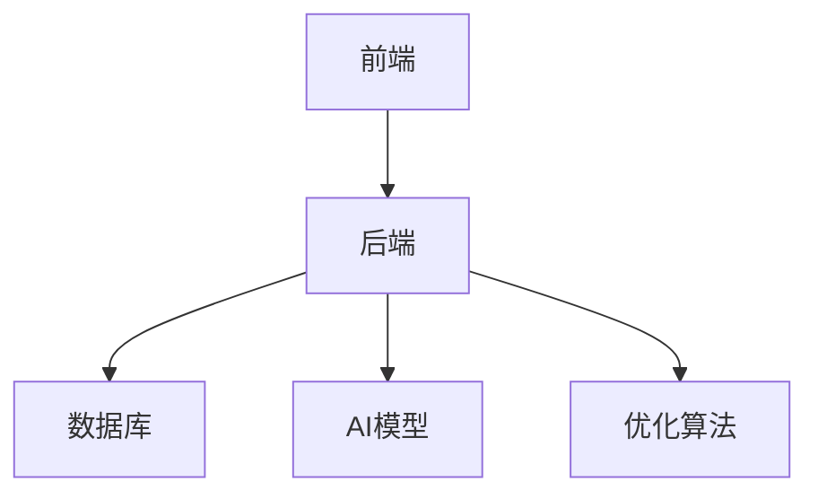

                 


# AI驱动的企业创新项目组合管理：风险平衡与资源优化的智能化

## 关键词：
人工智能、项目组合管理、风险平衡、资源优化、深度学习、机器学习、企业创新

## 摘要：
随着企业创新步伐的加快，传统的项目组合管理方式逐渐暴露出效率低下、风险难以平衡和资源浪费等问题。本文将探讨如何利用人工智能技术，构建智能化的项目组合管理模型，实现风险平衡与资源优化。通过分析AI驱动的创新项目组合管理的核心概念、算法原理和系统架构，本文将为企业提供一种更高效、更精准的管理方式，助力企业在快速变化的市场环境中保持竞争优势。

---

# 第一部分：AI驱动的企业创新项目组合管理概述

## 第1章：企业创新项目组合管理的背景与挑战

### 1.1 项目组合管理的核心概念

#### 1.1.1 项目组合管理的定义与目标
项目组合管理（Portfolio Management）是通过选择、优化和监控一组项目，以实现组织战略目标的过程。其核心目标包括最大化投资回报（ROI）、平衡风险与收益、优化资源分配等。

#### 1.1.2 传统项目组合管理的局限性
- **信息孤岛**：传统方法依赖人工数据收集，难以实时更新和分析。
- **主观决策**：依赖管理者经验，缺乏数据支持，导致决策偏差。
- **动态调整能力不足**：面对市场变化和项目风险，难以快速调整组合。

#### 1.1.3 创新项目管理的独特挑战
创新项目具有高度不确定性，其成功依赖于新兴技术、市场需求和团队能力的动态变化。传统的线性管理模式难以适应这种不确定性，因此需要引入智能化工具来提高管理效率。

---

## 第2章：AI驱动的创新项目组合管理框架

### 2.1 AI在创新项目组合管理中的作用

#### 2.1.1 数据驱动的决策支持
AI可以通过机器学习模型分析海量数据，识别潜在风险和机会，为项目选择和资源分配提供科学依据。

#### 2.1.2 智能化风险评估与优化
AI能够实时监控项目进展，预测潜在风险，并提出优化建议，从而实现风险的动态平衡。

#### 2.1.3 资源动态分配与监控
通过AI算法，企业可以实现资源的最优分配，并实时调整资源分配策略以应对变化。

---

# 第二部分：AI驱动的创新项目组合管理模型

## 第3章：AI驱动的项目组合优化算法

### 3.1 基于机器学习的优化模型

#### 3.1.1 线性规划与非线性优化
线性规划是一种经典的优化方法，适用于目标和约束均为线性的情况。然而，创新项目组合管理通常涉及复杂的非线性关系，需要引入非线性优化算法。

#### 3.1.2 遗传算法与模拟退火
- **遗传算法（Genetic Algorithm, GA）**：模拟生物进化过程，通过选择、交叉和变异操作生成新的解。
- **模拟退火（Simulated Annealing, SA）**：通过随机化搜索策略，避免陷入局部最优解。

#### 3.1.3 群智能算法（如蚁群算法）
蚁群算法模拟蚂蚁觅食行为，通过分布式计算和自适应搜索策略找到最优解。

#### 3.1.4 算法实现步骤
1. 初始化：生成初始解。
2. 适应度评估：计算每个解的适应度。
3. 选择：根据适应度选择部分解进行交叉和变异。
4. 更新：生成新解并替换旧解。
5. 终止条件：达到迭代次数或找到最优解。

#### 3.1.5 算法复杂度分析
- 时间复杂度：O(n^2)。
- 空间复杂度：O(n)。

#### 3.1.6 代码实现
```python
import numpy as np

def fitness_function(solution):
    return -sum(solution**2)

def genetic_algorithm(n, pop_size=100, mutation_rate=0.1):
    population = np.random.rand(pop_size, n)
    best_fitness = -np.inf
    
    for _ in range(100):
        fitness = np.apply_along_axis(fitness_function, 1, population)
        if np.max(fitness) > best_fitness:
            best_fitness = np.max(fitness)
            best_solution = population[np.argmax(fitness)]
        
        selected = population[:np.argmax(fitness)]
        population = selected
        
        if len(population) < pop_size:
            population = np.vstack((population, np.random.rand(pop_size - len(population), n)))
        
        for i in range(len(population)):
            if np.random.rand() < mutation_rate:
                population[i] += np.random.randn(n) * 0.1
    
    return best_solution, best_fitness
```

---

## 第4章：深度学习在项目组合优化中的应用

### 4.1 基于神经网络的优化模型

#### 4.1.1 神经网络模型的构建
- **输入层**：项目特征（如成本、时间、风险）。
- **隐藏层**：提取特征并进行非线性变换。
- **输出层**：预测目标（如投资回报率）。

#### 4.1.2 网络结构
```python
import tensorflow as tf

model = tf.keras.Sequential([
    tf.keras.layers.Dense(64, activation='relu', input_shape=(n_features,)),
    tf.keras.layers.Dense(32, activation='relu'),
    tf.keras.layers.Dense(1, activation='linear')
])
```

#### 4.1.3 模型训练
- **损失函数**：均方误差（MSE）。
- **优化器**：Adam优化器。
- **评估指标**：准确率、召回率、F1分数。

#### 4.1.4 模型应用
通过神经网络模型，企业可以预测项目的成功概率，从而优化项目组合。

---

## 第5章：系统架构与实现方案

### 5.1 系统功能设计

#### 5.1.1 数据收集模块
- **数据来源**：项目文档、市场数据、团队反馈。
- **数据预处理**：清洗、特征提取、数据增强。

#### 5.1.2 AI模型训练模块
- **训练数据**：历史项目数据。
- **模型训练**：使用深度学习框架（如TensorFlow、PyTorch）训练AI模型。

#### 5.1.3 优化建议模块
- **输入**：当前项目组合。
- **输出**：优化建议和风险评估。

### 5.2 系统架构设计

#### 5.2.1 模块化架构
- **前端**：用户界面，展示项目组合和优化建议。
- **后端**：AI模型和优化算法，处理数据并生成建议。
- **数据库**：存储项目数据和优化结果。

#### 5.2.2 系统架构图


---

## 第6章：项目实战

### 6.1 环境配置

#### 6.1.1 技术选型
- **编程语言**：Python。
- **深度学习框架**：TensorFlow。
- **工具库**：NumPy、Pandas、Scikit-learn。

#### 6.1.2 环境搭建
```bash
pip install numpy pandas scikit-learn tensorflow
```

### 6.2 核心代码实现

#### 6.2.1 数据预处理
```python
import pandas as pd
from sklearn.model_selection import train_test_split

data = pd.read_csv('projects.csv')
X_train, X_test, y_train, y_test = train_test_split(data.drop('return', axis=1), data['return'])
```

#### 6.2.2 AI模型训练
```python
model = tf.keras.Sequential([
    tf.keras.layers.Dense(64, activation='relu', input_shape=(X_train.shape[1],)),
    tf.keras.layers.Dense(32, activation='relu'),
    tf.keras.layers.Dense(1, activation='linear')
])

model.compile(optimizer='adam', loss='mean_squared_error')
model.fit(X_train, y_train, epochs=100, validation_data=(X_test, y_test))
```

---

## 第7章：总结与展望

### 7.1 总结
本文探讨了AI在企业创新项目组合管理中的应用，提出了基于机器学习和深度学习的优化模型，并通过实际案例展示了其有效性。AI技术可以帮助企业实现风险平衡与资源优化，提高项目管理效率。

### 7.2 未来展望
随着AI技术的不断发展，创新项目组合管理将更加智能化和个性化。未来的研究方向包括更复杂的优化算法、实时监控和动态调整能力的提升。

### 7.3 最佳实践 Tips
- **数据质量**：确保数据的完整性和准确性。
- **模型选择**：根据具体问题选择合适的AI模型。
- **持续优化**：定期更新模型和调整策略以适应变化。

---

通过本文的分析与实践，企业可以更好地利用AI技术优化创新项目组合管理，从而在竞争激烈的市场中占据优势。

