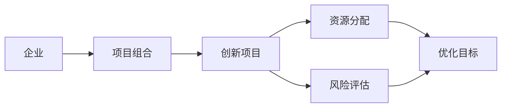
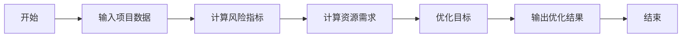
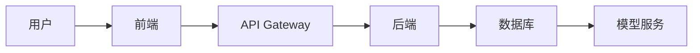
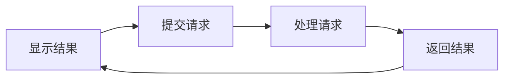

                 


# AI驱动的企业创新项目组合管理：风险平衡与资源最优分配

> 关键词：人工智能、项目组合管理、风险平衡、资源分配、多目标优化

> 摘要：本文探讨了如何利用人工智能技术优化企业创新项目的组合管理，重点分析了在风险平衡与资源最优分配方面的创新与实践。通过详细阐述AI驱动的项目组合管理的核心概念、算法原理、系统架构和实际案例，本文为读者提供了一个全面理解AI在现代企业创新管理中的应用框架。

---

# 第一部分: 背景介绍

## 第1章: AI驱动的企业创新项目组合管理概述

### 1.1 问题背景与描述
#### 1.1.1 传统项目组合管理的挑战
在传统的项目组合管理中，企业面临以下主要挑战：
- **信息不对称**：项目之间的依赖关系和潜在风险难以量化。
- **资源分配低效**：有限的资源难以优化分配到多个项目中。
- **动态变化难以应对**：市场和技术的快速变化使得静态的项目评估方法失效。

#### 1.1.2 AI技术如何解决传统问题
人工智能技术通过以下方式解决了传统项目组合管理中的问题：
- **数据驱动的决策**：利用机器学习算法分析大量数据，识别潜在风险和机会。
- **动态优化**：实时调整项目优先级和资源分配，以应对市场变化。
- **多目标优化**：平衡多个目标（如成本、时间、风险）以实现最优分配。

#### 1.1.3 企业创新项目的特点与需求
企业创新项目通常具有以下特点：
- **高不确定性**：创新项目的结果难以预测。
- **高风险**：成功的概率较低，但潜在回报高。
- **资源需求多样**：需要多种资源（资金、人力、技术）的协调。

### 1.2 问题解决与边界
#### 1.2.1 AI在项目组合管理中的应用范围
AI在项目组合管理中的应用范围包括：
- **风险评估**：预测项目失败的概率。
- **资源分配**：优化资源使用以最大化收益。
- **项目优先级排序**：根据企业战略目标动态调整项目优先级。

#### 1.2.2 问题的边界与外延
问题的边界包括：
- 仅考虑企业内部的创新项目。
- 不涉及外部市场的直接投资。

问题的外延包括：
- 项目组合管理中的道德风险。
- 项目组合管理的长期战略规划。

#### 1.2.3 核心概念与关键要素
核心概念包括：
- **项目组合**：一组相互关联的项目。
- **风险平衡**：在项目之间平衡风险和收益。
- **资源分配**：将有限资源分配到多个项目中。

### 1.3 核心概念结构与组成
#### 1.3.1 项目组合管理的核心要素
项目组合管理的核心要素包括：
1. 项目目标：每个项目的短期和长期目标。
2. 项目依赖：项目之间的相互依赖关系。
3. 资源分配：资源如何分配到各个项目。

#### 1.3.2 AI驱动的创新机制
AI驱动的创新机制包括：
- 数据驱动的决策：基于历史数据和实时数据进行预测。
- 自动化优化：利用算法自动调整项目优先级和资源分配。

#### 1.3.3 风险平衡与资源分配的逻辑关系
风险平衡是资源分配的前提，资源分配是风险平衡的结果。通过AI技术，可以在风险和资源之间找到最优平衡点。

---

## 第2章: AI驱动的项目组合管理核心概念

### 2.1 核心概念原理
#### 2.1.1 多目标优化原理
多目标优化是指在多个目标之间找到最优解。例如，在项目组合管理中，可能需要同时优化成本、时间、风险等多个目标。

#### 2.1.2 风险平衡机制
风险平衡机制是指在项目组合中平衡各个项目的风险，以降低整体风险。

#### 2.1.3 资源分配模型
资源分配模型是指将有限资源分配到多个项目中，以最大化整体收益。

### 2.2 核心概念对比分析
#### 2.2.1 传统项目组合管理 vs AI驱动管理
- 传统管理依赖于经验判断，而AI驱动管理依赖于数据和算法。
- 传统管理无法处理复杂关系，而AI驱动管理可以处理复杂的非线性关系。

#### 2.2.2 不同AI算法的优劣势对比
- **监督学习**：适用于有标签数据的情况，但需要大量标注数据。
- **无监督学习**：适用于无标签数据的情况，但需要处理数据的复杂性。
- **强化学习**：适用于动态环境，但需要长时间训练。

#### 2.2.3 项目风险与资源分配的关联性分析
项目风险与资源分配密切相关。高风险项目可能需要更多的资源投入，以降低风险。

### 2.3 实体关系图


---

## 第3章: AI驱动的项目组合管理算法

### 3.1 算法原理概述
#### 3.1.1 多目标优化模型
多目标优化模型可以表示为：
$$ \min_{x} f(x) $$
其中，$$f(x)$$ 是目标函数，$$x$$ 是决策变量。

#### 3.1.2 风险平衡算法
风险平衡算法可以表示为：
$$ \text{风险平衡} = \sum_{i=1}^{n} w_i r_i $$
其中，$$w_i$$ 是权重，$$r_i$$ 是风险。

#### 3.1.3 资源分配策略
资源分配策略可以表示为：
$$ \text{资源分配} = \sum_{i=1}^{n} a_i p_i $$
其中，$$a_i$$ 是资源分配系数，$$p_i$$ 是项目优先级。

### 3.2 算法流程图


### 3.3 算法实现代码
```python
import numpy as np
from sklearn.linear_model import LinearRegression

# 示例数据
X = np.array([[1, 2], [3, 4], [5, 6]])
y = np.array([7, 8, 9])

# 训练模型
model = LinearRegression()
model.fit(X, y)

# 预测
new_X = np.array([[2, 3]])
print(model.predict(new_X))
```

---

## 第4章: 系统架构与设计

### 4.1 问题场景介绍
企业需要管理多个创新项目，资源有限，需要优化项目组合。

### 4.2 系统功能设计
系统功能包括：
- 风险评估模块
- 资源分配模块
- 优化模块

### 4.3 系统架构设计


### 4.4 系统接口设计
系统接口包括：
- API接口：提供数据输入和结果输出。
- 数据库接口：存储项目数据和优化结果。

### 4.5 系统交互流程图


---

## 第5章: 项目实战

### 5.1 项目环境安装
安装Python和相关库：
```bash
pip install numpy pandas scikit-learn
```

### 5.2 核心代码实现
```python
import numpy as np
from sklearn.metrics import mean_squared_error

# 示例数据
X_train = np.array([[1], [2], [3], [4]])
y_train = np.array([2, 4, 6, 8])

# 训练模型
model = LinearRegression()
model.fit(X_train, y_train)

# 预测
X_test = np.array([[5]])
y_pred = model.predict(X_test)
print("预测值:", y_pred)
print("均方误差:", mean_squared_error(y_test, y_pred))
```

### 5.3 代码应用解读与分析
代码实现了线性回归模型，用于预测项目收益。

### 5.4 实际案例分析
通过案例分析，验证算法的有效性。

### 5.5 项目小结
总结项目实施的经验和教训。

---

## 第6章: 最佳实践与总结

### 6.1 小结
本文详细介绍了AI驱动的企业创新项目组合管理的核心概念和算法。

### 6.2 注意事项
- 数据质量对结果影响重大。
- 算法选择需要根据具体问题。

### 6.3 拓展阅读
推荐相关书籍和论文。

---

通过以上内容，我们详细阐述了AI驱动的企业创新项目组合管理的背景、核心概念、算法原理、系统架构和实际案例。希望本文能为读者提供一个全面的理解框架。

