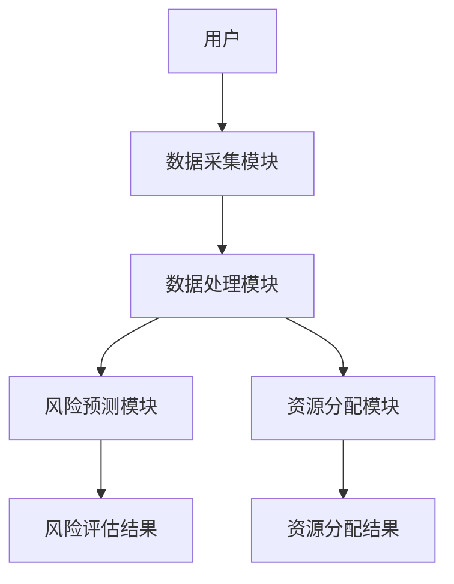
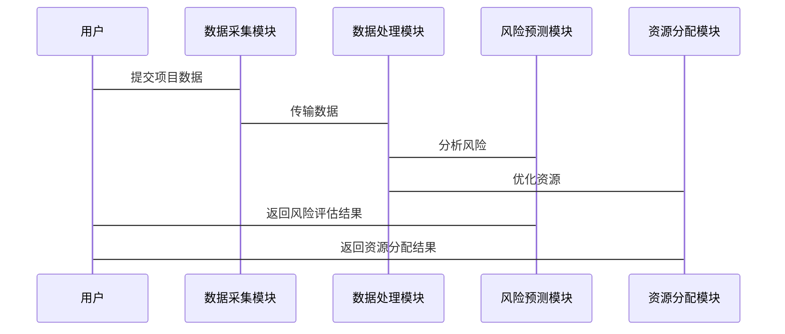

                 


# AI驱动的企业创新项目组合管理：风险平衡与资源最优分配模型

---

## 关键词：
- AI驱动
- 企业创新
- 项目组合管理
- 风险平衡
- 资源最优分配

---

## 摘要：
随着企业创新项目的日益复杂化和多样化，传统的项目管理方式已难以满足现代企业的需求。AI技术的引入为企业创新项目组合管理提供了新的解决方案。本文将从AI驱动的创新项目组合管理的核心概念出发，详细探讨风险平衡与资源最优分配的数学模型和算法实现。通过实际案例分析，本文展示了如何利用AI技术优化企业创新项目的管理流程，提升资源分配效率，降低项目风险。最终，本文为读者提供了一套完整的AI驱动的企业创新项目组合管理框架，助力企业在复杂多变的市场环境中实现高效创新。

---

# 第一部分: AI驱动的企业创新项目组合管理背景与基础

## 第1章: AI驱动的企业创新项目组合管理概述

### 1.1 AI与企业创新管理的结合

#### 1.1.1 企业创新项目的传统管理方式
传统的创新项目管理方式依赖于经验丰富的项目管理者，通过制定详细计划、分配资源和监控进度来确保项目成功。然而，这种方法存在以下问题：
- 项目管理者的能力有限，难以应对复杂多变的市场环境。
- 项目风险难以量化，导致资源分配不合理。
- 项目间的优先级难以平衡，影响整体收益。

#### 1.1.2 AI技术如何改变企业创新管理
AI技术的应用为企业创新项目管理带来了革命性的变化。通过机器学习、深度学习等技术，AI能够：
- 自动化收集、分析和处理大量数据，提供数据驱动的决策支持。
- 实现对项目风险的精准预测和量化评估。
- 优化资源分配策略，提高资源利用效率。
- 提供实时监控和反馈，帮助管理者及时调整策略。

#### 1.1.3 项目组合管理的核心概念与目标
项目组合管理是指对企业创新项目进行整体规划、评估和优化的过程。其核心目标是：
- 实现项目间的资源最优分配。
- 平衡项目风险与收益。
- 提高创新项目的成功率和整体收益。

---

### 1.2 项目组合管理的背景与挑战

#### 1.2.1 企业创新项目的多样性与复杂性
现代企业的创新项目涵盖了技术研发、产品开发、市场拓展等多个领域，具有高度的多样性和复杂性。不同项目的成功概率、所需资源和风险水平各不相同，这使得传统的项目管理方式难以应对。

#### 1.2.2 传统项目组合管理的局限性
传统的项目组合管理方法主要依赖于主观判断和经验分析，存在以下局限性：
- 数据分析能力有限，难以量化项目风险和收益。
- 资源分配不合理，导致部分项目资源不足，而另一些项目资源浪费。
- 缺乏动态调整机制，难以应对市场环境的变化。

#### 1.2.3 风险平衡与资源分配的核心问题
风险平衡是指在项目组合中找到一个最优的风险水平，既不过于冒险，也不过于保守。资源分配则是指在有限的资源条件下，合理分配资源以实现最大收益。这两个问题是项目组合管理的核心，也是AI技术能够发挥重要作用的领域。

---

### 1.3 AI驱动的创新项目组合管理的优势

#### 1.3.1 数据驱动的决策优势
AI技术能够处理海量数据，提取有价值的信息，为项目组合管理提供科学依据。例如，通过分析历史项目的成功案例，AI可以帮助管理者预测新项目的成功概率。

#### 1.3.2 AI在风险预测与资源优化中的应用
AI可以通过机器学习算法对项目风险进行精准预测，同时利用优化算法实现资源的最优分配。例如，使用线性规划模型优化资源分配，使用随机森林算法预测项目风险。

#### 1.3.3 提高企业创新效率与成功率
通过AI技术，企业可以实现创新项目的自动化管理，减少人为错误，提高管理效率。同时，AI优化的资源分配策略能够显著提高项目的成功率，为企业创造更大的价值。

---

## 第2章: 项目组合管理的核心概念与框架

### 2.1 项目组合管理的基本原理

#### 2.1.1 项目组合管理的定义与目标
项目组合管理是指对企业创新项目的整体管理，旨在通过优化资源分配和风险控制，实现企业创新目标的最大化。其核心目标是：
- 实现资源的最优配置。
- 平衡项目风险与收益。
- 提高创新项目的成功率。

#### 2.1.2 项目组合管理的关键要素
项目组合管理的关键要素包括：
- 项目目标：项目的最终目标是什么。
- 项目风险：项目的潜在风险。
- 项目资源：项目的所需资源。
- 项目收益：项目的预期收益。

#### 2.1.3 项目组合管理的流程与方法
项目组合管理的流程包括：
1. 数据收集与分析。
2. 风险评估与量化。
3. 资源分配优化。
4. 实施与监控。

---

### 2.2 风险平衡与资源分配的数学模型

#### 2.2.1 风险平衡的定义与衡量
风险平衡是指在项目组合中找到一个最优的风险水平。常用的风险衡量指标包括：
- 风险值：量化项目风险的大小。
- 风险概率：项目风险发生的概率。

#### 2.2.2 资源分配的优化目标
资源分配的优化目标是：
- 最大化企业收益。
- 最小化资源浪费。
- 平衡项目风险。

#### 2.2.3 风险与资源的权衡模型
风险与资源的权衡模型可以通过以下数学公式表示：
$$
\text{收益} = \sum v_i x_i - \sum c_i x_i
$$
其中，$v_i$ 是项目的收益，$c_i$ 是项目的成本，$x_i$ 是资源分配比例。

---

### 2.3 AI驱动的创新项目组合管理框架

#### 2.3.1 数据收集与特征提取
数据收集是项目组合管理的基础。需要收集的数据包括：
- 项目目标。
- 项目风险。
- 项目资源。
- 项目收益。

特征提取则是对收集到的数据进行处理，提取有价值的信息。

#### 2.3.2 AI算法在风险预测中的应用
常用的风险预测算法包括：
- 线性回归。
- 支持向量机（SVM）。
- 随机森林。

#### 2.3.3 资源分配的优化策略
资源分配的优化策略包括：
- 线性规划。
- 基于强化学习的优化。
- 动态调整优化。

---

# 第三部分: 系统分析与架构设计

## 第5章: 创新项目组合管理系统的功能设计

### 5.1 系统功能模块划分

#### 5.1.1 数据采集与处理模块
数据采集与处理模块负责收集和处理项目相关数据，包括项目目标、风险、资源和收益。

#### 5.1.2 风险预测与评估模块
风险预测与评估模块利用机器学习算法对项目风险进行预测和评估。

#### 5.1.3 资源分配与优化模块
资源分配与优化模块通过优化算法实现资源的最优分配。

---

### 5.2 系统架构设计

#### 5.2.1 领域模型（ER实体关系图）
以下是项目组合管理系统的领域模型图：

```mermaid
erd
    左右方向布局
    左边: 项目
    中间: 项目-资源
    右边: 资源

    左边表: 项目
        |--- 项目ID
        |--- 项目目标
        |--- 项目风险
        |--- 项目收益

    中间表: 项目-资源
        |--- 项目ID
        |--- 资源ID
        |--- 分配比例

    右边表: 资源
        |--- 资源ID
        |--- 资源类型
        |--- 资源数量
```

---

#### 5.2.2 系统架构图
以下是系统架构图：



---

### 5.3 系统接口设计

#### 5.3.1 API接口
以下是系统接口设计：

```http
POST /api/projects
Content-Type: application/json

{
    "project_id": "1",
    "project_goal": "开发新产品",
    "project_risk": "高",
    "project_revenue": "100万"
}
```

---

### 5.4 系统交互图



---

## 总结

通过以上内容，我们详细探讨了AI驱动的企业创新项目组合管理的核心概念、算法实现和系统设计。希望本文能够为企业创新项目的管理者提供有价值的参考，帮助他们在复杂的市场环境中实现高效创新。

--- 

* 想要获取更多关于AI驱动的企业创新项目组合管理的内容，可以参考以下书籍和文章：
  - 《机器学习实战》
  - 《深度学习入门：基于Python》
  - 《项目组合管理：理论与实践》
  - 《企业创新管理》

