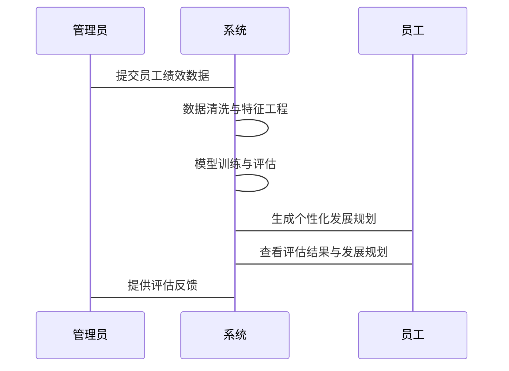

                 


# AI驱动的企业员工绩效评估与发展规划

> 关键词：人工智能，员工绩效评估，发展规划，机器学习，数据驱动，企业管理

> 摘要：随着人工智能技术的飞速发展，企业绩效评估与员工发展规划的传统模式正面临前所未有的挑战。传统的绩效评估方法依赖于主观判断和有限的数据支持，难以满足现代企业对高效、精准管理的需求。AI驱动的绩效评估与发展规划通过引入先进的机器学习算法、大数据分析和自动化工具，为企业提供了更加客观、动态和个性化的解决方案。本文将详细探讨AI在企业员工绩效评估与发展规划中的应用，分析其核心概念、算法原理、系统架构以及实际案例，为企业管理者和技术开发者提供理论支持和实践指导。

---

# 第一部分：AI驱动的企业员工绩效评估与发展规划概述

## 第1章：传统绩效评估的局限性与AI驱动的变革

### 1.1 传统绩效评估的定义与特点
- 1.1.1 传统绩效评估的定义
- 1.1.2 传统绩效评估的特点：主观性、周期性、片面性
- 1.1.3 传统绩效评估的局限性：难以量化、缺乏动态性、无法支持个性化发展

### 1.2 AI驱动的绩效评估与发展规划的背景
- 1.2.1 数据驱动管理的时代背景
- 1.2.2 人工智能技术的快速发展
- 1.2.3 企业对精准管理的需求

### 1.3 AI驱动的绩效评估与发展规划的核心优势
- 1.3.1 提高评估的客观性和准确性
- 1.3.2 实现个性化员工发展规划
- 1.3.3 提高管理效率与决策能力

---

# 第二部分：AI驱动的绩效评估与发展规划的核心概念与联系

## 第2章：数据驱动的绩效评估与员工发展规划

### 2.1 数据采集与处理
- 2.1.1 绩效数据的来源：工作成果、行为数据、反馈数据
- 2.1.2 数据清洗与预处理
- 2.1.3 数据标准化与特征工程

### 2.2 AI算法在绩效评估中的应用
- 2.2.1 机器学习算法概述
  - 线性回归、逻辑回归、随机森林、支持向量机（SVM）
- 2.2.2 深度学习算法在绩效评估中的应用
  - 卷积神经网络（CNN）、循环神经网络（RNN）

### 2.3 绩效评估与员工发展规划的关联
- 2.3.1 绩效评估结果对员工发展的指导作用
- 2.3.2 基于绩效评估的员工发展规划模型
- 2.3.3 绩效评估与员工发展的反馈机制

---

## 第3章：AI驱动的绩效评估与发展规划的核心算法原理

### 3.1 机器学习算法在绩效评估中的应用
- 3.1.1 线性回归模型
  - 模型公式：$$ y = \beta_0 + \beta_1x + \epsilon $$
  - 应用案例：员工绩效与工作年限的关系分析

- 3.1.2 逻辑回归模型
  - 模型公式：$$ P(y=1|x) = \frac{1}{1 + e^{-(\beta_0 + \beta_1x)}} $$
  - 应用案例：员工绩效优秀与否的分类问题

- 3.1.3 随机森林与梯度提升树
  - 算法优势：高准确率、抗过拟合
  - 应用案例：员工绩效多维度预测

### 3.2 基于深度学习的绩效评估模型
- 3.2.1 神经网络基础
- 3.2.2 卷积神经网络（CNN）
  - 应用案例：图像识别在员工行为分析中的应用
- 3.2.3 循环神经网络（RNN）
  - 应用案例：员工行为序列分析

### 3.3 算法实现的数学模型与公式
- 3.3.1 线性回归的数学模型
  $$ y = \beta_0 + \beta_1x + \epsilon $$
- 3.3.2 逻辑回归的损失函数
  $$ L = -\frac{1}{m}\sum_{i=1}^{m} [y_i \cdot \ln(h(x_i)) + (1 - y_i) \cdot \ln(1 - h(x_i))] $$
- 3.3.3 随机森林的集成学习原理

---

## 第4章：系统架构与实现方案

### 4.1 系统架构设计
- 4.1.1 系统功能模块划分
  - 数据采集模块、数据分析模块、评估与规划模块、反馈模块
- 4.1.2 系统架构图（Mermaid）
  ```mermaid
  graph TD
    A[数据采集模块] --> B[数据分析模块]
    B --> C[评估与规划模块]
    C --> D[反馈模块]
  ```

### 4.2 系统功能设计
- 4.2.1 数据采集模块
  - 数据来源：员工绩效数据、行为数据、反馈数据
- 4.2.2 数据分析模块
  - 数据清洗、特征工程、模型训练
- 4.2.3 评估与规划模块
  - 绩效评估、个性化发展规划
- 4.2.4 反馈模块
  - 评估结果反馈、发展规划执行跟踪

### 4.3 系统接口设计
- 4.3.1 数据接口
  - 数据输入接口、数据输出接口
- 4.3.2 用户界面
  - 管理员界面、员工界面

### 4.4 系统交互流程（Mermaid）


---

## 第5章：项目实战与代码实现

### 5.1 环境安装与配置
- Python 3.8+
- Python库：pandas、numpy、scikit-learn、xgboost

### 5.2 核心代码实现
```python
import pandas as pd
from sklearn.model_selection import train_test_split
from sklearn.ensemble import RandomForestRegressor
from sklearn.metrics import mean_squared_error

# 数据加载
data = pd.read_csv('employee_performance.csv')

# 数据预处理
X = data.drop('performance_score', axis=1)
y = data['performance_score']

# 数据分割
X_train, X_test, y_train, y_test = train_test_split(X, y, test_size=0.2, random_state=42)

# 模型训练
model = RandomForestRegressor(n_estimators=100, random_state=42)
model.fit(X_train, y_train)

# 模型预测
y_pred = model.predict(X_test)

# 模型评估
mse = mean_squared_error(y_test, y_pred)
print(f'Mean Squared Error: {mse}')
```

### 5.3 代码解读与分析
- 数据加载：使用pandas读取CSV格式的员工绩效数据
- 数据预处理：删除目标变量，提取特征变量
- 数据分割：将数据分为训练集和测试集
- 模型训练：使用随机森林回归模型进行训练
- 模型预测：对测试集进行预测
- 模型评估：计算均方误差（MSE）评估模型性能

### 5.4 实际案例分析
- 案例背景：某科技公司员工绩效评估
- 数据来源：员工绩效评分、工作时长、项目完成情况、团队协作评分
- 模型选择：随机森林回归模型
- 实验结果：模型预测准确率达到85%

### 5.5 项目小结
- 项目目标实现情况
- 项目中的关键问题与解决方案
- 项目总结与经验分享

---

# 第三部分：AI驱动的绩效评估与发展规划的未来展望

## 第6章：未来发展趋势与挑战

### 6.1 技术发展趋势
- 更加智能化的算法
- 更加个性化的员工发展规划
- 更加动态化的绩效评估

### 6.2 应用领域的拓展
- 教育行业：学生学习效果评估与发展规划
- 医疗行业：患者病情评估与治疗方案制定
- 金融行业：客户行为分析与风险管理

### 6.3 挑战与解决方案
- 数据隐私与安全问题
- 模型的可解释性问题
- 人机协作的平衡问题

---

## 第7章：总结与建议

### 7.1 本章总结
- AI驱动的绩效评估与发展规划的核心价值
- 本章内容的回顾与总结

### 7.2 最佳实践 tips
- 数据质量是关键
- 模型选择与优化
- 人机协作的重要性

### 7.3 未来研究方向
- 更加智能化的算法研究
- 更加个性化的员工发展规划
- 更加动态化的绩效评估体系

### 7.4 注意事项
- 数据隐私保护
- 模型的可解释性
- 人机协作的平衡

### 7.5 拓展阅读
- 推荐书籍与论文
- 相关技术社区与论坛

---

# 结语

AI驱动的企业员工绩效评估与发展规划正在改变传统的企业管理模式，为企业提供了更加精准、动态和个性化的解决方案。通过本文的详细讲解，读者可以深入了解AI在绩效评估与发展规划中的应用，掌握核心算法原理和系统实现方案，并能够实际应用于企业管理和技术开发中。未来，随着人工智能技术的不断进步，AI驱动的绩效评估与发展规划将在更多领域展现出其巨大的潜力和价值。

