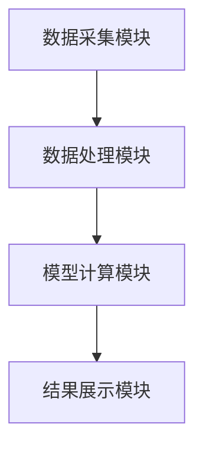
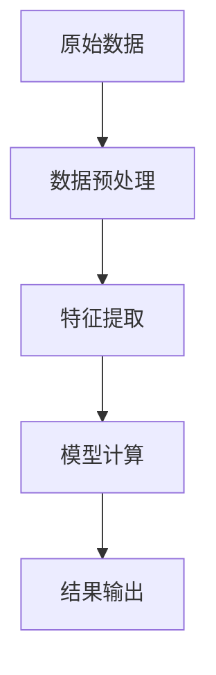

                 

# AI驱动的企业品牌价值动态量化系统

> 关键词：企业品牌价值、动态量化、人工智能、机器学习、数据驱动

> 摘要：本文详细探讨了如何利用人工智能技术构建企业品牌价值动态量化系统。通过分析品牌价值的影响因素，提出了一种基于机器学习的动态量化模型，并结合系统架构设计与实际案例，展示了该系统的实现与应用价值。

---

# 第1章：AI驱动的企业品牌价值动态量化系统背景

## 1.1 问题背景与现状分析

### 1.1.1 传统品牌价值评估的局限性
传统品牌价值评估方法通常依赖于财务数据和静态指标，难以捕捉品牌在市场中的动态变化。例如，品牌声誉的波动、消费者行为的变化以及市场环境的快速演变，都会对品牌价值产生显著影响，但传统方法难以实时反映这些变化。

### 1.1.2 当前市场环境的变化对企业品牌价值的影响
在数字化时代，市场竞争日益激烈，消费者行为更加分散，品牌价值的波动性显著增加。企业需要一种动态的、实时更新的品牌价值评估方法，以应对市场的不确定性。

### 1.1.3 现有品牌价值评估方法的不足
现有的品牌价值评估方法主要依赖于专家评分、市场调研和财务数据，存在以下问题：
- 数据采集成本高，难以实时更新。
- 消费者行为数据难以量化。
- 市场环境的复杂性难以全面捕捉。

---

## 1.2 问题描述与解决思路

### 1.2.1 企业品牌价值动态变化的核心问题
品牌价值的动态变化主要受以下因素影响：
- 市场表现：包括市场份额、销售增长率等。
- 消费者认知：包括品牌知名度、美誉度、消费者情感倾向等。
- 行业趋势：包括行业竞争格局、政策变化、技术进步等。

### 1.2.2 AI技术在品牌价值量化中的应用潜力
人工智能技术可以通过以下方式提升品牌价值的量化能力：
- 自然语言处理（NLP）技术可以分析社交媒体上的消费者评论，提取情感倾向。
- 机器学习算法可以预测品牌价值的变化趋势。
- 数据挖掘技术可以发现市场数据中的潜在关联。

### 1.2.3 系统设计的目标与核心解决思路
系统设计的目标是构建一个能够实时更新、动态计算企业品牌价值的量化系统。核心解决思路包括：
- 数据驱动：利用多源数据（如市场数据、消费者数据、行业数据）构建品牌价值模型。
- AI驱动：通过机器学习算法实现品牌价值的动态预测与优化。
- 可视化：提供直观的品牌价值变化趋势图，便于企业决策者理解和使用。

---

## 1.3 系统边界与外延

### 1.3.1 系统的功能边界
系统的核心功能包括：
- 数据采集与处理：从多源数据中提取品牌相关特征。
- 模型计算：基于机器学习算法动态计算品牌价值。
- 结果展示：以可视化形式呈现品牌价值变化趋势。

### 1.3.2 系统的适用范围与限制
系统适用于需要动态评估品牌价值的企业，尤其适用于互联网行业、快消品行业等市场竞争激烈的领域。系统的限制包括：
- 数据采集成本较高。
- 需要大量历史数据进行模型训练。

### 1.3.3 系统与外部环境的交互关系
系统与外部环境的交互主要通过数据接口实现：
- 从外部数据源获取市场数据和消费者数据。
- 向企业决策者提供品牌价值评估结果。

---

## 1.4 核心概念与组成要素

### 1.4.1 系统的核心组成要素
系统的核心组成要素包括：
- 数据采集模块：负责采集市场数据、消费者数据和行业数据。
- 数据处理模块：对数据进行清洗、特征提取和标准化处理。
- 模型计算模块：基于机器学习算法计算品牌价值。
- 结果展示模块：以可视化形式呈现品牌价值变化趋势。

### 1.4.2 各要素之间的关系与作用
各要素之间的关系可以表示为：
- 数据采集模块为数据处理模块提供原始数据。
- 数据处理模块为模型计算模块提供特征数据。
- 模型计算模块为结果展示模块提供计算结果。

### 1.4.3 系统的逻辑架构图
系统逻辑架构图如下：

---

## 1.5 小结

通过本章的背景介绍，我们明确了AI驱动的企业品牌价值动态量化系统的核心目标和实现思路。接下来，我们将从动态量化模型的原理入手，详细探讨系统的实现方法。

---

# 第2章：动态量化模型的原理与实现

## 2.1 动态量化模型的基本原理

### 2.1.1 数据采集与特征提取
动态量化模型的核心在于从多源数据中提取有效的特征。特征包括：
- 市场表现：如市场份额、销售增长率。
- 消费者认知：如品牌知名度、消费者情感倾向。
- 行业趋势：如行业竞争格局、政策变化。

### 2.1.2 品牌价值的动态计算方法
品牌价值的动态计算方法基于以下公式：
$$
\text{品牌价值} = \alpha \cdot \text{市场表现} + \beta \cdot \text{消费者认知} + \gamma \cdot \text{行业趋势}
$$
其中，$\alpha$、$\beta$、$\gamma$为模型参数，需要通过训练数据进行优化。

### 2.1.3 模型的自适应调整机制
模型通过在线学习算法实现自适应调整。具体步骤如下：
1. 数据采集模块实时采集市场数据。
2. 数据处理模块提取特征。
3. 模型计算模块更新模型参数。
4. 结果展示模块实时更新品牌价值。

---

## 2.2 数据流与计算流程

### 2.2.1 数据流图
数据流图如下：

### 2.2.2 计算流程
计算流程如下：
1. 数据采集模块从外部数据源获取原始数据。
2. 数据预处理模块对数据进行清洗和标准化处理。
3. 特征提取模块从数据中提取有效的特征。
4. 模型计算模块基于机器学习算法计算品牌价值。
5. 结果展示模块以可视化形式呈现计算结果。

---

## 2.3 模型的核心算法

### 2.3.1 算法原理概述
动态量化模型基于随机森林算法，具体步骤如下：
1. 数据预处理：对原始数据进行清洗和标准化。
2. 特征提取：从数据中提取有效的特征。
3. 模型训练：使用随机森林算法训练模型。
4. 模型预测：基于训练好的模型预测品牌价值。

### 2.3.2 算法的数学模型与公式
随机森林算法的数学模型如下：
$$
y = \sum_{i=1}^{n} \theta_i x_i + \epsilon
$$
其中，$y$为品牌价值，$x_i$为特征，$\theta_i$为模型参数，$\epsilon$为误差项。

### 2.3.3 算法的实现步骤
算法实现步骤如下：
1. 数据预处理：对原始数据进行清洗和标准化。
2. 特征提取：从数据中提取有效的特征。
3. 模型训练：使用随机森林算法训练模型。
4. 模型预测：基于训练好的模型预测品牌价值。

---

## 2.4 小结

本章详细探讨了动态量化模型的原理与实现方法，包括数据流、计算流程和核心算法。接下来，我们将从系统架构设计的角度，详细探讨系统的实现方案。

---

# 第3章：系统架构设计

## 3.1 系统功能模块划分

### 3.1.1 数据采集模块
数据采集模块负责从外部数据源获取原始数据，包括市场数据、消费者数据和行业数据。

### 3.1.2 数据处理模块
数据处理模块负责对数据进行清洗、特征提取和标准化处理。

### 3.1.3 模型计算模块
模型计算模块负责基于机器学习算法计算品牌价值。

### 3.1.4 结果展示模块
结果展示模块负责以可视化形式呈现品牌价值变化趋势。

---

## 3.2 系统架构图

系统架构图如下：

---

## 3.3 系统接口设计

系统接口设计如下：
1. 数据采集模块接口：用于从外部数据源获取原始数据。
2. 数据处理模块接口：用于对数据进行清洗和特征提取。
3. 模型计算模块接口：用于基于机器学习算法计算品牌价值。
4. 结果展示模块接口：用于以可视化形式呈现品牌价值变化趋势。

---

## 3.4 系统交互流程

系统交互流程如下：
1. 数据采集模块从外部数据源获取原始数据。
2. 数据处理模块对数据进行清洗和特征提取。
3. 模型计算模块基于机器学习算法计算品牌价值。
4. 结果展示模块以可视化形式呈现品牌价值变化趋势。

---

## 3.5 小结

本章详细探讨了系统架构设计，包括功能模块划分、系统架构图、系统接口设计和系统交互流程。接下来，我们将从项目实战的角度，详细探讨系统的实现与应用。

---

# 第4章：项目实战

## 4.1 环境搭建

### 4.1.1 安装必要的依赖
安装必要的依赖包括：
- Python 3.8+
- scikit-learn
- pandas
- numpy
- matplotlib

### 4.1.2 数据源获取
数据源包括：
- 市场数据：从公开市场数据源获取。
- 消费者数据：从社交媒体平台获取消费者评论。
- 行业数据：从行业报告中获取。

---

## 4.2 数据预处理

### 4.2.1 数据清洗
数据清洗步骤如下：
1. 去除重复数据。
2. 处理缺失值。
3. 标准化处理。

### 4.2.2 特征提取
特征提取步骤如下：
1. 从市场数据中提取市场份额、销售增长率。
2. 从消费者数据中提取品牌知名度、消费者情感倾向。
3. 从行业数据中提取行业竞争格局、政策变化。

---

## 4.3 模型训练

### 4.3.1 模型选择
选择随机森林算法作为模型。

### 4.3.2 模型训练
模型训练步骤如下：
1. 将数据分为训练集和测试集。
2. 使用随机森林算法训练模型。
3. 评估模型性能，调整超参数。

---

## 4.4 模型预测

### 4.4.1 品牌价值预测
基于训练好的模型，预测品牌价值。

### 4.4.2 结果分析
分析预测结果，评估模型的准确性。

---

## 4.5 优化与调优

### 4.5.1 超参数优化
通过网格搜索优化模型超参数。

### 4.5.2 模型调优
通过交叉验证进一步优化模型性能。

---

## 4.6 小结

本章通过一个实际案例，详细探讨了系统的实现与应用。接下来，我们将从总结与展望的角度，探讨系统的价值与未来发展方向。

---

# 第5章：总结与展望

## 5.1 系统的核心价值
通过动态量化模型，企业可以实时更新品牌价值，捕捉市场变化，优化品牌策略。

## 5.2 当前系统的局限性
当前系统的局限性包括：
- 数据采集成本较高。
- 模型的准确率有待进一步提高。

## 5.3 未来的发展方向
未来的发展方向包括：
- 结合知识图谱技术，进一步提升模型的准确性。
- 引入区块链技术，提高数据的安全性。
- 结合多模态数据（如图像、视频），进一步丰富模型的输入特征。

---

# 结语

通过本文的探讨，我们详细介绍了AI驱动的企业品牌价值动态量化系统的实现方法与应用价值。未来，随着AI技术的不断发展，品牌价值的动态量化将更加精准和实时，为企业决策提供更有力的支持。

---

# 参考文献

（此处可以列出相关的参考文献，如学术论文、技术报告等。）

