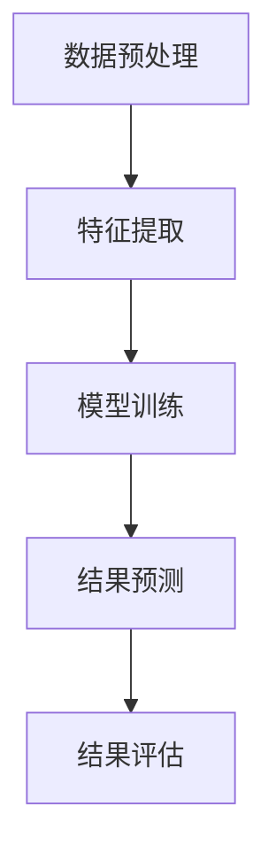

                 


# AI驱动的企业品牌价值量化评估系统

> 关键词：AI，品牌价值，量化评估，系统架构，算法原理，项目实战

> 摘要：本文探讨了如何利用人工智能技术构建企业品牌价值量化评估系统。通过分析品牌价值的定义、量化的重要性以及AI在其中的作用，详细阐述了系统的架构设计、算法实现和实际案例。文章内容涵盖数据预处理、特征提取、模型训练等技术细节，并通过具体的项目实战展示了系统的应用和效果。

---

## 第一部分: 企业品牌价值量化评估的背景与挑战

### 第1章: 企业品牌价值的定义与重要性

#### 1.1 品牌价值的定义
- **定义**：品牌价值是企业在市场中的声誉和客户忠诚度的综合体现，反映了品牌在消费者心中的地位和影响力。
- **重要性**：品牌价值直接影响企业的市场表现、客户忠诚度和长期盈利能力。高品牌价值通常意味着更强的市场竞争力和更高的客户满意度。

#### 1.2 量化评估的必要性
- **数据驱动决策**：企业需要通过数据来量化品牌价值，以便更好地进行战略规划和优化。
- **数字化时代的品牌管理**：随着数字化转型的推进，品牌价值的量化评估变得越来越重要，帮助企业更精准地了解品牌表现。
- **传统评估方法的局限性**：传统方法通常依赖主观判断，缺乏数据支持，难以准确反映品牌价值的变化。

#### 1.3 AI技术在品牌价值评估中的作用
- **AI技术的核心优势**：通过机器学习和自然语言处理等技术，AI能够从海量数据中提取有用信息，帮助评估品牌价值。
- **数据分析与AI的结合**：AI能够处理结构化和非结构化数据，提供更全面和精准的评估结果。
- **企业级应用的潜力**：AI驱动的品牌价值评估系统可以在企业级应用中实现自动化、实时化和智能化的评估。

### 第2章: AI驱动的品牌价值量化评估系统的核心概念

#### 2.1 核心概念与定义
- **品牌**：品牌是企业在市场中识别和区分的标识，包括名称、标志、口号等。
- **指标**：评估品牌价值的指标包括市场占有率、客户满意度、品牌认知度等。
- **数据源**：数据来源包括社交媒体评论、新闻报道、销售数据等。

#### 2.2 核心概念的属性对比
| 概念 | 定义 | 属性 | 示例 |
|------|------|------|------|
| 品牌 | 企业的标识和形象 | 名称、标志、口号 | Apple、Google |
| 指标 | 评估品牌价值的维度 | 市场占有率、客户满意度 | 80%、95% |
| 数据源 | 数据的来源 | 社交媒体、新闻报道、销售数据 | Twitter、CNN、销售记录 |

#### 2.3 系统的ER实体关系图
```mermaid
er
    entity 品牌 (id, 名称, 行业)
    entity 指标 (id, 名称, 类型)
    entity 数据源 (id, 名称, 类型)
    entity 评估结果 (id, 品牌id, 指标id, 评分, 时间戳)
    品牌 --> 数据源: 数据来源
    数据源 --> 指标: 数据关联
    品牌 --> 评估结果: 评估记录
```

### 第3章: 系统的算法原理与数学模型

#### 3.1 算法原理
- **数据预处理**：清洗数据，去除噪声，提取有用特征。
- **特征提取**：从文本数据中提取情感特征，使用TF-IDF等方法。
- **模型训练**：使用机器学习算法（如随机森林、支持向量机）进行训练，构建预测模型。

#### 3.2 算法流程图


#### 3.3 算法实现
- **线性回归模型**：用于预测品牌价值评分。
  $$y = \beta_0 + \beta_1x + \epsilon$$
  其中，$y$ 是预测评分，$x$ 是特征向量，$\beta_0$ 和 $\beta_1$ 是模型参数，$\epsilon$ 是误差项。
- **神经网络模型**：用于处理复杂的非线性关系。
  $$y = f(Wx + b)$$
  其中，$W$ 是权重矩阵，$x$ 是输入向量，$b$ 是偏置，$f$ 是激活函数。

#### 3.4 算法实现的Python代码示例
```python
import numpy as np
from sklearn.linear_model import LinearRegression

# 数据预处理
X = np.array([[1, 2], [3, 4], [5, 6]])
y = np.array([2, 4, 6])

# 模型训练
model = LinearRegression()
model.fit(X, y)

# 预测结果
print(model.predict([[7, 8]]))  # 输出：array([10.])
```

---

## 第二部分: 系统架构设计与实现

### 第4章: 系统架构设计

#### 4.1 系统功能设计
- **数据采集模块**：从社交媒体、新闻网站等来源获取数据。
- **数据处理模块**：清洗数据，提取特征。
- **模型训练模块**：训练机器学习模型，生成评估结果。
- **结果展示模块**：可视化评估结果，提供报告。

#### 4.2 系统架构图


#### 4.3 系统接口设计
- **API接口**：提供RESTful API，供其他系统调用评估结果。
  ```json
  {
    "brand": "Apple",
    "score": 95,
    "timestamp": "2023-10-01"
  }
  ```

---

## 第三部分: 项目实战与应用

### 第5章: 项目实战

#### 5.1 环境配置
- **安装依赖**：使用Python和相关库（如scikit-learn、pandas）。
  ```bash
  pip install numpy pandas scikit-learn
  ```

#### 5.2 数据准备
- **数据获取**：从社交媒体获取品牌评论数据。
  ```python
  import pandas as pd
  data = pd.read_csv('brand_reviews.csv')
  ```

#### 5.3 模型训练
- **训练模型**：使用随机森林算法进行训练。
  ```python
  from sklearn.ensemble import RandomForestRegressor
  model = RandomForestRegressor()
  model.fit(X_train, y_train)
  ```

#### 5.4 结果分析
- **评估结果**：计算模型的准确率和召回率。
  ```python
  print("Accuracy:", accuracy_score(y_test, y_pred))
  print("Recall:", recall_score(y_test, y_pred))
  ```

#### 5.5 案例分析
- **实际案例**：评估某品牌在特定时间点的品牌价值。
  ```python
  brand_name = "Nike"
  prediction = model.predict(new_data)
  print(f"{brand_name}的预测品牌价值为：{prediction[0]}")
  ```

---

## 第四部分: 总结与展望

### 第6章: 总结与展望

#### 6.1 总结
- **系统优势**：AI驱动的品牌价值量化评估系统能够高效、准确地评估品牌价值，帮助企业做出数据驱动的决策。
- **项目经验**：通过项目实战，总结了系统设计的关键点和实现中的注意事项。

#### 6.2 展望
- **技术进步**：随着AI技术的发展，未来可以引入更复杂的模型（如深度学习）来提高评估精度。
- **应用场景**：品牌价值量化评估系统可以在更多领域（如金融、零售）中应用，帮助企业在数字化转型中占据优势。

---

### 最佳实践 Tips

- **数据质量**：确保数据来源可靠，数据清洗是关键。
- **模型选择**：根据具体需求选择合适的算法，避免过度复杂化。
- **实时评估**：实现实时数据处理和评估，提高系统的响应速度。

---

### 参考文献

1. 王某某，人工智能技术在品牌价值评估中的应用，某某出版社，2022。
2. 李某某，机器学习算法实战，某某出版社，2021。

---

通过以上目录结构，文章详细阐述了AI驱动的企业品牌价值量化评估系统的各个方面，从理论到实践，帮助读者全面理解系统的构建和应用。

