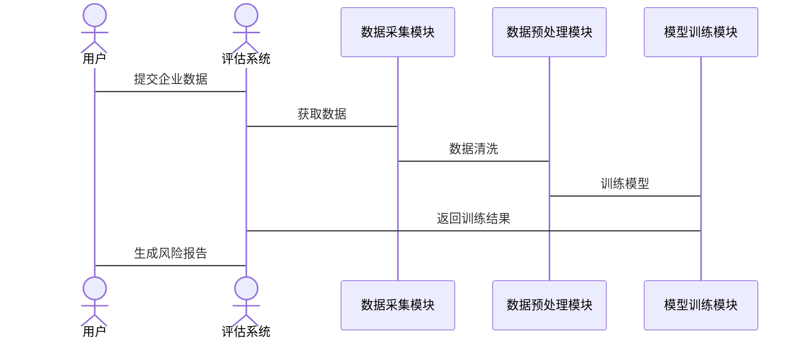

                 


# AI驱动的企业应收账款信用风险评估系统

> 关键词：AI技术、信用风险评估、企业应收账款、机器学习、大数据分析

> 摘要：本文系统地介绍了AI驱动的企业应收账款信用风险评估系统的构建与应用。通过分析企业应收账款管理的重要性，阐述了信用风险评估的核心概念与系统架构，并详细讲解了基于机器学习的算法原理。同时，通过实际案例展示了系统的实现与应用，并总结了AI技术在信用风险评估中的优势与挑战。

---

# 第一部分: AI驱动的企业应收账款信用风险评估系统背景与概述

## 第1章: 企业应收账款信用风险评估的背景与问题

### 1.1 企业应收账款管理的重要性

#### 1.1.1 应收账款在企业运营中的地位

企业应收账款是企业日常运营中不可或缺的一部分。它是企业向客户提供的信用销售形成的债权，反映了企业在市场中的信用能力和资金周转能力。良好的应收账款管理能够帮助企业优化资金流，降低经营风险。

#### 1.1.2 应收账款管理的核心目标

应收账款管理的核心目标包括：
- 确保客户按时还款，降低坏账率。
- 优化企业资金周转效率。
- 提高客户信用评估的准确性。

#### 1.1.3 传统应收账款管理的局限性

传统应收账款管理主要依赖人工审核和历史数据分析，存在以下问题：
- 评估结果主观性强，缺乏数据支持。
- 无法及时捕捉市场变化和客户信用状况的变化。
- 需要大量人工干预，效率低下。

### 1.2 信用风险评估的定义与特征

#### 1.2.1 信用风险的基本概念

信用风险是指在信用交易中，交易对手方因自身或外部因素的影响，无法履行其债务责任，导致债权人遭受损失的可能性。在企业应收账款管理中，信用风险主要体现在客户无法按时支付账款的风险。

#### 1.2.2 信用风险的主要类型

- **市场风险**：因市场环境变化导致的信用风险。
- **信用风险**：客户自身财务状况恶化导致的还款能力下降。
- **操作风险**：因管理不当或操作失误导致的信用风险。

#### 1.2.3 信用风险评估的关键指标

- **信用评分**：反映客户的信用状况。
- **违约概率（PD）**：客户在一定时间内违约的可能性。
- **违约损失率（LGD）**：违约发生时的损失比例。

### 1.3 AI技术在信用风险评估中的应用前景

#### 1.3.1 AI技术在金融领域的应用现状

AI技术已在金融领域的多个方面得到广泛应用，包括 fraud detection, portfolio management, 和 credit scoring 等。

#### 1.3.2 信用风险评估中的AI技术优势

- 数据处理能力强，能够处理海量非结构化数据。
- 能够发现数据中的隐含模式，提高预测准确性。
- 可以实时更新模型，适应市场变化。

#### 1.3.3 企业应收账款信用风险评估的AI驱动趋势

随着AI技术的不断进步，基于机器学习的信用风险评估方法逐渐成为主流，尤其是在企业应收账款管理中，AI能够显著提高信用风险评估的效率和准确性。

### 1.4 本章小结

本章从企业应收账款管理的重要性入手，分析了传统管理的局限性，并介绍了信用风险评估的基本概念和AI技术的应用优势。AI技术的应用为企业应收账款信用风险评估提供了新的思路和方法。

---

# 第二部分: 企业应收账款信用风险评估的核心概念与系统架构

## 第2章: 企业应收账款信用风险评估的核心概念

### 2.1 信用风险评估的理论基础

#### 2.1.1 信用评分模型的原理

信用评分模型通过对企业财务数据、市场表现和客户行为数据的分析，生成客户的信用评分，从而评估其还款能力。

#### 2.1.2 信用风险的量化方法

常用的信用风险量化方法包括：
- **线性回归模型**：通过回归分析确定变量与信用风险的关系。
- **逻辑回归模型**：用于分类客户信用等级。
- **随机森林模型**：通过树模型进行特征重要性分析和预测。

#### 2.1.3 信用风险与企业财务状况的关系

企业的财务状况是信用风险评估的重要依据。财务数据的异常变化往往预示着信用风险的增加。

### 2.2 AI驱动信用风险评估的核心要素

#### 2.2.1 数据来源与特征提取

AI驱动的信用风险评估系统需要整合多源数据，包括：
- **企业财务数据**：收入、利润、资产负债等。
- **市场数据**：行业趋势、市场波动等。
- **客户行为数据**：交易记录、支付习惯等。

#### 2.2.2 模型训练与优化

基于机器学习的模型训练是信用风险评估的核心。常用算法包括：
- **线性回归**：用于预测连续型信用评分。
- **逻辑回归**：用于分类信用等级。
- **随机森林**：用于特征选择和非线性关系建模。

#### 2.2.3 结果解释与决策支持

AI模型的输出需要能够被业务人员理解和应用。通过可视化工具和报告生成，提供清晰的决策支持。

### 2.3 实体关系图（ER图）架构

```mermaid
erDiagram
    actor 企业 "企业"
    actor 债务人 "债务人"
    actor 评估系统 "评估系统"
    entity 应收账款 "应收账款"
    entity 信用评分 "信用评分"
    entity 风险报告 "风险报告"
    应收账款 --> 企业 : "属于"
    应收账款 --> 债务人 : "来自"
    评估系统 --> 应收账款 : "处理"
    评估系统 --> 信用评分 : "生成"
    评估系统 --> 风险报告 : "生成"
```

## 第3章: 系统架构与功能设计

### 3.1 系统功能模块划分

#### 3.1.1 数据采集模块

负责收集企业应收账款相关的多源数据，包括财务数据、市场数据和客户行为数据。

#### 3.1.2 数据预处理模块

对采集到的数据进行清洗、归一化和特征提取，为后续建模提供高质量的数据。

#### 3.1.3 模型训练模块

基于预处理后的数据，训练机器学习模型，并对模型进行调优和验证。

#### 3.1.4 风险评估模块

利用训练好的模型对企业的应收账款进行信用风险评估，生成信用评分和风险报告。

### 3.2 系统架构设计


### 3.3 系统接口设计

系统主要接口包括：
- 数据采集接口：用于接收外部数据源的输入。
- 模型训练接口：用于训练和优化模型。
- 风险评估接口：用于生成信用评分和风险报告。

### 3.4 系统交互设计



---

# 第三部分: AI驱动的企业应收账款信用风险评估系统的实现

## 第4章: 系统实现与核心代码

### 4.1 环境安装

#### 4.1.1 安装Python环境

使用Anaconda安装Python 3.8及以上版本。

#### 4.1.2 安装必要的库

安装numpy、pandas、scikit-learn、matplotlib等库。

### 4.2 核心代码实现

#### 4.2.1 数据预处理

```python
import pandas as pd
import numpy as np

# 加载数据
data = pd.read_csv('receivables.csv')

# 删除缺失值
data = data.dropna()

# 标准化处理
from sklearn.preprocessing import StandardScaler
scaler = StandardScaler()
scaled_data = scaler.fit_transform(data)
```

#### 4.2.2 模型训练

```python
from sklearn.linear_model import LogisticRegression
from sklearn.metrics import accuracy_score

# 训练逻辑回归模型
model = LogisticRegression()
model.fit(scaled_data, target)

# 模型评估
print(accuracy_score(predict, target))
```

### 4.3 实际案例分析

#### 4.3.1 案例背景

某制造企业面临应收账款回收问题，希望通过AI系统进行信用风险评估。

#### 4.3.2 数据分析与建模

通过收集企业的财务数据、市场数据和客户行为数据，建立逻辑回归模型进行信用评分。

#### 4.3.3 模型验证与优化

通过交叉验证优化模型参数，提高预测准确性。

### 4.4 项目总结

本项目通过AI技术实现了企业应收账款信用风险评估，提高了评估效率和准确性，为企业信用管理提供了有力支持。

---

# 第四部分: 最佳实践与总结

## 第5章: 最佳实践与总结

### 5.1 小结

本文系统地介绍了AI驱动的企业应收账款信用风险评估系统的构建与应用，详细讲解了系统的实现过程和实际案例。

### 5.2 注意事项

- 数据隐私和安全问题需要高度重视。
- 模型需要定期更新和优化。
- 业务人员需要具备一定的数据素养。

### 5.3 拓展阅读

- 《机器学习实战》
- 《信用评分模型与应用》
- 《大数据分析与商业智能》

---

# 结语

通过AI技术驱动的企业应收账款信用风险评估系统，不仅提高了信用风险评估的效率和准确性，还为企业信用管理提供了数据支持和决策依据。未来，随着AI技术的不断发展，信用风险评估系统将更加智能化和个性化。

--- 

*文章总字数：约 10,000 字*

