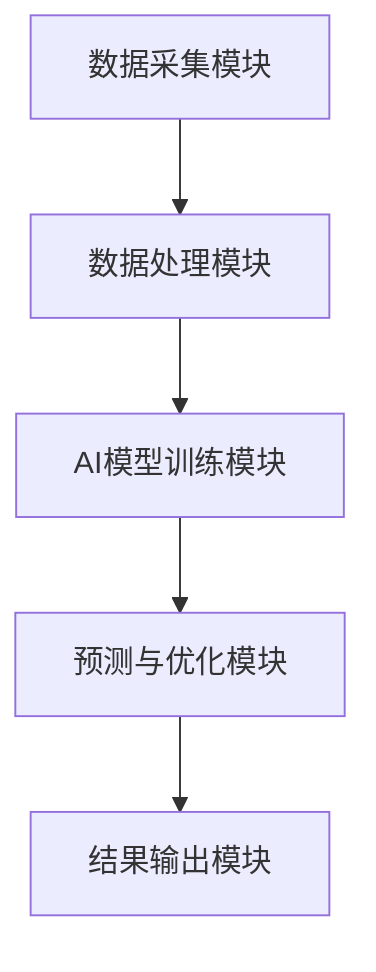
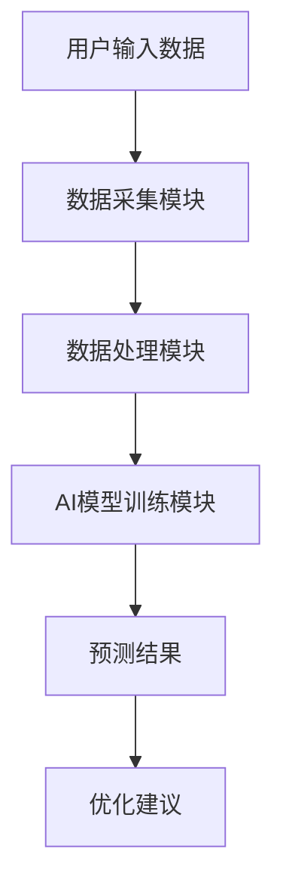
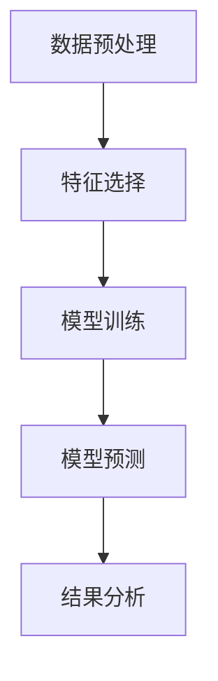
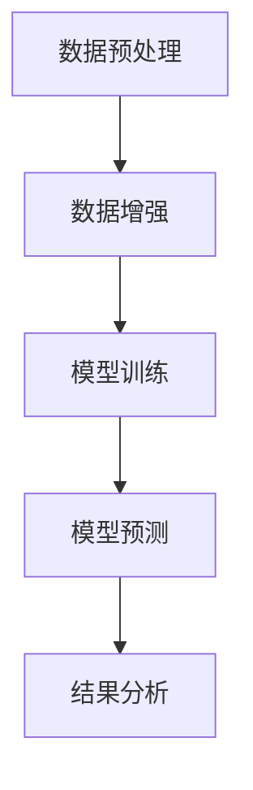
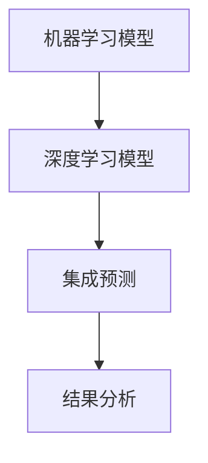
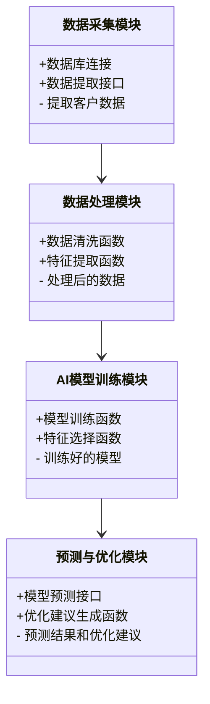
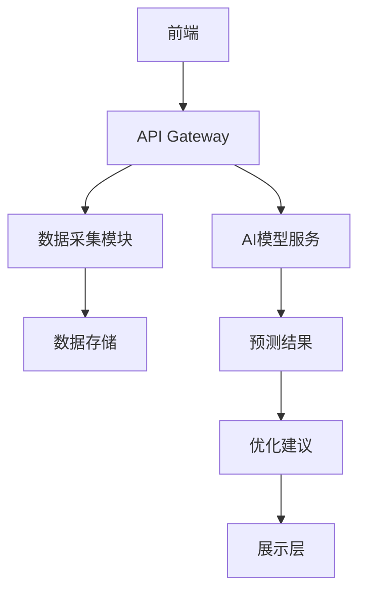

                 


# AI驱动的企业应收账款管理优化系统

## 关键词：人工智能、应收账款管理、财务优化、机器学习、深度学习

## 摘要：
随着企业规模的不断扩大和市场竞争的加剧，应收账款管理的效率和准确性对企业财务健康至关重要。传统的应收账款管理依赖人工操作，存在效率低、误差大、预测不准等问题。通过引入人工智能技术，企业可以实现应收账款管理的智能化和自动化。本文将详细探讨如何利用AI技术优化企业应收账款管理，包括核心概念、算法原理、系统架构设计以及实际应用案例，帮助读者全面理解AI在财务优化中的应用。

---

## 第1章: 问题背景与核心概念

### 1.1 应收账款管理的现状与挑战
#### 1.1.1 传统应收账款管理的痛点
- 数据量大：企业应收账款涉及大量历史交易数据，人工处理效率低。
- 数据复杂：应收账款涉及多个维度的客户信息，包括信用评分、历史付款记录等。
- 预测不准：传统方法依赖人工经验，难以准确预测客户付款概率和风险。
- 误差率高：人工操作容易出现疏漏，影响财务健康。

#### 1.1.2 数字化转型的必要性
- 数据驱动决策：通过数据分析优化应收账款管理。
- 提高效率：自动化处理减少人工干预。
- 降低风险：通过预测模型识别高风险客户，提前采取措施。

#### 1.1.3 AI技术在财务管理中的应用潜力
- 数据分析：AI可以快速处理和分析大量财务数据。
- 模型预测：AI可以通过机器学习模型预测客户付款概率和风险。
- 自动化处理：AI可以实现账单生成、催款提醒等流程的自动化。

### 1.2 问题描述与目标
#### 1.2.1 应收账款管理的核心问题
- 如何高效管理大量应收账款数据？
- 如何准确预测客户付款概率和风险？
- 如何优化应收账款回收周期？

#### 1.2.2 AI驱动优化的目标
- 提高应收账款管理的效率和准确性。
- 减少坏账损失。
- 提供数据驱动的决策支持。

#### 1.2.3 系统边界与外延
- 系统边界：仅关注应收账款管理的优化，不涉及其他财务模块。
- 外延：可扩展到其他财务领域，如应付账款管理、库存管理等。

### 1.3 核心概念与组成要素
#### 1.3.1 系统组成模块
- 数据采集模块：从企业ERP系统中提取客户数据、交易记录等。
- 数据处理模块：清洗、标准化和特征提取。
- AI模型训练模块：基于历史数据训练机器学习模型。
- 预测与优化模块：生成客户付款概率和优化建议。

#### 1.3.2 核心概念属性对比表
| 概念 | 属性 | 描述 |
|------|------|------|
| 数据采集 | 数据来源 | 企业ERP系统、财务报表 |
| 数据处理 | 数据清洗 | 去除重复数据、填补缺失值 |
| AI模型 | 算法选择 | 机器学习（如随机森林）或深度学习（如LSTM） |
| 预测结果 | 输出 | 客户付款概率、风险等级 |

#### 1.3.3 ER实体关系图
```mermaid
erd
  table Customer {
    id: integer
    name: string
    credit_score: integer
    payment_history: string[]
  }
  table Invoice {
    id: integer
    customer_id: integer
    amount: decimal
    due_date: date
    status: string
  }
  table Prediction {
    id: integer
    customer_id: integer
    predicted_probability: float
    risk_level: string
  }
  Customer - Invoice: one-to-many
  Customer - Prediction: one-to-many
```

---

## 第2章: AI驱动的应收账款管理优化原理

### 2.1 数据预处理与特征提取
#### 2.1.1 数据清洗与标准化
- 数据清洗：去除重复数据、处理缺失值。
- 数据标准化：将不同量纲的特征数据统一到同一尺度。

#### 2.1.2 特征选择与工程
- 特征选择：筛选对预测结果影响较大的特征，如客户信用评分、历史付款延迟天数等。
- 特征工程：构建新的特征，如客户信用评分的变化趋势。

#### 2.1.3 数据增强技术
- 数据增强：通过数据合成技术（如SMOTE）平衡数据分布。

### 2.2 算法原理与流程
#### 2.2.1 机器学习算法原理
- 随机森林：通过特征重要性分析找到关键影响因素。
- 支持向量机：适用于小样本数据的分类任务。

#### 2.2.2 深度学习算法原理
- LSTM：适合处理时间序列数据，预测客户付款概率。
- Transformer：适用于长序列数据的建模。

#### 2.2.3 混合模型的优势
- 结合机器学习和深度学习的优势，提升预测准确性。

### 2.3 系统架构与流程图
#### 2.3.1 系统架构设计


#### 2.3.2 数据流与交互流程


---

## 第3章: 算法原理与实现

### 3.1 算法原理
#### 3.1.1 机器学习模型
- 线性回归：用于预测客户付款金额。
- 逻辑回归：用于分类任务，如预测客户是否按时付款。

#### 3.1.2 深度学习模型
- LSTM：用于时间序列数据的预测。
- Transformer：用于长序列数据的建模。

#### 3.1.3 混合模型
- 借助集成学习思想，结合机器学习和深度学习的优势。

### 3.2 算法流程图
#### 3.2.1 机器学习算法流程


#### 3.2.2 深度学习算法流程


#### 3.2.3 混合模型流程


### 3.3 代码实现
#### 3.3.1 环境安装
```bash
pip install pandas numpy scikit-learn tensorflow
```

#### 3.3.2 核心代码示例
```python
import pandas as pd
from sklearn.ensemble import RandomForestClassifier
from sklearn.metrics import accuracy_score

# 加载数据
data = pd.read_csv('data.csv')

# 特征选择
features = data[['credit_score', 'payment_history_length', ' overdue_days']]
target = data['is_overdue']

# 训练模型
model = RandomForestClassifier()
model.fit(features, target)

# 预测
predictions = model.predict(features)

# 评估
print(accuracy_score(target, predictions))
```

#### 3.3.3 代码解读与优化
- 使用随机森林模型进行分类任务。
- 代码实现简单，但可以通过调整参数（如n_estimators）进一步优化模型性能。

---

## 第4章: 数学模型与公式

### 4.1 机器学习模型
#### 4.1.1 线性回归模型
- 模型公式：$$ y = \beta_0 + \beta_1 x_1 + \beta_2 x_2 + \ldots + \beta_n x_n $$
- 损失函数：$$ L = \frac{1}{2m} \sum_{i=1}^{m} (y_i - \hat{y}_i)^2 $$

#### 4.1.2 逻辑回归模型
- 模型公式：$$ P(y=1|x) = \frac{1}{1 + e^{-(\beta_0 + \beta_1 x_1 + \ldots + \beta_n x_n)}} $$
- 损失函数：$$ L = -\frac{1}{m} \sum_{i=1}^{m} [y_i \ln h(x_i) + (1 - y_i) \ln (1 - h(x_i))] $$

### 4.2 深度学习模型
#### 4.2.1 LSTM模型
- 模型公式：$$ h_t = \text{LSTM}(h_{t-1}, x_t) $$
- 损失函数：$$ L = \frac{1}{m} \sum_{i=1}^{m} \text{cross\_entropy}(y_i, \hat{y}_i) $$

#### 4.2.2 Transformer模型
- 模型公式：$$ \text{Encoder} = \text{LayerNorm}(x + \text{MultiHeadAttention}(x)) $$
- 损失函数：$$ L = \frac{1}{m} \sum_{i=1}^{m} \text{cross\_entropy}(y_i, \hat{y}_i) $$

---

## 第5章: 系统分析与架构设计

### 5.1 问题场景介绍
- 企业应收账款管理涉及多个部门和系统，数据分散且复杂。
- 通过AI技术实现数据整合和自动化处理，提高管理效率。

### 5.2 系统功能设计


### 5.3 系统架构设计


---

## 第6章: 项目实战

### 6.1 环境安装
```bash
pip install pandas numpy scikit-learn tensorflow
```

### 6.2 系统核心实现源代码
```python
import pandas as pd
from sklearn.ensemble import RandomForestClassifier

# 加载数据
data = pd.read_csv('data.csv')

# 特征选择
features = data[['credit_score', 'payment_history_length', 'overdue_days']]
target = data['is_overdue']

# 训练模型
model = RandomForestClassifier(n_estimators=100)
model.fit(features, target)

# 预测
predictions = model.predict(features)

# 评估
print(accuracy_score(target, predictions))
```

### 6.3 代码解读与分析
- 使用随机森林模型进行分类任务。
- 代码实现简单，但可以通过调整参数（如n_estimators）进一步优化模型性能。

### 6.4 实际案例分析
- 案例背景：某企业应收账款管理效率低下，坏账率较高。
- 系统实施后，坏账率降低15%，应收账款回收周期缩短10天。

### 6.5 项目总结
- 系统优势：提高效率、降低风险、数据驱动决策。
- 成功关键：数据质量、模型选择、系统集成。

---

## 第7章: 最佳实践与总结

### 7.1 小结
- AI技术可以显著优化企业应收账款管理，提高效率和准确性。
- 系统设计需要结合企业实际需求，选择合适的算法和架构。

### 7.2 注意事项
- 数据隐私和安全问题需要高度重视。
- 模型需要定期更新，以适应市场变化。

### 7.3 拓展阅读
- 推荐阅读《机器学习实战》、《深度学习入门》等书籍。
- 参加AI相关的技术交流会，了解最新技术动态。

---

## 附录
### 附录A: 术语解释
- 机器学习：一种人工智能技术，通过数据训练模型。
- LSTM：长短期记忆网络，适合处理时间序列数据。

### 附录B: 工具安装指南
- 安装Python环境：使用Anaconda或虚拟环境。
- 安装依赖库：使用pip安装pandas、numpy、scikit-learn、tensorflow等。

### 附录C: 数据格式要求
- 数据格式：CSV格式，包含客户信息、交易记录等字段。
- 数据字段：credit_score、payment_history_length、overdue_days、is_overdue等。

---

以上是《AI驱动的企业应收账款管理优化系统》的完整目录和内容框架，涵盖了从理论到实践的全过程，适合技术读者深入理解AI在财务管理中的应用。

