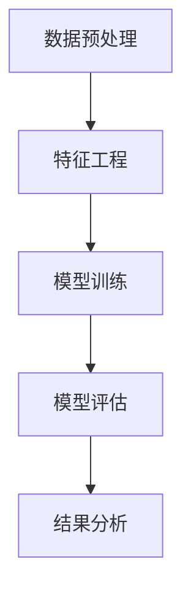
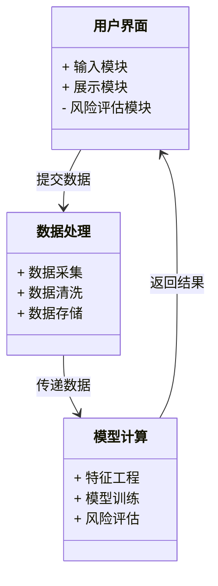

                 


# AI驱动的企业应收账款组合信用风险评估系统

> 关键词：AI，企业应收账款，信用风险评估，系统架构，机器学习，风险管理

> 摘要：本文介绍了一种基于人工智能技术的企业应收账款组合信用风险评估系统。该系统通过整合机器学习算法与传统的信用评估方法，构建了一个高效、智能的信用风险管理体系。文章详细阐述了系统的背景、核心概念、算法原理、系统架构以及项目实现，通过实际案例分析和代码实现，深入探讨了该系统的优势与应用。

---

# 第一部分：背景与核心概念

## 第1章：背景介绍

### 1.1 应收账款信用风险评估的重要性

#### 1.1.1 应收账款在企业运营中的地位
- 应收账款是企业流动资产的重要组成部分。
- 信用风险直接影响企业的财务健康和资金流动性。

#### 1.1.2 传统信用风险评估的局限性
- 依赖人工经验，主观性较强。
- 数据处理能力有限，难以应对海量数据。

#### 1.1.3 AI技术的应用优势
- 提高评估效率和准确性。
- 处理非结构化数据，挖掘潜在风险因素。

### 1.2 系统目标与问题描述

#### 1.2.1 系统目标
- 构建智能化的信用风险评估模型。
- 提供实时、动态的风险评估能力。

#### 1.2.2 核心问题
- 如何有效整合多源数据？
- 如何提升模型的泛化能力？

#### 1.2.3 边界与外延
- 系统适用于大型企业，但不包括政府债务。

## 第2章：核心概念与联系

### 2.1 核心概念原理

#### 2.1.1 应收账款组合信用风险
- 组合风险是单个风险的综合体现。
- 需要考虑行业周期性与宏观经济因素。

#### 2.1.2 AI驱动的风险评估
- 利用机器学习模型分析历史数据。
- 通过特征工程提取关键风险指标。

### 2.2 核心概念属性特征对比

#### 2.2.1 不同信用评估方法的对比
| 方法 | 优点 | 缺点 |
|------|------|------|
| 传统评分法 | 简单易懂 | 主观性强 |
| 机器学习 | 高准确性 | 需大量数据 |
| 深度学习 | 模型复杂 | 计算资源消耗大 |

#### 2.2.2 AI驱动与传统方法的对比分析
- AI方法能够处理非结构化数据，但需要更多的计算资源。

### 2.3 ER实体关系图架构

```mermaid
erDiagram
    actor 顾客 {
        <属性>
        - 客户ID
        - 企业名称
        - 财务数据
    }
    actor 供应商 {
        <属性>
        - 供应商ID
        - 信用评分
        - 历史交易记录
    }
    actor 系统 {
        <功能>
        - 数据采集
        - 风险评估
        - 报告生成
    }
    顾客 --> 系统 : 提交申请
    供应商 --> 系统 : 提供数据
    系统 --> 顾客 : 生成报告
```

---

# 第三部分：算法原理讲解

## 第3章：算法原理概述

### 3.1 基于机器学习的信用风险评估模型

#### 3.1.1 算法选择
- 使用逻辑回归和随机森林进行对比实验。

#### 3.1.2 算法流程图



### 3.2 算法实现细节

#### 3.2.1 数据预处理与特征工程

```python
import pandas as pd
from sklearn.preprocessing import StandardScaler

# 数据加载
df = pd.read_csv('data.csv')

# 特征选择
features = ['收入', '利润', '应收账款', '信用评分']
X = df[features]
y = df['违约情况']

# 标准化处理
scaler = StandardScaler()
X_scaled = scaler.fit_transform(X)
```

#### 3.2.2 模型训练与调优

```python
from sklearn.model_selection import train_test_split
from sklearn.linear_model import LogisticRegression
from sklearn.metrics import accuracy_score

# 数据分割
X_train, X_test, y_train, y_test = train_test_split(X_scaled, y, test_size=0.2)

# 模型训练
model = LogisticRegression()
model.fit(X_train, y_train)

# 模型评估
y_pred = model.predict(X_test)
print("准确率:", accuracy_score(y_test, y_pred))
```

### 3.3 数学模型与公式

#### 3.3.1 逻辑回归模型
$$ P(y=1|x) = \frac{e^{\beta_0 + \beta_1 x}}{1 + e^{\beta_0 + \beta_1 x}} $$

---

# 第四部分：系统分析与架构设计

## 第4章：系统功能设计

### 4.1 项目场景介绍

#### 4.1.1 项目背景
- 企业需要实时监控应收账款风险。
- 系统需支持多用户同时访问。

### 4.2 系统功能设计

#### 4.2.1 系统功能模块



---

# 第五部分：项目实战

## 第5章：环境安装与系统实现

### 5.1 环境安装

#### 5.1.1 安装Python环境
```bash
pip install numpy pandas scikit-learn
```

#### 5.1.2 安装可视化工具
```bash
pip install matplotlib seaborn
```

### 5.2 系统核心实现

#### 5.2.1 核心代码实现

```python
import numpy as np
import pandas as pd
from sklearn.ensemble import RandomForestClassifier
from sklearn.metrics import classification_report

# 加载数据
data = pd.read_csv('data.csv')

# 特征选择
features = data.columns[:-1]
target = data.columns[-1]

# 数据分割
X_train, X_test, y_train, y_test = train_test_split(data[features], data[target], test_size=0.2)

# 模型训练
model = RandomForestClassifier(n_estimators=100)
model.fit(X_train, y_train)

# 模型预测
y_pred = model.predict(X_test)

# 模型评估
print(classification_report(y_test, y_pred))
```

---

## 第6章：总结与展望

### 6.1 总结

#### 6.1.1 系统优势
- 高效性：AI驱动，提升评估效率。
- 准确性：机器学习模型提高预测准确率。

#### 6.1.2 实践意义
- 为企业提供可靠的风险评估工具。
- 降低企业财务风险。

### 6.2 展望

#### 6.2.1 挑战与改进方向
- 数据隐私与安全问题。
- 模型解释性与可解释性要求。

#### 6.2.2 未来研究方向
- 结合区块链技术，提升数据可信度。
- 开发实时风险监控系统。

---

通过以上目录和内容，您可以逐步深入理解AI驱动的企业应收账款组合信用风险评估系统的构建与应用。希望这篇技术博客能为您提供有价值的信息和启发。

