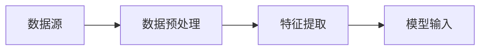
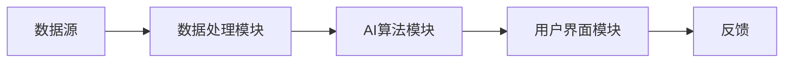

                 


# AI驱动的企业战略执行仪表盘：实时KPI追踪与自动调整

> 关键词：AI, 企业战略, KPI, 实时追踪, 自动调整, 数据驱动, 智能决策

> 摘要：随着企业数字化转型的深入，AI技术在企业战略执行中的应用越来越重要。本文详细探讨了AI驱动的企业战略执行仪表盘的设计与实现，包括实时KPI追踪和自动调整的核心算法、系统架构、项目实战以及最佳实践。通过本文的分析，读者将能够理解如何利用AI技术优化企业战略执行，提升决策效率和准确性。

---

## 第一部分: 背景介绍

### 第1章: 问题背景与问题描述

#### 1.1 问题背景
在企业运营中，战略执行是决定企业成功与否的关键因素。传统的KPI（关键绩效指标）管理依赖于定期报告和人工分析，存在滞后性、主观性和不实时性的问题。企业需要一种更高效、更智能的方式来实时监控和调整战略执行。

#### 1.2 问题描述
- **滞后性**：传统KPI管理通常基于历史数据，无法实时反映当前战略执行的状态。
- **主观性**：人工分析依赖于个人经验和判断，存在主观偏差。
- **复杂性**：企业战略涉及多个部门和指标，协调和优化难度大。

#### 1.3 问题解决
AI技术的引入为解决这些问题提供了新的可能性。通过实时数据采集、智能分析和自动调整，AI能够显著提升战略执行的效率和准确性。

#### 1.4 边界与外延
- **边界**：本文仅关注企业战略执行层面的KPI管理和调整，不涉及企业整体数字化转型的其他方面。
- **外延**：AI驱动的仪表盘可以扩展到更多业务场景，如供应链优化、市场营销等。

#### 1.5 概念结构与核心要素
- **核心要素**：实时数据采集、智能分析算法、动态调整机制、可视化界面。
- **系统架构**：包括数据源、数据处理模块、AI算法模块、用户界面模块。

---

## 第二部分: 核心概念与联系

### 第2章: 核心概念原理

#### 2.1 实时数据采集与处理
- **数据源**：包括企业内部系统（如ERP、CRM）和外部数据源（如市场数据）。
- **数据预处理**：数据清洗、特征提取、数据格式转换。
- **数据流处理**：使用流处理技术（如Flink、Kafka）实现实时数据处理。

#### 2.2 KPI追踪算法
- **算法原理**：基于机器学习的KPI预测和异常检测。
- **实现步骤**：
  1. 数据预处理与特征提取。
  2. 模型训练（如时间序列模型、回归模型）。
  3. 实时预测与异常检测。

#### 2.3 自动调整机制
- **调整策略**：基于KPI预测结果，自动生成调整建议。
- **反馈机制**：实时调整策略的执行效果反馈，优化模型。

---

## 第三部分: 算法原理讲解

### 第3章: 算法原理与实现

#### 3.1 数据流处理流程


#### 3.2 机器学习模型
- **时间序列预测模型**：
  - 使用LSTM（长短期记忆网络）进行KPI预测。
  - 模型训练：
    ```python
    model = Sequential()
    model.add(LSTM(units=50, input_shape=(timesteps, features)))
    model.add(Dense(1))
    model.compile(optimizer='adam', loss='mean_squared_error')
    model.fit(X_train, y_train, epochs=100, batch_size=32)
    ```

- **异常检测模型**：
  - 使用Isolation Forest算法检测异常数据。
  - 示例代码：
    ```python
    from sklearn.ensemble import IsolationForest
    model = IsolationForest(n_estimators=100, contamination=0.05)
    model.fit(X)
    ```

#### 3.3 调整策略优化
- **数学模型**：基于线性规划的资源分配优化。
  - 示例公式：
    $$\text{max} \sum_{i=1}^{n} w_i x_i$$
    $$\text{subject to} \sum_{i=1}^{n} x_i \leq C$$
    其中，\(w_i\)为权重，\(x_i\)为资源分配变量，\(C\)为总资源限制。

---

## 第四部分: 系统架构与设计

### 第4章: 系统架构设计

#### 4.1 系统功能设计
- **领域模型**：
  ```mermaid
  classDiagram
      class 数据源 {
          提供实时数据
      }
      class 数据处理模块 {
          数据清洗
          特征提取
      }
      class AI算法模块 {
          KPI预测
          异常检测
      }
      class 用户界面模块 {
          KPI可视化
          调整建议展示
      }
      数据源 --> 数据处理模块
      数据处理模块 --> AI算法模块
      AI算法模块 --> 用户界面模块
  ```

#### 4.2 系统架构图


#### 4.3 接口设计与交互流程
- **接口设计**：
  - 数据接口：RESTful API。
  - 用户界面：基于React的可视化界面。
- **交互流程**：
  ```mermaid
  sequenceDiagram
      User -> 数据处理模块: 请求实时数据
      数据处理模块 -> AI算法模块: 获取预测结果
      AI算法模块 -> 用户界面模块: 更新可视化界面
      User -> 系统: 提供反馈
      系统 -> 数据处理模块: 更新模型
  ```

---

## 第五部分: 项目实战

### 第5章: 项目核心实现

#### 5.1 环境安装
- **依赖安装**：
  ```bash
  pip install tensorflow pandas numpy matplotlib flask
  ```

#### 5.2 核心代码实现
- **数据处理模块**：
  ```python
  import pandas as pd
  def preprocess_data(data):
      data = data.dropna()
      data = pd.get_dummies(data)
      return data
  ```

- **AI算法模块**：
  ```python
  import tensorflow as tf
  def build_model(input_shape):
      model = tf.keras.Sequential()
      model.add(tf.keras.layers.LSTM(50, input_shape=input_shape))
      model.add(tf.keras.layers.Dense(1))
      return model
  ```

#### 5.3 案例分析
- **案例背景**：某企业希望优化销售KPI。
- **实施步骤**：
  1. 数据采集与预处理。
  2. 模型训练与部署。
  3. 实时监控与调整。

---

## 第六部分: 最佳实践与总结

### 第6章: 最佳实践与总结

#### 6.1 小结
- AI驱动的企业战略执行仪表盘能够显著提升KPI管理的效率和准确性。
- 关键技术包括实时数据处理、智能算法和动态调整机制。

#### 6.2 注意事项
- 数据质量是关键，需确保数据的实时性和准确性。
- 模型需要定期更新，以适应业务变化。
- 用户反馈是优化系统的重要来源。

#### 6.3 拓展阅读
- 推荐阅读《机器学习实战》和《数据驱动的决策》。

---

通过本文的详细讲解，读者可以全面理解AI驱动的企业战略执行仪表盘的设计与实现，并能够将其应用到实际的企业管理中，提升战略执行的效果和效率。

