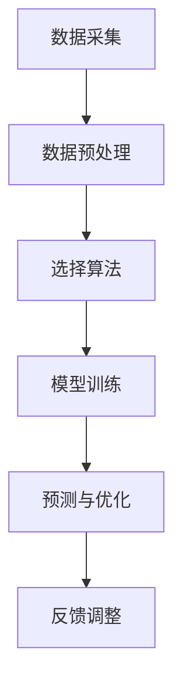
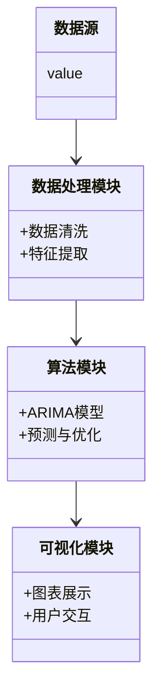
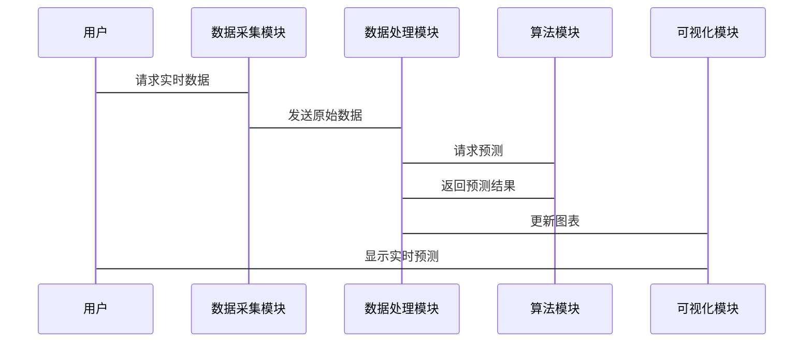

                 


# AI驱动的企业战略执行仪表盘：实时KPI追踪与调整

**关键词**：AI驱动、企业战略执行、实时KPI、仪表盘、调整策略

**摘要**：本文探讨了如何利用人工智能技术构建企业战略执行仪表盘，实现对关键绩效指标（KPI）的实时追踪与动态调整。文章从背景介绍、核心概念、算法原理、系统架构、项目实战到最佳实践，详细阐述了构建AI驱动的实时KPI追踪系统的全过程，包括数据采集、算法实现、系统设计和实际应用案例。

---

## 第一部分: AI驱动的企业战略执行仪表盘背景介绍

### 第1章: 问题背景与核心概念

#### 1.1 问题背景
- **1.1.1 传统企业战略执行的挑战**
  - 传统KPI管理依赖人工统计，耗时且效率低下。
  - 数据孤岛问题严重，难以实现跨部门协同。
  - 无法实时反馈，导致战略执行滞后。

- **1.1.2 KPI管理的痛点与不足**
  - 数据来源多样，难以统一处理。
  - 传统KPI分析依赖历史数据，缺乏预测性。
  - 人工调整策略耗时，难以应对快速变化的市场环境。

- **1.1.3 AI技术如何解决这些问题**
  - AI能够实时处理数据，提供动态反馈。
  - 通过机器学习模型，实现KPI的预测与优化。
  - 自动化调整策略，提升执行效率。

#### 1.2 核心概念
- **1.2.1 企业战略执行仪表盘的定义**
  - 一个实时监控和调整企业战略执行的可视化工具。
  - 集成AI技术，提供数据驱动的决策支持。

- **1.2.2 AI驱动的实时KPI追踪与调整**
  - 利用AI算法对实时数据进行分析和预测。
  - 根据分析结果，动态调整战略执行策略。

- **1.2.3 仪表盘的核心功能与价值**
  - 实时数据可视化，帮助管理者快速了解执行情况。
  - AI驱动的预测与优化，提升战略执行效率。
  - 提供数据驱动的决策支持，降低人为失误。

#### 1.3 问题描述
- **1.3.1 传统KPI管理的局限性**
  - 数据采集和处理效率低。
  - 分析结果缺乏预测性和前瞻性。
  - 调整策略依赖人工判断，耗时且不够精准。

- **1.3.2 企业战略执行中的数据孤岛问题**
  - 数据分散在不同部门和系统中，难以整合。
  - 数据格式不统一，难以统一分析。

- **1.3.3 实时反馈与动态调整的必要性**
  - 市场环境变化快，需要实时调整策略。
  - 动态反馈能够及时发现并解决问题。
  - 提高战略执行的灵活性和响应速度。

#### 1.4 问题解决
- **1.4.1 AI驱动的实时数据采集与处理**
  - 利用AI技术实时采集和处理多源数据。
  - 通过数据清洗和特征提取，提高数据质量。

- **1.4.2 KPI的动态分析与预测**
  - 应用机器学习模型对KPI进行实时预测。
  - 通过模型优化，提升预测准确率。

- **1.4.3 智能化调整策略的实施**
  - 根据预测结果，自动生成调整策略。
  - 实时反馈调整效果，动态优化执行方案。

#### 1.5 边界与外延
- **1.5.1 仪表盘的适用范围**
  - 适用于需要实时监控和调整的战略执行场景。
  - 适用于数据量大、变化快的行业，如金融、电商等。

- **1.5.2 与其他管理工具的协同**
  - 与企业资源计划（ERP）系统协同，整合企业数据。
  - 与客户关系管理（CRM）系统协同，提升客户体验。

- **1.5.3 未来发展的可能性**
  - 结合更多AI技术，如自然语言处理（NLP），提供更智能的决策支持。
  - 数据源的扩展，如物联网（IoT）数据的接入。

#### 1.6 概念结构与核心要素
- **1.6.1 数据源与数据处理**
  - 数据源包括企业内部系统、外部数据源等。
  - 数据处理包括清洗、整合、特征提取等。

- **1.6.2 AI算法与模型**
  - 选择合适的机器学习算法，如时间序列分析、回归模型等。
  - 模型训练与优化，提升预测准确性。

- **1.6.3 可视化与用户交互**
  - 通过可视化工具展示实时数据和分析结果。
  - 提供用户友好的交互界面，支持实时调整和反馈。

---

## 第二部分: 核心概念与联系

### 第2章: AI驱动仪表盘的核心原理

#### 2.1 核心概念原理
- **数据流与实时处理**
  - 数据从各个来源实时采集，经过处理后输入模型。
  - 模型分析后，生成反馈，驱动调整策略的实施。

- **AI算法在KPI分析中的应用**
  - 利用机器学习算法对KPI进行实时预测和分析。
  - 通过模型优化，提升预测的准确性和响应速度。

- **可视化与用户反馈**
  - 可视化界面展示实时数据和分析结果。
  - 用户通过界面进行反馈，进一步优化模型。

#### 2.2 核心概念属性特征对比
- **表格对比**
  | **传统KPI管理** | **AI驱动的实时KPI管理** |
  |------------------|--------------------------|
  | 数据处理延迟    | 实时数据处理            |
  | 分析依赖历史数据 | 分析基于实时数据        |
  | 人工调整策略    | AI自动生成调整策略      |

#### 2.3 ER实体关系图
```mermaid
erd
    企业战略执行仪表盘
    正确选项：定义如下：
    企业战略执行仪表盘 <--(1,n)--> 数据源
    企业战略执行仪表盘 <--(1,n)--> 用户
    企业战略执行仪表盘 <--(1,n)--> 调整策略
```

---

## 第三部分: 算法原理讲解

### 第3章: 算法实现与数学模型

#### 3.1 算法原理
- **时间序列分析**
  - 使用ARIMA模型对KPI进行预测。
  - 基于历史数据，预测未来的KPI趋势。

#### 3.2 算法流程图


#### 3.3 算法实现代码
```python
import pandas as pd
from statsmodels.tsa.arima.model import ARIMA

# 数据加载与预处理
data = pd.read_csv('kpi_data.csv')
data = data['value'].values

# 模型训练
model = ARIMA(data, order=(5,1,0))
model_fit = model.fit()

# 预测
forecast, stderr, conf_int = model_fit.forecast(steps=5)
```

#### 3.4 数学模型
- **ARIMA模型公式**
  $$ARIMA(p, d, q)$$
  - p：自回归（AR）阶数
  - d：差分阶数
  - q：移动平均（MA）阶数

---

## 第四部分: 系统分析与架构设计方案

### 第4章: 系统架构设计

#### 4.1 问题场景介绍
- 企业需要实时监控和调整KPI，提升战略执行效率。

#### 4.2 系统功能设计
- **数据采集模块**
  - 从多个数据源采集实时数据。
  - 数据清洗与预处理。

- **算法模块**
  - 应用机器学习算法进行预测与优化。
  - 自动生成调整策略。

- **可视化模块**
  - 展示实时数据和分析结果。
  - 提供用户友好的交互界面。

#### 4.3 领域模型类图


#### 4.4 系统架构图
```mermaid
archi
    仪表盘 <--(1,n)--> 数据源
    仪表盘 <--(1,n)--> 算法模块
    仪表盘 <--(1,n)--> 可视化模块
```

#### 4.5 系统接口设计
- API接口定义：
  ```json
  {
    "接口名称": "获取实时KPI预测",
    "输入参数": {"部门": "销售部"},
    "输出参数": {"预测值": 100, "置信区间": [90, 110]}
  }
  ```

#### 4.6 系统交互序列图


---

## 第五部分: 项目实战

### 第5章: 项目实现与案例分析

#### 5.1 环境安装
- **安装Python和相关库**
  ```bash
  pip install pandas statsmodels matplotlib
  ```

#### 5.2 核心代码实现
```python
import pandas as pd
import matplotlib.pyplot as plt
from statsmodels.tsa.arima.model import ARIMA

# 加载数据
data = pd.read_csv('kpi_data.csv')
data['date'] = pd.to_datetime(data['date'])
data.set_index('date', inplace=True)

# 训练模型
model = ARIMA(data['value'], order=(5, 1, 0))
model_fit = model.fit()

# 预测
forecast = model_fit.forecast(steps=5)
forecast_data = pd.DataFrame({'date': data.index[-5:] + pd.offsets.BDay(5), '预测值': forecast[0]})

# 可视化
plt.figure(figsize=(10, 6))
data['value'].plot(label='实际值')
forecast_data.plot(label='预测值', linestyle='--')
plt.title('KPI预测')
plt.xlabel('日期')
plt.ylabel('值')
plt.legend()
plt.show()
```

#### 5.3 代码解读与分析
- **数据加载与预处理**
  - 使用Pandas加载数据，并设置日期为索引。
- **模型训练**
  - 应用ARIMA模型进行训练。
- **预测与可视化**
  - 生成预测数据，并与实际数据进行对比。

#### 5.4 实际案例分析
- **案例背景**
  - 某企业销售额下降，需要实时监控和调整。
- **分析结果**
  - 预测未来5天的销售额，并生成调整策略。
- **调整策略**
  - 根据预测结果，调整营销策略和销售目标。

#### 5.5 项目小结
- **项目成果**
  - 成功构建了实时KPI预测与调整系统。
  - 提高了战略执行效率和决策准确性。
- **经验与教训**
  - 数据质量对模型性能影响巨大。
  - 模型需要定期更新，以适应数据变化。

---

## 第六部分: 最佳实践

### 第6章: 实施建议与优化

#### 6.1 最佳实践Tips
- **数据质量**
  - 确保数据来源可靠，格式统一。
- **模型优化**
  - 定期重新训练模型，避免过时。
- **系统维护**
  - 定期检查系统性能，确保稳定运行。

#### 6.2 小结
- 本文详细介绍了AI驱动的企业战略执行仪表盘的构建过程。
- 通过实时KPI追踪与调整，企业能够更高效地执行战略。

#### 6.3 注意事项
- 数据隐私和安全问题需要特别注意。
- 系统上线前，进行充分的测试和验证。

#### 6.4 拓展阅读
- 推荐阅读《机器学习实战》和《数据可视化权威指南》。

---

**总结**：通过本文的详细介绍，读者可以全面了解AI驱动的企业战略执行仪表盘的构建过程和实际应用。从背景介绍到项目实战，每一步都进行了详细的阐述和代码实现，帮助读者掌握相关技术和方法。

