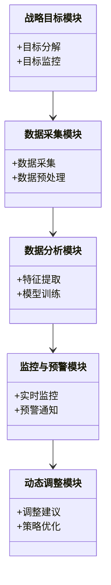
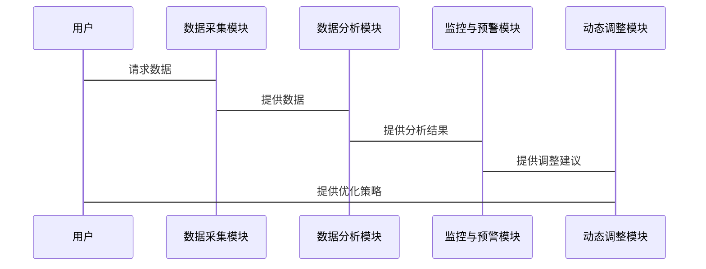

                 


# AI驱动的企业战略执行监控与调整系统

> 关键词：AI驱动、战略执行、监控系统、企业战略、动态调整

> 摘要：本文将详细探讨如何利用人工智能技术构建企业战略执行监控与调整系统。通过分析企业战略执行的痛点，提出AI驱动的解决方案，并结合具体应用场景，深入讲解系统的核心算法、架构设计及实现方案，最终为企业提供一种高效、智能的战略执行监控与调整方法。

---

## 第1章：企业战略执行监控的背景与挑战

### 1.1 企业战略执行的现状与问题

#### 1.1.1 传统企业战略执行的痛点
企业在战略制定后，往往面临执行过程中的诸多挑战：
- **目标分解难**：战略目标难以有效分解到各个部门和层级。
- **执行监控难**：缺乏实时数据支持，难以及时发现执行偏差。
- **调整滞后**：发现问题时往往已经造成较大损失，调整不及时。
- **数据孤岛**：各部门数据分散，难以形成统一的决策依据。

#### 1.1.2 数字化转型对企业战略执行的新要求
随着企业数字化转型的推进，战略执行需要更加敏捷和智能：
- **数据驱动决策**：需要实时、准确的数据支持。
- **智能化监控**：利用AI技术实现自动化的监控和预测。
- **动态调整能力**：能够快速响应市场变化和内部情况。

#### 1.1.3 AI在企业战略执行中的潜在价值
AI技术能够通过以下方式提升战略执行效率：
- **自动化数据处理**：AI可以快速处理大量数据，生成关键指标。
- **智能预测**：利用机器学习模型预测执行偏差。
- **实时反馈**：AI系统可以实时监控执行情况，提供调整建议。

### 1.2 AI驱动战略执行监控的必要性

#### 1.2.1 数据驱动决策的时代背景
当前企业决策越来越依赖数据支持，AI技术能够帮助企业在海量数据中提取有价值的信息。

#### 1.2.2 AI技术在战略执行中的应用优势
- **自动化**：AI可以自动采集、分析数据，减少人工干预。
- **实时性**：AI系统能够实时监控执行情况，提供即时反馈。
- **预测性**：通过机器学习模型预测潜在风险和机会。

#### 1.2.3 企业战略与AI技术的结合趋势
随着AI技术的成熟，越来越多的企业开始尝试将AI技术应用于战略执行监控，以提升企业竞争力。

### 1.3 本章小结
本章分析了企业战略执行的现状和问题，探讨了AI技术在战略执行中的潜在价值和必要性，为企业构建AI驱动的战略执行监控系统提供了背景支持。

---

## 第2章：AI驱动的战略执行监控系统的核心概念

### 2.1 战略执行监控的定义与目标

#### 2.1.1 战略执行监控的定义
战略执行监控是指通过数据采集、分析和可视化，实时跟踪战略执行情况，发现偏差并提供调整建议的过程。

#### 2.1.2 系统的目标与价值
- **目标**：实时监控战略执行情况，提供动态调整建议。
- **价值**：提升战略执行效率，降低偏差成本。

#### 2.1.3 系统的核心功能模块
- **数据采集**：采集企业内外部数据。
- **数据分析**：分析数据，发现执行偏差。
- **监控与预警**：实时监控，提供预警信息。
- **动态调整**：基于分析结果，提供调整建议。

### 2.2 AI技术在战略执行监控中的应用

#### 2.2.1 机器学习在战略执行中的应用
- **监督学习**：用于预测执行结果。
- **无监督学习**：用于发现数据中的潜在规律。

#### 2.2.2 自然语言处理在战略文档分析中的应用
- **文本挖掘**：分析战略文档中的关键词和主题。
- **情感分析**：识别文档中的情感倾向。

#### 2.2.3 数据可视化在战略监控中的作用
- **直观展示**：通过图表展示战略执行情况。
- **趋势分析**：通过可视化展示数据变化趋势。

### 2.3 系统的边界与外延

#### 2.3.1 系统的边界定义
系统仅关注战略执行监控，不涉及战略制定和最终调整的执行过程。

#### 2.3.2 系统与企业其他系统的关联
- **企业资源计划（ERP）**：数据来源。
- **客户关系管理（CRM）**：提供客户数据。
- **数据分析平台**：提供数据处理支持。

#### 2.3.3 系统的可扩展性与灵活性
系统设计时充分考虑了模块化设计，便于后续功能扩展。

### 2.4 核心概念对比分析

#### 2.4.1 战略执行监控与传统管理的区别
| 方面 | 战略执行监控 | 传统管理 |
|------|--------------|----------|
| 数据来源 | 结构化数据+非结构化数据 | 主要依赖经验 |
| 决策方式 | 数据驱动 | 人为主导 |

#### 2.4.2 AI驱动与传统驱动的对比
| 方面 | AI驱动 | 传统驱动 |
|------|--------|----------|
| 效率 | 高 | 低 |
| 实时性 | 实时 | 周期性 |

#### 2.4.3 不同AI模型在战略执行中的适用场景
- **监督学习**：适用于有标签的分类任务。
- **无监督学习**：适用于无标签的数据聚类任务。

### 2.5 本章小结
本章详细阐述了AI驱动的战略执行监控系统的核心概念，包括系统定义、目标、功能模块以及与传统管理的区别，为后续章节的系统设计奠定了基础。

---

## 第3章：AI驱动的战略执行监控系统的核心原理

### 3.1 系统的核心原理概述

#### 3.1.1 数据采样与预处理
- **数据采样**：随机采样、分层采样。
- **数据预处理**：数据清洗、特征提取。

#### 3.1.2 特征工程
- **特征选择**：选择对目标有较大影响的特征。
- **特征变换**：对特征进行标准化、归一化处理。

#### 3.1.3 模型训练
- **监督学习模型**：线性回归、支持向量机（SVM）。
- **无监督学习模型**：聚类分析（K-means）。

### 3.2 算法原理讲解

#### 3.2.1 机器学习算法
- **线性回归**：
  $$ y = \beta_0 + \beta_1x + \epsilon $$
  通过最小化均方误差（MSE）来优化参数。

- **支持向量机（SVM）**：
  使用最大-margin思想，将数据映射到高维空间，找到最优超平面。

#### 3.2.2 自然语言处理算法
- **文本挖掘**：
  使用TF-IDF方法提取关键词：
  $$ TF-IDF = \frac{tf \times idf}{N} $$
  其中，$tf$表示词频，$idf$表示逆文档频率，$N$表示总文档数。

- **情感分析**：
  使用词袋模型（Bag-of-Words）或词嵌入模型（Word2Vec）进行情感分类。

#### 3.2.3 数据可视化算法
- **主成分分析（PCA）**：
  通过降维技术，将高维数据映射到二维或三维空间，便于可视化。

### 3.3 算法实现代码示例

#### 3.3.1 机器学习模型实现
```python
import numpy as np
from sklearn.linear_model import LinearRegression

# 示例数据
X = np.array([[1], [2], [3], [4]])
y = np.array([2, 4, 6, 8])

# 模型训练
model = LinearRegression()
model.fit(X, y)

# 预测
print(model.predict(np.array([[5]])))
```

#### 3.3.2 文本挖掘实现
```python
from sklearn.feature_extraction.text import TfidfVectorizer

# 示例文本
text = ["This is a sample text.", "Another sample text."]

# 提取TF-IDF特征
vectorizer = TfidfVectorizer()
tfidf = vectorizer.fit_transform(text)
print(vectorizer.get_feature_names_out())
```

### 3.4 本章小结
本章详细讲解了AI驱动的战略执行监控系统的核心算法原理，包括数据预处理、特征工程、机器学习模型和自然语言处理算法，并通过代码示例展示了算法的实现过程。

---

## 第4章：系统分析与架构设计

### 4.1 系统分析

#### 4.1.1 问题场景介绍
企业战略执行监控系统需要解决以下问题：
- 实时监控战略执行情况。
- 自动发现执行偏差。
- 提供动态调整建议。

#### 4.1.2 项目介绍
本项目旨在构建一个AI驱动的企业战略执行监控系统，通过数据采集、分析和可视化，帮助企业在战略执行过程中实现动态调整。

### 4.2 系统功能设计

#### 4.2.1 领域模型设计


### 4.3 系统架构设计

#### 4.3.1 系统架构图
```mermaid
server
    graph TD
        I1 --> S1
        S1 --> C1
        C1 --> D1
        D1 --> A1
        A1 --> M1
        M1 --> O1
```

#### 4.3.2 接口设计
- 数据采集接口：提供REST API用于数据采集。
- 数据分析接口：提供API用于模型训练和特征提取。
- 监控预警接口：提供API用于实时监控和预警通知。

#### 4.3.3 交互流程


### 4.4 本章小结
本章详细分析了系统的功能需求，并设计了系统的架构和交互流程，为系统的实现提供了理论基础。

---

## 第5章：项目实战

### 5.1 环境搭建与数据准备

#### 5.1.1 环境搭建
安装所需依赖：
```bash
pip install numpy scikit-learn matplotlib
```

#### 5.1.2 数据准备
示例数据集：
```python
import pandas as pd

# 创建示例数据
data = {
    '部门': ['A', 'A', 'B', 'B'],
    '目标': [100, 200, 150, 250],
    '实际执行': [80, 180, 130, 220]
}

df = pd.DataFrame(data)
print(df)
```

### 5.2 系统核心实现

#### 5.2.1 数据采集与预处理
```python
import numpy as np
import pandas as pd

# 数据清洗
def preprocess_data(data):
    # 处理缺失值
    data = data.dropna()
    # 标准化处理
    from sklearn.preprocessing import StandardScaler
    scaler = StandardScaler()
    data[['目标', '实际执行']] = scaler.fit_transform(data[['目标', '实际执行']])
    return data

# 示例数据
data = {
    '部门': ['A', 'A', 'B', 'B'],
    '目标': [100, 200, 150, 250],
    '实际执行': [80, 180, 130, 220]
}

df = pd.DataFrame(data)
df_clean = preprocess_data(df)
print(df_clean)
```

#### 5.2.2 模型训练与评估
```python
from sklearn.model_selection import train_test_split
from sklearn.metrics import mean_squared_error

# 数据集划分
X = df_clean[['实际执行']]
y = df_clean['目标']
X_train, X_test, y_train, y_test = train_test_split(X, y, test_size=0.2, random_state=42)

# 模型训练
from sklearn.linear_model import LinearRegression
model = LinearRegression()
model.fit(X_train, y_train)

# 模型评估
y_pred = model.predict(X_test)
print(mean_squared_error(y_test, y_pred))
```

### 5.3 实际案例分析与实现

#### 5.3.1 案例背景
某企业战略目标是提高销售额，但实际执行中发现部门间存在较大的执行偏差。

#### 5.3.2 系统实现
```python
import numpy as np
import pandas as pd
from sklearn.linear_model import LinearRegression
from sklearn.metrics import mean_squared_error

# 数据准备
data = {
    '部门': ['A', 'A', 'B', 'B'],
    '目标': [100, 200, 150, 250],
    '实际执行': [80, 180, 130, 220]
}

df = pd.DataFrame(data)

# 数据预处理
def preprocess_data(data):
    data = data.dropna()
    from sklearn.preprocessing import StandardScaler
    scaler = StandardScaler()
    data[['目标', '实际执行']] = scaler.fit_transform(data[['目标', '实际执行']])
    return data

df_clean = preprocess_data(df)

# 模型训练
X = df_clean[['实际执行']]
y = df_clean['目标']
X_train, X_test, y_train, y_test = train_test_split(X, y, test_size=0.2, random_state=42)

model = LinearRegression()
model.fit(X_train, y_train)

# 模型评估
y_pred = model.predict(X_test)
print(mean_squared_error(y_test, y_pred))
```

### 5.4 本章小结
本章通过实际案例分析，详细讲解了系统的核心实现过程，包括数据准备、预处理、模型训练和评估。

---

## 第6章：最佳实践与总结

### 6.1 最佳实践

#### 6.1.1 数据质量管理
- 数据清洗要彻底，确保数据准确性。
- 数据标注要清晰，便于后续分析。

#### 6.1.2 模型优化
- 选择合适的模型，避免过拟合。
- 定期更新模型，确保模型的有效性。

#### 6.1.3 系统维护
- 定期检查系统运行状态。
- 及时修复系统漏洞。

### 6.2 小结与展望

#### 6.2.1 小结
本文详细探讨了AI驱动的企业战略执行监控与调整系统的构建过程，包括系统背景、核心概念、算法原理、系统架构设计和项目实战。

#### 6.2.2 展望
未来，随着AI技术的不断发展，战略执行监控系统将更加智能化和自动化，为企业提供更加精准的决策支持。

### 6.3 注意事项

#### 6.3.1 系统实施注意事项
- 确保数据安全。
- 系统上线前进行充分测试。

#### 6.3.2 系统维护注意事项
- 定期备份数据。
- 及时更新系统版本。

### 6.4 拓展阅读
- 推荐阅读《机器学习实战》、《深入理解机器学习》等书籍，以进一步提升对AI技术的理解。

---

## 附录：参考文献

1. 周志华. 《机器学习实战》. 清华大学出版社, 2016.
2. 李航. 《统计学习题》. 清华大学出版社, 2006.
3. Goodfellow, I., Bengio, Y., & Courville, A. (2016). Deep learning. MIT Press.

---

## 附录：术语表

- **机器学习**：一种人工智能技术，通过数据训练模型，实现对新数据的预测和分类。
- **TF-IDF**：文本挖掘中常用的一种特征提取方法，用于衡量一个词在文档中的重要性。
- **均方误差**：回归任务中常用的损失函数，衡量预测值与真实值的差距。

---

## 附录：问题解答

### 1. 系统如何保证数据安全性？
答：系统采用数据加密技术和访问控制策略，确保数据的安全性。

### 2. 系统支持哪些数据格式？
答：系统支持常见的文本、Excel、数据库等多种数据格式。

### 3. 系统如何进行模型更新？
答：系统定期收集新数据，重新训练模型，确保模型的有效性。

---

## 附录：联系方式

如需进一步了解本系统或获取技术支持，请联系：
- 邮箱：support@company.com
- 电话：+86-123-456789

---

# 结语

AI驱动的企业战略执行监控与调整系统为企业提供了一种高效、智能的管理方式。通过本文的详细讲解，读者可以深入了解系统的构建过程和实现方法，为企业在数字化转型中提供有力支持。

