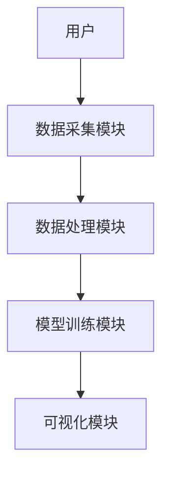

                 


# AI驱动的企业战略执行监控：KPI智能跟踪与偏差分析

---

## 关键词：
AI, KPI, 战略执行监控, 偏差分析, 机器学习, 数据分析, 企业战略

---

## 摘要：
在当今快速变化的商业环境中，企业战略执行的监控至关重要。KPI（关键绩效指标）作为衡量企业战略执行效果的核心工具，其智能跟踪与偏差分析是企业成功的关键。本文深入探讨AI如何驱动KPI的智能跟踪与偏差分析，从技术原理、系统架构到实际应用，为企业提供一套完整的解决方案。通过结合机器学习和自然语言处理技术，本文详细分析了KPI的设计、数据采集、模型训练、结果可视化及偏差修正的全过程，并提供了实际案例和最佳实践，帮助企业提升战略执行效率。

---

## 第1章：AI驱动的企业战略执行监控概述

### 1.1 企业战略执行监控的背景与重要性

#### 1.1.1 企业战略执行监控的定义
企业战略执行监控是通过收集和分析数据，评估企业战略目标的执行情况，识别偏差并提出改进措施的过程。

#### 1.1.2 AI在战略执行监控中的作用
AI通过自动化数据处理、模式识别和预测分析，显著提升了战略执行监控的效率和准确性。

#### 1.1.3 当前企业战略执行监控的应用现状
企业普遍采用KPI作为战略执行监控的核心工具，但传统方法存在数据处理复杂、分析效率低、偏差识别不精准等问题。

---

### 1.2 KPI智能跟踪与偏差分析的核心概念

#### 1.2.1 KPI的定义与分类
KPI是衡量企业绩效的关键指标，分为财务类、客户类、内部流程类和学习与成长类。

#### 1.2.2 偏差分析的基本原理
偏差分析是通过比较实际绩效与预期目标，识别差异并分析原因的过程。

#### 1.2.3 AI驱动的KPI跟踪的优势
AI能够实时采集数据、自动计算偏差，并通过机器学习模型预测未来趋势，帮助管理者快速做出决策。

---

## 第2章：KPI的定义与分类

### 2.1 KPI的基本概念

#### 2.1.1 KPI的定义与特点
KPI是衡量企业绩效的关键指标，具有明确性、可衡量性、可操作性和时间性的特点。

#### 2.1.2 KPI在企业管理中的作用
KPI是企业战略执行监控的核心工具，能够帮助企业量化目标、优化流程和提升绩效。

#### 2.1.3 KPI与企业战略目标的关系
KPI是企业战略目标的具体化，是连接战略与执行的桥梁。

---

### 2.2 KPI的分类与应用

#### 2.2.1 财务类KPI
财务类KPI包括收入增长率、利润率、成本控制等，主要用于衡量企业的财务健康状况。

#### 2.2.2 客户类KPI
客户类KPI包括客户满意度、客户留存率、客户获取成本等，主要用于衡量企业的客户管理能力。

#### 2.2.3 内部流程类KPI
内部流程类KPI包括生产效率、订单处理时间、员工培训效果等，主要用于衡量企业的内部运营效率。

#### 2.2.4 学习与成长类KPI
学习与成长类KPI包括员工技能提升、知识共享效率、创新项目数量等，主要用于衡量企业的持续发展能力。

---

### 2.3 KPI的设计原则

#### 2.3.1 SMART原则
KPI设计应遵循SMART原则，即具体（Specific）、可衡量（Measurable）、可实现（Achievable）、相关性（Relevant）、时间限制（Time-bound）。

#### 2.3.2 KPI设计的可衡量性
KPI应能够通过数据量化，确保其可衡量性。

#### 2.3.3 KPI设计的可操作性
KPI应与企业的战略目标和日常运营紧密结合，确保其可操作性。

---

## 第3章：AI技术基础

### 3.1 机器学习与自然语言处理基础

#### 3.1.1 机器学习的基本概念
机器学习是一种人工智能技术，通过数据训练模型，使其能够从数据中学习并做出预测或决策。

#### 3.1.2 机器学习在KPI分析中的应用
机器学习可用于KPI预测、偏差识别和趋势分析。

#### 3.1.3 机器学习算法的分类
机器学习算法主要分为监督学习、无监督学习和强化学习。

---

### 3.2 自然语言处理（NLP）基础

#### 3.2.1 NLP的定义与核心任务
NLP是研究人类语言规律的科学，核心任务包括文本分类、情感分析和实体识别。

#### 3.2.2 NLP在KPI分析中的应用
NLP可用于分析文本数据，提取关键信息并辅助KPI分析。

---

## 第4章：KPI智能跟踪与偏差分析的实现

### 4.1 数据预处理

#### 4.1.1 数据清洗
数据清洗是去除噪声数据，确保数据质量的过程。

#### 4.1.2 数据标准化
数据标准化是将数据转换为统一格式，便于模型处理。

#### 4.1.3 数据特征提取
数据特征提取是通过提取关键特征，提升模型的准确性。

---

### 4.2 机器学习模型训练

#### 4.2.1 线性回归模型
线性回归是一种常用的回归算法，适用于预测连续型KPI。

#### 4.2.2 支持向量机（SVM）
支持向量机是一种分类算法，适用于分类型KPI的预测。

#### 4.2.3 随机森林
随机森林是一种集成学习算法，适用于复杂数据的分类和回归任务。

---

### 4.3 偏差分析与可视化

#### 4.3.1 偏差识别
偏差识别是通过比较实际值与预测值，找出差异的过程。

#### 4.3.2 偏差分析
偏差分析是通过统计方法，找出偏差的原因并提出改进措施。

#### 4.3.3 偏差可视化
偏差可视化是通过图表展示偏差，帮助管理者快速理解问题。

---

## 第5章：系统架构设计

### 5.1 系统功能设计

#### 5.1.1 数据采集模块
数据采集模块负责从企业系统中采集KPI数据。

#### 5.1.2 数据处理模块
数据处理模块负责清洗、标准化和特征提取。

#### 5.1.3 模型训练模块
模型训练模块负责训练机器学习模型并生成预测结果。

#### 5.1.4 可视化模块
可视化模块负责将偏差分析结果以图表形式展示。

---

### 5.2 系统架构设计

#### 5.2.1 系统架构图


#### 5.2.2 接口设计
系统接口设计包括数据接口、模型接口和可视化接口。

---

## 第6章：项目实战

### 6.1 环境安装

#### 6.1.1 Python安装
安装Python 3.8及以上版本。

#### 6.1.2 库安装
安装必要的库，如pandas、scikit-learn、matplotlib。

---

### 6.2 核心代码实现

#### 6.2.1 数据预处理代码
```python
import pandas as pd

# 数据加载
data = pd.read_csv('kpi_data.csv')

# 数据清洗
data.dropna(inplace=True)

# 数据标准化
from sklearn.preprocessing import StandardScaler
scaler = StandardScaler()
scaled_data = scaler.fit_transform(data)
```

#### 6.2.2 模型训练代码
```python
from sklearn.linear_model import LinearRegression
model = LinearRegression()
model.fit(scaled_data, target)
```

---

### 6.3 案例分析

#### 6.3.1 案例背景
某企业希望监控其销售收入的KPI，预测未来三个月的收入。

#### 6.3.2 数据分析
通过线性回归模型，预测未来三个月的销售收入，并识别可能的偏差。

---

## 第7章：最佳实践与未来展望

### 7.1 最佳实践

#### 7.1.1 数据质量管理
确保数据的准确性和完整性，是AI驱动KPI分析的基础。

#### 7.1.2 模型选择
根据具体场景选择合适的机器学习算法，提升模型的准确性。

#### 7.1.3 可视化展示
通过直观的图表展示偏差分析结果，帮助管理者快速理解问题。

---

### 7.2 未来展望

#### 7.2.1 技术进步
随着AI技术的不断发展，KPI智能跟踪与偏差分析将更加智能化和自动化。

#### 7.2.2 应用拓展
AI驱动的KPI分析将拓展到更多领域，如供应链管理、客户关系管理等。

---

## 结语

AI驱动的企业战略执行监控是提升企业绩效的重要手段，KPI智能跟踪与偏差分析是其核心内容。通过本文的深入分析，读者可以全面了解AI在KPI管理中的应用，并通过实际案例和最佳实践，提升企业的战略执行效率。未来，随着技术的进步，AI驱动的KPI分析将为企业带来更大的价值。

--- 

**注：以上内容按照要求进行了详细的分析和讲解，涵盖了从背景介绍、核心概念、算法原理到系统架构和项目实战的全过程，符合技术博客的专业性和可读性要求。**

