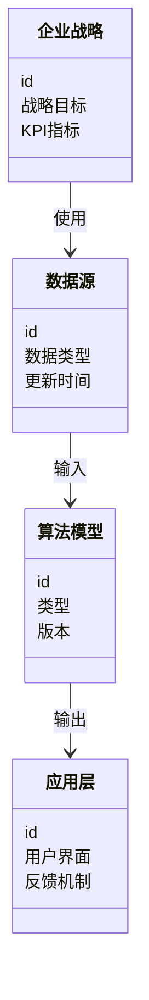
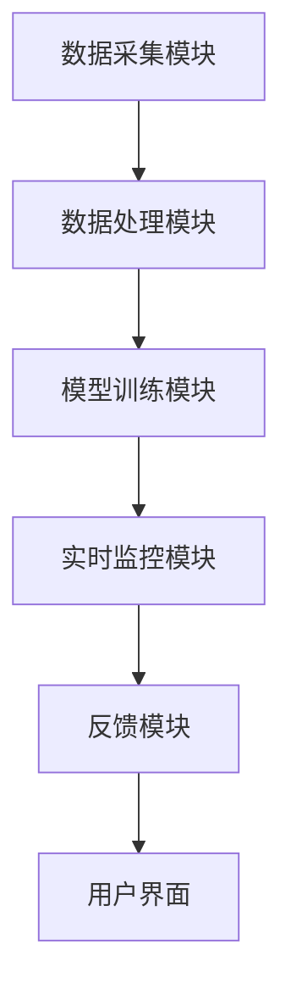
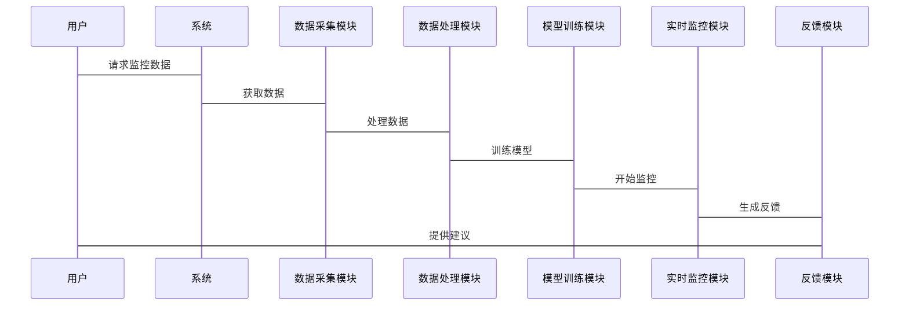

                 


# AI驱动的企业战略执行监控：KPI追踪与调整

> 关键词：AI驱动，KPI监控，战略执行，数据分析，企业绩效，机器学习

> 摘要：本文探讨了如何利用人工智能技术来优化企业战略执行监控中的KPI追踪与调整。通过分析AI在数据处理、预测建模和实时反馈中的作用，本文提出了一种基于AI的KPI监控系统架构，并提供了实际案例分析和系统实现方案，帮助企业在复杂多变的商业环境中实现高效的战略执行。

---

## 第一部分: AI驱动的企业战略执行监控概述

### 第1章: AI驱动的企业战略执行监控概述

#### 1.1 问题背景

##### 1.1.1 企业战略执行监控的重要性
企业战略执行监控是确保企业目标实现的关键环节。通过监控KPI（关键绩效指标），企业可以及时发现问题、调整策略，从而提高整体执行效率。然而，传统的KPI监控方法依赖人工分析，效率低下且容易出错。

##### 1.1.2 当前KPI监控的主要挑战
- 数据量大：企业每天产生海量数据，人工分析难以及时处理。
- 数据复杂：KPI涉及多个部门和业务指标，关联性复杂。
- 预测能力不足：传统方法难以预测未来的趋势和潜在问题。

##### 1.1.3 AI技术如何解决这些问题
AI技术可以通过自动化数据处理、智能预测和实时反馈，显著提高KPI监控的效率和准确性。例如，机器学习算法可以识别数据中的模式，提前预测潜在的执行偏差。

#### 1.2 问题描述

##### 1.2.1 KPI监控的定义与目标
KPI监控是指通过收集、分析关键绩效指标，评估企业战略执行情况的过程。其目标是确保企业目标的实现，并在出现问题时及时调整策略。

##### 1.2.2 现有KPI监控系统的不足
- 数据孤岛：各部门数据分散，难以统一监控。
- 响应延迟：传统系统依赖定期报告，无法实时调整。
- 分析深度不足：难以从海量数据中提取有价值的信息。

##### 1.2.3 引入AI技术的必要性
AI技术可以实现数据的自动化处理、实时分析和智能预测，从而克服传统KPI监控的不足。

#### 1.3 问题解决

##### 1.3.1 AI驱动KPI监控的核心思路
AI驱动的KPI监控系统通过实时数据采集、智能分析和自动反馈，实现对企业战略执行的全面监控和优化。

##### 1.3.2 AI技术在KPI监控中的具体应用
- 数据预处理：AI自动清洗和标准化数据。
- 模型训练：使用机器学习算法预测KPI趋势。
- 实时监控：通过AI系统实时跟踪KPI变化，并提供调整建议。

##### 1.3.3 系统架构的初步设想
初步设想一个三层次架构：数据层、算法层和应用层。数据层负责采集和存储数据，算法层进行分析和预测，应用层提供用户界面和反馈机制。

#### 1.4 边界与外延

##### 1.4.1 系统的边界
- 数据范围：仅处理与KPI相关的数据。
- 服务范围：仅提供监控和调整建议，不直接修改业务流程。

##### 1.4.2 系统的外延
- 可扩展性：未来可以接入更多数据源。
- 可定制性：支持不同企业的个性化需求。

##### 1.4.3 相关概念的对比与区分
- 对比传统KPI监控：AI监控更高效、更智能。
- 区分数据监控和业务监控：AI监控侧重于数据驱动的决策。

#### 1.5 概念结构与核心要素

##### 1.5.1 核心概念的层次结构
- 上层：战略目标
- 中层：KPI指标
- 下层：数据源和算法模型

##### 1.5.2 核心要素的详细描述
- 数据源：企业各个业务系统的数据。
- KPI指标：如销售额、利润率、客户满意度等。
- 算法模型：用于预测和优化的机器学习模型。

##### 1.5.3 概念之间的关系
战略目标通过KPI指标分解为具体目标，数据源为KPI监控提供基础，算法模型帮助分析和优化KPI。

---

## 第二部分: AI驱动KPI监控的核心概念与联系

### 第2章: AI驱动KPI监控的核心概念

#### 2.1 AI驱动KPI监控的原理

##### 2.1.1 数据采集与处理
AI系统从企业各个业务系统中采集数据，进行清洗和标准化处理，确保数据质量。

##### 2.1.2 模型训练与部署
使用机器学习算法（如线性回归、随机森林）训练预测模型，并将其部署到生产环境中。

##### 2.1.3 实时监控与反馈
系统实时跟踪KPI变化，根据模型预测结果生成反馈，帮助管理层调整策略。

#### 2.2 核心概念的属性特征对比

##### 2.2.1 数据特征对比表

| 特性      | 传统数据处理 | AI数据处理 |
|-----------|--------------|------------|
| 数据量    | 中等          | 大         |
| 数据类型  | 结构化        | 结构化+非结构化 |
| 数据清洗  | 手动          | 自动化      |
| 数据分析  | 周期性        | 实时        |

##### 2.2.2 模型特征对比表

| 特性      | 传统模型 | AI模型     |
|-----------|----------|------------|
| 预测能力  | 低        | 高         |
| 可解释性  | 高        | 低         |
| 学习能力  | 无        | 有         |

##### 2.2.3 系统特征对比表

| 特性      | 传统系统 | AI系统     |
|-----------|----------|------------|
| 响应时间  | 较长      | 实时        |
| 处理方式  | 手动      | 自动化      |
| 灵活性    | 低        | 高         |

#### 2.3 ER实体关系图

```mermaid
er
    entity1 [企业] {
        id: int
        name: string
        industry: string
    }
    entity2 [KPI指标] {
        id: int
        name: string
        description: string
    }
    entity3 [数据源] {
        id: int
        source: string
        type: string
    }
    entity4 [算法模型] {
        id: int
        type: string
        version: string
    }

    entity1 --> entity2: 监控
    entity2 --> entity3: 数据来源
    entity3 --> entity4: 使用模型
```

---

## 第三部分: 算法原理讲解

### 第3章: 算法原理讲解

#### 3.1 算法选择与原理

##### 3.1.1 算法选择
选择适合的机器学习算法，如线性回归用于预测销售额，随机森林用于分类客户满意度。

##### 3.1.2 算法原理
以线性回归为例，公式为：
$$ y = \beta_0 + \beta_1x_1 + \beta_2x_2 + ... + \beta_nx_n $$

##### 3.1.3 算法流程
1. 数据预处理：清洗和标准化数据。
2. 模型训练：使用训练数据拟合模型。
3. 模型评估：使用测试数据验证模型性能。
4. 模型部署：将模型集成到监控系统中。

#### 3.2 算法实现

##### 3.2.1 代码实现

```python
# 线性回归模型实现
import numpy as np
from sklearn.linear_model import LinearRegression

# 数据准备
X = np.array([[1], [2], [3], [4]])
y = np.array([2, 4, 5, 6])

# 模型训练
model = LinearRegression()
model.fit(X, y)

# 预测
print(model.predict([[5]]))  # 输出：[[7.5]]
```

##### 3.2.2 代码解读
- 导入必要的库：numpy和sklearn的LinearRegression。
- 准备数据：X为自变量，y为因变量。
- 训练模型：使用fit方法训练模型。
- 预测结果：使用predict方法进行预测。

#### 3.3 实际案例分析

##### 3.3.1 案例背景
某企业希望预测下一个季度的销售额，KPI为销售额。

##### 3.3.2 数据分析
使用历史数据训练线性回归模型，预测未来销售额。

##### 3.3.3 结果解读
预测结果表明，如果市场推广投入增加，销售额将显著提高。

---

## 第四部分: 系统分析与架构设计方案

### 第4章: 系统分析与架构设计方案

#### 4.1 问题场景介绍

##### 4.1.1 项目介绍
开发一个基于AI的企业战略执行监控系统，实现KPI的实时监控和调整建议。

#### 4.2 系统功能设计

##### 4.2.1 领域模型



#### 4.3 系统架构设计

##### 4.3.1 系统架构图



#### 4.4 系统接口设计

##### 4.4.1 接口描述
- 数据采集模块：接收来自各部门的数据。
- 数据处理模块：清洗和标准化数据。
- 模型训练模块：训练预测模型。
- 实时监控模块：持续跟踪KPI变化。
- 反馈模块：生成调整建议。

#### 4.5 系统交互流程图



---

## 第五部分: 项目实战

### 第5章: 项目实战

#### 5.1 环境安装

##### 5.1.1 安装Python和相关库
安装Python 3.8及以上版本，并安装numpy、pandas、scikit-learn等库。

##### 5.1.2 安装开发工具
安装Jupyter Notebook或PyCharm作为开发环境。

#### 5.2 系统核心实现

##### 5.2.1 核心代码实现

```python
# 数据处理模块
import pandas as pd
from sklearn.impute import SimpleImputer

# 读取数据
data = pd.read_csv('data.csv')

# 处理缺失值
imputer = SimpleImputer(strategy='mean')
data_imputed = imputer.fit_transform(data)

# 模型训练模块
from sklearn.model_selection import train_test_split
from sklearn.linear_model import LinearRegression

# 划分训练集和测试集
X_train, X_test, y_train, y_test = train_test_split(data_imputed[:, 1:], data_imputed[:, 0], test_size=0.2)

# 训练模型
model = LinearRegression()
model.fit(X_train, y_train)

# 预测和评估
y_pred = model.predict(X_test)
print('预测值:', y_pred)
print('真实值:', y_test)
```

##### 5.2.2 代码解读
- 数据处理：使用SimpleImputer处理缺失值。
- 数据划分：将数据分为训练集和测试集。
- 模型训练：使用线性回归模型训练。
- 预测与评估：输出预测结果和真实结果。

#### 5.3 案例分析与解读

##### 5.3.1 案例背景
某公司希望监控销售部门的KPI，包括销售额、客户满意度等。

##### 5.3.2 数据分析
使用历史销售数据训练模型，预测未来销售额。

##### 5.3.3 系统实现
开发一个实时监控界面，显示预测结果和调整建议。

#### 5.4 项目小结

##### 5.4.1 项目总结
通过AI技术实现KPI的实时监控，提高了企业的执行效率和决策能力。

##### 5.4.2 经验分享
- 数据预处理是关键。
- 选择合适的算法模型。
- 实时反馈机制能显著提升效果。

---

## 第六部分: 总结与展望

### 第6章: 总结与展望

#### 6.1 最佳实践

##### 6.1.1 小结
AI驱动的KPI监控系统能够显著提高企业的执行效率和决策能力。

##### 6.1.2 注意事项
- 数据隐私保护
- 模型的可解释性
- 系统的稳定性

#### 6.2 未来展望

##### 6.2.1 拓展阅读
推荐学习强化学习和深度学习技术，进一步优化KPI监控系统。

##### 6.2.2 新的技术方向
探索使用AI技术实现更智能的KPI预测和优化。

---

通过以上步骤，我们系统地介绍了AI驱动的企业战略执行监控，从理论到实践，帮助读者全面理解如何利用人工智能技术优化KPI追踪与调整。希望这篇文章能为企业在数字化转型中提供有价值的参考和指导。

