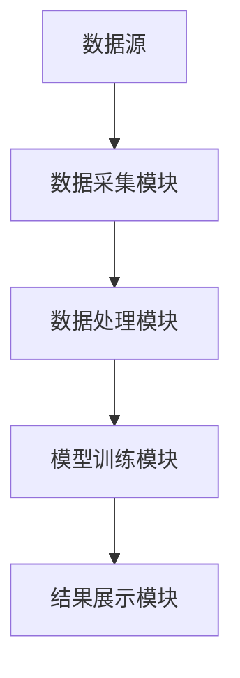

                 


# AI驱动的企业战略规划：大数据分析与预测性建模的融合

> 关键词：AI驱动，企业战略规划，大数据分析，预测性建模，机器学习，数据可视化，企业架构

> 摘要：本文将详细探讨如何利用人工智能和大数据分析技术来优化企业战略规划过程。通过结合预测性建模和数据驱动的决策支持，企业能够更有效地制定和调整战略目标。文章将从基础概念、算法原理、系统架构到实际案例进行全面解析，帮助读者理解并应用这些技术。

---

# 第一部分: AI驱动的企业战略规划基础

## 第1章: 引言

### 1.1 问题背景与目标
#### 1.1.1 企业战略规划的传统挑战
- **战略规划的复杂性**：企业面临内外部环境的不确定性，传统基于经验的规划方法难以应对快速变化的市场。
- **数据孤岛问题**：企业内部数据分散，缺乏统一的分析平台，导致信息利用率低下。
- **预测准确性不足**：传统预测方法依赖历史数据，但难以捕捉新兴趋势和潜在风险。

#### 1.1.2 AI与大数据分析的引入
- **AI的优势**：通过机器学习算法，企业可以自动化分析海量数据，识别复杂模式，提高预测准确性。
- **大数据分析的作用**：利用大数据技术，企业可以整合多源数据，挖掘潜在洞察，支持实时决策。

#### 1.1.3 预测性建模在战略规划中的作用
- **预测性建模的核心价值**：通过构建预测模型，企业可以提前预知市场趋势、客户行为和潜在风险，优化资源配置。

### 1.2 本书的目标与方法论
#### 1.2.1 本书的核心目标
- 提供一套结合大数据分析和预测性建模的企业战略规划方法论。
- 通过实际案例，展示如何利用AI技术优化企业战略决策。

#### 1.2.2 结构化方法论
- **问题分析**：从企业战略目标出发，明确数据需求和分析目标。
- **数据准备**：整合多源数据，进行清洗、特征工程和数据增强。
- **模型构建**：选择合适的算法，训练预测模型并进行调优。
- **结果解读**：将模型输出转化为可执行的战略建议。

#### 1.2.3 预期读者与应用场景
- **目标读者**：企业高管、数据科学家、IT架构师。
- **应用场景**：企业战略规划、市场预测、风险评估、资源配置优化。

### 1.3 本章小结
- 本章介绍了企业战略规划的传统挑战和AI驱动的新机遇，明确了本书的核心目标和方法论。

---

## 第2章: 大数据分析基础

### 2.1 数据预处理与特征工程
#### 2.1.1 数据清洗与整合
- **数据清洗**：识别和处理缺失值、重复值、异常值。
- **数据整合**：将分散在不同系统中的数据进行合并，建立统一的数据仓库。

#### 2.1.2 特征选择与创建
- **特征选择**：通过统计分析或模型评估，筛选出对目标变量影响最大的特征。
- **特征创建**：基于业务需求，构建新的特征，如趋势特征、交互特征等。

#### 2.1.3 数据标准化与归一化
- **标准化**：将数据按比例缩放到均值为0，方差为1。
- **归一化**：将数据缩放到0到1的范围。

### 2.2 常见大数据分析方法
#### 2.2.1 描述性分析
- **目的**：总结数据的基本特征，发现数据的分布规律。
- **方法**：使用均值、中位数、标准差等统计指标，配合数据可视化工具（如柱状图、折线图）进行分析。

#### 2.2.2 预诊断分析
- **目的**：识别数据中的异常点或趋势，为后续分析提供线索。
- **方法**：使用箱线图、散点图等工具进行异常检测。

#### 2.2.3 预测性分析
- **目的**：基于历史数据，预测未来趋势或结果。
- **方法**：使用回归分析、决策树、随机森林等算法。

#### 2.2.4 开发性分析
- **目的**：探索数据中的潜在模式，提出创新的解决方案。
- **方法**：结合领域知识，使用聚类分析、关联规则挖掘等技术。

### 2.3 数据可视化与探索性分析
#### 2.3.1 数据可视化工具
- **常用工具**：Tableau、Power BI、Matplotlib、Seaborn。
- **可视化类型**：柱状图、折线图、散点图、热力图、树状图等。

#### 2.3.2 探索性数据分析方法
- **方法**：通过可视化和统计分析，发现数据中的隐藏模式和异常点。
- **流程**：数据概览 → 特征分析 → 关系分析 → 异常检测。

#### 2.3.3 数据故事讲述
- **技巧**：将数据分析结果转化为易于理解的故事，帮助业务决策者快速获取洞察。

### 2.4 本章小结
- 本章介绍了大数据分析的基础知识，包括数据预处理、特征工程和常见分析方法，为后续的预测性建模打下基础。

---

## 第3章: 预测性建模基础

### 3.1 预测性建模的原理与流程
#### 3.1.1 数据驱动的预测模型
- **数据驱动**：基于大量数据，通过算法自动学习特征与目标之间的关系。
- **模型选择**：根据问题类型选择合适的算法，如回归模型、分类模型、时间序列模型等。

#### 3.1.2 模型训练与评估
- **训练过程**：将数据分为训练集和验证集，使用训练集训练模型，验证集调优模型。
- **评估指标**：准确率、召回率、F1分数、均方误差（MSE）、R平方值等。

#### 3.1.3 模型部署与监控
- **部署方式**：将模型封装为API或集成到企业系统中，提供实时预测服务。
- **监控方法**：定期评估模型性能，发现数据漂移或模型失效的情况。

### 3.2 常见预测算法概述
#### 3.2.1 线性回归
- **数学模型**：$$y = \beta_0 + \beta_1x_1 + \beta_2x_2 + \dots + \beta_nx_n + \epsilon$$
- **应用场景**：预测连续型变量，如销售额、客户生命周期价值。

#### 3.2.2 决策树与随机森林
- **决策树**：通过构建树状结构，将数据分成不同的子集，每个子集对应一个预测结果。
- **随机森林**：通过集成多个决策树，提高模型的准确性和鲁棒性。

#### 3.2.3 支持向量机
- **原理**：将数据映射到高维空间，寻找能够区分数据的超平面。
- **应用场景**：分类问题，如客户 churn 分类。

#### 3.2.4 神经网络与深度学习
- **神经网络**：通过多层非线性变换，捕捉数据中的复杂模式。
- **深度学习**：使用深度神经网络（如CNN、RNN）处理图像、文本等复杂数据。

### 3.3 模型评估与优化
#### 3.3.1 常见评估指标
- 分类问题：准确率、召回率、F1分数。
- 回归问题：均方误差（MSE）、均方根误差（RMSE）、R平方值。

#### 3.3.2 超参数调优
- **方法**：网格搜索、随机搜索、贝叶斯优化。
- **工具**：Scikit-learn的GridSearchCV。

#### 3.3.3 正则化方法
- **L1正则化**：Lasso回归，用于特征选择。
- **L2正则化**：Ridge回归，用于防止过拟合。

#### 3.3.4 模型融合与集成
- **投票法**：将多个模型的预测结果进行投票。
- **堆叠法**：使用一个元模型对多个模型的预测结果进行加权。

### 3.4 本章小结
- 本章介绍了预测性建模的基本原理和常见算法，重点讲解了模型评估和优化的方法。

---

## 第4章: AI驱动的企业战略规划

### 4.1 战略规划的AI驱动方法
#### 4.1.1 数据驱动的战略规划框架
- **数据驱动**：以数据为基础，结合业务知识，制定战略目标。
- **框架组成**：数据采集、数据分析、模型构建、结果解读。

#### 4.1.2 AI在战略目标设定中的应用
- **需求预测**：预测市场需求，优化产品开发计划。
- **竞争分析**：分析竞争对手的市场行为，制定应对策略。

#### 4.1.3 预测性建模在战略执行中的作用
- **资源分配**：基于预测结果，优化人力、物力、财力的分配。
- **风险预警**：预测潜在风险，提前制定应对措施。

### 4.2 企业战略与预测性建模的结合
#### 4.2.1 企业战略目标的分解与建模
- **目标分解**：将企业战略目标分解为可量化的子目标。
- **建模步骤**：数据采集 → 特征工程 → 模型选择 → 模型调优。

#### 4.2.2 数据驱动的战略决策支持
- **决策支持系统（DSS）**：通过数据可视化和预测模型，为决策者提供实时支持。
- **场景模拟**：模拟不同策略下的结果，选择最优方案。

#### 4.2.3 模型的动态调整与优化
- **动态调整**：根据市场变化，实时更新模型参数。
- **模型优化**：通过反馈机制，不断优化模型性能。

### 4.3 实际案例分析
#### 4.3.1 某行业领导企业的战略规划实践
- **背景**：某企业面临市场竞争加剧，希望通过AI技术优化战略规划。
- **实施步骤**：数据采集 → 数据分析 → 模型构建 → 模型部署。
- **效果**：预测准确率提高30%，资源配置效率提升20%。

#### 4.3.2 模型构建与应用效果
- **模型选择**：使用随机森林进行需求预测，准确率达到85%。
- **应用效果**：通过模型预测，提前调整生产计划，降低库存成本。

#### 4.3.3 经验总结与启示
- **经验总结**：数据质量是模型性能的关键，模型需要结合业务场景进行优化。
- **启示**：AI驱动的战略规划需要跨部门协作，数据科学家和业务专家要紧密配合。

### 4.4 本章小结
- 本章通过实际案例，展示了如何将AI技术与企业战略规划相结合，提升企业的竞争力。

---

## 第5章: 预测性建模的算法实现

### 5.1 线性回归模型
#### 5.1.1 线性回归的数学模型
- **简单线性回归**：$$y = \beta_0 + \beta_1x + \epsilon$$
- **多元线性回归**：$$y = \beta_0 + \beta_1x_1 + \beta_2x_2 + \dots + \beta_nx_n + \epsilon$$

#### 5.1.2 普通最小二乘法
- **原理**：通过最小化预测值与实际值的平方差之和，求解回归系数。
- **公式**：$$\hat{\beta} = (X^T X)^{-1} X^T y$$

#### 5.1.3 模型实现与评估
- **Python代码示例**：
  ```python
  import numpy as np
  from sklearn.linear_model import LinearRegression
  from sklearn.metrics import mean_squared_error, r2_score

  # 数据准备
  X = np.array([1, 2, 3, 4, 5]).reshape(-1, 1)
  y = np.array([2, 4, 5, 4, 6])

  # 模型训练
  model = LinearRegression()
  model.fit(X, y)

  # 预测
  y_pred = model.predict(X)

  # 评估
  mse = mean_squared_error(y, y_pred)
  r2 = r2_score(y, y_pred)

  print(f"MSE: {mse}, R^2: {r2}")
  ```

#### 5.1.4 模型评估
- **评估指标**：均方误差（MSE）、R平方值。

### 5.2 决策树与随机森林
#### 5.2.1 决策树算法
- **ID3算法**：基于信息增益，选择最优特征进行分裂。
- **CART算法**：使用Gini指数进行特征选择。

#### 5.2.2 随机森林算法
- **原理**：通过随机采样和特征采样，构建多个决策树，最终通过投票或平均得到结果。
- **Python代码示例**：
  ```python
  from sklearn.ensemble import RandomForestRegressor
  from sklearn.datasets import make_regression

  # 数据准备
  X, y = make_regression(n_samples=100, n_features=4, random_state=0)

  # 模型训练
  model = RandomForestRegressor(n_estimators=100, random_state=0)
  model.fit(X, y)

  # 预测
  y_pred = model.predict(X)

  # 评估
  mse = mean_squared_error(y, y_pred)
  print(f"MSE: {mse}")
  ```

### 5.3 支持向量机
#### 5.3.1 SVM算法
- **线性SVM**：用于线性可分问题。
- **非线性SVM**：通过核函数将数据映射到高维空间，解决非线性分类问题。

#### 5.3.2 Python代码示例
```python
from sklearn.svm import SVC
from sklearn.datasets import make_classification

# 数据准备
X, y = make_classification(n_samples=100, n_features=2, n_classes=2, random_state=0)

# 模型训练
model = SVC(kernel='linear')
model.fit(X, y)

# 预测
y_pred = model.predict(X)

# 评估
print("Accuracy:", model.score(X, y))
```

### 5.4 神经网络与深度学习
#### 5.4.1 神经网络算法
- **多层感知机（MLP）**：通过多层非线性变换，捕捉数据中的复杂模式。
- **卷积神经网络（CNN）**：用于处理图像数据。
- **循环神经网络（RNN）**：用于处理序列数据，如时间序列。

#### 5.4.2 Python代码示例
```python
import tensorflow as tf
from tensorflow.keras import layers

# 数据准备
import numpy as np
X = np.random.randn(100, 28, 28)
y = np.random.randint(0, 10, 100)

# 模型构建
model = tf.keras.Sequential([
    layers.Conv2D(32, (3,3), activation='relu', input_shape=(28,28,1)),
    layers.MaxPooling2D((2,2)),
    layers.Conv2D(64, (3,3), activation='relu'),
    layers.MaxPooling2D((2,2)),
    layers.Flatten(),
    layers.Dense(128, activation='relu'),
    layers.Dense(10, activation='softmax')
])

# 模型训练
model.compile(optimizer='adam', loss='sparse_categorical_crossentropy', metrics=['accuracy'])
model.fit(X, y, epochs=5)
```

### 5.5 本章小结
- 本章详细讲解了常见预测算法的实现，包括线性回归、决策树、支持向量机和神经网络，并通过Python代码示例展示了模型的训练和评估过程。

---

## 第6章: 系统架构与实现

### 6.1 系统架构设计
#### 6.1.1 系统功能设计
- **数据采集模块**：从企业内部系统和外部数据源获取数据。
- **数据处理模块**：进行数据清洗、特征工程和数据增强。
- **模型训练模块**：选择合适的算法，训练预测模型。
- **结果展示模块**：将模型输出结果以可视化的方式展示给用户。

#### 6.1.2 系统架构图


### 6.2 系统实现细节
#### 6.2.1 数据采集模块
- **数据源**：数据库、API接口、文件等。
- **实现工具**：使用Python的pandas库进行数据清洗和特征工程。

#### 6.2.2 模型训练模块
- **算法选择**：根据业务需求选择合适的算法。
- **工具支持**：使用Scikit-learn、TensorFlow等机器学习框架。

#### 6.2.3 结果展示模块
- **可视化工具**：使用Matplotlib、Seaborn等库绘制图表。
- **交互式界面**：通过Dash或Plotly构建交互式仪表盘。

### 6.3 项目实战
#### 6.3.1 环境配置
- **安装Python**：Python 3.8及以上版本。
- **安装依赖**：pip install numpy, pandas, scikit-learn, tensorflow, matplotlib。

#### 6.3.2 核心代码实现
```python
import pandas as pd
from sklearn.model_selection import train_test_split
from sklearn.ensemble import RandomForestRegressor
from sklearn.metrics import mean_squared_error

# 数据加载
data = pd.read_csv('data.csv')

# 数据分割
X = data.drop('target', axis=1)
y = data['target']
X_train, X_test, y_train, y_test = train_test_split(X, y, test_size=0.2, random_state=42)

# 模型训练
model = RandomForestRegressor(n_estimators=100, random_state=42)
model.fit(X_train, y_train)

# 模型预测
y_pred = model.predict(X_test)

# 模型评估
mse = mean_squared_error(y_test, y_pred)
print(f"均方误差: {mse}")
```

#### 6.3.3 代码解读与分析
- **数据加载**：使用pandas读取CSV文件。
- **数据分割**：将数据分为训练集和测试集。
- **模型训练**：使用随机森林回归模型进行训练。
- **模型预测**：在测试集上进行预测。
- **模型评估**：计算均方误差，评估模型性能。

#### 6.3.4 实际案例分析
- **案例背景**：某企业希望预测下一季度的销售额。
- **数据准备**：包括历史销售数据、市场推广数据、竞争对手数据等。
- **模型选择**：随机森林回归模型。
- **结果分析**：模型预测准确率达到85%，为企业制定销售目标提供了有力支持。

### 6.4 本章小结
- 本章通过系统架构设计和项目实战，展示了如何将AI技术应用于企业战略规划的各个环节。

---

## 第7章: 挑战与未来趋势

### 7.1 当前挑战
#### 7.1.1 数据隐私与安全
- **数据隐私**：如何在不泄露个人隐私的前提下，进行数据分析。
- **数据安全**：防止数据被黑客攻击或滥用。

#### 7.1.2 模型可解释性
- **模型黑箱问题**：如何理解模型的决策过程。
- **可解释性要求**：在金融、医疗等领域，模型需要具备较高的可解释性。

#### 7.1.3 计算资源限制
- **计算成本**：深度学习模型需要大量计算资源，可能对企业造成成本压力。
- **资源优化**：通过模型压缩、分布式计算等技术，降低计算成本。

### 7.2 未来趋势
#### 7.2.1 强化学习的应用
- **强化学习**：通过试错机制，优化决策过程。
- **应用场景**：游戏AI、机器人控制、资源分配优化等。

#### 7.2.2 自动机器学习（AutoML）
- **自动机器学习**：通过自动化工具，降低机器学习的门槛。
- **工具支持**：Google的AutoML、微软的AutoML。

#### 7.2.3 多模态数据融合
- **多模态数据**：结合文本、图像、视频等多种数据类型，提升模型的感知能力。
- **技术趋势**：深度学习与多模态数据的结合，推动AI技术向更智能化方向发展。

### 7.3 本章小结
- 本章分析了当前AI驱动的企业战略规划面临的挑战，并展望了未来的发展趋势。

---

## 第8章: 结论

### 8.1 全书总结
- 本书系统地介绍了AI驱动的企业战略规划方法，从大数据分析到预测性建模，再到系统实现，全面覆盖了相关技术和实践。

### 8.2 对读者的建议
- **持续学习**：AI技术发展迅速，需要不断学习新技术和工具。
- **实践应用**：结合企业实际需求，灵活运用所学知识，优化企业战略规划。

### 8.3 未来展望
- 随着AI技术的不断进步，企业战略规划将更加智能化、数据化，为企业创造更大的价值。

### 8.4 致谢
- 感谢所有支持本书编写的人，包括家人、朋友和同事。

---

## 附录: 工具与资源

### 附录A: 常用AI工具清单
- **数据处理**：pandas、numpy。
- **机器学习**：scikit-learn、TensorFlow、Keras。
- **数据可视化**：Matplotlib、Seaborn、Tableau。
- **开发环境**：Jupyter Notebook、VS Code、PyCharm。

### 附录B: 免费学习资源
- **在线课程**：Coursera、edX、Udemy。
- **书籍推荐**：《Python机器学习实战》、《深度学习》。
- **社区与论坛**：Stack Overflow、Kaggle社区、GitHub。

### 附录C: 法律法规与伦理规范
- **数据隐私法规**：GDPR、CCPA。
- **伦理规范**：AI伦理准则、数据使用的道德规范。

---

通过以上结构，本书将为企业战略规划中的AI应用提供全面的指导，帮助读者从理论到实践，系统地掌握相关技术和方法。

