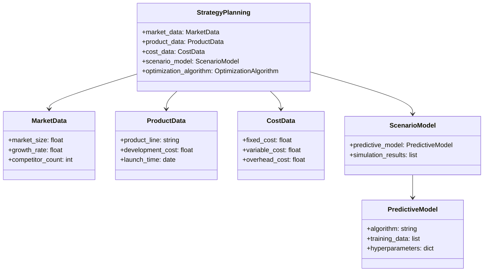

                 


# AI驱动的企业战略规划：情景模拟与优化

---

## 关键词：AI驱动、企业战略规划、情景模拟、优化算法、数学建模、系统架构

---

## 摘要：  
在当前快速变化的商业环境中，企业战略规划的复杂性不断提高，传统的规划方法已难以应对不确定性。AI驱动的企业战略规划通过情景模拟与优化，为企业提供更高效、更灵活的决策支持。本文详细探讨了AI在企业战略规划中的应用，包括情景模拟的基本原理、优化算法的选择与实现，以及系统的架构设计。通过实际案例分析，展示了如何利用AI技术提升企业战略规划的效率与准确性。

---

## 第1章: AI驱动的企业战略规划概述

### 1.1 企业战略规划的背景与挑战

#### 1.1.1 企业战略规划的基本概念  
企业战略规划是企业在不确定的环境中，为实现长期目标而制定的一系列行动方案。它涉及市场分析、资源配置、风险评估等多个方面。

#### 1.1.2 传统战略规划的局限性  
传统战略规划方法依赖于专家经验和主观判断，存在以下问题：  
1. 数据量有限，难以覆盖复杂场景。  
2. 人工分析耗时，难以快速响应变化。  
3. 缺乏动态优化能力，难以应对实时调整的需求。  

#### 1.1.3 AI驱动战略规划的优势  
AI技术的应用为企业战略规划带来了显著优势：  
1. 大数据分析能力：AI可以处理海量数据，提供更全面的市场洞察。  
2. 自动化模拟：通过AI算法快速生成多种情景，提高规划效率。  
3. 动态优化：AI能够实时调整规划方案，应对环境变化。  

### 1.2 情景模拟与优化的基本原理

#### 1.2.1 情景模拟的定义与特点  
情景模拟是一种通过构建虚拟场景来分析不同策略对企业结果影响的方法。其特点包括：  
- **多样性**：能够模拟多种可能的市场情况。  
- **动态性**：支持实时调整和优化。  
- **可视化**：便于理解和沟通。  

#### 1.2.2 情景模拟与企业战略的关系  
情景模拟是企业战略规划的核心工具，它帮助企业识别潜在风险和机会，制定更具前瞻性的策略。  

#### 1.2.3 优化在战略规划中的作用  
优化算法通过数学建模，寻找最优解决方案，确保战略规划的高效性和可行性。  

### 1.3 本书的核心内容与目标

#### 1.3.1 本书的核心主题  
本书聚焦于AI驱动的企业战略规划，探讨情景模拟与优化的理论、方法和实践。  

#### 1.3.2 本书的目标读者  
- 企业管理者  
- 战略规划师  
- 数据科学家  
- 对AI技术感兴趣的读者  

#### 1.3.3 本书的结构安排  
- 章节清晰，从基础到应用，逐步深入。  
- 结合理论与实践，提供丰富的案例分析。  

---

## 第2章: AI驱动的企业战略规划的核心概念

### 2.1 情景模拟的基本原理

#### 2.1.1 情景模拟的定义与分类  
情景模拟可以分为以下几类：  
1. **市场情景模拟**：分析不同市场趋势对企业的影响。  
2. **竞争情景模拟**：评估竞争对手策略对企业战略的影响。  
3. **风险情景模拟**：识别潜在风险并制定应对措施。  

#### 2.1.2 情景模拟的关键要素  
1. **数据来源**：市场数据、财务数据、行业趋势等。  
2. **模型构建**：基于AI算法构建预测模型。  
3. **情景生成**：根据模型生成多种可能的市场情景。  

#### 2.1.3 情景模拟的流程与方法  
1. **数据收集与预处理**：清洗和标准化数据。  
2. **模型训练**：使用机器学习算法训练预测模型。  
3. **情景生成**：基于模型生成多种市场情景。  
4. **结果分析**：评估不同情景下的企业表现。  

### 2.2 AI在情景模拟中的应用

#### 2.2.1 AI驱动情景模拟的原理  
AI通过以下步骤实现情景模拟：  
1. 数据采集与特征提取。  
2. 建立预测模型（如神经网络、随机森林）。  
3. 生成多种市场情景并评估其影响。  

#### 2.2.2 AI在情景模拟中的优势  
1. **高效率**：AI可以快速处理大量数据，生成多种情景。  
2. **高精度**：基于机器学习的模型具有较高的预测准确性。  
3. **动态调整**：AI能够实时更新模型，适应环境变化。  

#### 2.2.3 情景模拟的挑战  
1. **数据质量**：数据的准确性和完整性直接影响模拟结果。  
2. **模型选择**：不同场景可能需要不同的模型。  
3. **计算资源**：复杂的模拟需要大量计算资源。  

### 2.3 优化算法在战略规划中的应用

#### 2.3.1 优化算法的基本概念  
优化算法通过寻找最优解来提高企业战略规划的效率。常见的优化算法包括遗传算法、梯度下降和贪心算法。  

#### 2.3.2 常见优化算法的分类  
1. **遗传算法**：模拟生物进化过程，通过选择、交叉和变异生成新的解。  
2. **梯度下降**：通过计算损失函数的梯度，逐步优化参数。  
3. **贪心算法**：每一步选择当前最优解，最终达到全局最优。  

#### 2.3.3 优化算法在战略规划中的具体应用  
1. **资源分配优化**：通过优化算法确定最佳资源分配方案。  
2. **成本最小化**：通过优化算法降低企业运营成本。  
3. **利润最大化**：通过优化算法提高企业利润。  

---

## 第3章: AI驱动的企业战略规划的算法原理

### 3.1 情景模拟的数学模型

#### 3.1.1 情景模拟的数学建模方法  
数学模型是情景模拟的核心，常见的建模方法包括线性回归、时间序列分析和决策树等。  

#### 3.1.2 情景模拟的变量与约束条件  
1. **变量**：如市场需求、成本、利润等。  
2. **约束条件**：如预算限制、时间限制等。  

#### 3.1.3 情景模拟的优化目标  
1. **最大化收益**：如利润最大化。  
2. **最小化成本**：如成本最小化。  
3. **风险最小化**：如风险最小化。  

### 3.2 常见优化算法的实现

#### 3.2.1 遗传算法的实现原理  
遗传算法通过以下步骤实现优化：  
1. 初始化种群：随机生成一组解。  
2. 计算适应度：评估每个解的适应度。  
3. 选择：保留适应度高的解。  
4. 交叉：生成新的解。  
5. 变异：随机改变解的某些部分。  
6. 重复：直到达到终止条件。  

#### 3.2.2 梯度下降算法的实现原理  
梯度下降通过计算损失函数的梯度，逐步优化参数。公式如下：  
$$w = w - \eta \cdot \frac{\partial L}{\partial w}$$  
其中，$\eta$是学习率，$L$是损失函数。  

#### 3.2.3 贪心算法的实现原理  
贪心算法每一步选择当前最优解，最终达到全局最优。  

### 3.3 优化算法的比较与选择

#### 3.3.1 各种优化算法的优缺点  
1. **遗传算法**：优点是全局搜索能力强，缺点是计算成本高。  
2. **梯度下降**：优点是计算速度快，缺点是容易陷入局部最优。  
3. **贪心算法**：优点是简单高效，缺点是可能无法找到全局最优。  

#### 3.3.2 如何选择适合的优化算法  
1. **问题类型**：如线性问题适合梯度下降，非线性问题适合遗传算法。  
2. **计算资源**：计算成本高的算法可能不适合资源有限的情况。  
3. **问题规模**：大规模问题适合并行计算能力强的算法。  

---

## 第4章: 企业战略规划的情景模拟系统架构

### 4.1 问题场景介绍  
企业需要制定一份三年的战略规划，涉及市场扩展、产品开发和成本控制等多个方面。  

### 4.2 系统功能设计

#### 4.2.1 领域模型（mermaid 类图）  


### 4.3 系统架构设计

#### 4.3.1 系统架构（mermaid 架构图）  
```mermaid
architectural
    title AI驱动的战略规划系统架构
    client --> API Gateway: API 请求
    API Gateway --> Load Balancer: 负载均衡
    Load Balancer --> StrategyPlanningService: 战略规划服务
    StrategyPlanningService --> Database: 数据库交互
    StrategyPlanningService --> AIModelService: AI 模型服务
    AIModelService --> PredictionModel: 预测模型
    AIModelService --> OptimizationEngine: 优化引擎
    StrategyPlanningService --> ReportingService: 报告生成
    ReportingService --> UserInterface: 用户界面
```

### 4.4 系统接口设计

#### 4.4.1 API 接口  
1. `/api/v1/strategy/planning`：提交战略规划请求。  
2. `/api/v1/scenario/simulation`：启动情景模拟。  
3. `/api/v1/optimization/run`：执行优化算法。  

### 4.5 系统交互（mermaid 序列图）  

```mermaid
sequenceDiagram
    participant User: 用户
    participant API Gateway
    participant StrategyPlanningService
    participant AIModelService
    participant Database
    User -> API Gateway: 发送战略规划请求
    API Gateway -> StrategyPlanningService: 转发请求
    StrategyPlanningService -> AIModelService: 请求情景模拟
    AIModelService -> Database: 加载历史数据
    AIModelService -> AIModelService: 执行预测和优化
    StrategyPlanningService -> User: 返回优化结果
```

---

## 第5章: 企业战略规划的情景模拟系统实战

### 5.1 项目环境安装

#### 5.1.1 安装依赖  
```bash
pip install numpy pandas scikit-learn matplotlib
```

### 5.2 系统核心实现

#### 5.2.1 预测模型实现  
```python
from sklearn.ensemble import RandomForestRegressor
import numpy as np

def train_predictive_model(X_train, y_train):
    model = RandomForestRegressor(n_estimators=100)
    model.fit(X_train, y_train)
    return model
```

#### 5.2.2 优化算法实现  
```python
def genetic_algorithm(objective_function, constraints, population_size=100):
    # 初始化种群
    population = [generate_random_solution() for _ in range(population_size)]
    # 计算适应度
    fitness = [objective_function(solution) for solution in population]
    # 选择最优解
    selected = [population[i] for i in range(population_size) if fitness[i] > threshold]
    # 交叉与变异
    new_population = crossover(selected)
    new_population = mutate(new_population)
    return new_population
```

### 5.3 案例分析

#### 5.3.1 数据分析与建模  
假设我们有一个关于市场增长的数据集，使用随机森林模型进行预测。  

#### 5.3.2 情景模拟与优化  
通过遗传算法优化资源分配，找到最优的市场扩展方案。  

#### 5.3.3 结果解读  
分析不同情景下的企业表现，选择最优的战略规划方案。  

---

## 第6章: 企业战略规划的情景模拟系统的未来展望

### 6.1 未来发展趋势  
随着AI技术的进步，企业战略规划的情景模拟与优化将更加智能化和自动化。  

### 6.2 潜在的研究方向  
1. **强化学习的应用**：探索强化学习在战略规划中的潜力。  
2. **多目标优化**：研究如何在多个目标之间进行权衡。  
3. **实时动态调整**：开发实时更新的动态优化模型。  

---

## 总结  
AI驱动的企业战略规划通过情景模拟与优化，为企业提供了更高效、更灵活的决策支持。随着技术的不断发展，AI在企业战略规划中的应用将更加广泛和深入，为企业创造更大的价值。

---

## 注意事项  
- 数据隐私和伦理问题需要高度重视。  
- 模型的选择和调优直接影响结果的准确性。  
- 系统的可解释性和透明度需要进一步提升。  

---

## 推荐阅读  
- 《机器学习实战》  
- 《优化算法导论》  
- 《企业战略管理》  

--- 

感谢您的耐心阅读，希望这篇文章能为您提供有价值的洞见！

