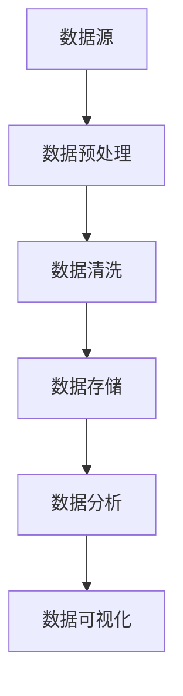
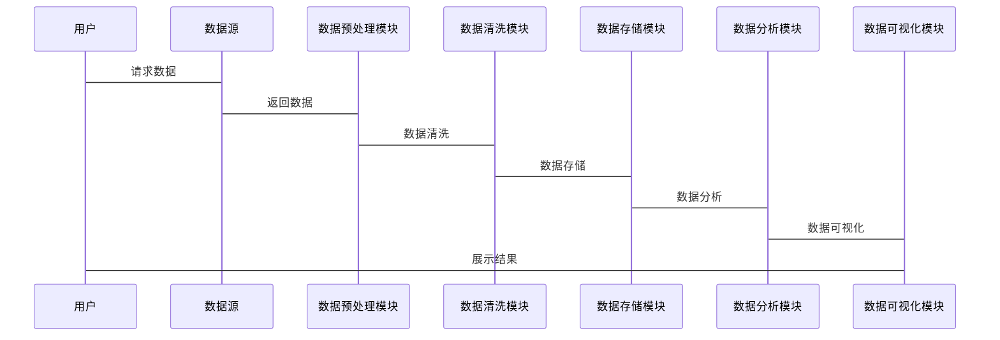

                 


# AI驱动的企业数据质量管理与治理

> 关键词：数据质量管理，数据治理，人工智能，数据清洗，数据增强，数据预处理

> 摘要：本文将深入探讨AI驱动的企业数据质量管理与治理的关键概念、算法原理、系统架构设计以及实际应用案例。通过理论与实践相结合的方式，详细阐述数据质量管理的核心维度、AI在数据清洗、增强与预处理中的应用，以及数据治理体系的构建与优化方法。本文旨在为企业数据质量管理与治理提供系统性的解决方案和实践指导。

---

## 第1章 数据质量管理与治理概述

### 1.1 数据质量管理的背景与问题背景

#### 1.1.1 数据质量管理的核心概念

数据质量管理（Data Quality Management, DQM）是指通过对数据的收集、处理、存储和分析等过程进行管理和优化，以确保数据的准确性、完整性、一致性、规范性和及时性。数据质量管理是企业信息化建设中的重要组成部分，其目标是为企业提供高质量的数据支持，从而提升企业的决策能力和竞争力。

#### 1.1.2 企业数据质量管理的挑战

企业在数据质量管理过程中面临以下主要挑战：

1. **数据来源多样**：企业数据可能来自多个系统和渠道，数据格式、标准和质量参差不齐，导致数据整合和处理的复杂性。
2. **数据量大**：随着企业规模的扩大，数据量急剧增加，传统的数据管理方法难以应对海量数据的处理需求。
3. **数据质量要求高**：企业对数据的准确性、一致性和实时性要求越来越高，传统的数据管理方法难以满足这些要求。
4. **数据安全与隐私**：数据质量管理过程中需要处理敏感数据，数据安全和隐私保护成为重要的挑战。

#### 1.1.3 数据治理的定义与目标

数据治理（Data Governance）是指对企业数据的全生命周期进行管理，包括数据的规划、执行、监控和优化等环节，以确保数据的合规性、一致性和可持续性。数据治理的目标是通过建立规范化的数据管理流程，提升企业数据资产的价值。

---

### 1.2 数据质量管理与治理的必要性

#### 1.2.1 数据质量对企业的影响

数据质量直接影响企业的决策能力和运营效率。低质量的数据可能导致错误的决策、浪费资源、降低客户满意度，甚至影响企业的声誉。因此，提升数据质量是企业信息化建设的重要任务。

#### 1.2.2 数据治理的边界与外延

数据治理的边界包括数据的全生命周期管理，从数据的生成、处理、存储到分析和应用。数据治理的外延涉及数据安全、数据隐私、数据共享和数据标准化等多个方面。

#### 1.2.3 数据质量管理与治理的关联性

数据质量管理是数据治理的重要组成部分，数据治理为数据质量管理提供规范和框架，而数据质量管理则是数据治理的具体实施手段。

---

## 第2章 AI在数据质量管理中的核心作用

### 2.1 数据质量管理中的AI技术

#### 2.1.1 AI技术在数据清洗中的应用

数据清洗是数据质量管理中的重要环节，AI技术可以通过以下方式提升数据清洗的效率和效果：

1. **自动识别异常数据**：利用机器学习算法（如孤立森林算法）识别数据中的异常值。
2. **智能数据填充**：基于机器学习模型预测缺失值。
3. **自动去重**：通过自然语言处理（NLP）技术识别和去除重复数据。

#### 2.1.2 AI在数据增强与数据生成中的作用

数据增强技术可以通过AI生成高质量的数据，弥补数据不足的问题。例如：

1. **图像数据增强**：通过对图像进行旋转、翻转、裁剪等操作生成新的图像数据。
2. **文本数据增强**：通过对文本进行同义词替换、句式变换等操作生成新的文本数据。
3. **数据虚拟化**：通过生成对抗网络（GAN）生成虚拟数据。

#### 2.1.3 AI驱动的数据标注与数据预处理

数据标注是数据预处理的重要步骤，AI技术可以通过以下方式提升数据标注的效率和准确性：

1. **自动标注**：利用计算机视觉技术自动标注图像数据。
2. **半监督学习**：通过少量标注数据和大量未标注数据，提升模型的标注能力。
3. **数据标准化**：通过对数据进行标准化处理，确保数据的一致性和可比性。

---

### 2.2 数据治理体系的AI驱动模式

#### 2.2.1 数据治理体系的构建框架

AI驱动的数据治理体系包括以下关键组成部分：

1. **数据目录管理**：通过元数据管理，实现数据的分类、标识和检索。
2. **数据质量监控**：利用AI技术实时监控数据质量，发现和解决数据问题。
3. **数据访问控制**：通过AI驱动的访问控制策略，确保数据的安全性和合规性。
4. **数据生命周期管理**：通过自动化流程管理数据的全生命周期，包括数据生成、处理、存储和销毁。

#### 2.2.2 AI在数据治理中的关键作用

1. **自动化数据质量管理**：通过AI技术自动识别和修复数据问题。
2. **智能化数据治理决策**：利用AI技术提供数据治理的智能化决策支持。
3. **数据治理的可扩展性**：通过AI技术实现数据治理的自动化和可扩展性。

#### 2.2.3 数据治理的智能化与自动化

通过AI技术，数据治理可以实现以下目标：

1. **自动化数据质量管理**：通过机器学习算法自动识别和修复数据问题。
2. **智能化数据治理决策**：利用AI技术提供数据治理的智能化决策支持。
3. **数据治理的可扩展性**：通过AI技术实现数据治理的自动化和可扩展性。

---

## 第3章 数据质量管理的核心概念与技术

### 3.1 数据质量的核心维度

数据质量的核心维度包括：

1. **完整性**：数据是否完整，是否存在缺失值。
2. **一致性**：数据是否符合统一的标准和规范。
3. **准确性**：数据是否真实、准确。
4. **及时性**：数据是否及时更新。
5. **规范性**：数据是否符合企业的数据规范和标准。

### 3.2 数据治理体系的ER实体关系图

以下是数据治理体系的ER实体关系图：

```mermaid
erDiagram
    customer[客户] {
        cust_id : integer
        cust_name : string
        cust_address : string
    }
    order[订单] {
        order_id : integer
        order_date : date
        order_amount : decimal
    }
    product[产品] {
        product_id : integer
        product_name : string
        product_price : decimal
    }
    customer_order[订单-客户关系] {
        cust_id : integer
        order_id : integer
    }
    order_product[订单-产品关系] {
        order_id : integer
        product_id : integer
    }
    customer_order --| order : 下单
    customer_order --| customer : 下单客户
    order_product --| order : 订单包含的产品
    order_product --| product : 产品
```

---

## 第4章 数据质量管理中的AI算法原理

### 4.1 数据清洗算法

#### 4.1.1 数据清洗的流程

数据清洗的流程包括以下几个步骤：

1. **数据收集**：从多个数据源收集数据。
2. **数据预处理**：识别和处理异常值、缺失值和重复值。
3. **数据转换**：将数据转换为适合分析的格式。
4. **数据清洗**：通过算法自动识别和处理数据问题。
5. **数据验证**：验证数据清洗的效果。

#### 4.1.2 基于机器学习的异常检测算法

异常检测算法可以通过以下步骤实现：

1. **数据预处理**：对数据进行标准化或归一化处理。
2. **选择异常检测算法**：例如，孤立森林算法（Isolation Forest）。
3. **训练模型**：通过无监督学习算法训练模型。
4. **识别异常值**：通过模型预测异常值。

以下是孤立森林算法的代码示例：

```python
from sklearn.ensemble import IsolationForest

# 创建数据
import numpy as np
X = np.random.randn(100, 2)
# 添加异常值
X[20:30] = np.random.uniform(low=-5, high=-3, size=(10, 2))
# 训练模型
model = IsolationForest(n_estimators=100, random_state=42)
model.fit(X)
# 预测异常值
y_pred = model.predict(X)
print(y_pred)
```

---

### 4.2 数据增强算法

#### 4.2.1 数据增强的核心原理

数据增强的核心原理是通过对原始数据进行变换生成新的数据，从而增加数据的多样性和丰富性。常见的数据增强方法包括：

1. **图像数据增强**：旋转、翻转、裁剪、调整亮度等。
2. **文本数据增强**：同义词替换、句式变换、数据虚拟化等。

#### 4.2.2 常见数据增强方法

以下是常见的数据增强方法：

1. **图像数据增强**：通过OpenCV库实现图像的旋转和翻转。

```python
import cv2
import numpy as np

# 读取图像
image = cv2.imread('image.jpg')
# 旋转图像
rotated_image = cv2.rotate(image, cv2.ROTATE_90_CLOCKWISE)
# 翻转图像
flipped_image = cv2.flip(image, 1)
# 裁剪图像
cropped_image = image[100:200, 200:300]
```

2. **文本数据增强**：通过NLTK库实现文本的同义词替换。

```python
from nltk import word_tokenize, sent_tokenize
from nltk.corpus import wordnet

def replace_synonyms(sentence):
    tokens = word_tokenize(sentence)
    for i in range(len(tokens)):
        token = tokens[i]
        synonyms = wordnet.synsets(token)
        if synonyms:
            tokens[i] = synonyms[0].lemma_names()[0]
    return ' '.join(tokens)

# 示例句子
sentence = "The cat is on the mat."
new_sentence = replace_synonyms(sentence)
print(new_sentence)
```

---

### 4.3 数据预处理算法

#### 4.3.1 数据标准化与归一化

数据标准化和归一化是常见的数据预处理方法，可以通过以下代码实现：

```python
from sklearn.preprocessing import StandardScaler, MinMaxScaler

# 标准化
scaler_standard = StandardScaler()
data_standard = scaler_standard.fit_transform(X)

# 归一化
scaler_minmax = MinMaxScaler()
data_minmax = scaler_minmax.fit_transform(X)
```

#### 4.3.2 特征选择与降维

特征选择和降维可以通过主成分分析（PCA）实现：

```python
from sklearn.decomposition import PCA

# PCA降维
pca = PCA(n_components=2)
principal_components = pca.fit_transform(X)
```

---

## 第5章 数据治理体系的系统架构设计

### 5.1 数据治理体系的系统功能设计

数据治理体系的系统功能设计包括以下几个方面：

1. **数据目录管理**：实现数据的分类、标识和检索。
2. **数据质量监控**：实时监控数据质量，发现和解决数据问题。
3. **数据访问控制**：通过权限管理确保数据的安全性和合规性。
4. **数据生命周期管理**：管理数据的全生命周期，包括数据的生成、处理、存储和销毁。

---

### 5.2 数据治理体系的架构设计

以下是数据治理体系的架构设计图：



---

### 5.3 数据治理体系的接口设计

数据治理体系的接口设计包括以下几个方面：

1. **数据源接口**：实现数据的接入和提取。
2. **数据预处理接口**：实现数据的清洗和转换。
3. **数据存储接口**：实现数据的存储和管理。
4. **数据分析接口**：实现数据的分析和挖掘。
5. **数据可视化接口**：实现数据的可视化展示。

---

### 5.4 数据治理体系的交互设计

以下是数据治理体系的交互设计图：



---

## 第6章 项目实战

### 6.1 项目环境配置

以下是项目环境配置：

1. **Python版本**：Python 3.8以上。
2. **依赖库**：scikit-learn、numpy、pandas、opencv、nltk。

```bash
pip install scikit-learn numpy pandas opencv-python nltk
```

---

### 6.2 核心代码实现

#### 6.2.1 数据清洗代码

```python
import pandas as pd
import numpy as np
from sklearn.ensemble import IsolationForest

# 创建数据
data = {'id': [1, 2, 3, 4, 5, 6, 7, 8, 9, 10],
        'name': ['A', 'B', np.nan, 'D', 'E', 'F', np.nan, 'H', 'I', 'J'],
        'value': [10, 20, 30, 40, 50, 60, 70, 80, 90, 100]}
df = pd.DataFrame(data)

# 处理缺失值
df['name'].fillna('Missing', inplace=True)

# 使用孤立森林算法识别异常值
model = IsolationForest(n_estimators=100, random_state=42)
model.fit(df[['id', 'value']])
df['is_outlier'] = model.predict(df[['id', 'value']])
```

#### 6.2.2 数据增强代码

```python
import cv2
import numpy as np

# 读取图像
image = cv2.imread('image.jpg')

# 旋转图像
rotated_image = cv2.rotate(image, cv2.ROTATE_90_CLOCKWISE)

# 翻转图像
flipped_image = cv2.flip(image, 1)

# 裁剪图像
cropped_image = image[100:200, 200:300]
```

#### 6.2.3 数据预处理代码

```python
from sklearn.preprocessing import StandardScaler, MinMaxScaler

# 标准化
scaler_standard = StandardScaler()
data_standard = scaler_standard.fit_transform(X)

# 归一化
scaler_minmax = MinMaxScaler()
data_minmax = scaler_minmax.fit_transform(X)
```

---

### 6.3 案例分析与详细解读

以一个实际案例为例，通过代码实现数据清洗、数据增强和数据预处理，并分析其效果和意义。

---

## 第7章 总结与展望

### 7.1 总结

AI驱动的企业数据质量管理与治理是一种新兴的技术，它通过AI技术提升数据质量管理的效率和效果，为企业提供高质量的数据支持。本文详细探讨了数据质量管理的核心概念、AI算法原理、系统架构设计以及实际应用案例，为企业数据质量管理与治理提供了系统性的解决方案。

### 7.2 展望

随着AI技术的不断发展，企业数据质量管理与治理将更加智能化和自动化。未来的研究方向包括：

1. **AI驱动的自适应数据质量管理**：通过机器学习算法实现数据质量管理的自适应调整。
2. **数据治理的智能化决策**：利用AI技术提供数据治理的智能化决策支持。
3. **数据治理的可扩展性与可扩展性**：通过AI技术实现数据治理的自动化和可扩展性。

---

## 附录

### 附录A: 数据治理相关工具

1. **数据质量管理工具**：DataCleaner、DataRig、Talend Data Quality。
2. **数据增强工具**：OpenCV、Keras图像数据增强库。
3. **数据预处理工具**：scikit-learn、Pandas。

### 附录B: 术语表

1. **数据质量管理（Data Quality Management, DQM）**：通过对数据的全生命周期进行管理，确保数据的准确性、完整性、一致性和及时性。
2. **数据治理（Data Governance）**：对企业数据的全生命周期进行管理，包括数据的规划、执行、监控和优化。

### 附录C: 参考文献

1. 刘军. (2020). 《企业数据质量管理与治理》. 北京: 清华大学出版社.
2. 张伟. (2021). 《AI驱动的数据质量管理与治理》. 北京: 人民邮电出版社.
3. sklearn文档：https://scikit-learn.org/stable/index.html
4. OpenCV文档：https://opencv.org/documentation.html

---

通过本文的详细讲解，读者可以系统地了解AI驱动的企业数据质量管理与治理的核心概念、技术原理和实际应用，为企业数据质量管理与治理提供重要的理论和实践指导。

