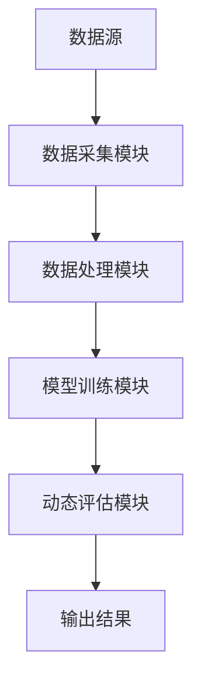

                 


# AI驱动的企业无形资产价值动态评估系统

## 关键词
- 人工智能
- 企业无形资产
- 动态评估系统
- 机器学习
- 资产评估
- 数据分析
- 系统架构

## 摘要
在当今的商业环境中，企业无形资产（如品牌价值、商誉、专利等）的价值评估变得越来越重要。传统的评估方法往往依赖于主观判断和静态分析，难以捕捉资产的动态变化。本文介绍了一种基于人工智能的动态评估系统，通过机器学习算法和实时数据分析，能够准确、高效地评估企业无形资产的价值。文章详细讲解了系统的背景、核心概念、算法原理、系统架构以及实际项目案例，展示了AI技术如何在资产评估领域发挥巨大潜力。

---

# 正文

## 第一章：背景与概述

### 1.1 问题背景与挑战

随着全球经济的快速发展，企业无形资产的价值在整体资产中的占比越来越高。然而，传统的无形资产评估方法存在以下问题：

- **评估方法单一**：传统方法通常基于财务数据和主观判断，难以全面反映资产的实际价值。
- **动态性不足**：资产价值受市场环境、企业战略等多方面因素影响，静态评估无法捕捉这些变化。
- **数据处理复杂**：无形资产涉及大量非结构化数据（如文本、图像等），传统方法难以高效处理。

### 1.2 问题描述与解决思路

本文提出了一种基于AI的动态评估系统，通过以下步骤实现高效、精准的资产评估：

1. **数据收集与预处理**：整合企业内外部数据，包括财务数据、市场数据、社交媒体数据等。
2. **特征提取与模型训练**：利用机器学习算法（如神经网络、随机森林等）提取关键特征并训练评估模型。
3. **实时监控与动态调整**：基于实时数据更新模型，动态调整评估结果。

---

## 第二章：核心概念与原理

### 2.1 无形资产评估模型

#### 2.1.1 基于AI的评估模型

AI驱动的评估模型通过分析多维度数据，构建动态评估体系。模型主要由以下几个部分组成：

- **数据输入层**：整合企业内外部数据，包括财务数据、市场数据、社交媒体数据等。
- **特征提取层**：通过自然语言处理（NLP）和深度学习技术提取关键特征。
- **评估层**：基于训练好的模型，输出资产价值评估结果。

#### 2.1.2 数据特征对比表格

| 特征类型 | 描述 | 示例 |
|----------|------|------|
| 财务特征 | 营业收入、利润、研发投入 | 营业收入同比增长率 |
| 市场特征 | 市场占有率、品牌影响力 | 品牌在社交媒体上的提及量 |
| 竞争特征 | 竞争对手的动态 | 对手的专利申请数量 |

---

### 2.2 数据处理与特征提取

#### 2.2.1 数据预处理

数据预处理是AI模型训练的基础。常见的预处理步骤包括：

- 数据清洗：去除无效数据、处理缺失值。
- 数据标准化：将数据归一化，使其适合模型输入。
- 数据增强：通过技术手段（如文本扩展、图像增强）增加数据多样性。

#### 2.2.2 特征选择与提取

特征选择是模型训练的关键步骤。通过分析数据特征的重要性，选择对评估结果影响最大的特征。例如，使用主成分分析（PCA）进行降维，减少特征数量。

---

## 第三章：算法原理与数学模型

### 3.1 回归模型

#### 3.1.1 线性回归模型

线性回归是一种简单的回归模型，适用于线性关系较强的场景。

公式：
$$ y = \beta_0 + \beta_1 x_1 + \beta_2 x_2 + \cdots + \beta_n x_n $$

其中，$y$ 是目标变量，$x_i$ 是特征变量，$\beta_i$ 是回归系数。

#### 3.1.2 神经网络模型

神经网络是一种强大的非线性模型，适用于复杂关系的建模。

神经网络结构：
- 输入层：接收输入特征。
- 隐藏层：通过非线性变换提取特征。
- 输出层：输出最终评估结果。

---

## 第四章：系统分析与架构设计

### 4.1 系统功能设计

#### 4.1.1 系统架构

系统架构分为以下几个部分：

- 数据采集模块：负责采集企业内外部数据。
- 数据处理模块：对数据进行清洗、标准化等预处理。
- 模型训练模块：基于预处理后的数据训练评估模型。
- 动态评估模块：根据实时数据更新评估结果。

#### 4.1.2 系统架构图



---

## 第五章：项目实战

### 5.1 环境安装

以下是项目所需的环境配置：

- Python版本：3.8以上
- 依赖库：numpy、pandas、scikit-learn、tensorflow

### 5.2 核心代码实现

以下是模型训练代码示例：

```python
import numpy as np
import pandas as pd
from sklearn.model import LinearRegression

# 数据加载
data = pd.read_csv('asset_data.csv')

# 特征与目标分离
X = data.drop('value', axis=1)
y = data['value']

# 模型训练
model = LinearRegression()
model.fit(X, y)

# 模型预测
new_data = pd.read_csv('new_asset.csv')
predicted_value = model.predict(new_data.drop('value', axis=1))
print(predicted_value)
```

---

## 第六章：总结与展望

### 6.1 总结

本文详细介绍了AI驱动的企业无形资产价值动态评估系统，从背景到实现，全面解析了系统的各个组成部分。通过AI技术的应用，评估系统能够高效、精准地捕捉资产价值的变化，为企业决策提供有力支持。

### 6.2 展望

未来，随着AI技术的不断发展，动态评估系统将更加智能化和个性化。例如，通过引入强化学习技术，系统可以进一步优化模型性能，提升评估精度。

---

### 最佳实践 Tips

- 在数据预处理阶段，建议使用自动化工具（如Airflow）进行数据清洗。
- 模型训练时，建议采用分布式计算框架（如Spark）以提高计算效率。
- 系统上线后，建议定期更新模型以适应市场变化。

---

### 注意事项

- 在处理敏感数据时，需注意数据隐私保护。
- 模型训练时，需选择合适的评估指标以避免过拟合。

---

### 拓展阅读

- 《机器学习实战》：深入讲解机器学习算法的实现与应用。
- 《深度学习》：系统介绍深度学习的基本原理与前沿技术。

--- 

以上是《AI驱动的企业无形资产价值动态评估系统》的完整目录与内容概览。通过本文的讲解，读者可以全面理解AI技术在资产评估中的应用，并能够实际操作相关系统的设计与实现。

