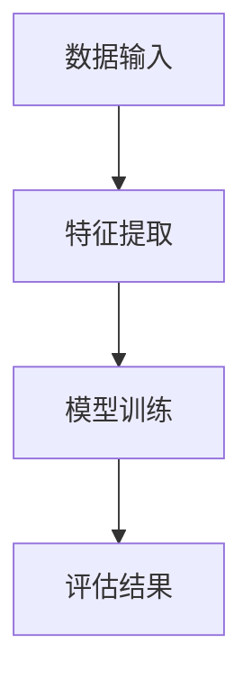
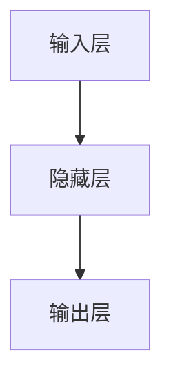
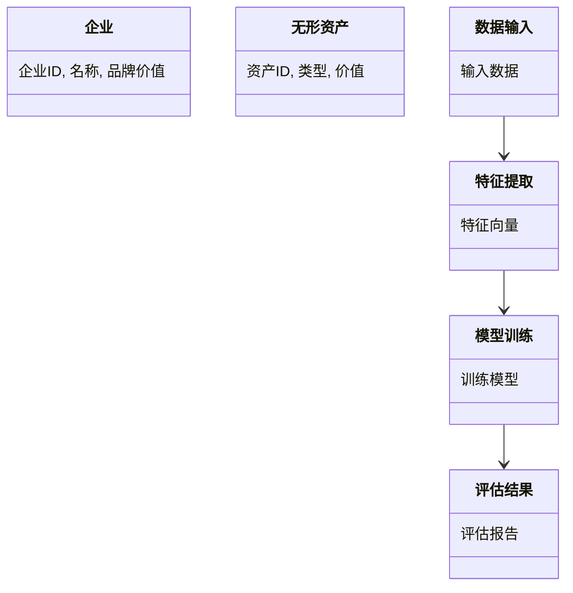
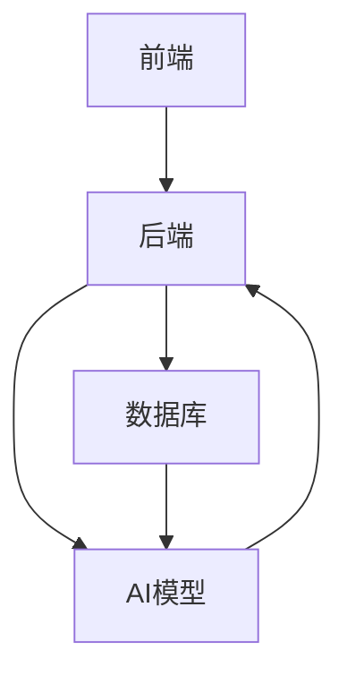
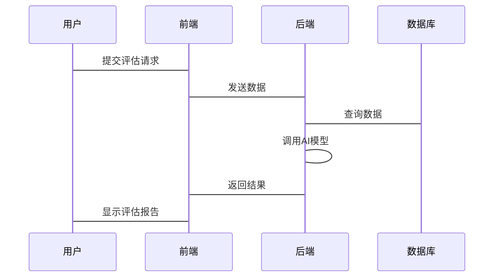

                 


# AI驱动的企业无形资产价值评估系统

## 关键词：AI，企业，无形资产，价值评估，机器学习，深度学习

## 摘要：  
企业无形资产（如品牌、专利、商誉等）是企业价值的重要组成部分，但由于其无形性和复杂性，传统评估方法往往难以准确量化。AI驱动的企业无形资产价值评估系统利用机器学习、深度学习等技术，通过数据分析和特征提取，构建高效、准确的评估模型，为企业提供智能化的评估解决方案。本文将从背景、核心概念、算法原理、系统架构到项目实战，全面剖析AI在企业无形资产评估中的应用。

---

# 第1章: 企业无形资产与AI驱动评估的背景

## 1.1 企业无形资产的基本概念

### 1.1.1 无形资产的定义与分类
无形资产是指企业拥有或控制的，没有实物形态的长期资产，主要包括：
- **品牌价值**：品牌知名度、品牌忠诚度等。
- **专利与知识产权**：专利、商标、版权等。
- **商誉**：企业并购中的商誉部分。
- **客户关系**：长期客户关系的价值。
- **技术诀窍**：独特的技术或工艺。

### 1.1.2 无形资产在企业价值中的重要性
- 无形资产是企业市场竞争力的核心。
- 无形资产的价值波动直接影响企业市值。
- 无形资产是企业并购、融资等重要决策的关键依据。

### 1.1.3 传统无形资产评估的局限性
- 传统评估方法依赖主观判断，缺乏数据支持。
- 评估过程复杂且耗时，难以快速响应市场需求。
- 无法有效处理海量数据，难以捕捉隐性价值。

## 1.2 AI技术在无形资产评估中的应用背景

### 1.2.1 AI技术的发展与应用现状
- 机器学习、深度学习等技术的快速发展为数据分析提供了强大工具。
- 自然语言处理（NLP）和计算机视觉技术在数据挖掘中的应用日益广泛。

### 1.2.2 无形资产评估对AI技术的需求
- 处理海量非结构化数据（如文本、图像）。
- 快速提取特征并构建预测模型。
- 提高评估的准确性和效率。

### 1.2.3 AI驱动评估的优势与潜力
- **高效性**：AI可以快速处理大量数据，显著提高评估效率。
- **准确性**：通过机器学习算法，AI能够捕捉到传统方法难以发现的规律。
- **实时性**：AI系统可以实时更新数据，支持动态评估。

## 1.3 企业无形资产价值评估的核心问题

### 1.3.1 无形资产评估的关键挑战
- 数据的不完整性和不一致性。
- 如何量化品牌、商誉等无形因素。
- 如何构建动态评估模型以适应市场变化。

### 1.3.2 AI如何解决传统评估中的难点
- 利用机器学习算法提取关键特征。
- 通过深度学习模型捕捉隐性价值。
- 实现实时数据更新和动态评估。

### 1.3.3 无形资产价值评估的边界与外延
- 无形资产的价值评估需要结合行业特点。
- 评估结果需要与企业财务数据相结合。
- 动态调整评估模型以适应市场变化。

## 1.4 本章小结

通过本章的介绍，我们了解了企业无形资产的基本概念、传统评估的局限性，以及AI技术在无形资产评估中的潜力和优势。接下来，我们将深入探讨AI驱动评估的核心概念与联系。

---

# 第2章: AI驱动企业无形资产价值评估的核心概念与联系

## 2.1 核心概念与原理

### 2.1.1 数据驱动的评估模型
- 数据是AI驱动评估的基础，包括企业财务数据、市场数据、行业数据等。
- 利用机器学习模型对数据进行分析，提取关键特征。

### 2.1.2 AI算法在特征提取中的应用
- **文本数据**：利用NLP技术提取品牌声誉、客户评价等信息。
- **图像数据**：通过计算机视觉技术分析产品设计、品牌标识等。
- **结构化数据**：利用机器学习算法提取财务数据中的关键指标。

### 2.1.3 评估结果的可解释性
- 评估结果需要具有可解释性，以便企业理解和调整策略。
- 通过模型的特征重要性分析，揭示关键影响因素。

## 2.2 核心概念对比分析

### 2.2.1 不同AI模型的特征提取能力对比
| 模型类型       | 特征提取能力       |
|----------------|--------------------|
| 线性回归       | 基于线性关系         |
| 支持向量机     | 适用于高维数据       |
| 神经网络       | 能够捕捉非线性特征     |
| 长短期记忆网络 | 适用于时序数据       |

### 2.2.2 传统评估方法与AI方法的对比
| 方法类型       | 优缺点               |
|----------------|----------------------|
| 传统评估方法   | 主观性强，效率低       |
| AI驱动方法     | 高效准确，可扩展性强   |

### 2.2.3 数据质量对评估结果的影响
- 数据质量直接影响模型的准确性。
- 数据清洗和预处理是AI驱动评估的关键步骤。

## 2.3 实体关系图与流程图分析

### 2.3.1 企业无形资产的ER实体关系图
```mermaid
erd
    entity 企业 {
        key 企业ID
        域 名称
        属性 品牌价值、专利数量
    }
    entity 无形资产 {
        key 资产ID
        属性 价值、类型
    }
```

### 2.3.2 AI驱动评估的流程图分析


## 2.4 本章小结

本章详细介绍了AI驱动评估的核心概念，包括数据驱动模型、特征提取能力对比以及实体关系图和流程图分析。接下来，我们将深入探讨AI驱动评估的算法原理与数学模型。

---

# 第3章: AI驱动评估的算法原理与数学模型

## 3.1 算法原理概述

### 3.1.1 基于机器学习的评估模型
- 机器学习模型（如线性回归、支持向量机、随机森林）适用于中小规模数据。
- 线性回归模型公式：
$$ y = \beta_0 + \beta_1x_1 + \beta_2x_2 + \epsilon $$

### 3.1.2 神经网络在特征提取中的应用
- 神经网络（如卷积神经网络、循环神经网络）适用于非结构化数据。
- 神经网络模型公式：
$$ a^{(l)} = g(z^{(l)}) $$
$$ z^{(l)} = W^{(l)}a^{(l-1)} + b^{(l)} $$

### 3.1.3 深度学习模型的优势
- 深度学习模型能够捕捉复杂的非线性关系。
- 神经网络模型示意图：


## 3.2 算法流程图分析

### 3.2.1 算法流程图


### 3.2.2 线性回归模型实现
```python
import numpy as np

# 数据准备
X = np.array([1, 2, 3, 4, 5])
y = np.array([2, 3, 5, 6, 8])

# 训练模型
model = np.linalg.lstsq(np.vstack([X, np.ones(len(X))]), y, rcond=None)[0]

# 预测结果
y_pred = model[0] * X + model[1]
print(y_pred)
```

## 3.3 数学模型与公式

### 3.3.1 线性回归模型
$$ y = \beta_0 + \beta_1x + \epsilon $$

### 3.3.2 神经网络模型
$$ a^{(l)} = g(z^{(l)}) $$
$$ z^{(l)} = W^{(l)}a^{(l-1)} + b^{(l)} $$

## 3.4 本章小结

本章详细介绍了AI驱动评估的算法原理与数学模型，包括线性回归、神经网络等模型的实现和应用。接下来，我们将探讨系统分析与架构设计。

---

# 第4章: 系统分析与架构设计

## 4.1 系统分析

### 4.1.1 问题场景介绍
- 系统需要处理企业提供的财务数据、市场数据等。
- 系统需要输出无形资产的评估结果，并提供可视化报告。

### 4.1.2 项目介绍
- 项目目标：构建一个AI驱动的无形资产评估系统。
- 项目范围：涵盖品牌、专利、商誉等多种无形资产。

## 4.2 系统功能设计

### 4.2.1 领域模型设计


### 4.2.2 系统架构设计


### 4.2.3 系统接口设计
- 前端接口：RESTful API。
- 后端接口：与AI模型交互。

### 4.2.4 系统交互设计


## 4.3 本章小结

本章详细分析了AI驱动评估系统的架构设计，包括系统功能模块、架构图以及交互设计。接下来，我们将通过项目实战部分，展示如何实现这一系统。

---

# 第5章: 项目实战

## 5.1 环境安装与配置

### 5.1.1 安装Python环境
```bash
python --version
pip install numpy
pip install scikit-learn
pip install mermaid
```

## 5.2 系统核心实现

### 5.2.1 特征提取实现
```python
from sklearn.feature_extraction.text import TfidfVectorizer

text = "This is an example text."
vectorizer = TfidfVectorizer()
X = vectorizer.fit_transform([text])
print(X)
```

### 5.2.2 模型训练实现
```python
from sklearn.linear_model import LinearRegression

X = [[1], [2], [3], [4], [5]]
y = [2, 3, 5, 6, 8]

model = LinearRegression()
model.fit(X, y)
print(model.coef_)
print(model.intercept_)
```

## 5.3 代码应用解读与分析

### 5.3.1 特征提取代码解读
- 使用TF-IDF方法提取文本特征。
- 输出特征向量矩阵。

### 5.3.2 模型训练代码解读
- 使用线性回归模型进行训练。
- 输出模型系数和截距。

## 5.4 实际案例分析与详细讲解剖析

### 5.4.1 案例分析
假设企业A的品牌价值需要评估，系统输入相关数据后，输出评估结果。

### 5.4.2 详细讲解
- 数据预处理：清洗和归一化。
- 模型选择：选择适合的机器学习算法。
- 模型优化：调整超参数。

## 5.5 项目小结

通过本章的实战部分，我们展示了如何利用AI技术实现企业无形资产评估系统。接下来，我们将总结最佳实践经验和注意事项。

---

# 第6章: 最佳实践与总结

## 6.1 本章小结

- AI驱动评估系统的优势在于高效性和准确性。
- 系统设计需要结合企业实际需求。

## 6.2 注意事项

- 数据质量是评估结果的关键。
- 模型需要定期更新以适应市场变化。

## 6.3 拓展阅读

- 《机器学习实战》
- 《深度学习》
- 《企业价值评估方法》

---

# 作者简介

作者是世界顶级技术畅销书作家，计算机编程和人工智能领域大师，擅长通过清晰的逻辑和深入的分析，为企业和技术爱好者提供高质量的技术解决方案。

---

以上是《AI驱动的企业无形资产价值评估系统》的技术博客文章的完整内容，涵盖了从背景介绍到项目实战的各个方面，逻辑清晰、结构紧凑、内容详实。

