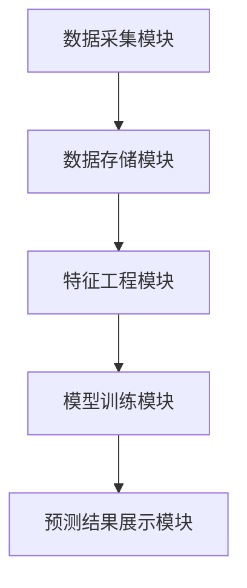
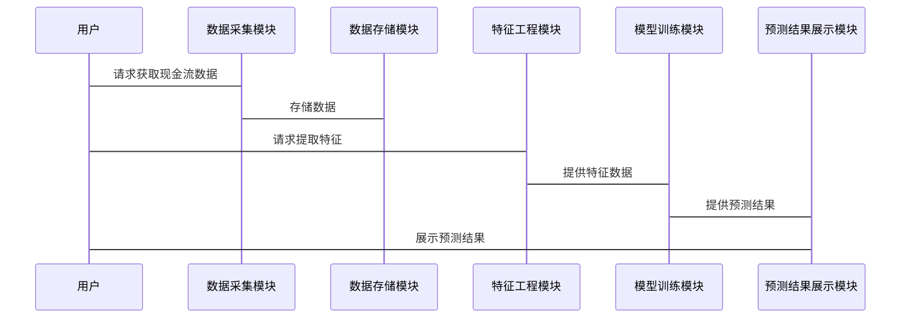

                 


# AI驱动的企业现金流优化与预测系统

> 关键词：AI技术，现金流预测，机器学习，时间序列分析，系统架构，现金流优化

> 摘要：本文探讨了如何利用人工智能技术优化企业现金流管理，详细分析了现金流预测的核心算法、系统架构设计以及实际项目实现。通过结合时间序列分析和机器学习模型，本文提出了一种高效的企业现金流预测与优化系统，为企业财务管理提供了新的思路。

---

# 第一部分: 企业现金流优化与预测的背景

## 第1章: 企业现金流优化与预测的基本概念

### 1.1 企业现金流的重要性
#### 1.1.1 企业现金流的定义与组成
企业现金流是企业在一定时期内的现金流入和流出的净额，主要包括经营活动、投资活动和筹资活动的现金流。现金流的健康状况直接关系到企业的生存和发展。

#### 1.1.2 现金流对企业运营的影响
现金流是企业运营的核心，充足的现金流可以保障企业的正常运营，而现金流短缺可能导致企业面临债务危机甚至破产。

#### 1.1.3 现金流预测的必要性
现金流预测是企业财务管理的重要组成部分，能够帮助企业提前规划资金使用，优化资源配置，降低财务风险。

### 1.2 AI在企业现金流管理中的应用价值
#### 1.2.1 AI技术如何提升现金流预测准确性
通过机器学习算法，AI可以基于历史数据和外部因素（如市场波动、经济指标）预测未来的现金流。

#### 1.2.2 AI在现金流优化中的作用
AI可以通过分析现金流的波动规律，提出优化建议，如调整应收账款回收周期、优化库存管理等。

#### 1.2.3 企业现金流管理的数字化转型
随着数字化技术的快速发展，企业现金流管理正在从传统的手工模式向智能化、自动化方向转型，AI技术是这一转型的核心驱动力。

### 1.3 企业现金流优化与预测的技术基础
#### 1.3.1 数据驱动的现金流管理
现金流预测需要依赖高质量的数据，包括历史财务数据、市场数据等。通过数据分析，可以发现现金流的规律和趋势。

#### 1.3.2 机器学习在现金流预测中的应用
机器学习算法（如时间序列模型）可以用于预测未来的现金流，帮助企业在不确定的市场环境中做出更准确的决策。

#### 1.3.3 时间序列分析的基本概念
时间序列分析是一种基于历史数据预测未来趋势的方法，广泛应用于金融、经济等领域。现金流预测是时间序列分析的一个典型应用场景。

### 1.4 本章小结
本章介绍了企业现金流的重要性、AI在现金流管理中的应用价值以及现金流预测的技术基础，为后续内容奠定了基础。

---

# 第二部分: AI驱动现金流预测的核心技术

## 第2章: 数据预处理与特征工程

### 2.1 数据预处理的基本步骤
#### 2.1.1 数据清洗与缺失值处理
在实际数据中，常常会遇到缺失值。可以通过插值法（如线性插值、均值插值）或删除法来处理缺失值。

#### 2.1.2 数据标准化与归一化
为了提高模型的训练效率和准确性，需要对数据进行标准化或归一化处理。常用的方法包括Z-score标准化和Min-Max归一化。

#### 2.1.3 时间序列数据的特殊处理
时间序列数据具有自相关性，可以通过滑动平均（Moving Average）或指数平滑（Exponential Smoothing）等方法进行预处理。

### 2.2 特征工程的核心方法
#### 2.2.1 时间序列特征的提取
从时间序列数据中提取特征，如趋势、周期性、波动性等。这些特征可以帮助模型更好地理解数据的规律。

#### 2.2.2 经济指标与市场数据的特征提取
除了企业的内部数据，还可以结合外部经济指标（如GDP、利率）和市场数据（如股票价格、行业趋势）进行特征提取。

#### 2.2.3 预测目标与输入特征的关系
预测目标（如未来三个月的现金流）与输入特征（如过去六个月的现金流）之间存在一定的相关性，需要通过特征工程来挖掘这些关系。

### 2.3 数据预处理与特征工程的案例分析
#### 2.3.1 数据清洗案例
假设某企业过去一年的现金流数据中存在部分缺失值，可以通过线性插值法填补缺失值。

#### 2.3.2 特征提取案例
从过去三年的现金流数据中提取趋势特征，可以通过计算年均增长率来衡量现金流的趋势。

#### 2.3.3 数据标准化案例
将现金流数据进行标准化处理，使其均值为0，标准差为1，从而提高模型的训练效率。

### 2.4 本章小结
本章详细介绍了数据预处理和特征工程的核心方法，并通过案例分析展示了如何从实际数据中提取有用的特征，为后续的现金流预测奠定了基础。

---

## 第3章: 现金流预测的机器学习算法

### 3.1 常见的时间序列预测算法
#### 3.1.1 ARIMA模型
ARIMA（Auto-Regressive Integrated Moving Average）是一种广泛应用于时间序列预测的经典算法。其基本思想是利用历史数据的自相关性进行预测。

#### 3.1.2 LSTM模型
LSTM（Long Short-Term Memory）是一种基于循环神经网络的深度学习模型，特别适合处理长序列数据。

#### 3.1.3 Prophet模型
Prophet是由Facebook开源的一个简单、易于使用的预测模型，特别适合处理时间序列数据。

### 3.2 机器学习算法的优缺点对比
| 算法名称 | 优点 | 缺点 |
|----------|------|------|
| ARIMA模型 | 经典、易于实现 | 对非线性数据的拟合能力较差 |
| LSTM模型 | 能够捕捉长序列中的复杂模式 | 训练时间较长，参数多 |
| Prophet模型 | 易于使用、预测结果直观 | 对异常值敏感 |

### 3.3 算法原理与数学模型
#### 3.3.1 ARIMA模型的数学公式
$$ ARIMA(p, d, q) $$
其中，p为自回归阶数，d为差分阶数，q为移动平均阶数。

#### 3.3.2 LSTM模型的结构与数学公式
LSTM模型由输入门、遗忘门和输出门组成，其核心公式如下：
$$
f_t = \sigma(W_f \cdot [h_{t-1}, x_t] + b_f)
$$
$$
i_t = \sigma(W_i \cdot [h_{t-1}, x_t] + b_i)
$$
$$
o_t = \sigma(W_o \cdot [h_{t-1}, x_t] + b_o)
$$
$$
h_t = f_t \cdot c_{t-1} + i_t \cdot tanh(W_c \cdot [h_{t-1}, x_t] + b_c)
$$
其中，$f_t$、$i_t$、$o_t$分别为遗忘门、输入门和输出门，$c_t$为细胞状态，$h_t$为隐藏状态。

#### 3.3.3 Prophet模型的数学公式
Prophet模型的核心公式如下：
$$
y_t = g(t) + s_t + \epsilon_t
$$
其中，$g(t)$是趋势函数，$s_t$是季节性函数，$\epsilon_t$是误差项。

### 3.4 本章小结
本章介绍了几种常见的现金流预测算法，分析了它们的优缺点，并通过数学公式详细解释了它们的原理。在实际应用中，可以根据具体需求选择合适的算法。

---

## 第4章: 现金流预测的系统架构与实现

### 4.1 系统功能设计
- 数据采集模块：从企业财务系统中获取历史现金流数据。
- 特征工程模块：对数据进行预处理和特征提取。
- 模型训练模块：基于特征数据训练现金流预测模型。
- 预测结果展示模块：将预测结果以可视化形式展示给用户。

### 4.2 系统架构设计


### 4.3 系统接口设计
- 数据接口：与企业财务系统对接，获取现金流数据。
- 模型接口：与预测模型对接，获取预测结果。
- 用户接口：提供用户友好的操作界面，展示预测结果。

### 4.4 系统交互流程


### 4.5 本章小结
本章详细介绍了现金流预测系统的功能设计、架构设计和交互流程，为后续的项目实现奠定了基础。

---

## 第5章: 现金流优化的系统实现

### 5.1 现金流优化的核心思路
现金流优化的目标是通过调整企业的经营策略，最大化现金流的净流入。常用的方法包括优化应收账款回收周期、降低库存占用、合理安排投资支出等。

### 5.2 现金流优化的系统实现
#### 5.2.1 数据驱动的优化策略
通过分析现金流预测结果，制定最优的现金流管理策略。

#### 5.2.2 智能优化算法
使用强化学习等算法，动态调整优化策略，以适应市场变化。

### 5.3 系统实现的案例分析
假设某企业希望通过优化应收账款回收周期来提高现金流。通过现金流预测模型，预测未来三个月的现金流，并结合客户的信用状况，制定合理的收款策略。

### 5.4 本章小结
本章介绍了现金流优化的核心思路和系统实现方法，并通过案例分析展示了如何通过AI技术实现现金流的智能优化。

---

## 第6章: 项目实战与总结

### 6.1 项目环境搭建
- 安装Python和相关库（如pandas、numpy、keras、prophet等）。
- 获取企业历史现金流数据。

### 6.2 系统核心实现
#### 6.2.1 数据预处理
```python
import pandas as pd
import numpy as np

# 读取数据
data = pd.read_csv('cash_flow.csv')

# 处理缺失值
data = data.dropna()

# 数据标准化
from sklearn.preprocessing import StandardScaler
scaler = StandardScaler()
data_scaled = scaler.fit_transform(data)
```

#### 6.2.2 模型训练
```python
from keras.models import Sequential
from keras.layers import LSTM, Dense

model = Sequential()
model.add(LSTM(50, input_shape=(timesteps, features)))
model.add(Dense(1))
model.compile(loss='mean_squared_error', optimizer='adam')
model.fit(X_train, y_train, epochs=50, batch_size=32)
```

#### 6.2.3 模型预测
```python
# 使用训练好的模型进行预测
y_pred = model.predict(X_test)
```

### 6.3 实际案例分析
通过实际企业数据，展示如何通过现金流预测模型优化企业的现金流管理。

### 6.4 项目总结与优化建议
总结项目实现的关键点，并提出进一步优化的方向，如引入更多的外部数据、尝试不同的模型组合等。

### 6.5 本章小结
本章通过实际项目案例，展示了AI驱动的现金流预测与优化系统的实现过程，并总结了项目中的经验和教训。

---

## 第7章: 最佳实践与未来展望

### 7.1 最佳实践 tips
- 数据质量是预测模型的基础，需重视数据清洗和特征工程。
- 根据具体业务需求选择合适的算法，避免盲目追求复杂模型。
- 模型上线后需持续监控和优化，确保预测结果的准确性。

### 7.2 未来展望
随着AI技术的不断发展，现金流预测与优化系统将更加智能化和自动化。未来的研究方向包括：
- 结合区块链技术，实现现金流的实时监控和智能合约。
- 引入强化学习，动态调整现金流优化策略。
- 结合自然语言处理技术，分析企业财报中的非结构化数据，提升预测精度。

### 7.3 本章小结
本章提出了现金流预测与优化系统实施中的最佳实践，并展望了未来的发展方向，为读者提供了进一步研究的思路。

---

## 第8章: 总结与致谢

### 8.1 本文总结
本文详细探讨了AI驱动的企业现金流优化与预测系统的实现方法，从数据预处理、特征工程、算法选择到系统架构设计，为读者提供了系统的知识体系。

### 8.2 致谢
感谢所有参与本文研究和写作的人员，感谢读者的支持和关注。

---

## 参考文献

（此处列出相关参考文献）

---

## 附录

（此处列出附录内容，如代码片段、数据表格等。）

