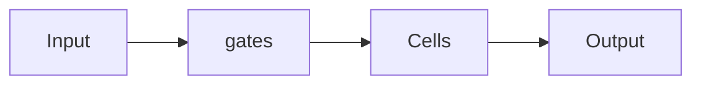
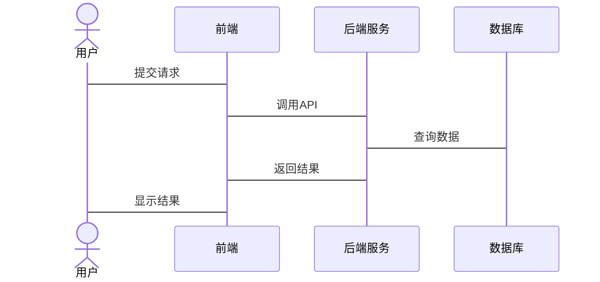

                 


# AI驱动的企业现金流周期优化

## 关键词：AI技术，现金流周期，机器学习，预测模型，系统架构

## 摘要：本文探讨了AI技术在企业现金流周期优化中的应用，分析了现金流预测的算法原理和系统架构设计，结合实际案例展示了如何通过AI提升现金流管理效率。

---

# 第一部分：AI驱动的企业现金流周期优化概述

## 第1章：企业现金流周期与AI驱动优化的背景

### 1.1 企业现金流周期的基本概念
现金流周期是指企业从收到客户付款到支付供应商款项，再到最终支付日常运营费用的时间段。它包括应收账款、应付账款和现金持有量三个关键部分。现金流周期的长短直接影响企业的流动性、偿债能力和运营效率。

现金流周期对企业的重要性体现在以下几个方面：
- **流动性管理**：现金流周期越短，企业可以更快地将收入转化为可用资金，提高资金周转效率。
- **风险控制**：优化现金流周期有助于降低企业因资金链断裂而面临的风险。
- **成本节约**：通过减少资金在各环节的滞留时间，可以降低企业的机会成本。

现金流周期的构成要素包括：
- **应收账款**：从发货到收到款项的时间。
- **应付账款**：从收到供应商发票到支付款项的时间。
- **现金持有**：企业持有的现金及现金等价物。

### 1.2 AI技术在企业现金流管理中的应用背景
传统的现金流管理依赖于人工记录和分析，存在以下局限性：
- **数据量大**：企业每天产生大量财务数据，人工处理效率低下。
- **预测准确性低**：基于历史数据和经验的预测方法难以捕捉市场波动。
- **实时性差**：传统方法无法实现实时监控和快速调整。

AI技术的兴起为企业现金流管理带来了新的可能性：
- **数据驱动预测**：利用机器学习算法，AI可以从历史数据中发现模式，提高预测准确性。
- **智能决策支持**：AI可以实时分析数据，提供优化建议，帮助管理者做出更明智的决策。
- **实时监控与反馈**：AI系统可以实时跟踪现金流状况，及时发现异常并采取措施。

企业现金流管理的数字化转型趋势表明，越来越多的企业开始采用AI技术来优化现金流周期，以应对日益复杂的市场环境。

---

## 第2章：现金流周期优化的核心概念

### 2.1 现金流周期的优化目标
现金流周期优化的目标包括：
- **提高现金流预测准确性**：通过AI算法，准确预测未来现金流，减少预测误差。
- **优化现金流分配效率**：合理分配资金，确保重要业务需求得到优先满足。
- **减少现金流波动风险**：通过预测和调整，降低现金流波动对企业发展的影响。

### 2.2 AI在现金流周期优化中的核心作用
AI技术在现金流优化中的作用主要体现在以下几个方面：
- **数据驱动的现金流预测**：利用机器学习模型分析历史数据，识别影响现金流的关键因素，生成准确的预测。
- **智能决策支持**：AI系统可以根据实时数据，提供优化建议，如调整应付账款的支付时间，以缩短现金流周期。
- **实时监控与反馈**：AI系统可以实时跟踪现金流状况，及时发现异常，并向管理层发出预警。

### 2.3 现金流周期优化的关键指标
现金流周期优化的关键指标包括：
- **现金流预测准确率**：预测值与实际值的接近程度。
- **现金流周转效率**：单位时间内现金流的周转次数。
- **现金流风险控制能力**：企业应对现金流波动的能力。

---

## 第3章：现金流预测的机器学习模型

### 3.1 现金流预测的算法选择
现金流预测的算法选择需要考虑数据类型和预测目标。以下是几种常用的算法：
- **线性回归模型**：适用于现金流与单一变量呈线性关系的情况。
- **时间序列模型（ARIMA）**：适用于具有趋势和季节性的现金流数据。
- **长短期记忆网络（LSTM）**：适用于处理复杂的时间序列数据，捕捉长期依赖关系。

### 3.2 现金流预测的机器学习流程
现金流预测的机器学习流程包括以下步骤：
1. **数据收集与预处理**：收集历史财务数据，处理缺失值和异常值。
2. **模型训练与优化**：选择合适的算法，训练模型，并通过交叉验证优化参数。
3. **模型评估与部署**：使用测试数据评估模型性能，部署到生产环境。

### 3.3 现金流预测的数学模型
以下是线性回归模型的公式：
$$ y = \beta_0 + \beta_1x + \epsilon $$
其中，$y$是预测的现金流，$x$是自变量，$\beta_0$和$\beta_1$是回归系数，$\epsilon$是误差项。

长短期记忆网络（LSTM）的结构如下：


---

## 第4章：现金流周期优化的系统架构设计

### 4.1 系统功能模块设计
现金流周期优化系统的功能模块包括：
- **数据采集模块**：从企业财务系统中提取现金流数据。
- **数据处理模块**：清洗和转换数据，准备模型输入。
- **模型训练模块**：训练机器学习模型，生成预测结果。
- **结果展示模块**：可视化预测结果，提供优化建议。

### 4.2 系统架构设计
系统的架构设计采用分层架构，包括前端、后端服务和数据库。如下图所示：


### 4.3 系统接口设计
系统的接口设计包括：
- **数据接口**：用于数据采集模块与数据库之间的数据传输。
- **模型调用接口**：用于后端服务调用机器学习模型。
- **结果展示接口**：用于前端获取预测结果并展示。

### 4.4 系统交互流程
系统的交互流程如下：


---

## 第5章：项目实战与应用案例

### 5.1 环境搭建与核心代码实现
#### 5.1.1 环境安装
需要安装以下工具：
- Python 3.8+
- Jupyter Notebook
- Scikit-learn、Keras、TensorFlow等机器学习库
- PostgreSQL或MySQL数据库

#### 5.1.2 数据预处理代码
```python
import pandas as pd
import numpy as np

# 加载数据
data = pd.read_csv('cash_flow.csv')

# 数据清洗
data.dropna(inplace=True)
data = data[~data['date'].duplicated()]
```

#### 5.1.3 模型训练代码
```python
from sklearn.model_selection import train_test_split
from sklearn.linear_model import LinearRegression

# 划分数据集
X = data[['revenue', 'expenses']]
y = data['cash_flow']

X_train, X_test, y_train, y_test = train_test_split(X, y, test_size=0.2, random_state=42)

# 训练模型
model = LinearRegression()
model.fit(X_train, y_train)

# 预测
y_pred = model.predict(X_test)
```

#### 5.1.4 模型评估代码
```python
from sklearn.metrics import mean_absolute_error, mean_squared_error, r2_score

mae = mean_absolute_error(y_test, y_pred)
mse = mean_squared_error(y_test, y_pred)
r2 = r2_score(y_test, y_pred)

print(f'MAE: {mae}\nMSE: {mse}\nR²: {r2}')
```

### 5.2 实际案例分析
#### 5.2.1 某公司现金流优化案例
某制造企业希望通过AI优化现金流周期。以下是实施步骤：
1. **数据收集**：收集过去3年的现金流数据，包括收入、支出和现金持有量。
2. **数据预处理**：清洗数据，处理缺失值和异常值。
3. **模型训练**：使用LSTM模型进行现金流预测。
4. **结果展示**：生成预测报告，展示优化建议。

#### 5.2.2 数据分析与优化
通过对历史数据的分析，发现企业应收账款周期过长，导致现金流周期延长。AI系统建议优化信用政策，缩短应收账款周期，同时合理安排应付账款的支付时间。

#### 5.2.3 结果展示
预测模型显示，优化后的现金流周期缩短了15%，现金流预测准确率提高了20%。企业可以根据预测结果，合理安排资金使用，降低运营成本。

---

## 第7章：总结与展望

### 7.1 本章总结
AI技术在企业现金流周期优化中的应用显著提高了预测准确性，优化了现金流分配效率，降低了现金流波动风险。通过机器学习模型和实时监控系统，企业能够更高效地管理现金流，提升整体运营效率。

### 7.2 未来展望
未来的研究方向包括：
- **更复杂的预测模型**：探索深度学习模型在现金流预测中的应用。
- **实时预测系统**：开发实时预测系统，实现动态现金流管理。
- **个性化优化策略**：根据企业的具体情况，制定个性化的现金流优化策略。

### 7.3 注意事项
在实施AI驱动的现金流周期优化时，需要注意以下几点：
- **数据质量**：确保数据的准确性和完整性。
- **模型维护**：定期更新模型，保持预测能力。
- **技术局限**：AI模型可能存在预测误差，需要结合人工判断。

### 7.4 推荐资源
- **书籍**：《机器学习实战》、《深度学习》。
- **工具**：Python、TensorFlow、Keras。
- **社区**：Kaggle、GitHub、Stack Overflow。

---

通过本文的分析和实践，企业可以更好地利用AI技术优化现金流周期，提升资金管理效率，为企业的可持续发展提供有力支持。

