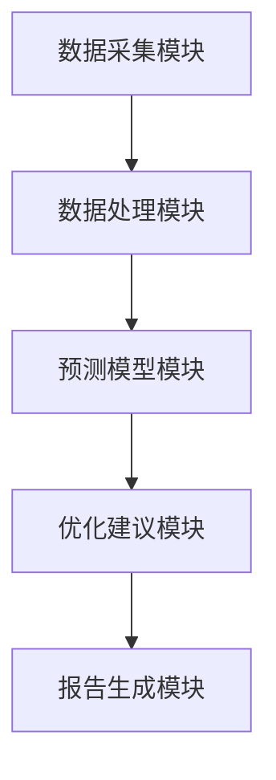
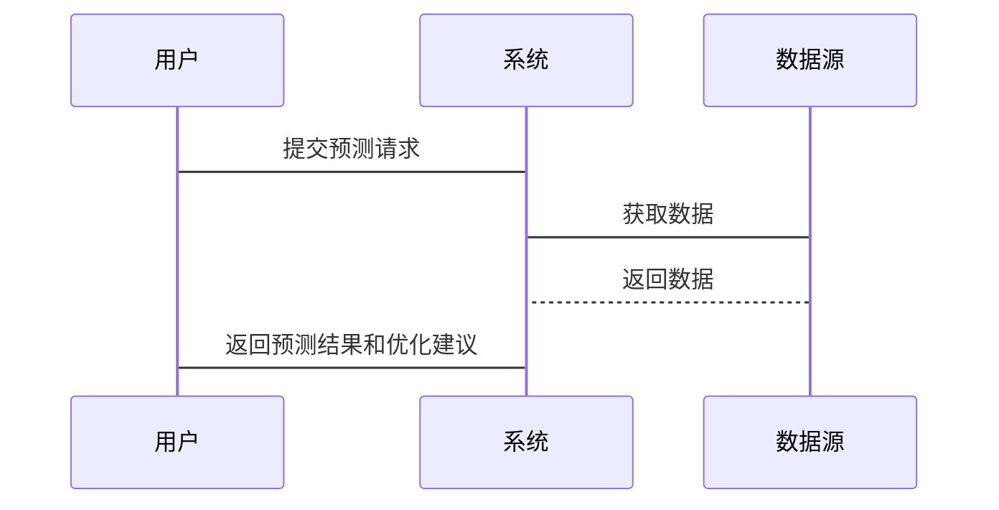

                 


# AI驱动的企业现金流周期优化系统

> 关键词：企业现金流周期，人工智能，现金流预测，优化系统，机器学习

> 摘要：本文探讨了AI技术如何优化企业现金流周期，涵盖现金流预测的AI模型构建、系统架构设计、项目实战等内容。通过分析传统方法的局限性，提出基于机器学习的解决方案，并展示实际案例的应用效果。

---

# 第1章: 企业现金流周期优化的背景与意义

## 1.1 企业现金流周期的基本概念

### 1.1.1 企业现金流周期的定义

现金流周期是指企业从收到客户付款到支付供应商款项，再到完成库存周转所需的时间。这个周期直接影响企业的资金流动性，进而影响整体财务健康。

### 1.1.2 现金流周期的重要性

现金流是企业的生命线，及时的现金流管理可以避免资金链断裂，提升企业运营效率。优化现金流周期有助于降低企业成本，提高资金利用率。

### 1.1.3 现金流周期与企业经营的关系

现金流周期越短，企业能够更快地将收入转化为支出，减少库存积压，提高资金周转率。这不仅有助于降低成本，还能增强企业的市场反应能力。

---

## 1.2 传统现金流管理的局限性

### 1.2.1 传统现金流管理的流程

传统方法依赖人工判断，数据收集和处理效率低下，容易出现人为误差。预测模型简单，缺乏动态调整能力。

### 1.2.2 传统方法的不足与挑战

数据量有限，难以捕捉市场波动；预测精度低，导致库存积压或短缺；缺乏实时监控，无法及时应对突发情况。

### 1.2.3 现金流优化对企业竞争力的影响

现金流管理不当可能导致企业资金链断裂，影响扩展和创新。优化现金流周期能增强企业的市场竞争力，提升整体运营效率。

---

## 1.3 AI技术在现金流管理中的应用前景

### 1.3.1 AI技术的基本概念

人工智能（AI）是指计算机系统执行人类智能任务的能力，如视觉识别、语音识别和决策支持。在财务领域，AI可以通过机器学习模型分析大量数据，提供精准预测和优化建议。

### 1.3.2 AI在企业财务管理中的潜力

AI能够处理大量数据，识别复杂模式，提高预测准确性。在现金流管理中，AI可以帮助企业优化应收账款回收时间，降低应付账款天数，提高库存周转率。

### 1.3.3 现金流优化的AI驱动模式

AI驱动的现金流优化系统通过实时数据分析和预测模型，提供智能化的管理建议。这包括自动化数据采集、智能预测和动态调整策略。

---

## 1.4 本章小结

现金流周期是企业运营的关键指标，传统管理方法存在效率低下和预测不准确的问题。AI技术的应用为现金流优化提供了新的解决方案，能够显著提高管理效率和准确性。

---

# 第2章: 现金流预测的AI模型构建

## 2.1 现金流预测的数学模型

### 2.1.1 线性回归模型

线性回归是一种简单而有效的预测方法，适用于现金流与单个变量之间存在线性关系的情况。公式为：$y = \beta_0 + \beta_1x + \epsilon$，其中$y$是预测值，$x$是自变量，$\epsilon$是误差项。

### 2.1.2 时间序列模型

时间序列模型如ARIMA（自回归积分滑动平均）适用于历史数据的时间依赖性。模型公式为：$ARIMA(p, d, q)$，其中$p$是自回归阶数，$d$是差分阶数，$q$是移动平均阶数。

### 2.1.3 随机森林模型

随机森林是一种基于决策树的集成学习方法，适用于非线性关系的数据预测。模型通过构建多棵决策树并取平均值来降低过拟合风险。

### 2.1.4 LSTM神经网络模型

LSTM（长短期记忆网络）适用于时间序列数据，能够捕捉长期依赖关系。LSTM单元包括输入门、遗忘门和输出门，公式如下：

$$
i = \sigma(W_i x + U_i h_{prev})
$$
$$
f = \sigma(W_f x + U_f h_{prev})
$$
$$
o = \sigma(W_o x + U_o h_{prev})
$$
$$
g = \tanh(W_g x + U_g h_{prev})
$$
$$
h = h_{prev} \circ f + g \circ i
$$
$$
o = o \cdot h
$$

---

## 2.2 数据特征的选择与预处理

### 2.2.1 数据特征的筛选标准

选择与现金流预测高度相关的特征，如销售额、应收账款天数、应付账款天数等。可以通过相关性分析或特征重要性评分来筛选特征。

### 2.2.2 数据清洗与标准化

数据清洗包括处理缺失值、异常值和重复值。标准化是将数据归一化，常用方法包括Min-Max标准化和Z-score标准化。

### 2.2.3 数据集的划分与交叉验证

将数据集划分为训练集、验证集和测试集，常用比例为7:1:2。交叉验证用于评估模型的泛化能力，常用k折交叉验证。

---

## 2.3 现金流预测的模型训练

### 2.3.1 模型训练的流程

训练流程包括数据预处理、特征选择、模型选择、参数调优和模型训练。通过交叉验证评估模型性能，选择最优模型。

### 2.3.2 超参数优化与调参

使用网格搜索或随机搜索方法优化模型超参数，如学习率、树的深度和正则化参数。优化目标是最大化准确率或F1分数。

### 2.3.3 模型评估与验证

评估指标包括均方误差（MSE）、平均绝对误差（MAE）和R平方系数。通过混淆矩阵和 ROC 曲线进一步验证模型性能。

---

## 2.4 现金流预测的AI算法实现

### 2.4.1 使用Python的机器学习库（如scikit-learn）

示例代码如下：

```python
from sklearn.ensemble import RandomForestRegressor
from sklearn.model_selection import train_test_split
from sklearn.metrics import mean_absolute_error

# 数据预处理
X = df.drop(columns=['现金流'])
y = df['现金流']

# 划分训练集和测试集
X_train, X_test, y_train, y_test = train_test_split(X, y, test_size=0.2, random_state=42)

# 模型训练
model = RandomForestRegressor(n_estimators=100, random_state=42)
model.fit(X_train, y_train)

# 模型预测
y_pred = model.predict(X_test)

# 模型评估
mae = mean_absolute_error(y_test, y_pred)
print(f"均绝对误差: {mae}")
```

### 2.4.2 使用深度学习框架（如TensorFlow或Keras）

示例代码如下：

```python
from tensorflow.keras import layers

# 模型构建
model = tf.keras.Sequential()
model.add(layers.Dense(64, activation='relu', input_shape=(n_features,)))
model.add(layers.Dense(32, activation='relu'))
model.add(layers.Dense(1, activation='linear'))

# 模型编译
model.compile(optimizer='adam', loss='mean_squared_error')

# 模型训练
model.fit(X_train, y_train, epochs=100, batch_size=32, validation_split=0.2)
```

### 2.4.4 模型的部署与应用

将训练好的模型部署到生产环境中，实时接收输入数据，进行现金流预测，并生成优化建议。

---

## 2.5 本章小结

现金流预测的AI模型构建包括数据预处理、特征选择、模型训练和评估。随机森林和LSTM模型表现优异，适用于不同场景。通过超参数优化和交叉验证，可以提高模型性能和泛化能力。

---

# 第3章: 现金流优化系统的架构设计

## 3.1 系统功能模块划分

### 3.1.1 数据采集模块

负责从企业ERP系统中获取销售、采购和库存数据，清洗和转换数据格式。

### 3.1.2 数据处理模块

对数据进行特征提取、标准化和数据增强，确保模型输入的规范性。

### 3.1.3 预测模型模块

实现现金流预测的AI模型，提供实时预测和历史数据预测功能。

### 3.1.4 优化建议模块

根据预测结果，生成优化建议，如缩短应收账款天数或优化库存周转率。

### 3.1.5 报告生成模块

生成详细的现金流分析报告，包括预测结果、优化建议和可视化图表。

---

## 3.2 系统架构设计

### 3.2.1 系统架构图



### 3.2.2 系统接口设计

系统通过API接口与企业ERP系统对接，实现数据的实时传输和交互。常用的接口包括RESTful API和GraphQL。

### 3.2.3 系统交互流程



---

## 3.3 本章小结

系统架构设计明确了各功能模块的职责和交互流程，确保系统的高效运行和可扩展性。通过模块化设计，方便后续的功能扩展和维护。

---

# 第4章: 现金流优化系统的项目实战

## 4.1 项目背景与目标

某制造企业希望优化现金流周期，减少库存积压和应收账款天数。项目目标是构建一个基于AI的现金流预测和优化系统。

## 4.2 项目实施步骤

### 4.2.1 数据采集与预处理

从ERP系统中获取过去三年的销售、采购和库存数据，清洗和转换数据格式。

### 4.2.2 模型训练与优化

选择随机森林模型进行现金流预测，通过网格搜索优化超参数，提高预测精度。

### 4.2.3 系统集成与部署

将训练好的模型部署到企业内部服务器，开发Web界面，方便财务人员使用。

## 4.3 项目案例分析

### 4.3.1 数据分析与预测

预测结果显示，未来三个月的现金流将增加10%，建议企业提前采购原材料，优化库存周转率。

### 4.3.2 优化建议

缩短应收账款天数至30天，优化库存周转率至5次/年，降低应付账款天数至60天。

## 4.4 项目小结

通过AI驱动的现金流优化系统，企业实现了现金流预测的高精度和优化建议的智能化，显著提升了资金周转效率，降低了运营成本。

---

# 第5章: 总结与展望

## 5.1 本章总结

本文详细探讨了AI技术在企业现金流周期优化中的应用，从模型构建到系统设计，再到项目实战，全面展示了AI的优势和潜力。

## 5.2 未来展望

未来，AI技术将更加深入地融入企业财务管理，实现智能化、自动化的现金流管理。同时，结合区块链和大数据分析，现金流优化系统将更加高效和安全。

---

## 5.3 最佳实践 Tips

- 数据质量是模型性能的基础，确保数据的完整性和准确性。
- 模型部署后需持续监控和更新，以适应市场变化。
- 优化建议应结合企业实际业务，避免生搬硬套。

---

## 5.4 注意事项

- 数据隐私和安全是系统设计中的重要考虑因素。
- 模型解释性是财务人员理解和信任的关键，选择可解释性较强的模型。
- 系统的实时性和稳定性是确保高效运行的重要保障。

---

## 5.5 拓展阅读

建议读者进一步学习时间序列分析、深度学习在金融领域的应用，以及企业级AI系统的架构设计。

---

# 第6章: 小结

通过本篇文章，我们全面探讨了AI驱动的企业现金流周期优化系统的构建与应用。从背景分析到系统设计，再到项目实战，展示了AI技术在财务管理中的巨大潜力。未来，随着技术的不断进步，现金流优化系统将更加智能化、个性化，为企业创造更大的价值。

