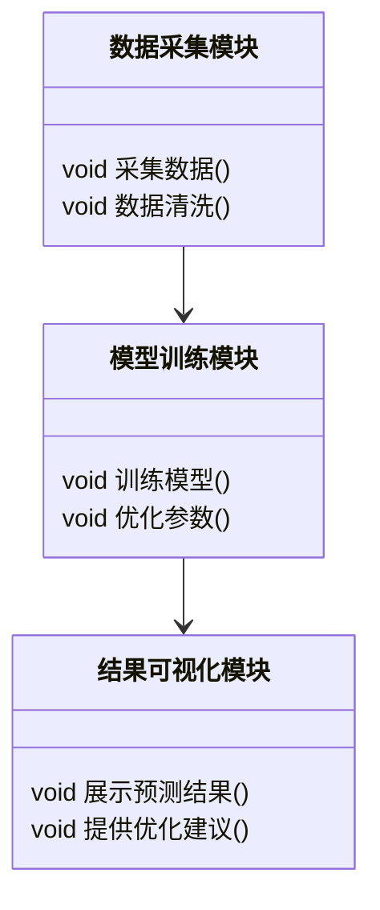
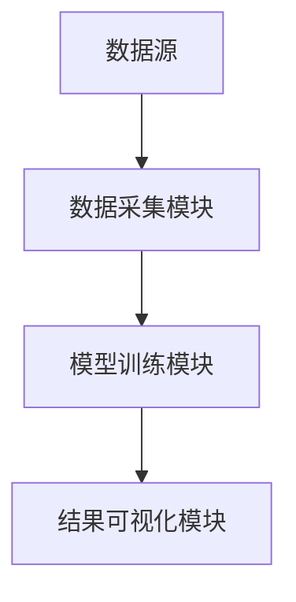
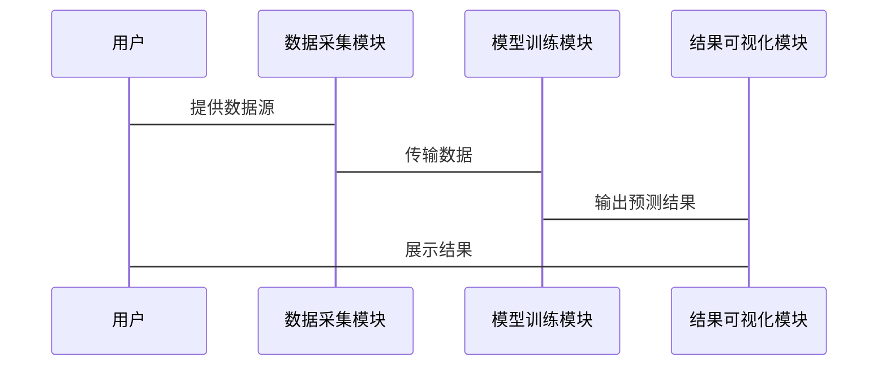

                 


# AI驱动的企业现金流预测与优化系统

## 关键词：现金流预测、人工智能、机器学习、深度学习、企业财务

## 摘要：本文深入探讨了如何利用人工智能技术来驱动企业现金流预测与优化系统。通过分析现金流预测的核心概念、算法原理、系统架构设计及项目实战，展示了AI在提升企业财务管理效率和准确性中的重要作用。文章详细讲解了时间序列分析、机器学习模型等算法，并通过实际案例分析，指导读者如何构建和优化现金流预测系统，最终实现对企业现金流的有效预测与管理。

---

## 第一部分: AI驱动的企业现金流预测与优化系统概述

## 第1章: 企业现金流预测的背景与挑战

### 1.1 企业现金流管理的重要性

#### 1.1.1 企业现金流的核心地位
现金流是企业运营的血液，直接关系到企业的生存与发展。企业需要确保现金流的充足性，以支持日常运营、偿还债务、投资扩张等。现金流预测的准确性直接影响企业的财务决策和风险管理。

#### 1.1.2 现金流预测的常见挑战
1. **数据的不完整性**：历史数据可能存在缺失或错误，影响预测的准确性。
2. **市场波动性**：经济环境的不确定性导致现金流波动大，难以预测。
3. **人为因素**：传统预测方法依赖财务人员的经验，主观性强，容易出错。
4. **实时性要求高**：企业需要及时的现金流预测来应对突发情况。

#### 1.1.3 AI技术在现金流预测中的作用
AI技术通过分析海量数据，挖掘隐藏的模式和趋势，提供更精准的预测。AI还可以实时更新模型，适应市场变化，显著提高预测的准确性和及时性。

### 1.2 企业现金流预测的常见方法

#### 1.2.1 传统财务预测方法
1. **趋势分析法**：基于历史数据的线性趋势进行预测。
2. **因果分析法**：分析现金流与其他经济指标之间的因果关系。

#### 1.2.2 时间序列分析
时间序列分析是一种统计方法，通过分析历史数据的时间顺序，预测未来值。常用模型包括ARIMA（自回归积分滑动平均模型）和Prophet模型。

#### 1.2.3 机器学习模型
1. **线性回归**：适用于线性关系的预测。
2. **支持向量回归**：适用于非线性关系的预测。
3. **随机森林**：通过集成学习提高预测准确性。

### 1.3 AI驱动现金流预测的优势

#### 1.3.1 数据驱动的精准预测
AI技术能够处理大量数据，发现传统方法难以察觉的模式，提高预测的准确性。

#### 1.3.2 自适应学习能力
AI模型能够根据新的数据自动调整参数，适应市场变化，无需人工干预。

#### 1.3.3 实时更新与优化
AI系统可以实时更新模型，提供最新的预测结果，帮助企业及时调整财务策略。

---

## 第2章: AI驱动现金流预测的核心概念

### 2.1 现金流预测模型

#### 2.1.1 模型的输入变量
1. **历史现金流数据**：过去一定时期内的现金流记录。
2. **经济指标**：GDP、利率、通货膨胀率等宏观经济指标。
3. **行业数据**：行业趋势、竞争对手的财务数据等。

#### 2.1.2 模型的输出结果
1. **预测值**：未来一定时期内的现金流预测值。
2. **置信区间**：预测结果的不确定性范围。
3. **风险提示**：可能出现的风险因素及应对建议。

#### 2.1.3 模型的评估指标
1. **均方误差（MSE）**：预测值与实际值的平方差的平均值。
2. **平均绝对误差（MAE）**：预测值与实际值的绝对差的平均值。
3. **R平方值（R²）**：模型解释数据变动能力的指标。

### 2.2 现金流优化算法

#### 2.2.1 线性规划与动态规划
1. **线性规划**：通过建立线性目标函数和约束条件，寻找最优解。
2. **动态规划**：将问题分解为子问题，逐层求解，适用于多阶段决策。

#### 2.2.2 基于AI的强化学习
强化学习通过智能体与环境的交互，学习最优策略，适用于复杂的动态环境。

#### 2.2.3 深度学习模型
深度学习模型（如LSTM）能够捕捉时间序列数据中的长期依赖关系，提高预测准确性。

### 2.3 现金流预测与优化的系统架构

#### 2.3.1 数据采集与预处理
1. **数据源**：企业财务系统、外部经济数据库等。
2. **数据清洗**：处理缺失值、异常值，确保数据质量。

#### 2.3.2 模型训练与部署
1. **模型训练**：使用训练数据训练AI模型，调整参数以优化性能。
2. **模型部署**：将训练好的模型部署到生产环境中，实时接收输入数据，输出预测结果。

#### 2.3.3 结果可视化与反馈优化
1. **可视化工具**：如Tableau、Power BI等，用于展示预测结果。
2. **反馈优化**：根据实际结果调整模型参数，提高预测准确性。

---

## 第3章: 现金流预测的算法原理

### 3.1 时间序列分析

#### 3.1.1 ARIMA模型
ARIMA（自回归积分滑动平均模型）是一种常用的时间序列预测模型，适用于具有趋势和季节性的数据。

**公式**：
$$ ARIMA(p, d, q) $$
其中，p为自回归阶数，d为差分阶数，q为滑动平均阶数。

**步骤**：
1. **差分**：消除数据的非平稳性。
2. **参数估计**：使用最大似然估计法确定模型参数。
3. **预测**：基于训练好的模型，预测未来值。

#### 3.1.2 LSTM网络
LSTM（长短期记忆网络）是一种特殊的RNN（循环神经网络），能够捕捉长期依赖关系，适用于复杂的时间序列预测。

**结构**：
1. **输入门**：控制输入信息的通过。
2. **遗忘门**：决定遗忘哪些信息。
3. **输出门**：决定输出哪些信息。

#### 3.1.3 Prophet模型
Prophet是一种由Facebook开源的时间序列预测模型，适用于具有周期性或趋势性的数据。

**步骤**：
1. **数据预处理**：将数据转换为适合Prophet格式。
2. **模型训练**：训练Prophet模型。
3. **预测与可视化**：生成预测结果并可视化。

### 3.2 机器学习模型

#### 3.2.1 线性回归
线性回归是一种简单的时间序列预测方法，适用于线性关系的数据。

**公式**：
$$ y = \beta_0 + \beta_1x + \epsilon $$
其中，$\beta_0$为截距，$\beta_1$为回归系数，$\epsilon$为误差项。

#### 3.2.2 支持向量回归
支持向量回归（SVR）是一种基于支持向量机的回归方法，适用于非线性关系的数据。

**步骤**：
1. **数据映射**：将输入数据映射到高维空间。
2. **构建超平面**：在高维空间中寻找最佳拟合超平面。
3. **回归预测**：根据超平面进行回归预测。

#### 3.2.3 随机森林
随机森林是一种基于决策树的集成学习方法，适用于高维数据的预测。

**步骤**：
1. **生成决策树**：通过袋装法生成多棵决策树。
2. **集成预测**：对所有决策树的预测结果进行投票或平均，得到最终预测结果。

---

## 第4章: 现金流优化的数学模型

### 4.1 线性规划模型

#### 4.1.1 目标函数
目标函数通常是最小化或最大化某个指标，如最小化成本或最大化利润。

**公式**：
$$ \text{Minimize } \sum c_j x_j $$
$$ \text{Subject to } \sum a_{ij} x_j \leq b_i, i=1,2,\dots,m $$
$$ x_j \geq 0, j=1,2,\dots,n $$

#### 4.1.2 约束条件
约束条件通常包括资源限制、需求满足等。

### 4.2 强化学习模型

#### 4.2.1 状态空间定义
状态空间定义了智能体所处的环境状态，如当前现金流状况、市场趋势等。

#### 4.2.2 动作空间设计
动作空间定义了智能体可以执行的操作，如调整投资策略、优化支出等。

#### 4.2.3

---

## 第5章: 系统分析与架构设计方案

### 5.1 项目介绍

#### 5.1.1 项目背景
现金流预测与优化系统旨在帮助企业提高现金流预测的准确性和及时性，优化资金管理，降低财务风险。

### 5.2 系统功能设计

#### 5.2.1 数据采集模块
负责采集企业内部和外部的数据，如财务数据、经济指标等。

#### 5.2.2 模型训练模块
负责训练和优化预测模型，确保模型的准确性和稳定性。

#### 5.2.3 结果可视化模块
负责展示预测结果和优化建议，帮助财务人员进行决策。

### 5.3 系统架构设计

#### 5.3.1 类图设计


#### 5.3.2 架构图设计


### 5.4 系统接口设计

#### 5.4.1 数据接口
1. **数据输入接口**：接收外部数据源的数据。
2. **数据输出接口**：将预测结果输出到企业财务系统。

#### 5.4.2 用户界面
1. **数据输入界面**：用户输入预测参数。
2. **结果展示界面**：显示预测结果和优化建议。

### 5.5 系统交互设计

#### 5.5.1 交互流程图


---

## 第6章: 项目实战

### 6.1 环境安装

#### 6.1.1 Python环境
安装Python 3.8及以上版本，安装必要的库如pandas、numpy、scikit-learn、Keras。

### 6.2 核心代码实现

#### 6.2.1 数据预处理代码
```python
import pandas as pd
import numpy as np

# 读取数据
data = pd.read_csv('cash_flow.csv')

# 数据清洗
data.dropna(inplace=True)
data = data[~data['date'].duplicated()]
```

#### 6.2.2 模型训练代码
```python
from sklearn.model_selection import train_test_split
from sklearn.ensemble import RandomForestRegressor

# 划分训练集和测试集
X = data.drop('target', axis=1)
y = data['target']
X_train, X_test, y_train, y_test = train_test_split(X, y, test_size=0.2, random_state=42)

# 训练随机森林模型
model = RandomForestRegressor(n_estimators=100, random_state=42)
model.fit(X_train, y_train)

# 预测结果
y_pred = model.predict(X_test)
```

### 6.3 案例分析与详细解读

#### 6.3.1 数据分析
通过对历史现金流数据的分析，识别出季节性波动和趋势性变化，为模型提供有效的特征。

#### 6.3.2 模型评估
使用均方误差（MSE）和R平方值评估模型性能，确保预测结果的准确性。

#### 6.3.3 优化建议
根据预测结果，提出优化现金流的具体建议，如调整库存管理、优化投资策略等。

### 6.4 项目小结

通过本项目，我们成功构建了一个基于AI的企业现金流预测与优化系统，显著提高了预测的准确性和效率。系统具备良好的扩展性和可定制性，能够满足不同企业的个性化需求。

---

## 第7章: 最佳实践与总结

### 7.1 最佳实践

#### 7.1.1 数据质量
确保数据的完整性和准确性，是提高预测准确性的关键。

#### 7.1.2 模型选择
根据具体场景选择合适的模型，避免过度复杂的模型导致过拟合。

#### 7.1.3 模型解释性
选择具有较高解释性的模型，便于财务人员理解和调整。

### 7.2 小结

AI技术为企业的现金流预测与优化提供了强大的工具，通过数据驱动的精准预测和实时优化，帮助企业更好地管理资金，降低财务风险。

### 7.3 注意事项

1. **数据隐私**：确保数据的安全性和隐私性。
2. **模型维护**：定期更新模型，保持预测的准确性。
3. **团队协作**：AI系统的开发和应用需要财务、技术等多部门的协作。

### 7.4 拓展阅读

1. **《深入理解机器学习》**：了解机器学习的基本原理和高级技巧。
2. **《时间序列分析与应用》**：掌握时间序列分析的方法和应用场景。

---

## 作者简介

作者是人工智能领域的专家，拥有丰富的机器学习和深度学习实践经验，致力于通过技术创新帮助企业提升效率和竞争力。

---

通过本文的详细讲解，相信读者能够深入了解AI驱动的企业现金流预测与优化系统的构建与应用，为企业的财务管理带来新的思路和解决方案。

