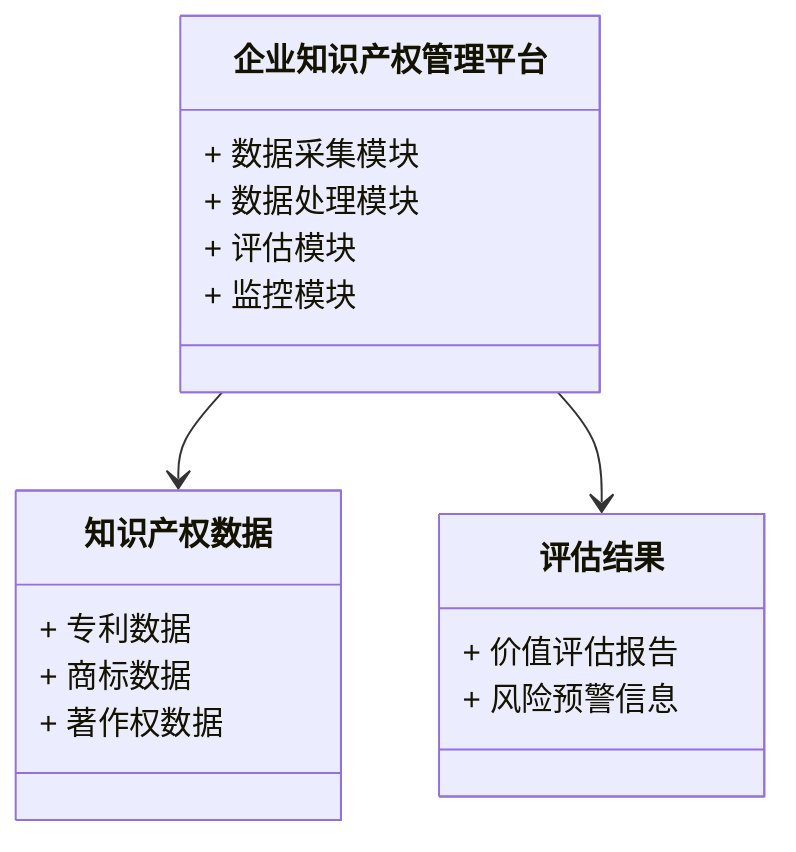
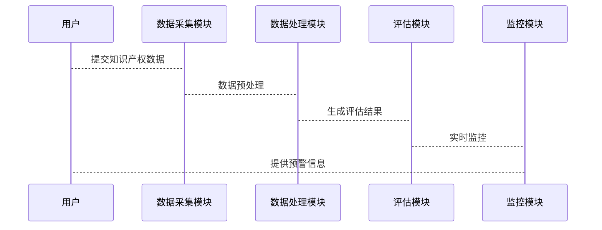

                 


# AI驱动的企业知识产权价值评估与管理

## 关键词：AI技术，知识产权，价值评估，知识图谱，机器学习，深度学习，智能监控

## 摘要：随着人工智能技术的快速发展，企业知识产权的价值评估与管理正面临新的挑战与机遇。本文将从AI驱动的角度，系统地分析企业知识产权的价值评估方法、管理模式以及实现方案。通过结合实际案例和系统设计，详细阐述如何利用机器学习、深度学习等技术提升知识产权管理的效率与精准度。文章内容涵盖从理论到实践的各个方面，为企业的知识产权管理提供新的思路和解决方案。

---

## 第一部分：AI驱动的企业知识产权价值评估与管理概述

### 第1章：知识产权与AI驱动管理的背景

#### 1.1 知识产权的基本概念

- **1.1.1 知识产权的定义与范围**
  - 知识产权是指人们对智力劳动成果所享有的专有权利，主要包括专利权、商标权、著作权、商业秘密等。
  - 知识产权的核心价值在于其创造的经济利益和市场竞争优势。

- **1.1.2 知识产权的核心价值**
  - 知识产权是企业的无形资产，能够为企业创造长期的经济价值。
  - 知识产权的保护和运用是企业竞争力的重要组成部分。

- **1.1.3 传统知识产权管理方式的局限性**
  - 传统管理方式依赖人工审核和文件处理，效率低且容易出错。
  - 数据分散，难以进行有效的信息整合和分析。

#### 1.2 AI技术在企业管理中的应用背景

- **1.2.1 AI技术的发展与企业应用趋势**
  - 人工智能技术的快速发展为企业管理提供了新的工具和方法。
  - AI技术在企业中的应用范围不断扩大，包括数据分析、决策支持、流程优化等。

- **1.2.2 AI在企业知识产权管理中的潜在价值**
  - 提高知识产权评估的准确性和效率。
  - 通过智能监控和预警，及时发现和应对知识产权风险。

- **1.2.3 当前企业知识产权管理的痛点与挑战**
  - 数据量大，难以进行有效的分析和挖掘。
  - 知识产权的价值评估缺乏统一的标准和方法。

#### 1.3 本章小结

- **1.3.1 知识产权管理的重要性**
  - 知识产权是企业的核心资产之一，其管理直接影响企业的竞争力。
  
- **1.3.2 AI技术对企业知识产权管理的推动作用**
  - AI技术能够提高知识产权管理的效率和精准度，为企业创造更大的价值。

- **1.3.3 本书的研究意义与目标**
  - 通过系统地研究和分析，提出基于AI的知识产权管理解决方案，为企业提供实践指导。

---

## 第二部分：AI驱动的企业知识产权价值评估与管理的核心概念

### 第2章：企业知识产权价值评估的原理与方法

#### 2.1 知识产权价值评估的基本原理

- **2.1.1 知识产权价值的影响因素**
  - 技术先进性、市场竞争力、法律保护力度、经济价值等。

- **2.1.2 知识产权价值评估的指标体系**
  - 包括技术指标、市场指标、法律指标等多个维度。

- **2.1.3 价值评估模型的构建与应用**
  - 基于机器学习的特征提取和分类算法，构建综合评估模型。

#### 2.2 AI驱动的知识产权价值评估方法

- **2.2.1 基于机器学习的特征提取**
  - 使用自然语言处理技术提取专利文本中的关键词和关键信息。

- **2.2.2 基于深度学习的语义分析**
  - 利用神经网络模型理解专利文档的语义信息，提高评估的准确性。

- **2.2.3 综合评估模型的设计与实现**
  - 结合特征提取和语义分析的结果，构建多维度的评估模型。

#### 2.3 知识产权价值评估的流程与步骤

- **2.3.1 数据收集与预处理**
  - 收集专利、商标等相关数据，进行清洗和标注。

- **2.3.2 模型训练与优化**
  - 基于训练数据，调整模型参数，优化评估效果。

- **2.3.3 结果分析与决策支持**
  - 根据评估结果，为企业提供决策支持和管理建议。

---

### 第3章：企业知识产权管理的AI驱动模式

#### 3.1 传统知识产权管理模式的局限性

- **3.1.1 人工管理的效率问题**
  - 人工审核效率低，容易出现疏漏。

- **3.1.2 信息孤岛与数据碎片化**
  - 数据分散在不同的系统中，难以进行统一管理。

- **3.1.3 知识产权保护与运用的不协调**
  - 保护与运用之间缺乏有效的协同机制。

#### 3.2 AI驱动的知识产权管理模式

- **3.2.1 智能化管理的特点与优势**
  - 高效、精准、实时性强。

- **3.2.2 基于AI的知识图谱构建**
  - 利用知识图谱技术，将知识产权信息进行结构化表示，便于管理和分析。

- **3.2.3 智能监控与预警系统**
  - 实时监控知识产权动态，及时发现潜在风险。

#### 3.3 企业知识产权管理的AI驱动架构

- **3.3.1 系统架构设计**
  - 包括数据采集层、计算层、应用层等多个层次。

- **3.3.2 数据流与信息处理流程**
  - 数据采集、清洗、分析、存储等流程。

- **3.3.3 系统功能模块划分**
  - 数据管理模块、评估模块、监控模块等。

---

## 第三部分：AI驱动的企业知识产权价值评估与管理的系统设计与实现

### 第4章：系统分析与架构设计

#### 4.1 问题场景介绍

- 企业知识产权管理中存在的主要问题：数据分散、评估方法单一、管理效率低下等。

#### 4.2 项目介绍

- 本项目旨在通过AI技术，构建一个智能化的知识产权管理平台，实现高效的价值评估和管理。

#### 4.3 系统功能设计

- **4.3.1 领域模型设计**
  - 使用Mermaid类图，展示系统中的核心实体及其关系。



- **4.3.2 系统架构设计**
  - 使用Mermaid架构图，展示系统的整体结构。


#### 4.4 系统接口设计

- **4.4.1 接口设计**
  - 数据采集接口、评估接口、监控接口等。

#### 4.5 系统交互设计

- **4.5.1 交互流程**
  - 使用Mermaid序列图，展示用户与系统的交互过程。



---

## 第四部分：AI驱动的企业知识产权价值评估与管理的项目实战

### 第5章：项目实战

#### 5.1 环境安装

- 安装必要的Python库：numpy、pandas、scikit-learn、tensorflow等。

#### 5.2 核心代码实现

- **5.2.1 数据处理代码**
  ```python
  import pandas as pd
  data = pd.read_csv('ip_data.csv')
  ```

- **5.2.2 评估模型代码**
  ```python
  from sklearn.model import LinearRegression
  model = LinearRegression()
  model.fit(X_train, y_train)
  ```

- **5.2.3 监控系统代码**
  ```python
  import tensorflow as tf
  model = tf.keras.Sequential()
  model.add(tf.keras.layers.Dense(64, activation='relu'))
  model.add(tf.keras.layers.Dense(1, activation='sigmoid'))
  model.compile(optimizer='adam', loss='binary_crossentropy')
  model.fit(X_train, y_train, epochs=10)
  ```

#### 5.3 实际案例分析

- 以某企业的专利数据为例，展示如何利用AI技术进行价值评估和管理。

#### 5.4 项目小结

- 总结项目的实现过程和取得的成果，为后续工作提供参考。

---

## 第五部分：AI驱动的企业知识产权价值评估与管理的最佳实践

### 第6章：最佳实践

#### 6.1 小结

- 通过本章的分析，我们可以看到AI技术在企业知识产权管理中的巨大潜力。

#### 6.2 注意事项

- 数据质量是评估结果准确性的关键，需确保数据的完整性和准确性。

#### 6.3 拓展阅读

- 推荐相关书籍和论文，供读者进一步学习和研究。

---

## 结语

随着AI技术的不断进步，企业知识产权的价值评估与管理将变得更加高效和精准。通过本文的系统分析和实践案例，我们希望能够为企业提供一套基于AI的知识产权管理解决方案，助力企业在激烈的市场竞争中占据优势地位。

