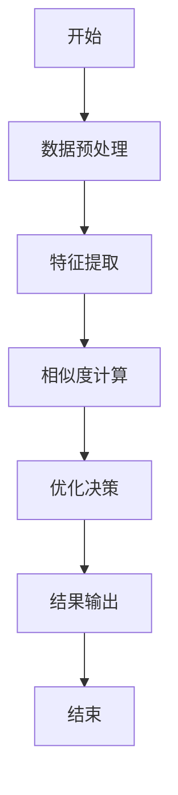
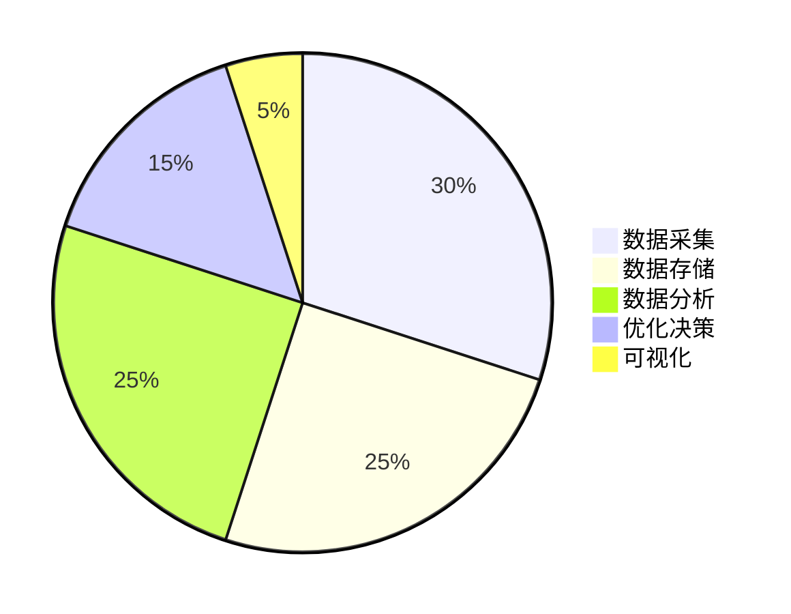
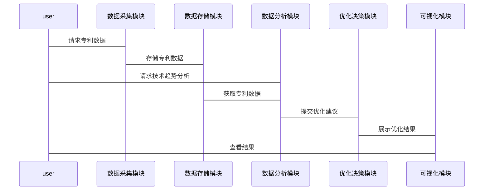

                 


# AI驱动的企业知识产权战略：专利组合优化与布局

## 关键词：人工智能，知识产权，专利组合，技术趋势，战略优化，数据挖掘，机器学习

## 摘要：  
随着人工智能（AI）技术的快速发展，企业知识产权管理迎来了新的变革。传统的专利管理方式逐渐被AI驱动的智能化方法取代，从而实现专利组合的优化与布局。本文将深入探讨AI在企业知识产权战略中的应用，分析专利组合优化的核心概念、算法原理、系统架构以及实际案例，为企业制定高效知识产权战略提供理论支持和实践指导。

---

# 第一部分：AI驱动的企业知识产权战略概述

## 第1章：AI与知识产权的结合

### 1.1 知识产权的基本概念

#### 1.1.1 知识产权的定义  
知识产权是指依法保护的创造性成果和标识，包括专利权、商标权、版权等。专利权是知识产权的重要组成部分，保护发明创造的独占性。

#### 1.1.2 专利的基本概念与特点  
专利是一种法律权利，授予发明人对其发明的独占使用权。专利具有独占性、地域性和时间性等特点。

#### 1.1.3 企业知识产权管理的重要性  
在竞争激烈的市场环境中，知识产权不仅是企业核心竞争力的体现，也是防御竞争对手的重要手段。有效的知识产权管理能够提升企业技术创新能力，降低法律风险。

---

### 1.2 AI技术与知识产权的结合

#### 1.2.1 AI技术的基本概念  
人工智能（AI）是模拟人类智能的技术，包括机器学习、自然语言处理、计算机视觉等领域。AI能够处理海量数据，发现隐藏的模式和趋势。

#### 1.2.2 AI在知识产权管理中的应用  
AI技术可以用于专利数据的分析、技术趋势预测、专利组合优化等领域，帮助企业在知识产权管理中做出更科学的决策。

#### 1.2.3 企业知识产权战略的演变  
从传统的被动防御到主动布局，AI驱动的知识产权战略正在改变企业的创新管理模式。

---

## 第2章：AI驱动的知识产权战略核心概念

### 2.1 专利组合优化的基本原理

#### 2.1.1 专利组合的概念  
专利组合是指一组相互关联的专利，覆盖特定技术领域的不同方面。优化专利组合的目标是最大化其价值和防御能力。

#### 2.1.2 专利组合优化的目标  
- 提高专利的质量和数量
- 降低专利布局的成本
- 增强专利的防御性和进攻性

#### 2.1.3 专利组合优化的步骤  
1. 数据收集与预处理  
2. 技术分析与关联  
3. 优化算法设计  
4. 结果验证与调整  

---

### 2.2 AI在专利组合优化中的作用

#### 2.2.1 数据分析与挖掘  
AI技术能够从海量专利数据中提取关键信息，发现技术趋势和竞争对手的动态。

#### 2.2.2 技术趋势预测  
通过自然语言处理和机器学习，AI可以预测未来的技术发展方向，帮助企业提前布局。

#### 2.2.3 专利价值评估  
AI可以根据技术领域、法律状态、市场应用等多维度评估专利的价值，为决策提供依据。

---

# 第二部分：AI驱动的知识产权战略算法原理

## 第3章：AI驱动的专利组合优化算法

### 3.1 算法原理概述

#### 3.1.1 数据预处理  
- 清洗数据：去除重复、无效的数据  
- 标识化处理：将专利数据转化为可分析的格式  

#### 3.1.2 特征提取  
- 通过自然语言处理提取专利文本中的关键词  
- 建立技术领域的向量表示  

#### 3.1.3 相似度计算  
- 使用余弦相似度计算专利之间的技术关联性  
- 构建专利网络图谱  

### 3.2 算法实现步骤

#### 3.2.1 算法流程图  


#### 3.2.2 数学模型  
计算专利之间相似度的公式：  
$$ \text{相似度}(p_i, p_j) = \frac{\sum_{k=1}^{n} w_{ik} \cdot w_{jk}}{\sqrt{\sum_{k=1}^{n} w_{ik}^2} \cdot \sqrt{\sum_{k=1}^{n} w_{jk}^2}}} $$  

其中，$w_{ik}$ 表示专利 $p_i$ 在第 $k$ 个特征上的权重。

---

## 第4章：系统架构设计

### 4.1 系统功能设计

#### 4.1.1 功能模块  
- 数据采集模块：收集专利数据  
- 数据分析模块：提取特征并计算相似度  
- 优化决策模块：生成专利组合优化方案  
- 可视化模块：展示分析结果  

#### 4.1.2 系统架构图  


---

### 4.2 接口设计与交互流程

#### 4.2.1 接口设计  
- 数据接口：与专利数据库对接  
- 用户接口：提供可视化界面供用户操作  

#### 4.2.2 交互流程图  


---

# 第三部分：AI驱动的知识产权战略项目实战

## 第5章：AI驱动的专利组合优化系统实现

### 5.1 项目背景与目标

#### 5.1.1 项目背景  
随着技术的快速发展，企业需要更高效的专利管理工具。

#### 5.1.2 项目目标  
开发一个基于AI的专利组合优化系统，帮助企业在技术创新中占据优势。

---

### 5.2 环境搭建与代码实现

#### 5.2.1 环境搭建  
- 安装Python、机器学习库（如scikit-learn）  
- 安装自然语言处理库（如spaCy、NLTK）  

#### 5.2.2 核心代码实现  
```python
import numpy as np
from sklearn.metrics.pairwise import cosine_similarity

# 示例专利数据
patents = [
    "专利1：人工智能图像识别方法",
    "专利2：基于深度学习的语音识别系统",
    # 更多专利数据...
]

# 特征提取
def extract_features(text):
    # 简单的特征提取，例如提取关键词
    return text.split()

# 计算相似度矩阵
features = [extract_features(p) for p in patents]
feature_matrix = []
for ft in features:
    feature_matrix.append(ft)

# 计算余弦相似度
similarity_matrix = cosine_similarity(feature_matrix)
```

---

### 5.3 项目案例分析

#### 5.3.1 案例背景  
某科技公司希望优化其人工智能领域的专利组合。

#### 5.3.2 数据分析  
通过对现有专利数据的分析，发现技术趋势并优化专利布局。

#### 5.3.3 结果展示  
生成优化后的专利组合报告，包括核心专利、技术领域分布等。

---

## 第6章：总结与展望

### 6.1 本章小结  
AI技术正在改变企业的知识产权管理方式，专利组合优化与布局是其中的重要应用。

### 6.2 未来展望  
随着AI技术的不断进步，知识产权管理将更加智能化和精准化，为企业创造更大的价值。

---

# 第四部分：注意事项与扩展阅读

## 第7章：AI驱动知识产权战略的注意事项

### 7.1 数据质量的重要性  
确保专利数据的准确性和完整性是AI分析的基础。

### 7.2 技术与法律的结合  
AI技术的应用需要结合知识产权法律知识，避免法律风险。

### 7.3 企业的长期规划  
专利组合优化是一个长期过程，需要企业持续投入和调整。

---

## 第8章：扩展阅读与推荐资源

### 8.1 推荐书籍  
- 《专利布局：企业创新的战略武器》  
- 《人工智能：一种现代的方法》  

### 8.2 推荐论文  
- "Artificial Intelligence in Intellectual Property Management"  
- "Machine Learning for Patent Analysis and Strategy"  

---

通过本文的系统分析和实践指导，企业可以更好地利用AI技术优化知识产权战略，提升核心竞争力。

