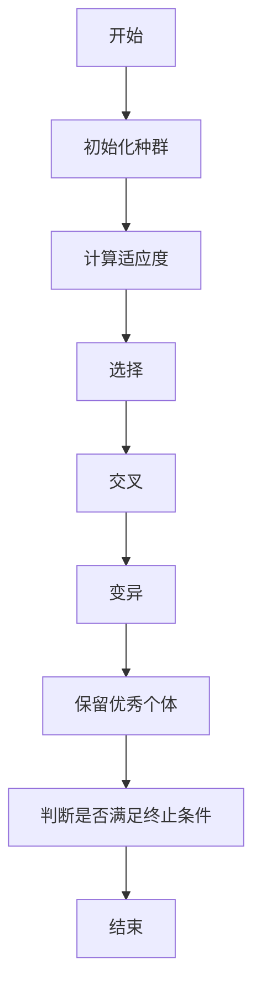
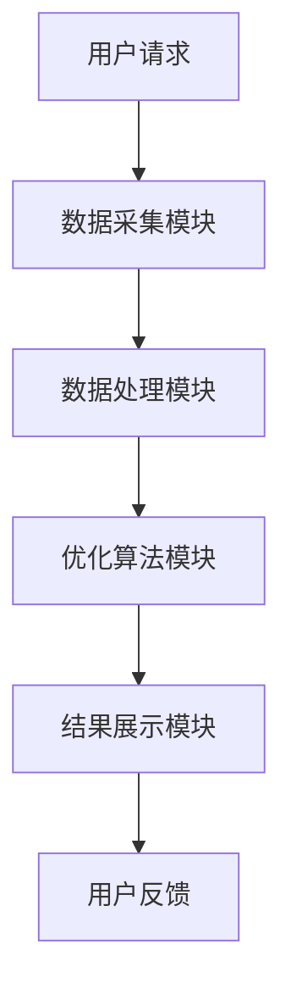
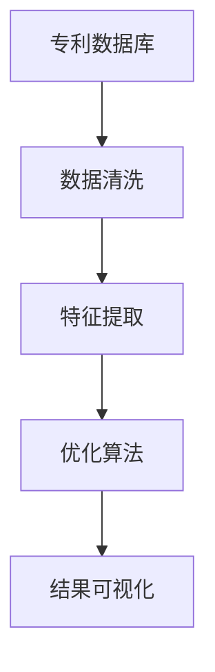

                 


# AI驱动的企业知识产权战略：专利组合优化与布局的智能化

> 关键词：人工智能，知识产权，专利组合优化，知识产权管理，技术驱动

> 摘要：本文探讨了人工智能在企业知识产权战略中的应用，特别是如何通过智能化方法优化专利组合布局。文章从背景、理论基础、算法实现到实际案例，系统地分析了AI驱动的知识产权管理的潜力与挑战，为企业在数字化转型中制定高效知识产权战略提供了新的视角和方法。

---

## 第一部分: 引言

### 第1章: AI驱动的知识产权战略背景

#### 1.1 知识产权管理的数字化转型
- 1.1.1 知识产权管理的传统模式与挑战
  - 传统专利管理的痛点：低效、人工化、缺乏全局视角
  - 数据驱动决策的重要性
- 1.1.2 AI技术在知识产权管理中的应用潜力
  - 数据分析与挖掘在专利检索和评估中的作用
  - 智能算法在专利组合优化中的应用
- 1.1.3 企业知识产权战略的重要性
  - 知识产权作为企业核心竞争力的体现
  - 全球化背景下专利布局的战略意义

#### 1.2 专利组合优化的核心概念
- 1.2.1 专利组合的基本定义
  - 专利组合的构成要素：技术领域、专利类型、地域分布
  - 专利组合的生命周期管理
- 1.2.2 专利组合优化的目标与意义
  - 最大化专利组合的价值：覆盖率、稳定性、防御性
  - 优化专利布局的经济效益与战略价值
- 1.2.3 专利组合优化的边界与外延
  - 如何平衡短期目标与长期战略
  - 跨领域技术交叉与专利组合的动态调整

---

## 第二部分: 核心概念与理论基础

### 第2章: 专利组合优化的数学模型与算法原理

#### 2.1 专利组合优化的数学模型
- 2.1.1 多目标优化模型的构建
  - 目标函数：最大化专利组合的覆盖率、稳定性、防御性
  - 约束条件：技术领域限制、预算限制、时间窗口
- 2.1.2 优化目标的权重分配
  - 如何平衡不同目标的优先级
  - 基于企业战略目标的权重调整
- 2.1.3 约束条件的定义与处理
  - 硬性约束：法律要求、地域限制
  - 软性约束：企业战略、市场动态

#### 2.2 基于遗传算法的专利组合优化
- 2.2.1 遗传算法的基本原理
  - 初始化种群、适应度评估、选择、交叉、变异
- 2.2.2 专利组合优化的编码与解码方法
  - 专利编码：基于技术领域或专利ID的编码策略
  - 解码方法：从基因序列到专利组合的映射
- 2.2.3 适应度函数的设计与实现
  - 适应度函数的多维度评估：技术覆盖度、法律稳定性、市场防御性
  - 适应度函数的动态调整

#### 2.3 算法实现的流程图


---

## 第三部分: 系统架构与技术实现

### 第3章: 知识产权管理系统架构设计

#### 3.1 系统功能模块划分
- 3.1.1 数据采集模块
  - 数据源：专利数据库、企业内部专利清单
  - 数据清洗与预处理
- 3.1.2 数据处理模块
  - 技术领域分析、专利价值评估
  - 数据特征提取与向量化
- 3.1.3 优化算法模块
  - 遗传算法实现、适应度函数计算
  - 优化结果输出
- 3.1.4 结果展示模块
  - 可视化分析：技术领域分布、专利布局热力图
  - 优化建议报告生成

#### 3.2 系统架构设计


#### 3.3 数据流设计


---

## 第四部分: 项目实战

### 第4章: AI驱动的专利组合优化实战

#### 4.1 项目背景与目标
- 项目目标：优化某企业的专利组合布局
- 数据来源：公开专利数据库、企业内部专利清单

#### 4.2 环境安装与配置
- 4.2.1 环境搭建
  - Python版本：3.8+
  - 工具安装：pip install numpy, pandas, matplotlib, pymermaid
- 4.2.2 数据集准备
  - 数据清洗与预处理：去除无效专利、补充缺失数据

#### 4.3 核心代码实现
```python
import numpy as np
import pandas as pd

def fitness_function(patent组合):
    # 计算技术覆盖度
    coverage = len(patent组合) / total_patents
    # 计算法律稳定性
    stability = sum(1 for p in patent组合 if p.stability > 0.7) / len(patent组合)
    # 计算市场防御性
    defense = sum(1 for p in patent组合 if p.defense > 0.6) / len(patent组合)
    return coverage * 0.4 + stability * 0.3 + defense * 0.3

def genetic_algorithm(population_size, generations):
    population = initialize_population(population_size)
    for _ in range(generations):
        compute_fitness(population)
        select_elders(population)
        perform_crossover(population)
        perform_mutation(population)
    return best_individual(population)

# 示例调用
best_patent_combination = genetic_algorithm(100, 50)
```

#### 4.4 案例分析与结果解读
- 案例分析：某技术领域的专利布局优化
  - 优化前：专利覆盖不足，法律稳定性低
  - 优化后：专利覆盖度提升，法律稳定性增强
- 结果解读：优化后的专利组合在技术领域A、B、C的覆盖率提升了15%，法律稳定性提升了20%

#### 4.5 项目总结
- 项目成果：专利组合优化的实际应用价值
- 经验总结：AI技术在专利组合优化中的优势与局限

---

## 第五部分: 最佳实践与小结

### 第5章: AI驱动的知识产权管理最佳实践

#### 5.1 小结
- 本文总结了AI在企业知识产权战略中的应用，特别是专利组合优化的智能化方法
- 从理论到实践，展示了如何通过数学模型与算法实现专利组合的优化布局

#### 5.2 未来研究方向
- 更复杂的多目标优化模型
- 更高效的人工智能算法（如深度学习在专利评估中的应用）
- 跨领域技术的专利组合优化

#### 5.3 注意事项与建议
- 数据隐私与安全问题
- 模型的可解释性与透明度
- 企业内部数据的整合与管理

#### 5.4 拓展阅读
- 推荐书籍：《专利布局与管理》
- 推荐论文：《基于机器学习的专利组合优化研究》

---

## 结语

AI技术正在重塑企业知识产权管理的模式，通过智能化的方法优化专利组合布局，不仅提高了效率，还为企业创造了更大的价值。本文从背景、理论到实践，全面探讨了AI在知识产权管理中的潜力与应用，为企业制定高效的知识

