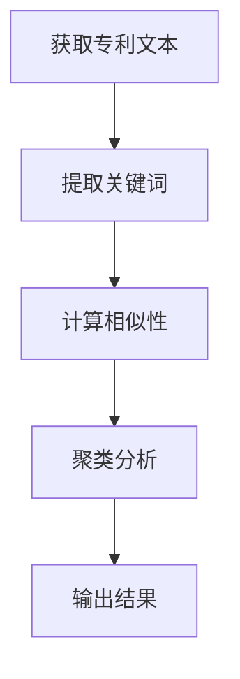
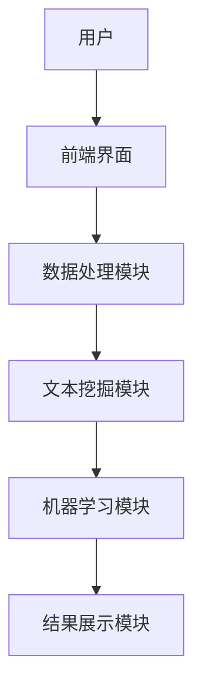

                 


# AI驱动的企业知识产权战略：专利组合分析与布局优化

---

## 关键词  
AI, 企业知识产权, 专利组合分析, 布局优化, 知识产权管理, 文本挖掘, 机器学习  

---

## 摘要  
随着人工智能技术的快速发展，企业知识产权管理迎来了新的变革。AI技术的应用不仅提高了专利分析的效率，还为企业专利组合的优化提供了全新的思路。本文将从AI驱动的专利组合分析方法入手，探讨专利布局的优化策略，并结合实际案例分析，为企业制定知识产权战略提供理论支持和实践指导。

---

## 第一部分: AI与知识产权的结合  

### 第1章: AI对知识产权管理的影响  

#### 1.1 知识产权的基本概念  
知识产权是指依法保护的创造性智力成果，包括专利权、商标权、著作权等。专利权是知识产权的重要组成部分，具有独占性、地域性和时间性等特点。  

AI技术的引入，使得专利数据的处理和分析更加高效。通过自然语言处理（NLP）和机器学习算法，AI能够快速提取专利文本中的关键信息，识别技术趋势和竞争对手的动态。  

#### 1.2 AI对专利组合分析的影响  
专利组合分析是企业知识产权管理的核心内容之一。通过AI技术，企业可以实现以下目标：  
1. **自动化数据处理**：快速整理和清洗专利数据，提取关键词和分类信息。  
2. **智能化分析**：利用机器学习算法对专利进行分类、聚类和预测，识别高价值专利和技术空白。  
3. **动态优化**：根据市场变化和技术发展，实时调整专利组合的布局策略。  

#### 1.3 专利组合分析的背景与意义  
专利组合是指一组具有战略意义的专利资产，能够为企业提供技术保护和市场竞争优势。通过AI驱动的专利组合分析，企业可以：  
1. **降低管理成本**：自动化处理专利数据，减少人工干预。  
2. **提升决策效率**：快速识别关键技术和潜在风险。  
3. **优化布局策略**：根据技术趋势和市场需求，动态调整专利布局。  

---

## 第二部分: 专利组合分析的核心概念  

### 第2章: 专利组合的定义与特征  

#### 2.1 专利组合的定义  
专利组合是指一组相互关联的专利资产，能够为企业提供技术保护和市场竞争优势。一个有效的专利组合应具备以下特征：  
- **技术覆盖性**：覆盖核心技术和关键领域。  
- **法律有效性**：专利必须有效且具有法律保护。  
- **战略协同性**：专利之间应具有协同作用，形成完整的保护体系。  

#### 2.2 专利组合的属性特征对比  
以下表格对比了专利组合的几个关键属性：  

| 属性        | 特征描述                                                                 |
|-------------|--------------------------------------------------------------------------|
| 技术领域     | 覆盖的技术领域是否全面，是否符合企业战略目标。                         |
| 保护范围     | 专利的保护范围是否合理，是否能够覆盖竞争对手的核心技术。               |
| 稳定性       | 专利的法律稳定性，包括专利的有效性和可执行性。                         |
| 战略价值     | 专利是否能够为企业带来市场竞争优势，是否具有商业价值。               |

#### 2.3 专利组合的ER实体关系图  
以下是一个简单的专利组合ER实体关系图（使用Mermaid）：  

```mermaid
erDiagram
    class 专利组合 {
        专利ID
        专利名称
        申请日期
        发明人
        技术领域
        保护范围
    }
    class 企业 {
        企业ID
        企业名称
        法人代表
        注册地址
    }
    class 技术领域 {
        领域ID
        领域名称
        关键技术
    }
    专利组合 --> 企业 : "属于"
    专利组合 --> 技术领域 : "涉及"
```

---

## 第三部分: AI驱动的专利组合分析方法  

### 第3章: 文本挖掘与专利分析  

#### 3.1 文本挖掘的基本原理  
文本挖掘是通过计算机技术从大量文本数据中提取有用信息的过程。在专利分析中，文本挖掘主要用于提取专利文本中的关键词、摘要和权利要求。  

#### 3.2 专利文本特征提取  
通过文本挖掘技术，可以提取专利文本的以下特征：  
- **关键词**：专利名称、摘要和权利要求中的关键词。  
- **技术领域**：根据关键词归类到具体的技术领域。  
- **相似性**：通过余弦相似度计算专利之间的相似性。  

#### 3.3 基于TF-IDF的专利关键词提取  
TF-IDF（Term Frequency-Inverse Document Frequency）是一种常用的文本特征提取方法。以下是TF-IDF的公式：  

$$TF-IDF = \frac{f_{term}}{N} \times \log(N+1)$$  

其中，\( f_{term} \) 是某个关键词在专利文本中的出现次数，\( N \) 是所有专利文本的总数。  

---

### 第4章: 机器学习算法在专利分析中的应用  

#### 4.1 常见的机器学习算法介绍  
在专利分析中，常用的机器学习算法包括：  
- **聚类算法**：用于将相似的专利归为一类。  
- **分类算法**：用于预测专利的技术领域和价值。  
- **回归算法**：用于评估专利的经济价值。  

#### 4.2 基于聚类的专利分类  
以下是基于聚类的专利分类流程图（使用Mermaid）：  



#### 4.3 基于分类的专利价值评估  
以下是一个简单的专利价值评估模型（使用Python代码）：  

```python
from sklearn.feature_extraction.text import TfidfVectorizer
from sklearn.svm import SVC

# 假设我们有一个专利文本列表
patents = ["专利1文本", "专利2文本", ..., "专利n文本"]

# 提取TF-IDF特征
vectorizer = TfidfVectorizer()
X = vectorizer.fit_transform(patents)

# 使用SVM进行分类
model = SVC()
model.fit(X, labels)

# 预测专利价值
predicted_value = model.predict(X)
```

---

## 第四部分: 系统架构设计  

### 第5章: 系统功能设计  

#### 5.1 问题场景介绍  
假设我们有一个企业需要优化其专利组合，我们可以通过以下系统实现：  
1. **数据获取**：从专利数据库获取专利文本。  
2. **数据处理**：清洗和预处理专利数据。  
3. **数据分析**：使用文本挖掘和机器学习算法进行专利分析。  
4. **结果展示**：生成可视化报告和优化建议。  

#### 5.2 系统架构设计  
以下是系统架构图（使用Mermaid）：  



---

## 第五部分: 企业知识产权战略的优化实践  

### 第6章: 专利布局的优化策略  

#### 6.1 专利布局的基本策略  
1. **技术领域布局**：根据企业的技术发展方向，选择核心技术和关键领域。  
2. **地域布局**：根据目标市场，选择合适的专利申请地区。  
3. **时间布局**：根据技术生命周期，合理安排专利的申请和维护时间。  

#### 6.2 专利组合的动态调整  
1. **定期评估**：每年对专利组合进行评估，识别无效或低效的专利。  
2. **技术跟踪**：跟踪技术发展趋势，及时调整专利布局。  

---

## 第六部分: 项目实战与案例分析  

### 第7章: 项目环境与工具安装  

#### 7.1 开发环境搭建  
1. 安装Python和必要的库：`scikit-learn`, `nltk`, `tflearn`。  
2. 安装文本挖掘工具：`spaCy`, `Gensim`。  

#### 7.2 数据获取与处理  
从专利数据库获取专利文本，清洗数据并提取关键词。  

---

## 结语  

AI技术正在深刻改变企业知识产权管理的方式。通过AI驱动的专利组合分析，企业可以更高效地优化专利布局，提升核心竞争力。未来，随着AI技术的进一步发展，企业知识产权管理将更加智能化和数据化。

