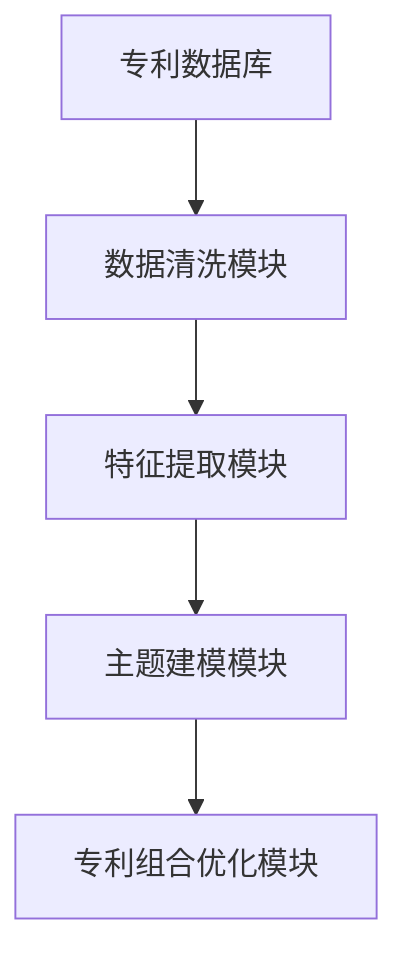

                 


# AI驱动的企业知识产权战略：专利组合分析与布局优化

## 关键词：AI, 企业知识产权, 专利组合, 布局优化, 技术分析

## 摘要：  
本文探讨了人工智能如何驱动企业知识产权战略的优化，特别是专利组合的分析与布局。通过结合AI技术，企业能够更高效地进行专利检索、分类、评估和优化，从而提升知识产权管理的效率和效果。文章详细分析了专利组合的核心要素、AI驱动的分析方法，以及优化策略，为企业制定和实施知识产权战略提供了实用的指导。

---

# 第一部分: 引言

## 1.1 AI驱动的企业知识产权战略的重要性

### 1.1.1 什么是企业知识产权战略  
企业知识产权战略是指企业在技术研发、产品开发和市场竞争中，通过获取、保护和运用知识产权（如专利、商标、版权等），以实现竞争优势和长期发展的战略规划。知识产权不仅是企业核心竞争力的体现，也是抵御竞争对手的重要手段。

### 1.1.2 AI如何改变知识产权管理  
随着AI技术的快速发展，企业知识产权管理的传统模式正在被智能化工具和方法所取代。AI能够通过自然语言处理（NLP）、机器学习和数据挖掘等技术，帮助企业高效分析海量专利数据，识别技术趋势，优化专利布局，降低管理成本。

### 1.1.3 专利组合分析的核心作用  
专利组合是指一组相互关联的专利资产，它们共同覆盖企业核心技术的多个方面。通过AI驱动的专利组合分析，企业可以更好地评估专利的价值、风险和潜力，从而制定更具前瞻性的知识产权战略。

---

## 1.2 本书的目标与结构  

### 1.2.1 本书的核心目标  
本书旨在帮助企业理解和应用AI技术，优化专利组合分析与布局策略。通过理论与实践相结合的方式，为企业提供从专利检索、分析到战略制定的全链条指导。

### 1.2.2 目录结构概览  
本书分为四个部分：引言、专利组合分析的背景与基础、AI驱动的专利组合分析方法、专利组合管理的优化策略。每一部分都详细展开，从基础概念到高级算法，再到实际应用，层层递进。

### 1.2.3 读者对象与预期收获  
本书适合企业知识产权管理者、技术研发人员、专利律师以及对AI技术感兴趣的读者。通过阅读本书，读者可以掌握AI驱动的专利分析方法，提升企业知识产权管理的效率和效果。

---

# 第二部分: 专利组合分析的背景与基础  

## 2.1 知识产权与专利的基本概念  

### 2.1.1 知识产权的定义与分类  
知识产权是指依法保护的创造性成果，包括专利权、商标权、版权等。专利是知识产权的重要组成部分，主要保护发明的实用性创新。

### 2.1.2 专利的定义、类型与保护范围  
专利是发明人或设计人向国家申请保护其发明创造的法律文件。专利分为发明专利、实用新型专利和外观设计专利三种类型，分别保护技术方案、技术构造和产品外观。

### 2.1.3 专利在企业竞争中的作用  
专利不仅是企业技术实力的体现，也是市场竞争的武器。通过专利布局，企业可以防止竞争对手侵权，提升市场地位。

---

## 2.2 专利组合分析的必要性  

### 2.2.1 什么是专利组合  
专利组合是指一组相互关联的专利资产，覆盖企业的核心技术领域。通过合理的专利组合布局，企业可以最大化专利的价值。

### 2.2.2 专利组合分析的背景与意义  
随着技术的快速发展，单一专利的保护范围有限，企业需要通过组合专利覆盖多个技术点，形成全面的技术壁垒。

### 2.2.3 专利组合分析的边界与外延  
专利组合分析不仅包括技术领域的覆盖，还涉及专利的质量、数量、布局地域等因素。

---

## 2.3 专利组合分析的核心要素  

### 2.3.1 技术领域分布  
专利组合应覆盖企业的核心技术领域，确保技术布局的全面性。

### 2.3.2 专利数量与质量  
专利数量是基础，但质量更为重要。高质量的专利通常具有较高的技术价值和法律稳定性。

### 2.3.3 专利布局的地域性  
根据目标市场和技术特点，选择合适的专利布局地域，确保专利保护的广度和深度。

---

# 第三部分: AI驱动的专利组合分析方法  

## 3.1 AI技术在专利分析中的应用  

### 3.1.1 自然语言处理在专利文本分析中的应用  
NLP技术可以帮助提取专利文本中的关键词、主题和语义信息，提高专利分类和检索的效率。

### 3.1.2 机器学习在专利分类与聚类中的应用  
机器学习算法可以自动分类专利，发现技术趋势和潜在的技术空白。

### 3.1.3 图论在专利网络分析中的应用  
通过构建专利网络图，可以分析专利之间的关联性，发现技术簇和潜在的协同创新机会。

---

## 3.2 专利组合分析的算法原理  

### 3.2.1 基于TF-IDF的关键词提取  
TF-IDF（Term Frequency-Inverse Document Frequency）是一种常用的文本特征提取方法，用于提取专利文本中的关键词。

$$ TF-IDF(t) = \text{log}(TF(t)) \times \text{log}(N / (DF(t) + 1)) $$  
其中，$TF(t)$ 是某词在文本中的频率，$DF(t)$ 是该词在所有文本中的出现次数，$N$ 是文本总数。

### 3.2.2 基于LDA的主题建模  
LDA（Latent Dirichlet Allocation）是一种主题建模算法，可以将专利文本分为多个主题，帮助发现技术领域的分布。

### 3.2.3 基于聚类算法的专利分组  
聚类算法（如K-means）可以将相似的专利分组，发现技术簇和技术趋势。

---

## 3.3 专利组合分析的数学模型  

### 3.3.1 专利质量评估模型  
专利质量可以通过技术相关性、法律稳定性、市场价值等多个维度进行评估。

$$ Q = \alpha \cdot T + \beta \cdot L + \gamma \cdot M $$  
其中，$Q$ 是专利质量，$\alpha, \beta, \gamma$ 是各维度的权重，$T$ 是技术相关性，$L$ 是法律稳定性，$M$ 是市场价值。

### 3.3.2 专利布局优化模型  
通过优化模型，可以确定最佳的专利布局策略。

$$ \text{Maximize} \quad \sum_{i=1}^{n} w_i \cdot x_i $$  
$$ \text{Subject to} \quad \sum_{i=1}^{n} x_i \leq C $$  
其中，$x_i$ 是第$i$个专利的布局权重，$w_i$ 是权重系数，$C$ 是预算约束。

---

# 第四部分: 专利组合管理的优化策略  

## 4.1 专利组合管理的框架  

### 4.1.1 专利组合管理的流程  
专利组合管理的流程包括专利检索、分类、评估、布局优化和监控。

### 4.1.2 专利组合管理的组织架构  
企业需要建立专门的知识产权管理团队，负责专利的获取、维护和运用。

### 4.1.3 专利组合管理的工具与平台  
常用的工具包括专利数据库（如PatentScope）、数据分析平台（如Python的Scikit-learn）和可视化工具（如Tableau）。

---

## 4.2 基于AI的专利组合优化  

### 4.2.1 基于强化学习的专利布局优化  
强化学习可以通过模拟优化过程，找到最佳的专利布局策略。

### 4.2.2 基于遗传算法的专利组合优化  
遗传算法可以模拟生物进化过程，优化专利组合的结构和质量。

---

## 4.3 企业知识产权战略的制定与实施  

### 4.3.1 专利组合与企业战略的结合  
专利组合应与企业的发展战略、技术研发方向和市场竞争目标相结合。

### 4.3.2 专利保护与风险防御策略  
通过合理的专利布局，可以有效防御竞争对手的侵权行为，降低法律风险。

### 4.3.3 专利运营与价值提升  
通过专利的许可、转让和质押，可以实现专利的经济价值。

---

## 总结  

AI技术正在深刻改变企业知识产权管理的方式。通过AI驱动的专利组合分析与布局优化，企业可以更高效地管理专利资产，提升核心竞争力。未来，随着AI技术的进一步发展，企业知识产权管理将更加智能化、数据化和全球化。

---

# 附录  

## 附录A: 专利组合分析的数学模型代码  

```python
import numpy as np
from sklearn.feature_extraction.text import TfidfVectorizer
from sklearn.decomposition import LatentDirichletAllocation

# 示例专利文本
texts = ["专利文本1", "专利文本2", "专利文本3"]

# 提取关键词
vectorizer = TfidfVectorizer()
X = vectorizer.fit_transform(texts)

# 主题建模
lda = LatentDirichletAllocation(n_components=3)
lda.fit(X)
```

---

## 附录B: 系统架构设计  



---

通过以上内容，本文全面介绍了AI驱动的企业知识产权战略，从理论到实践，为企业的专利组合分析与布局优化提供了系统的指导和实用的工具。

