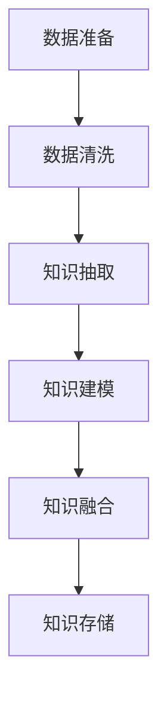

                 


# AI驱动的企业知识图谱：构建、维护与应用实践

## 关键词：知识图谱, AI驱动, 企业应用, 构建方法, 维护策略, 应用实践

## 摘要：  
知识图谱作为一种强大的企业信息管理工具，通过AI技术的驱动，能够有效地构建、维护和应用。本文将从知识图谱的背景与核心概念出发，详细探讨其构建方法与技术，系统架构与应用实践，并通过实际案例分析，总结出一套完整的知识图谱构建与应用方案。文章内容涵盖数据准备、知识抽取、图谱构建、系统架构设计等关键环节，同时提供具体的代码实现和数学公式，帮助读者全面理解知识图谱的构建与应用过程。

---

## 第一部分：企业知识图谱的背景与核心概念

### 第1章：知识图谱的定义与特点

#### 1.1 知识图谱的定义
知识图谱是一种以图结构形式表示知识的技术，通过实体（概念）和关系（属性）的组织，构建出一个可计算的语义网络。它不同于传统数据库，能够更好地支持语义搜索和智能应用。

- **知识图谱的定义**：知识图谱是一个由实体、关系和属性构成的网络，能够表示现实世界中的各种知识。
- **特点对比**：
  | 特性 | 数据库 | 知识图谱 |
  |------|--------|----------|
  | 结构 | 行和列 | 实体和关系 |
  | 查询 | 基于字段 | 基于语义 |
  | 可扩展性 | 有限 | 高度可扩展 |

- **知识图谱的属性特征**：
  - 实体唯一性：每个实体都有唯一的标识。
  - 关系多样性：支持多种类型的关系。
  - 知识层次化：支持层次化的知识组织。

#### 1.2 知识图谱与企业应用
- **应用背景**：企业知识管理的痛点，如数据孤岛、知识分散、语义不明确等问题。
- **核心价值**：通过知识图谱，企业能够实现知识的高效组织、语义检索和智能应用。

---

### 第2章：知识图谱的核心概念

#### 2.1 实体与关系
- **实体**：知识图谱中的基本单位，代表现实世界中的概念或对象。
- **关系**：描述实体之间的关联，可以是二元关系或多元关系。
- **属性**：描述实体的特征或性质。

#### 2.2 知识图谱的构建流程
- 数据准备：清洗、预处理和格式化。
- 知识抽取：从数据中提取实体和关系。
- 知识融合：消除冲突，整合知识。
- 知识存储：使用图数据库存储知识图谱。

---

## 第二部分：知识图谱的构建方法与技术

### 第3章：知识图谱的构建流程

#### 3.1 数据准备与清洗
- 数据来源：企业内部数据、公开数据集等。
- 数据清洗：去除冗余数据、处理缺失值、标准化数据格式。
- 数据预处理：将数据转换为适合知识抽取的形式。

#### 3.2 知识抽取与建模
- 实体识别：使用NLP技术从文本中提取实体。
- 关系抽取：识别实体之间的关系。
- 知识建模：将实体和关系组织成图结构。

#### 3.3 知识融合与冲突处理
- 数据冲突：同一实体在不同数据源中存在不同的表示。
- 冲突解决：通过规则或算法消除冲突，确保知识的唯一性和一致性。

---

### 第4章：知识图谱的构建算法

#### 4.1 知识抽取算法
- 基于规则的抽取：使用正则表达式提取特定模式的信息。
- 基于统计的抽取：利用概率模型识别实体和关系。
- 基于深度学习的抽取：使用神经网络模型进行抽取。

#### 4.2 知识融合算法
- 基于图的相似度计算：通过计算节点之间的相似度进行融合。
- 基于规则的冲突解决：使用预定义的规则消除冲突。
- 基于机器学习的融合模型：使用监督学习模型进行知识融合。

#### 4.3 知识图谱的构建流程图（Mermaid）



---

## 第三部分：知识图谱的系统架构与应用

### 第5章：知识图谱的系统架构设计

#### 5.1 系统功能设计
- 知识图谱管理模块：负责知识的存储、查询和更新。
- 数据处理模块：处理原始数据，提取知识。
- 应用接口模块：提供API，供上层应用调用。

#### 5.2 系统架构设计（Mermaid）

```mermaid
--- architecture
    backend
    frontend
    database
    API Gateway
    [Knowledge Graph]
    [Data Processing]
    [Knowledge Management]
```

#### 5.3 系统接口设计
- 数据接口：用于数据的输入和输出。
- 应用接口：提供RESTful API，供其他系统调用。

---

### 第6章：知识图谱的应用实践

#### 6.1 智能搜索与问答系统
- 智能搜索：基于知识图谱进行语义搜索。
- 问答系统：通过知识图谱回答用户的问题。

#### 6.2 智能推荐系统
- 基于知识图谱的推荐：分析用户行为和知识图谱中的关系，进行个性化推荐。

#### 6.3 企业知识共享与协作
- 知识共享：通过知识图谱实现企业内部知识的共享和协作。
- 知识协作：支持多人协作，实时更新知识图谱。

---

## 小结与最佳实践

知识图谱的构建和应用是一个复杂而系统的过程，需要结合企业实际需求，采用合适的技术和方法。在构建过程中，要注重数据的质量和一致性，同时要灵活应对知识的动态变化。在应用中，要结合具体的业务场景，充分发挥知识图谱的潜力。

### 最佳实践
- **数据准备**：确保数据的多样性和高质量。
- **知识抽取**：结合多种方法，提高抽取的准确性。
- **知识融合**：通过多源数据的融合，消除冲突，提高知识的全面性。
- **系统架构**：设计灵活可扩展的系统架构，支持未来的扩展和优化。

---

通过以上步骤，我们可以看到，构建和应用知识图谱是一个复杂而有趣的过程，需要结合技术和业务的深度理解。希望本文能够为读者提供一个清晰的知识图谱构建与应用的框架，帮助他们在实际工作中更好地利用知识图谱技术，推动企业的智能化发展。

