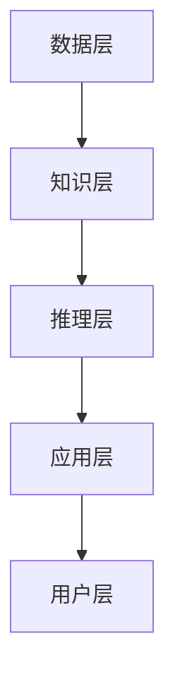
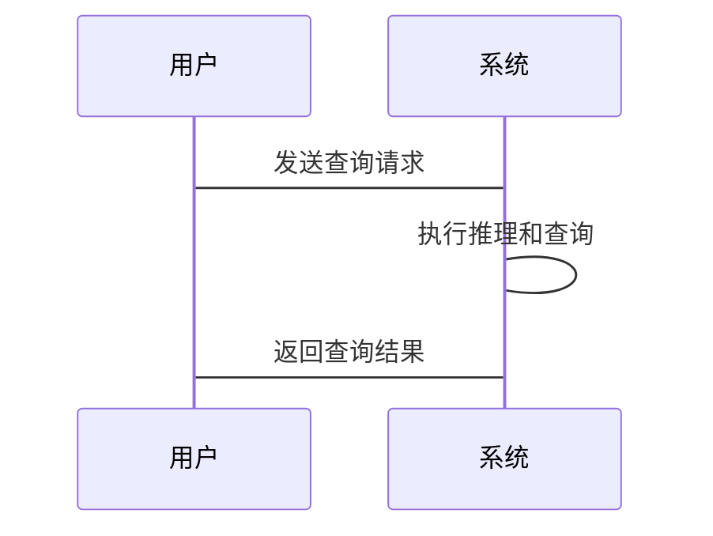

                 


# AI驱动的企业知识图谱：自动化构建与智能推理的深度融合

> 关键词：知识图谱，人工智能，自动化构建，智能推理，企业应用，系统架构

> 摘要：本文深入探讨了AI驱动的知识图谱在企业中的构建与应用，重点分析了自动化构建技术和智能推理方法的深度融合。通过详细讲解知识图谱的核心概念、构建流程、推理算法以及系统架构，本文为企业级知识图谱的构建与应用提供了理论基础和实践指导。

---

## 第一部分：知识图谱概述

### 第1章：知识图谱的基本概念与背景

#### 1.1 知识图谱的定义与特点

**知识图谱的定义**：知识图谱是一种以图结构形式表示知识的语义网络，由实体、关系和属性组成，能够描述现实世界中的概念及其关系。

**知识图谱的核心特点**：
- **语义性**：通过结构化的表示，明确描述实体之间的关系和属性。
- **层次化**：支持复杂的层次结构，能够表示复杂的知识体系。
- **动态性**：支持实时更新和扩展，能够适应不断变化的知识需求。

#### 1.2 知识图谱的构建背景与应用

**知识图谱的构建背景**：
- 随着企业数据的快速增长，如何有效管理和利用数据成为重要问题。
- 知识图谱能够将分散在不同数据源中的信息整合起来，形成统一的知识体系。

**知识图谱在企业中的应用场景**：
- **企业信息管理**：整合企业内部数据，提升信息利用效率。
- **智能问答系统**：基于知识图谱构建智能问答系统，提供准确的知识查询服务。
- **推荐系统**：通过分析用户行为和知识图谱中的关联关系，提供个性化推荐。

#### 1.3 知识图谱的核心要素与结构

**核心要素**：
- **实体**：知识图谱的基本组成单元，表示现实世界中的具体事物。
- **关系**：描述实体之间的关联，可以是二元关系或多元关系。
- **属性**：描述实体的特征或性质。

**知识图谱的层次化结构**：
- **概念层**：描述知识体系中的核心概念和关系。
- **实例层**：具体实例化概念，描述具体的数据实例。
- **规则层**：定义知识图谱的推理规则和约束条件。

#### 1.4 知识图谱的构建流程

**构建流程**：
1. **数据采集**：从多种数据源（数据库、文档、网页等）采集数据。
2. **数据预处理**：清洗数据，去除噪声，确保数据质量。
3. **知识抽取**：从数据中提取实体、关系和属性。
4. **知识建模**：根据领域知识构建知识图谱的本体模型。
5. **知识存储**：将知识图谱存储在合适的数据结构中，如RDF三元组。
6. **知识应用**：基于知识图谱构建各种应用系统，如问答系统、推荐系统。

---

## 第二部分：知识图谱的自动化构建技术

### 第2章：知识图谱的自动化构建方法

#### 2.1 知识抽取技术

**知识抽取技术**：
- **基于规则的知识抽取**：通过预定义的规则从文本中提取实体和关系。
- **基于自然语言处理的知识抽取**：利用NLP技术（如分词、实体识别、关系抽取）从文本中提取知识。
- **基于模式匹配的知识抽取**：通过模式匹配从结构化数据中提取知识。

**优缺点对比**：

| 技术 | 优点 | 缺点 |
|------|------|------|
| 基于规则 | 精确性高，易于控制 | 需要大量人工规则设计 |
| 基于NLP | 适用于非结构化数据，灵活性高 | 精确性较低，需要大量训练数据 |
| 基于模式匹配 | 适用于结构化数据，精确性高 | 模式设计复杂 |

#### 2.2 知识融合与冲突消解

**知识融合**：
- 将多个数据源中的知识进行整合，消除冗余和冲突。

**冲突消解**：
- 通过多种方法（如投票法、基于权重的方法）消除知识冲突。

**基于图结构的冲突消解算法**：
1. **检测冲突**：识别图中矛盾的三元组。
2. **冲突消解**：根据冲突的严重程度，选择合适的消解方法。

#### 2.3 知识图谱的存储与管理

**存储技术**：
- **RDF（Resource Description Framework）**：知识图谱的标准数据模型，支持语义Web的应用。
- **RDF4J**：RDF的Java实现，提供丰富的API和工具支持。
- **Apache Jena**：基于RDF的Semantic Web框架，支持知识图谱的构建和推理。

**查询与推理技术**：
- **SPARQL**：RDF数据的查询语言，支持复杂的查询操作。
- **RDFS（RDF Schema）**：RDF的Schema语言，用于定义概念和属性。

**版本控制与更新**：
- 通过版本控制工具（如Git）管理知识图谱的更新和变更。

#### 2.4 企业级知识图谱构建的挑战与解决方案

**挑战**：
- 数据源多样性和异构性问题。
- 知识抽取的精确性和效率问题。
- 知识融合的复杂性和冲突消解问题。

**解决方案**：
- **数据预处理**：通过数据清洗和标准化，降低数据异构性。
- **混合抽取方法**：结合规则和NLP技术，提高知识抽取的精确性和效率。
- **分布式计算**：利用分布式计算框架（如Hadoop、Spark）提高知识构建的效率。

---

## 第三部分：知识图谱的智能推理与应用

### 第3章：知识图谱的智能推理与应用

#### 3.1 智能推理算法

**推理算法**：
- **基于规则的推理**：通过预定义的规则进行推理。
- **基于描述逻辑的推理**：使用描述逻辑（如OWL）进行推理，支持复杂概念的推理。
- **基于深度学习的推理**：利用神经网络模型进行知识推理。

**优缺点对比**：

| 技术 | 优点 | 缺点 |
|------|------|------|
| 基于规则 | 精确性高，易于解释 | 需要大量人工规则设计 |
| 基于描述逻辑 | 支持复杂概念推理，形式化程度高 | 计算复杂度高，推理效率低 |
| 基于深度学习 | 鲁棒性强，适用于大规模数据 | 需要大量训练数据，可解释性差 |

#### 3.2 知识图谱的智能应用

**智能应用**：
- **问答系统**：基于知识图谱构建智能问答系统，提供准确的知识查询服务。
- **推荐系统**：通过分析用户行为和知识图谱中的关联关系，提供个性化推荐。
- **对话系统**：基于知识图谱构建智能对话系统，支持上下文理解和知识推理。

**应用场景**：
- **企业内部知识管理**：整合企业内部知识，提升员工工作效率。
- **客户互动**：通过智能问答和推荐系统提升客户体验。
- **市场分析**：利用知识图谱进行市场趋势分析和竞争对手分析。

#### 3.3 知识图谱的推理与应用案例

**案例分析**：
- **问答系统**：基于知识图谱构建问答系统，用户可以通过自然语言查询获取准确的知识答案。
- **推荐系统**：通过分析用户的历史行为和知识图谱中的关联关系，推荐相关的产品或服务。
- **对话系统**：基于知识图谱构建智能对话系统，支持多轮对话和上下文理解。

---

## 第四部分：知识图谱的系统架构与设计

### 第4章：知识图谱的系统架构与设计

#### 4.1 系统架构设计

**系统架构**：
- **数据层**：存储原始数据和知识图谱数据。
- **知识层**：存储知识图谱的实体、关系和属性。
- **推理层**：负责知识图谱的推理和查询。
- **应用层**：基于推理结果构建各种应用系统。
- **用户层**：用户与系统的交互界面。

**系统架构图**：



#### 4.2 接口设计与交互流程

**接口设计**：
- **RESTful API**：提供标准的HTTP接口，支持知识图谱的查询和推理。
- **WebSocket**：支持实时交互，提供动态的知识更新和推理结果。

**交互流程**：



---

## 第五部分：知识图谱的项目实战

### 第5章：企业级知识图谱实战

#### 5.1 项目背景与目标

**项目背景**：
- 某企业希望通过构建知识图谱实现内部知识管理和客户互动。

**项目目标**：
- 整合企业内部数据，构建统一的知识图谱。
- 基于知识图谱构建问答系统和推荐系统。

#### 5.2 环境搭建与工具安装

**环境搭建**：
- **操作系统**：Linux或Windows。
- **开发工具**：IntelliJ IDEA或Eclipse。
- **依赖库**：RDF4J、Apache Jena、SPARQL客户端。

**工具安装**：
- 安装RDF4J和Apache Jena，配置环境变量。

#### 5.3 知识图谱的构建与推理实现

**构建过程**：
1. 数据采集与预处理。
2. 知识抽取与建模。
3. 知识图谱的存储与管理。
4. 推理算法的实现与应用。

**代码示例**：
```python
from rdflib import Graph, Literal, BNode, Namespace, RDF, URIRef

# 定义命名空间
ns = Namespace("http://example.org/")

# 创建图
g = Graph()

# 添加三元组
g.add((URIRef('http://example.org/a'), RDF.type, URIRef('http://example.org/Thing')))
g.add((URIRef('http://example.org/a'), ns.hasProperty, Literal('propertyValue')))

# 查询三元组
for s, p, o in g:
    print(s, p, o)
```

#### 5.4 系统接口与应用开发

**接口开发**：
- 使用Flask框架开发RESTful API，提供知识图谱的查询和推理接口。

**应用开发**：
- 基于知识图谱构建问答系统和推荐系统，提供用户友好的交互界面。

---

## 第六部分：总结与展望

### 第6章：总结与展望

#### 6.1 全文总结

**总结**：
- 本文深入探讨了AI驱动的知识图谱的构建与应用，重点分析了自动化构建技术和智能推理方法的深度融合。
- 通过详细讲解知识图谱的核心概念、构建流程、推理算法以及系统架构，为企业级知识图谱的构建与应用提供了理论基础和实践指导。

#### 6.2 未来展望

**未来方向**：
- **知识图谱与大模型的结合**：将知识图谱与大语言模型结合，提升知识推理的准确性和效率。
- **跨领域知识融合**：研究如何在不同领域之间进行知识融合，构建跨领域的知识图谱。
- **动态知识图谱**：研究知识图谱的动态更新和实时推理，适应快速变化的知识需求。

---

## 附录

### 附录A：相关工具与库

- **RDF4J**：https://rdf4j.org/
- **Apache Jena**：https://jena.apache.org/
- **SPARQL**：https://www.w3.org/TR/sparql11-overview/

### 附录B：参考文献

- [1] 姜宇等. 知识图谱构建与应用研究. 计算机科学, 2020.
- [2] 王强等. 基于深度学习的知识图谱推理方法. 人工智能学报, 2021.

---

通过本文的详细讲解，读者可以全面了解AI驱动的知识图谱的构建与应用，掌握自动化构建技术和智能推理方法的核心原理，为企业级知识图谱的构建与应用提供理论支持和实践指导。

