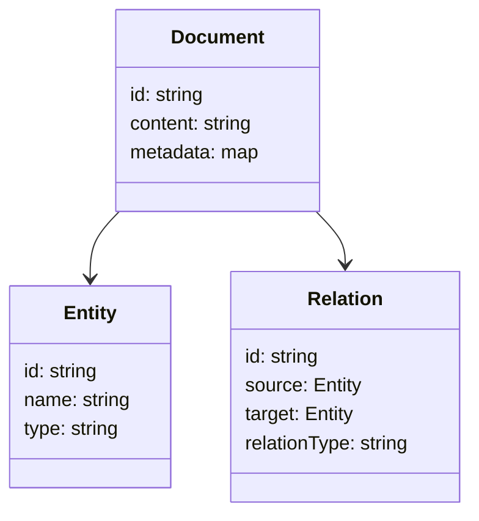

                 


# AI驱动的企业知识挖掘：从非结构化数据中提取价值

## 关键词：
- 人工智能, 企业知识挖掘, 非结构化数据, 自然语言处理, 知识图谱, 数据挖掘

## 摘要：
随着企业数据的快速增长，非结构化数据的占比越来越高。如何从这些数据中提取有价值的知识，成为企业提升竞争力的关键。本文将深入探讨AI在企业知识挖掘中的应用，从自然语言处理到知识图谱构建，详细分析技术原理和实际应用，为企业提供从数据到价值的完整解决方案。

---

# 第一部分：背景与概念

## 第1章：AI驱动的知识挖掘概述

### 1.1 知识挖掘的基本概念

#### 1.1.1 知识挖掘的定义
知识挖掘是从数据中提取隐含信息并转化为可利用知识的过程。它不同于传统的数据分析，更注重发现数据背后的关系和模式。

#### 1.1.2 知识挖掘的核心目标
- **数据理解**：识别数据中的实体和关系。
- **模式发现**：发现数据中的规律和趋势。
- **知识表示**：将数据结构化为可查询和推理的形式。

#### 1.1.3 知识挖掘的应用场景
- **企业分析**：从企业文档中提取市场趋势和竞争对手信息。
- **医疗领域**：从病历中提取患者信息和诊断结果。
- **金融行业**：从新闻中提取市场动态和风险预警。

### 1.2 非结构化数据的特点

#### 1.2.1 非结构化数据的定义
非结构化数据是指没有固定结构，难以用传统数据库存储和查询的数据，如文本、图像、音频等。

#### 1.2.2 非结构化数据的类型
- **文本数据**：如文档、邮件、新闻。
- **图像数据**：如照片、图表。
- **音频数据**：如语音记录。

#### 1.2.3 非结构化数据的挑战
- **数据复杂性**：数据类型多样，难以统一处理。
- **语义理解**：需要理解数据的含义和上下文。
- **处理效率**：处理大量非结构化数据需要高效的算法和工具。

---

## 第2章：企业知识挖掘的背景与需求

### 2.1 企业数据的现状

#### 2.1.1 结构化数据与非结构化数据的对比
- **结构化数据**：如表格数据，适合SQL查询。
- **非结构化数据**：如文本，适合自然语言处理。

#### 2.1.2 非结构化数据在企业中的重要性
- 提供丰富的上下文信息。
- 帮助企业做出更明智的决策。

#### 2.1.3 企业数据管理的痛点
- 数据孤岛：不同部门的数据难以整合。
- 数据冗余：重复数据导致存储浪费。
- 数据质量：数据不一致或不完整。

### 2.2 知识挖掘在企业中的价值

#### 2.2.1 提升决策效率
- 通过分析非结构化数据，快速提取关键信息。

#### 2.2.2 优化业务流程
- 自动化处理文档，减少人工干预。

#### 2.2.3 创新商业模式
- 开发基于知识图谱的新产品和服务。

---

## 第3章：AI驱动知识挖掘的核心技术

### 3.1 自然语言处理（NLP）

#### 3.1.1 NLP的基本概念
NLP是研究如何让计算机理解和生成人类语言的学科。

#### 3.1.2 NLP的关键技术
- **分词**：将文本分割成词语或短语。
- **实体识别**：识别文本中的命名实体。
- **情感分析**：判断文本的情感倾向。

#### 3.1.3 NLP在知识挖掘中的应用
- 从文本中提取实体和关系。
- 生成结构化的知识表示。

### 3.2 知识图谱构建

#### 3.2.1 知识图谱的定义
知识图谱是一种以图结构表示知识的语义网络。

#### 3.2.2 知识图谱的构建流程
1. 数据清洗：去除噪声数据。
2. 实体识别：识别文本中的实体。
3. 关系抽取：识别实体之间的关系。
4. 知识融合：整合多源数据。
5. 知识存储：存储知识图谱。

#### 3.2.3 知识图谱的存储与查询
- **存储**：使用图数据库，如Neo4j。
- **查询**：使用SPARQL查询语言。

---

# 第二部分：知识挖掘的算法与实现

## 第4章：知识挖掘的算法原理

### 4.1 传统文本挖掘算法

#### 4.1.1 朴素贝叶斯分类
- **原理**：基于概率的分类方法。
- **公式**：$$P(c|x) = \frac{P(x|c)P(c)}{P(x)}$$
- **应用**：文本分类、垃圾邮件识别。

#### 4.1.2 支持向量机（SVM）
- **原理**：寻找最优超平面进行分类。
- **应用**：文本分类、模式识别。

### 4.2 深度学习模型

#### 4.2.1 卷积神经网络（CNN）
- **原理**：通过卷积操作提取局部特征。
- **应用**：文本分类、图像识别。

#### 4.2.2 循环神经网络（RNN）
- **原理**：处理序列数据，如文本。
- **应用**：机器翻译、文本生成。

---

## 第5章：企业知识挖掘系统架构设计

### 5.1 问题场景介绍

#### 5.1.1 企业知识挖掘的典型场景
- 客户反馈分析。
- 市场趋势预测。

### 5.2 系统功能设计

#### 5.2.1 领域模型设计


### 5.3 系统架构设计


---

## 第6章：项目实战

### 6.1 医疗领域病历分析

#### 6.1.1 环境配置
- 安装Python和相关库：`pip install -r requirements.txt`

#### 6.1.2 数据预处理
```python
import pandas as pd

def load_data(file_path):
    return pd.read_csv(file_path)

data = load_data('medical_notes.csv')
```

#### 6.1.3 模型训练
```python
from sklearn.feature_extraction.text import TfidfVectorizer
from sklearn.naive_bayes import MultinomialNB

vectorizer = TfidfVectorizer()
X = vectorizer.fit_transform(data['text'])
model = MultinomialNB().fit(X, data['label'])
```

#### 6.1.4 结果分析
```python
from sklearn.metrics import accuracy_score

y_pred = model.predict(X)
print(accuracy_score(data['label'], y_pred))
```

---

## 第7章：总结与展望

### 7.1 全文总结
本文详细介绍了AI驱动的知识挖掘技术，从理论到实践，为企业提供了从非结构化数据中提取价值的完整解决方案。

### 7.2 技术展望
未来，知识图谱和深度学习的结合将进一步提升知识挖掘的能力。

### 7.3 最佳实践
- 使用合适的工具和框架。
- 定期更新和优化模型。
- 保护数据隐私和安全。

---

通过以上结构和内容，我们可以系统地了解AI在企业知识挖掘中的应用，从理论到实践，为企业提供从非结构化数据中提取价值的完整解决方案。

