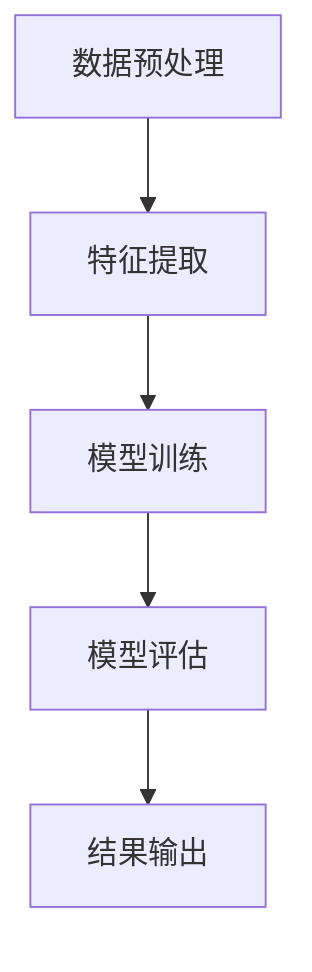
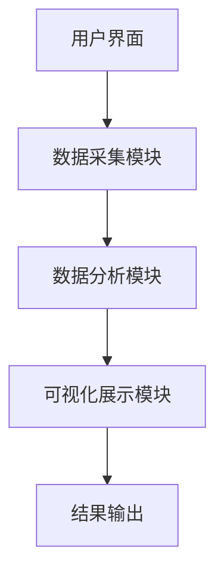
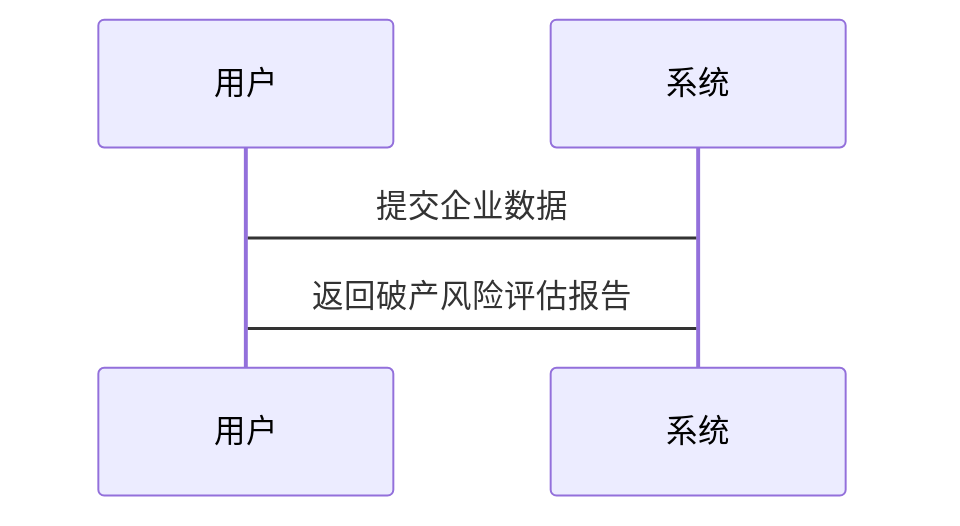

                 


# AI驱动的企业破产重组可行性分析

> 关键词：AI驱动、企业破产重组、可行性分析、数据驱动、决策支持

> 摘要：本文系统地探讨了人工智能（AI）在企业破产重组中的应用，分析了AI技术如何通过数据驱动的方法提高破产重组的可行性。文章从背景、核心概念、算法原理、系统架构设计到项目实战，全面阐述了AI在破产重组中的潜力与实现路径。通过具体案例分析和系统设计，展示了AI技术如何优化破产重组过程，为企业提供更高效、更精准的决策支持。

---

# 第一部分: AI驱动的企业破产重组背景与概念

## 第1章: 企业破产重组的背景与问题

### 1.1 企业破产重组的定义与特点

#### 1.1.1 企业破产的定义
企业破产是指企业在无法偿还债务的情况下，通过法律程序进行债务清理或资产重组的过程。破产重组的核心目标是通过调整资产结构、优化债务安排，使企业重新走上可持续发展的道路。

#### 1.1.2 企业重组的核心目标
- 恢复企业偿债能力
- 优化资产结构
- 提高企业运营效率
- 避免企业完全倒闭

#### 1.1.3 破产重组的法律框架
破产重组的法律框架包括《企业破产法》、《公司法》等，涉及债务人、债权人、股东等多方利益的平衡。

### 1.2 企业破产重组的常见原因

#### 1.2.1 经济下行的影响
经济低迷可能导致企业销售收入下降，资金链断裂，无法偿还债务。

#### 1.2.2 企业内部管理问题
内部管理不善、成本过高、资金使用效率低下等问题可能导致企业陷入财务困境。

#### 1.2.3 行业竞争加剧
行业竞争加剧可能导致企业市场份额被抢占，利润减少，最终导致财务危机。

### 1.3 AI技术在破产重组中的应用潜力

#### 1.3.1 数据驱动的决策支持
AI技术可以通过分析企业的财务数据、市场数据等，提供更精准的决策支持。

#### 1.3.2 AI在风险预警中的作用
通过分析企业的财务指标、市场环境等数据，AI可以提前预警企业的破产风险。

#### 1.3.3 AI在资产重组中的优化作用
AI可以通过优化资产配置、预测市场趋势等，帮助企业在重组过程中做出更优决策。

### 1.4 本章小结
本章介绍了企业破产重组的定义、常见原因以及AI技术在破产重组中的应用潜力。AI技术通过数据驱动的方法，可以在破产重组的各个环节提供支持，帮助企业实现更高效的决策。

---

## 第2章: AI驱动的破产重组可行性分析核心概念

### 2.1 核心概念与定义

#### 2.1.1 AI驱动的定义
AI驱动的破产重组是指利用人工智能技术（如机器学习、大数据分析等）来辅助企业进行破产预测、风险评估和资产重组的过程。

#### 2.1.2 破产重组的可行性分析
破产重组的可行性分析是指通过对企业财务状况、市场环境、资产结构等多方面因素的综合评估，判断企业是否适合进行破产重组。

#### 2.1.3 数据驱动的决策模型
数据驱动的决策模型是指通过收集和分析大量数据，利用统计学和机器学习方法，构建数学模型来支持决策的过程。

### 2.2 核心概念的联系与对比

#### 2.2.1 AI与传统破产重组分析的对比
| 对比维度         | AI驱动的破产重组分析 | 传统破产重组分析 |
|------------------|-----------------------|-------------------|
| 数据来源         | 结构化数据+非结构化数据 | 主要依赖财务报表 |
| 分析方法         | 机器学习、深度学习    | 专家经验判断      |
| 决策效率         | 高                    | 低                |
| 精准度           | 高                    | 中                |

#### 2.2.2 数据驱动与非数据驱动方法的对比
| 对比维度         | 数据驱动方法          | 非数据驱动方法    |
|------------------|-----------------------|-------------------|
| 分析依据         | 数据分析               | 专家经验判断      |
| 分析效率         | 高                    | 低                |
| 可扩展性         | 高                    | 低                |
| 精准度           | 高                    | 中                |

#### 2.2.3 可行性分析的核心要素
- 企业财务状况
- 市场环境
- 企业资产结构
- 债务情况
- 管理团队能力

### 2.3 本章小结
本章详细阐述了AI驱动的破产重组可行性分析的核心概念，对比了AI方法与传统方法的优缺点，明确了可行性分析的核心要素。

---

## 第3章: AI驱动的破产重组分析算法原理

### 3.1 破产预测模型的数学模型

#### 3.1.1 逻辑回归模型
逻辑回归是一种常用的分类算法，用于预测企业是否可能破产。其数学模型如下：
$$ P(y=1|x) = \frac{e^{\beta_0 + \beta_1x_1 + \beta_2x_2 + \dots + \beta_nx_n}}{1 + e^{\beta_0 + \beta_1x_1 + \beta_2x_2 + \dots + \beta_nx_n}} $$
其中，$y$ 是目标变量（企业是否破产），$x_i$ 是特征变量（如销售收入、利润等）。

#### 3.1.2 支持向量机模型
支持向量机（SVM）是一种分类算法，适用于高维数据的分类问题。其数学模型如下：
$$ y = \text{sign}(\sum_{i=1}^n \alpha_i y_i x_i \cdot x + b) $$
其中，$\alpha_i$ 是拉格朗日乘子，$y_i$ 是目标变量，$x_i$ 是特征向量。

#### 3.1.3 随机森林模型
随机森林是一种基于决策树的集成算法，适用于分类和回归问题。其数学模型如下：
$$ y = \text{mode}(\{h_t(x)\}_{t=1}^T) $$
其中，$h_t$ 是第$t$棵决策树的预测函数，$T$ 是决策树的数量。

### 3.2 破产预测模型的流程图



### 3.3 破产预测模型的Python实现

```python
import pandas as pd
from sklearn.model import LogisticRegression

# 数据加载与预处理
data = pd.read_csv(' bankruptcy_data.csv')
data = data.dropna()

# 特征提取
features = data[['revenue', 'profit', 'assets']]
target = data['bankruptcy']

# 模型训练
model = LogisticRegression()
model.fit(features, target)

# 模型评估
print(model.score(features, target))
```

### 3.4 本章小结
本章详细讲解了几种常用的破产预测模型，包括逻辑回归、支持向量机和随机森林，并通过流程图和代码示例展示了模型的实现过程。

---

## 第4章: 破产重组可行性分析的系统架构设计

### 4.1 系统功能模块设计

#### 4.1.1 数据采集模块
数据采集模块负责从企业财务报表、市场数据等来源获取相关数据。

#### 4.1.2 数据分析模块
数据分析模块利用机器学习算法对数据进行分析，生成破产风险评估报告。

#### 4.1.3 可视化展示模块
可视化展示模块将分析结果以图表形式展示，便于用户理解和决策。

### 4.2 系统架构设计



### 4.3 系统接口设计



### 4.4 本章小结
本章设计了一个完整的破产重组可行性分析系统架构，包括数据采集、分析和可视化的功能模块，以及系统的接口设计和交互流程图。

---

## 第5章: 项目实战——AI驱动的企业破产重组分析

### 5.1 环境安装与数据准备

#### 5.1.1 环境安装
需要安装Python、Pandas、Scikit-learn等库。

```bash
pip install numpy pandas scikit-learn
```

#### 5.1.2 数据准备
使用企业财务数据集，如销售收入、利润、资产等特征。

### 5.2 核心功能实现

#### 5.2.1 数据预处理
```python
import pandas as pd

data = pd.read_csv(' bankruptcy_data.csv')
data = data.dropna()
```

#### 5.2.2 模型训练
```python
from sklearn.model import LogisticRegression

features = data[['revenue', 'profit', 'assets']]
target = data['bankruptcy']

model = LogisticRegression()
model.fit(features, target)
```

#### 5.2.3 结果可视化
```python
import matplotlib.pyplot as plt

importances = model.coef_
plt.bar(range(len(importances[0])), importances[0])
plt.show()
```

### 5.3 案例分析与结果解读

#### 5.3.1 案例分析
以某企业为例，分析其财务数据，预测其破产风险。

#### 5.3.2 结果解读
根据模型预测结果，提出相应的重组建议。

### 5.4 项目总结
通过本项目，展示了AI技术在企业破产重组中的实际应用，证明了AI驱动的方法在提高决策效率和精准度方面的优势。

---

## 第6章: 最佳实践与未来展望

### 6.1 小结
AI技术通过数据驱动的方法，显著提高了企业破产重组的可行性分析效率和精准度。

### 6.2 注意事项
- 数据质量对模型性能影响较大，需确保数据的完整性和准确性。
- 模型的选择需根据具体问题和数据特点进行调整。
- 结果需结合企业实际情况进行综合判断，避免单一依赖模型预测。

### 6.3 拓展阅读
- 《机器学习实战》
- 《企业破产法》
- 《数据驱动的决策分析》

---

# 结语

通过本文的系统分析，我们可以看到AI技术在企业破产重组中的巨大潜力。未来，随着AI技术的不断发展，破产重组的分析将更加精准和高效，为企业提供更有力的决策支持。

