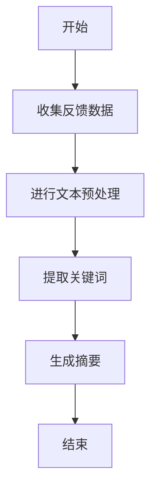
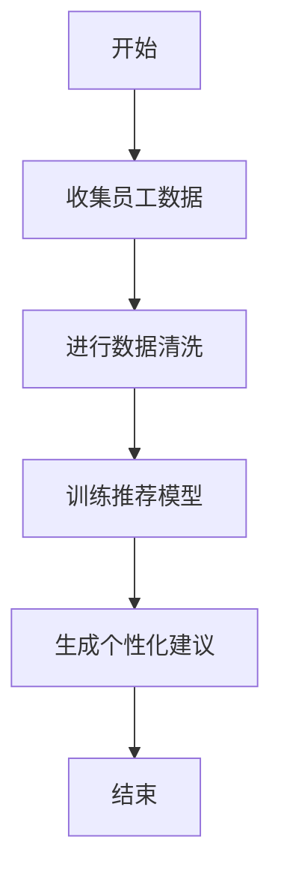
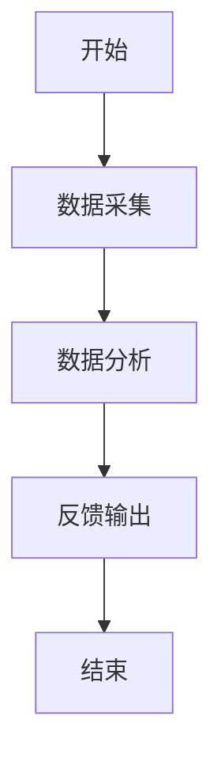

                 


# AI驱动的企业绩效管理：360度反馈与实时coaching

## 关键词：人工智能、企业绩效管理、360度反馈、实时 coaching、自然语言处理、机器学习

## 摘要：
随着人工智能技术的飞速发展，企业绩效管理正经历着一场深刻的数字化转型。本文将探讨如何利用AI技术，特别是通过360度反馈和实时 coaching，来提升企业的绩效管理水平。文章将从传统绩效管理的挑战入手，详细阐述AI驱动的360度反馈系统和实时 coaching 的实现原理，分析其在企业中的应用价值，并通过实际案例展示如何利用自然语言处理和机器学习算法来优化绩效管理流程，为企业管理者提供数据驱动的决策支持。

---

## 第一部分: AI驱动的企业绩效管理概述

### 第1章: 企业绩效管理的数字化转型

#### 1.1 传统企业绩效管理的挑战

##### 1.1.1 绩效管理的定义与历史演变
绩效管理是指通过设定目标、监控执行、评估结果和提供反馈，以提升组织和个人绩效的过程。传统绩效管理主要依赖人工填写评估表格，周期较长且主观性较强，难以实时反馈和个性化指导。

##### 1.1.2 传统绩效管理的痛点与局限性
- **主观性**：评估结果受评估者主观因素影响较大。
- **低效性**：评估周期长，反馈不及时，难以指导实时行为。
- **缺乏数据支持**：难以通过数据全面分析员工表现。
- **员工参与度低**：员工对评估过程的参与度不足，可能导致抵触情绪。

##### 1.1.3 数字化转型的必要性
数字化转型能够通过技术手段解决传统绩效管理的痛点，提高评估的客观性和实时性，同时为管理者提供数据支持，帮助员工实现自我提升。

#### 1.2 AI驱动的绩效管理新范式

##### 1.2.1 AI在企业管理中的应用现状
AI技术已经在企业中广泛应用，包括数据分析、流程自动化、客户服务等领域。在绩效管理中，AI可以帮助企业实现数据驱动的决策和个性化的员工支持。

##### 1.2.2 绩效管理的智能化趋势
智能化绩效管理通过AI技术实现以下目标：
- 自动化数据收集与分析。
- 实时反馈与个性化指导。
- 预测员工绩效，提前制定改进措施。

##### 1.2.3 360度反馈与实时 Coaching 的核心价值
360度反馈通过多维度的数据收集，提供全面的员工绩效评估；实时 Coaching 则通过AI算法，为员工提供即时的反馈和指导，帮助其快速改进。

---

### 第2章: 360度反馈系统的原理与优势

#### 2.1 360度反馈的定义与特点

##### 2.1.1 360度反馈的多维度评估
360度反馈从多个维度（如上级、同事、下属、客户）收集评估数据，确保评估的全面性和客观性。

##### 2.1.2 反馈的匿名性与客观性
通过匿名反馈，员工可以更真实地表达意见，减少主观偏见的影响。

##### 2.1.3 360度反馈在团队管理中的应用
360度反馈可以帮助团队识别优势和改进点，促进团队协作和整体绩效提升。

#### 2.2 AI在360度反馈中的作用

##### 2.2.1 数据采集与整合
AI系统可以自动收集来自不同渠道的反馈数据，并进行整合处理。

##### 2.2.2 智能分析与反馈生成
通过自然语言处理和机器学习算法，AI可以分析反馈内容，提取关键信息并生成个性化反馈报告。

##### 2.2.3 个性化反馈报告的输出
AI生成的反馈报告不仅全面，还能够针对不同员工的特点提出具体的改进建议。

---

### 第3章: 实时Coaching的技术实现

#### 3.1 实时Coaching的定义与目标

##### 3.1.1 Coaching的定义与传统方式
Coaching是一种通过一对一指导帮助员工提升技能和绩效的方法。传统Coaching通常依赖于人工经验，缺乏实时性和个性化。

##### 3.1.2 实时Coaching的优势
实时Coaching通过AI技术实现即时反馈和个性化指导，能够更快地帮助员工改进绩效。

##### 3.1.3 AI如何赋能实时Coaching
AI可以通过分析员工的行为数据和绩效指标，提供实时的反馈和建议，帮助员工快速调整和改进。

#### 3.2 AI驱动的实时Coaching系统架构

##### 3.2.1 数据流与处理流程
实时Coaching系统通过收集员工的行为数据（如工作效率、任务完成情况）和反馈数据，利用AI算法生成实时反馈。

##### 3.2.2 系统模块划分
- 数据采集模块：收集员工行为数据和反馈数据。
- 数据分析模块：利用AI算法对数据进行分析，生成反馈建议。
- 反馈输出模块：将反馈结果以用户友好的形式呈现给员工。

##### 3.2.3 系统交互设计
系统通过用户友好的界面与员工互动，实时提供反馈和指导。

---

## 第二部分: AI驱动的绩效管理核心算法与系统架构

### 第4章: 自然语言处理在绩效反馈中的应用

#### 4.1 NLP技术在反馈分析中的应用

##### 4.1.1 文本分类与情感分析
通过自然语言处理技术，系统可以对员工反馈文本进行分类和情感分析，识别出积极和消极的反馈。

##### 4.1.2 基于NLP的关键词提取
系统可以提取反馈中的关键词，帮助管理者快速了解员工的主要关注点。

##### 4.1.3 语义理解与反馈摘要
利用语义理解技术，系统可以生成反馈的摘要，帮助管理者快速掌握关键信息。

#### 4.2 基于NLP的反馈优化算法

##### 4.2.1 算法原理与流程图


##### 4.2.2 代码实现与案例分析
```python
import nltk
from textblob import TextBlob

text = "员工在团队合作中表现不佳，建议加强沟通。"
blob = TextBlob(text)
sentences = blob.sentences
for sentence in sentences:
    print(sentence.sentiment.polarity)
```

##### 4.2.3 算法优化与效果评估
通过不断优化自然语言处理算法，可以提高反馈分析的准确性和效率。

---

### 第5章: 机器学习在实时Coaching中的应用

#### 5.1 基于机器学习的员工行为预测

##### 5.1.1 数据特征提取
从员工的历史行为数据中提取特征，如工作效率、任务完成率等。

##### 5.1.2 模型训练与优化
利用机器学习算法（如随机森林、支持向量机）对员工行为进行预测。

##### 5.1.3 预测结果的应用
通过预测结果，管理者可以提前制定改进计划，帮助员工提升绩效。

#### 5.2 实时Coaching的个性化推荐算法

##### 5.2.1 算法原理与流程图


##### 5.2.2 代码实现与案例分析
```python
import numpy as np
from sklearn.model_selection import train_test_split
from sklearn.ensemble import RandomForestRegressor

# 假设X为特征矩阵，y为目标变量
X_train, X_test, y_train, y_test = train_test_split(X, y, test_size=0.2)

model = RandomForestRegressor(n_estimators=100)
model.fit(X_train, y_train)
```

##### 5.2.3 算法效果评估与优化
通过交叉验证和调参，可以提高推荐算法的效果。

---

### 第6章: 系统架构与数据安全

#### 6.1 系统整体架构设计

##### 6.1.1 系统模块划分
- 数据采集模块：收集员工行为数据和反馈数据。
- 数据分析模块：利用AI算法对数据进行分析，生成反馈建议。
- 反馈输出模块：将反馈结果以用户友好的形式呈现给员工。

##### 6.1.2 系统交互设计
系统通过用户友好的界面与员工互动，实时提供反馈和指导。

##### 6.1.3 系统数据流图


#### 6.2 数据安全与隐私保护

##### 6.2.1 数据加密与访问控制
对敏感数据进行加密处理，并限制数据访问权限。

##### 6.2.2 数据存储与备份策略
定期备份数据，确保数据的安全性和可恢复性。

##### 6.2.3 数据隐私合规性
确保系统符合相关数据隐私法规，如GDPR。

---

## 第三部分: 项目实战与扩展

### 第7章: 基于AI的绩效管理系统开发

#### 7.1 项目需求分析

##### 7.1.1 项目背景与目标
开发一个基于AI的绩效管理系统，实现360度反馈和实时Coaching功能。

##### 7.1.2 功能需求与技术选型
- 数据采集模块：使用Python和Flask框架。
- 数据分析模块：使用机器学习算法（如随机森林、支持向量机）。
- 反馈输出模块：使用React框架构建前端界面。

##### 7.1.3 项目计划与团队分工
- 开发团队：数据工程师、AI工程师、前端开发人员。
- 开发阶段：需求分析、系统设计、开发、测试、部署。

#### 7.2 系统核心功能实现

##### 7.2.1 360度反馈系统的实现
- 数据采集：通过API接口收集员工反馈数据。
- 数据分析：利用自然语言处理技术生成反馈摘要。
- 反馈输出：通过邮件或消息通知员工反馈结果。

##### 7.2.2 实时Coaching系统的实现
- 数据采集：实时收集员工行为数据。
- 数据分析：利用机器学习算法生成个性化建议。
- 反馈输出：通过消息通知员工实时反馈。

##### 7.2.3 系统集成与测试
- 系统集成：将各模块整合成一个完整的系统。
- 系统测试：进行功能测试、性能测试和安全测试。

#### 7.3 项目部署与应用案例

##### 7.3.1 系统部署与配置
- 部署环境：使用云服务器（如AWS、阿里云）。
- 系统配置：配置数据库、API接口、前端界面。

##### 7.3.2 实际应用案例分析
- 案例1：某公司通过系统实现员工绩效管理的数字化转型，显著提升了员工绩效。
- 案例2：某团队通过实时Coaching功能，快速提升了团队协作效率。

##### 7.3.3 项目小结
通过项目实战，验证了AI在绩效管理中的应用价值，同时也发现了系统优化的空间。

---

## 总结

AI驱动的企业绩效管理通过360度反馈和实时Coaching，为企业提供了更高效、更个性化的绩效管理方式。未来，随着AI技术的不断发展，企业绩效管理将更加智能化、数据化和个性化。企业需要结合自身特点，合理应用AI技术，以实现绩效管理的全面提升。

---

## 注意事项

- 数据隐私保护是系统设计中的重要部分，必须严格遵守相关法律法规。
- 系统的实时性和稳定性需要通过优化算法和架构设计来保证。
- 在实际应用中，需要结合企业的具体需求，灵活调整系统功能。

---

## 拓展阅读

- 《人工智能在企业管理中的应用》
- 《机器学习算法在绩效管理中的应用》
- 《自然语言处理技术在反馈分析中的应用》

--- 

以上就是《AI驱动的企业绩效管理：360度反馈与实时coaching》的完整目录和内容概要。

