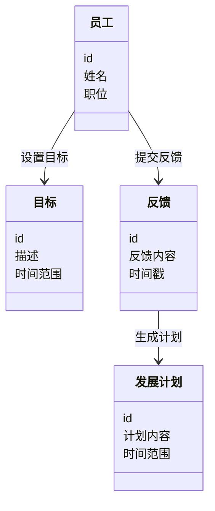
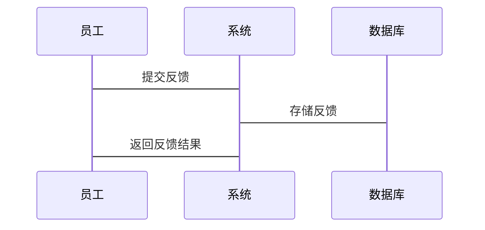

                 


# AI驱动的企业绩效管理：实时反馈与个性化发展计划

> 关键词：AI驱动，企业绩效管理，实时反馈，个性化发展，机器学习，深度学习，系统架构

> 摘要：  
> 在企业绩效管理中引入AI技术，实时反馈与个性化发展计划成为可能。本文通过分析AI在绩效管理中的应用，探讨实时反馈机制的实现、个性化发展计划的设计，以及系统架构的构建。结合实际案例，详细讲解算法原理和系统实现，为企业管理者和技术开发者提供理论与实践的双重指导。

---

# 目录

## 第一章：企业绩效管理的背景与AI引入

### 1.1 传统企业绩效管理的挑战
- 传统绩效管理的定义与核心要素
- 传统模式的局限性：数据滞后、反馈延迟、个性化不足
- 企业对实时反馈与个性化发展的现代需求

### 1.2 AI技术在企业绩效管理中的作用
- AI技术的基本概念与应用领域
- AI在绩效管理中的优势：数据处理能力、实时分析、个性化推荐
- AI驱动绩效管理的潜力与未来趋势

### 1.3 实时反馈与个性化发展计划的重要性
- 实时反馈的定义与价值：快速响应、提升效率、增强员工满意度
- 个性化发展计划的意义：精准匹配员工需求、提升职业发展
- AI如何实现实时反馈与个性化发展的结合

---

## 第二章：AI驱动绩效管理的核心概念

### 2.1 绩效管理的定义与核心要素
- 绩效管理的系统架构
- 核心要素分析：目标设定、数据采集、分析与反馈
- 绩效管理的边界与外延

### 2.2 AI驱动绩效管理的原理
- 数据采集与预处理：结构化与非结构化数据的处理方法
- 智能分析与决策：机器学习与深度学习的应用场景
- 反馈与优化机制：闭环系统的构建

### 2.3 实时反馈与个性化发展的实现路径
- 数据驱动的实时反馈：基于机器学习的反馈模型
- 个性化发展计划的设计：用户行为分析与推荐算法
- AI算法在个性化发展中的应用：协同过滤与深度学习的对比

---

## 第三章：AI驱动绩效管理的算法原理

### 3.1 实时反馈机制的算法实现
- 反馈数据的采集与预处理：数据清洗与特征提取
- 基于机器学习的反馈模型：线性回归与逻辑回归的应用
- 实时反馈的输出与优化：动态调整与模型迭代

### 3.2 个性化发展计划的推荐算法
- 用户行为分析与建模：基于协同过滤的推荐系统
- 基于深度学习的推荐模型：神经网络与注意力机制的应用
- 推荐系统的实现步骤：数据准备、模型训练、结果输出

### 3.3 算法实现的数学模型
- 基于线性回归的反馈模型：
  $$ y = \beta_0 + \beta_1x + \epsilon $$
- 基于神经网络的推荐模型：
  $$ f(x) = \text{Activation}(\text{Linear}(\text{Input})) $$

---

## 第四章：系统分析与架构设计

### 4.1 问题场景介绍
- 绩效管理系统的功能需求：实时反馈、个性化推荐、数据可视化
- 系统设计的目标：高效性、准确性和可扩展性

### 4.2 系统功能设计
- 领域模型设计：员工、目标、反馈、发展计划的实体关系
- 使用 Mermaid 绘制领域模型图：



### 4.3 系统架构设计
- 分层架构设计：数据层、业务逻辑层、用户界面层
- 使用 Mermaid 绘制系统架构图：


### 4.4 系统接口设计
- API 接口定义：RESTful API 的设计与实现
- 接口交互流程：数据请求、处理、返回

### 4.5 系统交互设计
- 使用 Mermaid 绘制交互序列图：



---

## 第五章：项目实战

### 5.1 环境安装与配置
- 开发环境：Python、Jupyter Notebook
- 必需库的安装：numpy、pandas、scikit-learn、tensorflow

### 5.2 系统核心功能实现
- 反馈机制的代码实现：
  ```python
  def feedback_model(data):
      # 数据预处理
      X = data.drop('label', axis=1)
      y = data['label']
      # 模型训练
      from sklearn.linear_model import LinearRegression
      model = LinearRegression()
      model.fit(X, y)
      return model
  ```
- 个性化推荐系统的实现：
  ```python
  def recommendation_system(data):
      # 数据处理
      user_items = data.pivot('user', 'item', 'rating')
      # 协同过滤推荐
      from sklearn.metrics.pairwise import cosine_similarity
      similarities = cosine_similarity(user_items)
      return similarities
  ```

### 5.3 代码实现与解读
- 反馈模型的训练与评估
- 推荐系统的实现与优化
- 案例分析：某公司绩效管理系统的应用

### 5.4 项目总结与优化
- 项目实现的关键点总结
- 系统优化的建议：算法改进、系统性能提升
- 未来拓展方向：结合更多AI技术，如自然语言处理

---

## 第六章：总结与展望

### 6.1 最佳实践 Tips
- 数据质量的重要性
- 算法选择与优化的建议
- 系统设计中的注意事项

### 6.2 小结
- AI在企业绩效管理中的核心作用
- 实时反馈与个性化发展计划的价值
- 系统设计与实现的关键点

### 6.3 注意事项
- 数据隐私与安全的保护
- 系统稳定性的保障
- 用户体验的优化

### 6.4 拓展阅读
- 推荐书籍：《机器学习实战》、《深度学习》
- 推荐博客：技术博客、行业分析报告

---

通过本文的系统分析与实践，读者可以深入了解AI驱动的企业绩效管理的实现过程，掌握实时反馈与个性化发展计划的核心技术，并能够将这些知识应用到实际的企业管理中。

