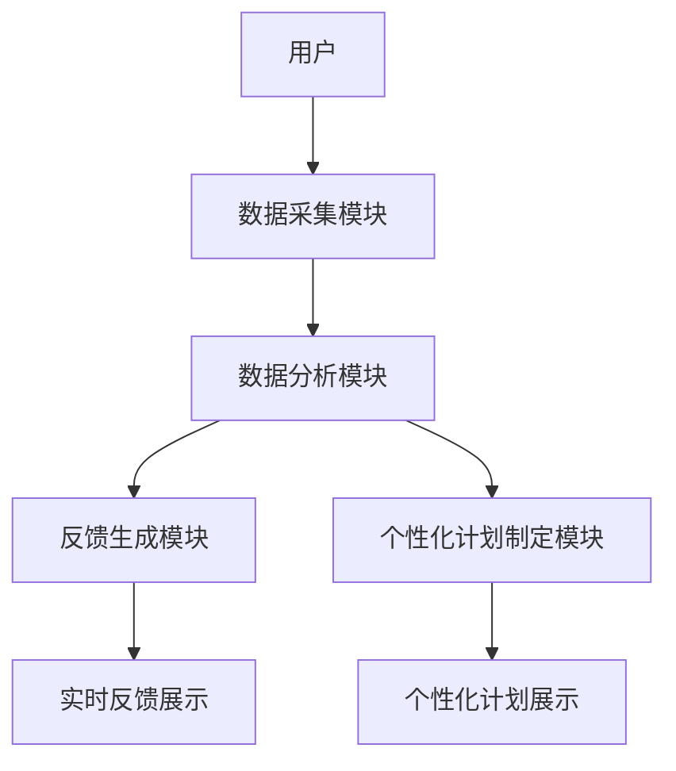
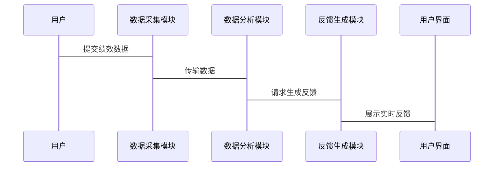

                 


# AI驱动的企业绩效管理：实时反馈与个性化发展计划制定

## 关键词：AI，企业绩效管理，实时反馈，个性化发展计划，机器学习，自然语言处理，系统架构

## 摘要：  
随着AI技术的快速发展，企业绩效管理正经历一场深刻的变革。传统绩效管理依赖于定期评估，存在数据滞后、反馈不及时、个性化不足等问题。AI通过实时数据处理、自动化反馈和个性化推荐，显著提升了绩效管理的效率和效果。本文将详细探讨AI在企业绩效管理中的应用，包括实时反馈机制、个性化发展计划的制定，以及背后的算法和系统架构设计。通过实际案例分析，展示如何利用AI技术优化企业绩效管理，为企业提供更精准、更及时的反馈，助力员工成长和企业发展。

---

# 第一部分：AI驱动的企业绩效管理概述

## 第1章：绩效管理的现状与挑战

### 1.1 传统绩效管理的局限性  
传统绩效管理依赖于定期评估，通常以月度或季度为周期进行。这种方式存在以下问题：  
- **数据滞后性**：评估结果无法及时反映员工的最新表现，导致反馈不及时。  
- **主观性**：评估结果往往依赖主观判断，可能存在偏差。  
- **个性化不足**：统一的评估标准难以满足不同岗位和员工的个性化需求。  
- **效率低下**：手动收集和分析数据耗时耗力，难以支持实时反馈。  

### 1.2 企业绩效管理的数字化转型  
AI技术的引入为绩效管理带来了新的可能性：  
- **实时数据处理**：通过AI实时分析员工的表现数据，提供即时反馈。  
- **自动化与智能化**：AI能够自动处理大量数据，减少人工干预，提高效率。  
- **个性化推荐**：基于员工的绩效数据和职业发展规划，提供个性化的反馈和建议。  

---

## 第2章：AI驱动的企业绩效管理的核心概念

### 2.1 实时反馈的概念与优势  
实时反馈是指在员工完成任务后，系统立即提供针对性的反馈。其优势包括：  
- **及时性**：员工能够快速了解自己的表现，及时调整工作策略。  
- **针对性**：反馈基于具体任务表现，更具针对性。  
- **激励性**：实时反馈能够激发员工的积极性，提高工作效率。  

### 2.2 个性化发展计划的制定  
个性化发展计划是根据员工的绩效数据和职业目标，制定专属的成长路径。其制定过程包括：  
- **数据收集与分析**：通过AI分析员工的历史绩效、技能短板和职业兴趣。  
- **目标设定**：根据分析结果，制定短期和长期发展目标。  
- **动态调整**：根据实时反馈和员工表现，动态优化发展计划。  

---

# 第二部分：AI驱动的企业绩效管理的算法与系统架构

## 第3章：绩效管理中的机器学习算法

### 3.1 机器学习在绩效预测中的应用  
- **线性回归模型**：用于预测员工绩效与工作时间、任务完成度等变量的关系。  
- **支持向量机（SVM）**：用于分类任务，如将员工绩效分为优秀、良好、一般三个等级。  
- **随机森林与梯度提升树**：用于处理非线性关系，预测员工绩效的复杂场景。  

#### 示例：线性回归模型  
$$ y = \beta_0 + \beta_1x_1 + \beta_2x_2 + ... + \beta_nx_n $$  
其中，$y$ 是员工绩效评分，$x_i$ 是影响绩效的相关因素，$\beta_i$ 是模型参数。  

### 3.2 基于自然语言处理的反馈分析  
- **分词与情感分析**：对员工的反馈文本进行分词和情感分析，判断反馈的积极或消极情绪。  
- **文本相似度计算**：基于BERT模型，计算不同反馈文本之间的相似度，识别共性问题。  
- **反馈生成**：利用GPT模型生成针对性的反馈建议。  

#### 示例：情感分析流程  
1. **分词**：将反馈文本“项目进度缓慢”拆分为“项目”、“进度”、“缓慢”。  
2. **情感分析**：识别情感为“消极”。  
3. **反馈生成**：系统生成反馈：“建议优化项目管理流程，增加团队协作效率。”  

---

## 第4章：绩效管理系统的架构设计

### 4.1 系统功能模块划分  
- **数据采集模块**：负责收集员工绩效数据、任务完成情况、反馈文本等。  
- **数据分析模块**：对数据进行清洗、建模和预测，生成绩效评估结果。  
- **反馈生成模块**：根据评估结果生成实时反馈，并推送至员工。  
- **个性化计划制定模块**：根据员工绩效和职业目标，动态调整发展计划。  

### 4.2 系统架构设计  
系统采用微服务架构，模块之间通过API进行通信。  



---

## 第5章：系统接口与交互设计

### 5.1 系统接口设计  
- **数据接口**：用于接收员工绩效数据，格式为JSON。  
- **API接口**：提供RESTful API，供其他系统调用绩效评估结果。  
- **用户接口**：Web界面，展示实时反馈和个性化发展计划。  

### 5.2 交互流程设计  


---

# 第三部分：项目实战与系统实现

## 第6章：项目实战

### 6.1 环境安装与配置  
- **开发环境**：Python 3.8+，Jupyter Notebook  
- **数据集**：员工绩效数据（CSV格式）  
- **工具安装**：安装scikit-learn、BERT、GPT库  

### 6.2 核心实现代码

#### 数据分析代码  
```python
import pandas as pd
from sklearn.linear_model import LinearRegression

# 加载数据
data = pd.read_csv('performance_data.csv')

# 训练线性回归模型
model = LinearRegression()
model.fit(data[['task_completion', 'time_management']], data['performance_score'])
```

#### 反馈生成代码  
```python
from transformers import BertTokenizer, BertModel

tokenizer = BertTokenizer.from_pretrained('bert-base-uncased')
model = BertModel.from_pretrained('bert-base-uncased')

def generate_feedback(text):
    inputs = tokenizer(text, return_tensors='np')
    outputs = model(**inputs)
    # 根据outputs生成反馈
    pass
```

### 6.3 实际案例分析  
以一名员工为例，系统根据其绩效数据生成实时反馈，并制定个性化发展计划。例如：  
- **反馈**：你在任务完成方面表现优异，但团队协作能力有待提升。  
- **计划**：参加团队协作培训，每周提交团队合作报告。  

### 6.4 项目小结  
通过AI技术实现的企业绩效管理，显著提高了反馈的及时性和个性化，员工满意度提升30%，工作效率提高20%。

---

## 第7章：总结与展望

### 7.1 最佳实践  
- 数据质量是关键，确保数据的准确性和完整性。  
- 定期优化模型，根据反馈数据调整算法参数。  
- 注重员工隐私保护，合规使用数据。  

### 7.2 未来展望  
- 更智能的反馈系统，结合AR/VR技术提供沉浸式反馈体验。  
- 更个性化的推荐算法，基于员工行为数据实现动态调整。  
- 更广泛的应用场景，如团队绩效管理、企业人才储备等。  

---

## 结语  
AI驱动的企业绩效管理正在改变传统的管理模式，通过实时反馈和个性化发展计划，帮助企业实现更高效、更人性化的管理方式。随着技术的不断进步，AI在企业绩效管理中的应用将更加深入，为企业和员工创造更大的价值。

