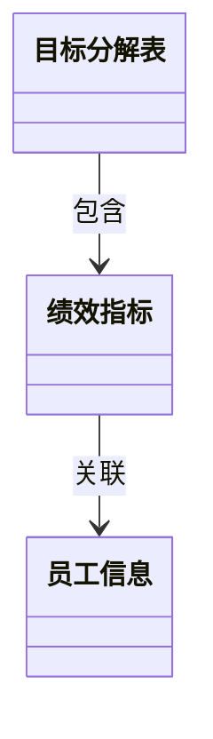

                 


# AI驱动的企业绩效管理：目标设定与实时跟踪

## 关键词：
AI驱动，企业绩效管理，目标设定，实时跟踪，机器学习，KPI分析，系统架构设计

## 摘要：
本文探讨了如何利用人工智能技术优化企业绩效管理流程，重点分析了目标设定与实时跟踪的关键环节。通过机器学习算法和实时数据分析技术，提升绩效管理的智能化水平，帮助企业实现数据驱动的决策。文章详细阐述了AI在绩效管理中的应用，从背景介绍到系统架构设计，再到项目实战，提供了全面的解决方案和实践指导。

---

# 第1章 AI驱动的企业绩效管理背景与核心概念

## 1.1 企业绩效管理的演变

### 1.1.1 传统绩效管理的局限性
传统绩效管理依赖人工设定目标和评估结果，存在目标设定主观性高、数据支持不足、实时性差等问题。

### 1.1.2 数字化转型的必要性
随着企业数字化转型的推进，数据驱动的决策方式成为主流，传统绩效管理已无法满足现代企业的复杂需求。

### 1.1.3 AI驱动的管理革新
人工智能技术的引入，为绩效管理带来了智能化、自动化的新思路，能够更精准地设定目标和实时跟踪绩效。

## 1.2 AI在企业绩效管理中的应用前景

### 1.2.1 AI技术的核心优势
- 数据分析能力：利用机器学习算法处理大量数据，提取关键信息。
- 智能化决策：通过预测模型优化目标设定和绩效评估。
- 实时反馈：AI能够快速响应数据变化，提供实时反馈。

### 1.2.2 企业绩效管理的痛点分析
- 目标设定缺乏数据支持。
- 绩效跟踪依赖人工记录，效率低。
- 反馈机制不及时，影响员工积极性。

### 1.2.3 AI驱动的解决方案
通过AI技术实现数据驱动的目标设定、实时跟踪和动态反馈，提升绩效管理的效率和准确性。

## 1.3 本书的目标与结构

### 1.3.1 本书的核心目标
- 探讨AI技术在企业绩效管理中的应用。
- 提供目标设定与实时跟踪的系统化解决方案。
- 通过实际案例展示AI驱动绩效管理的实践效果。

### 1.3.2 目录结构概览
- 第1章：背景与核心概念。
- 第2章：AI驱动的目标设定。
- 第3章：实时跟踪的技术实现。
- 第4章：AI算法与模型。
- 第5章：系统架构设计。
- 第6章：项目实战。
- 第7章：最佳实践与总结。

### 1.3.3 读者对象与预期收获
- 读者对象：企业管理者、人力资源部门、IT技术人员。
- 预期收获：了解AI在绩效管理中的应用，掌握目标设定与实时跟踪的方法，提升企业绩效管理水平。

---

# 第2章 AI驱动的目标设定

## 2.1 数据驱动的目标设定方法

### 2.1.1 数据分析驱动的目标设定
- 基于历史数据和业务目标，利用机器学习算法预测绩效目标。
- 示例：某企业通过分析过去三年的销售数据，预测出今年的销售目标。

### 2.1.2 AI算法在目标优化中的应用
- 使用线性回归模型预测目标值。
- 示例：使用Python代码实现线性回归模型，预测销售目标。

## 2.2 目标分解与责任分配

### 2.2.1 目标分解的逻辑
- 将企业级目标分解为部门目标，再分解为个人目标。
- 示例：将季度销售目标分解为月度目标，再分配给销售团队。

### 2.2.2 责任分配的系统设计
- 使用ER图展示目标分解的实体关系。
- 示例：目标分解表展示企业目标、部门目标和个人目标的关系。

---

# 第3章 实时跟踪的技术实现

## 3.1 数据采集与处理技术

### 3.1.1 数据采集方式
- 数据库接口：实时获取系统数据。
- API调用：通过API接口获取实时数据。

### 3.1.2 数据清洗与预处理
- 使用Python代码进行数据清洗，处理缺失值和异常值。

## 3.2 实时数据分析方法

### 3.2.1 监控指标的实时更新
- 使用时间序列分析预测当前绩效指标。
- 示例：使用ARIMA模型预测销售增长率。

### 3.2.2 绩效指标的动态调整
- 根据实时数据动态调整目标值。
- 示例：根据实时销售数据调整月度目标。

## 3.3 绩效反馈与优化策略

### 3.3.1 反馈机制的设计
- 定期生成绩效报告，反馈给相关人员。
- 示例：每周生成绩效报告，指出偏差和改进方向。

### 3.3.2 绩效数据分析与优化
- 使用机器学习模型优化绩效目标。
- 示例：使用随机森林模型分析影响绩效的关键因素。

---

# 第4章 AI驱动的绩效管理算法与模型

## 4.1 绩效预测的机器学习模型

### 4.1.1 监督学习在绩效预测中的应用
- 使用监督学习算法（如线性回归、支持向量机）预测绩效结果。
- 示例：使用Python代码实现线性回归模型，预测员工绩效评分。

### 4.1.2 无监督学习在绩效分析中的应用
- 使用聚类分析识别绩效表现相似的员工群体。
- 示例：使用K-means算法将员工分为高、中、低绩效三类。

## 4.2 绩效评估的优化算法

### 4.2.1 线性回归模型在绩效预测中的应用
- 使用线性回归模型预测绩效结果。
- 示例：公式：$$ y = \beta_0 + \beta_1x_1 + \beta_2x_2 + \ldots + \beta_nx_n $$，其中y是预测绩效，x_i是影响绩效的因素。

### 4.2.2 支持向量机在绩效分类中的应用
- 使用支持向量机（SVM）对绩效结果进行分类。
- 示例：将员工绩效分为优秀、良好、一般三个类别。

---

# 第5章 系统分析与架构设计

## 5.1 问题场景介绍

### 5.1.1 系统目标
- 实现AI驱动的目标设定与实时跟踪。
- 提供实时数据监控和绩效报告功能。

### 5.1.2 项目介绍
- 开发一个AI驱动的绩效管理系统，支持企业目标设定、实时跟踪和动态反馈。

## 5.2 系统功能设计

### 5.2.1 领域模型类图
- 使用Mermaid绘制领域模型类图，展示目标分解、绩效指标、员工信息等实体关系。



### 5.2.2 系统架构图
- 使用Mermaid绘制系统架构图，展示前端、后端、数据库和AI算法模块的交互。


---

# 第6章 项目实战

## 6.1 环境安装

### 6.1.1 安装Python
- 安装Python 3.8以上版本。

### 6.1.2 安装依赖库
- 使用pip安装numpy、pandas、scikit-learn等依赖库。

## 6.2 核心代码实现

### 6.2.1 数据预处理代码
```python
import pandas as pd
import numpy as np

# 读取数据
data = pd.read_csv('performance_data.csv')

# 处理缺失值
data = data.dropna()

# 标准化数据
from sklearn.preprocessing import StandardScaler
scaler = StandardScaler()
scaled_data = scaler.fit_transform(data)
```

### 6.2.2 绩效预测代码
```python
from sklearn.linear_model import LinearRegression

# 训练模型
model = LinearRegression()
model.fit(scaled_data[:, :-1], scaled_data[:, -1])

# 预测结果
predicted = model.predict(scaled_data[:, :-1])
```

## 6.3 实际案例分析

### 6.3.1 案例背景
- 某企业希望利用AI技术优化销售团队的绩效管理。

### 6.3.2 数据分析
- 使用线性回归模型预测销售人员的绩效评分。

## 6.4 项目小结

### 6.4.1 项目总结
- 成功实现了AI驱动的目标设定与实时跟踪。
- 提高了绩效管理的效率和准确性。

### 6.4.2 经验总结
- 数据质量是模型准确性的关键。
- 模型选择需要根据实际场景进行调整。

---

# 第7章 最佳实践与总结

## 7.1 小结

### 7.1.1 核心知识点回顾
- AI技术在绩效管理中的应用。
- 目标设定与实时跟踪的实现方法。

## 7.2 注意事项

### 7.2.1 数据隐私保护
- 在处理员工数据时，需要注意隐私保护。

### 7.2.2 模型的可解释性
- 在选择模型时，需要考虑模型的可解释性。

## 7.3 拓展阅读

### 7.3.1 推荐书籍
- 《机器学习实战》
- 《企业绩效管理：方法与实践》

### 7.3.2 推荐工具
- Python数据处理工具：Pandas、NumPy。
- 机器学习库：Scikit-learn。

---

# 结语

AI驱动的企业绩效管理正在改变传统管理方式，通过智能化的目标设定与实时跟踪，帮助企业实现更高效的管理。未来，随着AI技术的不断发展，绩效管理将更加精准和动态化。

