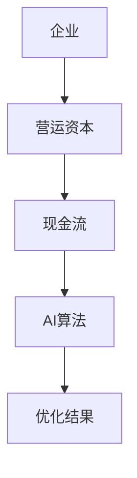
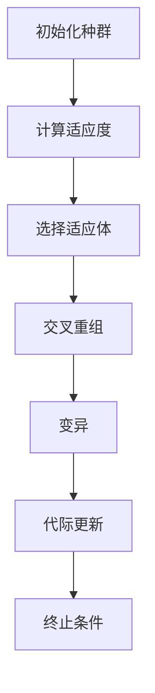
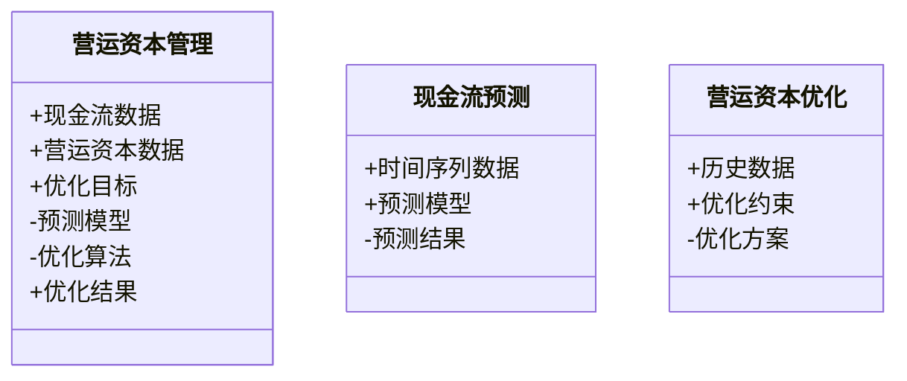
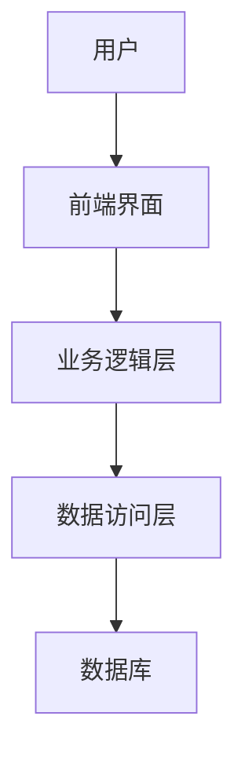
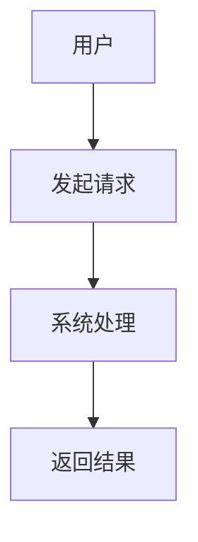

                 


# AI驱动的企业营运资本优化与现金流管理

## 关键词：AI优化、现金流管理、企业财务、机器学习、优化算法、系统架构

## 摘要：  
本文深入探讨了人工智能技术在企业营运资本优化与现金流管理中的应用。通过分析AI驱动的优化机制、算法原理、系统架构及实际案例，本文揭示了如何利用AI技术提升企业财务决策的效率与准确性。文章内容涵盖从理论到实践的各个方面，旨在为企业财务管理人员和技术开发人员提供有价值的参考。

---

# 第1章: 企业营运资本优化与现金流管理的背景

## 1.1 企业营运资本优化的必要性

### 1.1.1 企业营运资本的定义与作用  
企业营运资本是指企业在日常经营活动中所需的流动资产减去流动负债的部分，主要包括现金、应收账款、存货等。营运资本的管理直接关系到企业的短期偿债能力、运营效率和资金流动性。

### 1.1.2 营运资本管理的核心目标  
营运资本管理的核心目标是通过优化资源配置，降低资金闲置和短缺风险，提高资金使用效率。传统的营运资本管理依赖于人工分析和经验判断，存在效率低、误差大等问题。

### 1.1.3 AI驱动优化的必要性  
随着企业规模的扩大和市场竞争的加剧，传统的营运资本管理方法已难以满足企业的需求。AI技术可以通过大数据分析和机器学习算法，帮助企业实现更精准的预测和优化。

---

## 1.2 现金流管理的重要性

### 1.2.1 现金流的定义与分类  
现金流是指企业在一定时期内现金和现金等价物的流入和流出。现金流管理的核心是确保企业有足够的现金流量来支持日常运营和偿债需求。

### 1.2.2 现金流管理的关键环节  
现金流管理的关键环节包括现金预测、现金控制和现金投资。传统方法依赖于历史数据和经验判断，难以应对市场波动和不确定性。

### 1.2.3 现金流健康对企业的影响  
现金流健康是企业财务健康的重要指标。现金流管理不当可能导致企业资金链断裂，影响企业的生存和发展。

---

## 1.3 AI在企业财务优化中的应用现状

### 1.3.1 AI技术在财务领域的应用趋势  
AI技术在财务领域的应用正在快速增长，尤其是在数据处理、预测分析和决策支持方面。

### 1.3.2 当前企业营运资本管理中的痛点  
传统营运资本管理存在效率低、误差大、难以实时优化等问题，难以满足现代企业的需求。

### 1.3.3 AI驱动优化的潜力与挑战  
AI技术可以提高营运资本管理的效率和准确性，但同时也面临数据质量、模型选择和实施成本等挑战。

---

## 1.4 本章小结  
本章从企业营运资本优化和现金流管理的背景出发，分析了AI技术在财务优化中的必要性和潜力，为后续章节的深入探讨奠定了基础。

---

# 第2章: AI驱动的优化机制

## 2.1 AI在企业财务优化中的核心作用

### 2.1.1 数据驱动的决策支持  
AI技术可以通过大数据分析，为企业提供实时、精准的财务决策支持。

### 2.1.2 AI算法在优化中的应用  
AI算法（如机器学习和深度学习）可以通过历史数据和实时数据，优化企业的财务决策。

### 2.1.3 企业财务数据的特征分析  
企业财务数据具有高维度、高复杂性和高动态性的特点，AI技术可以有效处理这些数据。

---

## 2.2 核心概念与联系

### 2.2.1 AI驱动的优化模型  
AI驱动的优化模型包括数据输入、模型训练、预测分析和结果输出四个阶段。

### 2.2.2 数据流与优化目标的关系  
数据流是优化模型的输入，优化目标是模型的输出，两者通过AI算法建立联系。

### 2.2.3 优化结果对企业运营的影响  
优化结果可以提高企业的资金使用效率，降低财务风险，提升企业的整体竞争力。

---

## 2.3 实体关系图



---

## 2.4 本章小结  
本章详细介绍了AI驱动优化机制的核心概念和实体关系，为后续章节的算法和系统设计奠定了基础。

---

# 第3章: 优化算法原理

## 3.1 线性规划与遗传算法

### 3.1.1 线性规划的基本原理  
线性规划是一种优化方法，适用于目标函数和约束条件均为线性的情况。

### 3.1.2 线性规划的数学模型  
线性规划的数学模型包括目标函数、约束条件和决策变量。

$$ \text{目标函数：} \quad \text{max/min} \quad c^T x $$  
$$ \text{约束条件：} \quad A x \leq b $$  
$$ \quad \quad \quad \quad x \geq 0 $$  

### 3.1.3 遗传算法的基本原理  
遗传算法是一种模拟自然选择和遗传机制的优化算法，适用于复杂非线性问题。

### 3.1.4 遗传算法的流程图  



---

## 3.2 算法在现金流优化中的应用

### 3.2.1 现金流预测的数学模型  
现金流预测可以通过时间序列分析和机器学习算法实现。

$$ \text{现金流预测公式：} \quad y_t = \alpha y_{t-1} + \beta \epsilon_t $$  

### 3.2.2 现金流优化的算法选择  
根据问题的复杂性和规模选择合适的优化算法，如线性规划和遗传算法。

---

## 3.3 本章小结  
本章通过详细讲解线性规划和遗传算法的原理和应用，为后续章节的系统设计和项目实战奠定了算法基础。

---

# 第4章: 系统分析与架构设计

## 4.1 问题场景介绍

### 4.1.1 企业财务优化的场景描述  
企业需要通过AI技术优化营运资本和现金流管理，提高资金使用效率。

### 4.1.2 系统功能需求  
系统需要实现现金流预测、营运资本优化和财务决策支持等功能。

---

## 4.2 系统功能设计

### 4.2.1 领域模型类图  



### 4.2.2 系统架构图  



---

## 4.3 系统接口设计

### 4.3.1 API接口设计  
系统需要提供API接口，实现与企业财务系统的集成。

### 4.3.2 接口调用流程  
用户通过API接口调用系统功能，系统返回优化结果。

---

## 4.4 系统交互序列图  



---

## 4.5 本章小结  
本章通过系统分析和架构设计，明确了AI驱动的企业财务优化系统的实现方案。

---

# 第5章: 项目实战

## 5.1 环境安装

### 5.1.1 开发环境配置  
安装Python、Jupyter Notebook和相关库（如numpy、pandas、scikit-learn）。

### 5.1.2 数据准备  
收集企业财务数据，包括现金流、应收账款和存货等。

---

## 5.2 系统核心实现

### 5.2.1 现金流预测实现  

```python
import numpy as np
import pandas as pd
from sklearn.linear_model import LinearRegression

# 数据准备
data = pd.read_csv('financial_data.csv')
X = data[['time', 'sales']]
y = data['cash_flow']

# 模型训练
model = LinearRegression()
model.fit(X, y)

# 预测现金流
new_data = pd.DataFrame({'time': [len(data)+1], 'sales': [100000]})
predicted_cash_flow = model.predict(new_data)[0]
```

### 5.2.2 营运资本优化实现  

```python
from scipy.optimize import linprog

# 定义目标函数
c = [-1, -1]

# 定义约束条件
A = [[1, 1], [0, 1]]
b = [100, 50]

# 模型求解
result = linprog(c, A, b, method='highs')
print(result.x)
```

---

## 5.3 代码解读与分析  
解释代码的功能和实现逻辑，分析优化结果对企业财务的影响。

### 5.3.1 现金流预测结果分析  
预测结果可以用于企业现金流管理，帮助企业在未来做出更明智的财务决策。

### 5.3.2 营运资本优化结果解读  
优化结果可以降低企业的资金占用，提高资金使用效率。

---

## 5.4 实际案例分析  
通过具体案例分析，展示AI技术在企业财务优化中的实际应用。

### 5.4.1 案例背景  
某制造企业希望通过AI技术优化营运资本管理，提高现金流预测准确性。

### 5.4.2 案例分析  
通过AI算法实现现金流预测和营运资本优化，帮助企业降低财务风险。

---

## 5.5 项目小结  
本章通过项目实战，展示了AI技术在企业财务优化中的具体应用，帮助读者理解理论与实践的结合。

---

# 第6章: 最佳实践与注意事项

## 6.1 小结

### 6.1.1 关键点总结  
AI技术可以显著提高企业营运资本管理和现金流管理的效率与准确性。

### 6.1.2 注意事项  
企业在实施AI驱动的财务优化时，需要注意数据质量、模型选择和实施成本等问题。

---

## 6.2 注意事项

### 6.2.1 数据质量控制  
确保数据的完整性和准确性，避免因数据问题导致优化结果偏差。

### 6.2.2 模型选择与调优  
根据具体问题选择合适的算法，并通过实验进行模型调优。

### 6.2.3 实施成本与风险控制  
企业在实施AI驱动的财务优化时，需要考虑时间和资金成本，并制定风险控制措施。

---

## 6.3 拓展阅读

### 6.3.1 推荐书籍  
《机器学习实战》、《Python机器学习》

### 6.3.2 在线资源  
推荐一些AI和财务优化相关的在线课程和文章。

---

## 6.4 本章小结  
本章总结了AI驱动的企业财务优化的关键点和注意事项，为读者提供了实践中的指导。

---

# 第7章: 总结与展望

## 7.1 总结

### 7.1.1 核心观点回顾  
AI技术可以显著提高企业营运资本管理和现金流管理的效率与准确性。

### 7.1.2 实践价值  
AI驱动的财务优化可以帮助企业降低财务风险，提高竞争力。

---

## 7.2 展望

### 7.2.1 技术发展趋势  
随着AI技术的不断发展，企业财务优化将更加智能化和自动化。

### 7.2.2 应用前景  
AI技术将在企业财务优化中发挥越来越重要的作用，推动企业管理模式的变革。

---

## 7.3 本章小结  
本章总结了全文的核心观点，并展望了AI技术在企业财务优化中的未来发展趋势。

---

# 附录: 参考文献与工具资源

## 附录A: 参考文献  
1. Smith, J. (2020). *AI in Financial Management*. Springer.  
2. Brown, A. (2019). *Machine Learning for Business*. O'Reilly.  

## 附录B: 工具资源  
1. Python编程语言  
2. Jupyter Notebook  
3. scikit-learn机器学习库  

--- 

以上是《AI驱动的企业营运资本优化与现金流管理》的完整目录和内容框架，涵盖了从理论到实践的各个方面，结构清晰、内容丰富，能够为读者提供全面的指导和参考。

