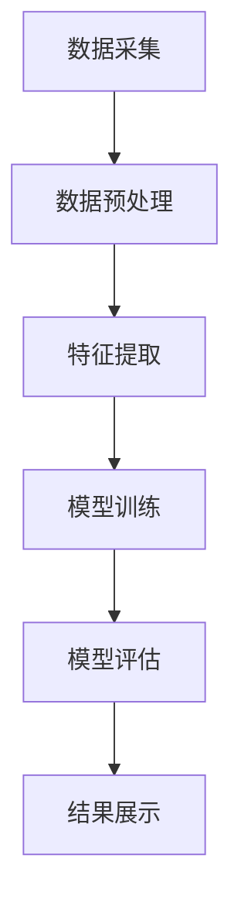
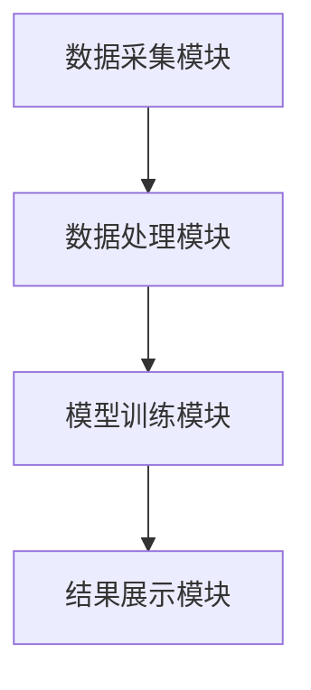
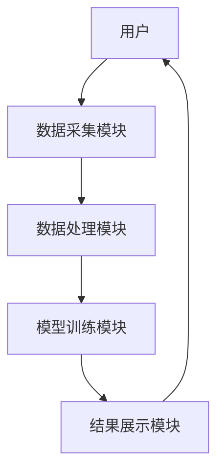

                 


# 第一部分：企业财务困境预测的背景与挑战

# 第1章：企业财务困境预测的背景与问题

## 1.1 企业财务困境的定义与特征
### 1.1.1 企业财务困境的定义
企业财务困境是指企业在经营过程中由于各种内外部因素的影响，导致其无法按时偿还债务、持续经营能力下降等情况。这种情况可能包括但不限于现金流枯竭、资产不足以偿还债务等。

### 1.1.2 财务困境的特征与表现
财务困境的表现形式多种多样，通常包括：
- **盈利能力下降**：净利润率、毛利率等指标持续下滑。
- **流动性风险增加**：流动资产不足以覆盖流动负债，导致短期偿债能力减弱。
- **负债比率上升**：资产负债率提高，企业债务负担加重。
- **信用评级下降**：由于财务状况恶化，企业信用评级被下调。
- **经营稳定性降低**：企业无法维持正常的业务运营，出现裁员、停产等情况。

### 1.1.3 财务困境对企业的影响
企业财务困境不仅影响企业的生存和发展，还可能引发连锁反应，如员工失业、供应商损失、债权人受损等，甚至可能导致企业破产。

## 1.2 传统财务困境预测方法的局限性
### 1.2.1 传统财务指标分析法
传统的财务指标分析法主要依赖于财务报表中的各项指标，如流动比率、速动比率、资产负债率等。这些指标虽然能够提供一定的信息，但具有以下局限性：
- **滞后性**：指标反映的是过去的财务状况，无法及时预警潜在风险。
- **单一性**：单一指标往往无法全面反映企业的财务健康状况。
- **主观性**：指标的设置和判断标准存在主观性，可能导致误判。

### 1.2.2 传统预测模型的不足
传统预测模型通常基于线性回归等简单方法，存在以下问题：
- **假设条件不满足**：线性回归模型假设变量间存在线性关系，而实际中财务困境的影响因素往往是非线性的。
- **模型泛化能力差**：传统模型难以捕捉复杂的数据模式，预测精度有限。
- **缺乏动态性**：无法有效处理时间序列数据，难以应对市场环境的快速变化。

### 1.2.3 传统方法的局限性总结
传统财务困境预测方法在实际应用中存在诸多不足，主要体现在以下几个方面：
- **数据维度有限**：传统方法通常只考虑财务数据，忽视了市场、行业等外部因素的影响。
- **预测精度不高**：由于模型的局限性，预测结果的准确性难以保证。
- **难以实时更新**：传统模型更新周期长，难以应对实时的财务变化。

## 1.3 AI技术在财务困境预测中的优势
### 1.3.1 AI技术的基本概念
人工智能（AI）是指计算机系统执行与人类智能相关的任务的能力，如学习、推理、问题解决等。AI技术包括机器学习、深度学习、自然语言处理等多种技术。

### 1.3.2 AI在财务分析中的独特优势
AI技术在财务分析中的优势主要体现在以下几个方面：
- **数据处理能力强大**：AI能够处理海量数据，提取复杂模式和关系。
- **预测精度高**：通过机器学习算法，AI能够构建高精度的预测模型。
- **实时性好**：AI系统可以实时处理数据，及时更新模型，提供实时预测。

### 1.3.3 AI驱动预测的潜力与前景
随着AI技术的不断发展，其在财务困境预测中的潜力巨大。通过结合企业内外部数据，AI能够构建更全面、更精准的预测模型，帮助企业在财务困境发生前采取预防措施。

## 1.4 本章小结
### 1.4.1 企业财务困境预测的重要性
财务困境预测是企业风险管理的重要组成部分，能够帮助企业及时发现潜在问题，采取有效措施，避免财务危机。

### 1.4.2 AI技术的应用价值
AI技术凭借其强大的数据处理和分析能力，为财务困境预测提供了新的解决方案，能够显著提高预测的准确性和实时性。

### 1.4.3 本书的研究目标
本书旨在探讨如何利用AI技术构建企业财务困境预测系统，通过理论分析和实践案例，为企业提供有效的风险管理工具。

---

# 第二部分：AI驱动财务困境预测的核心概念与模型

# 第2章：AI驱动财务困境预测的核心概念

## 2.1 数据特征与处理
### 2.1.1 财务数据的特征提取
财务数据是构建预测模型的基础，通常包括收入、支出、资产、负债等指标。为了提高模型的预测能力，需要对这些数据进行特征提取和处理。

#### 数据预处理步骤
1. **数据清洗**：去除无效数据、填充缺失值、处理异常值。
2. **特征选择**：通过统计分析或机器学习方法，选择对预测影响较大的特征。
3. **数据标准化**：对不同量纲的特征进行标准化处理，确保模型训练的稳定性。

### 2.1.2 数据清洗与预处理
#### 数据清洗案例
假设我们有以下财务数据，其中部分数据存在缺失或异常值：
```
公司A: 收入=1000, 利润=50, 资产=500, 负债=300
公司B: 收入=NaN, 利润=NaN, 资产=400, 负债=200
公司C: 收入=2000, 利润=-100, 资产=600, 负债=400
```
通过数据清洗，我们可以填补缺失值或剔除异常数据，确保数据质量。

### 2.1.3 数据标准化与归一化
标准化和归一化是常见的数据预处理方法，能够消除不同特征之间的量纲影响，提高模型训练效果。

#### 标准化公式
$$
Z = \frac{X - \mu}{\sigma}
$$
其中，$\mu$ 是均值，$\sigma$ 是标准差。

#### 归一化公式
$$
X_{\text{norm}} = \frac{X - \min(X)}{\max(X) - \min(X)}
$$

## 2.2 模型选择与评估
### 2.2.1 分类模型的选择
在构建财务困境预测模型时，可以选择以下几种分类算法：
- **逻辑回归**：适用于二分类问题，模型解释性强。
- **支持向量机（SVM）**：适用于小样本数据，分类性能好。
- **随机森林**：适用于特征较多的情况，模型鲁棒性强。

### 2.2.2 模型评估指标
模型的性能可以通过以下指标进行评估：
- **准确率（Accuracy）**：正确预测的比例。
- **召回率（Recall）**：实际为正样本中被正确预测的比例。
- **F1分数（F1 Score）**：综合准确率和召回率的指标。
- **AUC-ROC曲线**：评估模型的区分能力。

### 2.2.3 模型调优与优化
通过交叉验证和网格搜索等方法，可以优化模型的超参数，提高预测性能。

## 2.3 算法原理与流程
### 2.3.1 机器学习算法简介
机器学习算法分为监督学习、无监督学习和半监督学习三大类。财务困境预测属于监督学习问题，通常采用分类算法。

### 2.3.2 算法流程图
以下是构建AI驱动财务困境预测系统的流程图：


### 2.3.3 算法实现步骤
1. **数据采集**：获取企业的财务数据，包括收入、利润、资产、负债等。
2. **数据预处理**：清洗数据，处理缺失值和异常值。
3. **特征选择**：提取对预测有影响的关键特征。
4. **模型训练**：选择合适的算法，训练预测模型。
5. **模型评估**：通过测试数据评估模型性能，调整参数优化模型。
6. **结果展示**：将预测结果可视化，帮助企业做出决策。

---

# 第三部分：AI驱动财务困境预测的算法原理

# 第3章：算法原理与实现

## 3.1 逻辑回归算法
### 3.1.1 逻辑回归的基本原理
逻辑回归是一种常用的二分类算法，通过构建对数似然函数，利用最大似然估计法求解模型参数。

#### 逻辑回归模型
$$
P(y=1|x) = \frac{e^{\beta_0 + \beta_1 x}}{1 + e^{\beta_0 + \beta_1 x}}
$$

### 3.1.2 逻辑回归的数学模型
逻辑回归的目标函数是最大化对数似然函数：
$$
\log L = \sum_{i=1}^{n} y_i \log p_i + (1 - y_i) \log (1 - p_i)
$$
其中，$p_i$ 是第i个样本的预测概率。

### 3.1.3 逻辑回归的实现步骤
1. **数据准备**：收集和整理数据，确保数据格式正确。
2. **模型训练**：使用训练数据，训练逻辑回归模型。
3. **模型预测**：对测试数据进行预测，输出预测结果。
4. **模型评估**：计算准确率、召回率等指标，评估模型性能。

#### 逻辑回归代码示例
```python
from sklearn.linear_model import LogisticRegression
from sklearn.metrics import accuracy_score

# 数据准备
X = df[['收入', '利润', '资产', '负债']]
y = df['财务困境标签']

# 模型训练
model = LogisticRegression()
model.fit(X, y)

# 模型预测
y_pred = model.predict(X)

# 模型评估
print('准确率:', accuracy_score(y, y_pred))
```

## 3.2 支持向量机算法
### 3.2.1 支持向量机的基本原理
支持向量机是一种基于统计学习理论的分类算法，通过构建超平面，将数据点分到不同的类别中。

#### 支持向量机模型
$$
y = \text{sign}(\sum_{i=1}^{n} \alpha_i y_i x_i \cdot x + b)
$$
其中，$\alpha_i$ 是拉格朗日乘子，$y_i$ 是样本标签，$x_i$ 是支持向量。

### 3.2.2 支持向量机的数学模型
支持向量机的目标函数是最大化几何间隔：
$$
\frac{1}{2} ||w||^2
$$
受约束于：
$$
y_i (w \cdot x_i + b) \geq 1
$$

### 3.2.3 支持向量机的实现步骤
1. **数据准备**：收集和整理数据，确保数据格式正确。
2. **模型训练**：使用训练数据，训练支持向量机模型。
3. **模型预测**：对测试数据进行预测，输出预测结果。
4. **模型评估**：计算准确率、召回率等指标，评估模型性能。

#### 支持向量机代码示例
```python
from sklearn.svm import SVC
from sklearn.metrics import accuracy_score

# 数据准备
X = df[['收入', '利润', '资产', '负债']]
y = df['财务困境标签']

# 模型训练
model = SVC()
model.fit(X, y)

# 模型预测
y_pred = model.predict(X)

# 模型评估
print('准确率:', accuracy_score(y, y_pred))
```

## 3.3 随机森林算法
### 3.3.1 随机森林的基本原理
随机森林是一种基于决策树的集成学习算法，通过构建多棵决策树，取其预测结果的平均值，提高模型的准确性和鲁棒性。

#### 随机森林模型
$$
y = \text{mode}(\{h_i(x)\}_{i=1}^{n})
$$
其中，$h_i$ 是第i棵决策树的预测函数。

### 3.3.2 随机森林的数学模型
随机森林通过袋装技术和特征子集选择，降低模型的方差，提高模型的泛化能力。

### 3.3.3 随机森林的实现步骤
1. **数据准备**：收集和整理数据，确保数据格式正确。
2. **模型训练**：使用训练数据，训练随机森林模型。
3. **模型预测**：对测试数据进行预测，输出预测结果。
4. **模型评估**：计算准确率、召回率等指标，评估模型性能。

#### 随机森林代码示例
```python
from sklearn.ensemble import RandomForestClassifier
from sklearn.metrics import accuracy_score

# 数据准备
X = df[['收入', '利润', '资产', '负债']]
y = df['财务困境标签']

# 模型训练
model = RandomForestClassifier()
model.fit(X, y)

# 模型预测
y_pred = model.predict(X)

# 模型评估
print('准确率:', accuracy_score(y, y_pred))
```

## 3.4 算法对比与优化
### 3.4.1 不同算法的对比分析
通过对比逻辑回归、支持向量机和随机森林的性能，选择最适合企业财务困境预测的算法。

### 3.4.2 算法优化策略
通过交叉验证和网格搜索等方法，优化模型的超参数，提高模型的预测性能。

### 3.4.3 算法调优的实现
在模型训练过程中，通过调整学习率、树深度等参数，优化模型的性能。

---

# 第四部分：系统架构与设计

# 第4章：系统架构设计

## 4.1 系统功能模块划分
### 4.1.1 数据采集模块
负责从企业财务系统中获取财务数据，包括收入、利润、资产、负债等。

### 4.1.2 数据处理模块
对采集到的数据进行清洗、预处理和特征提取，确保数据质量。

### 4.1.3 模型训练模块
利用机器学习算法，构建企业财务困境预测模型，并对模型进行调优和优化。

### 4.1.4 结果展示模块
将模型的预测结果可视化，帮助企业用户理解和应用预测结果。

## 4.2 系统架构设计图
以下是系统的架构设计图：


## 4.3 系统接口设计
### 4.3.1 数据接口
定义数据输入和输出接口，确保数据能够顺利采集和处理。

### 4.3.2 模型接口
定义模型训练和预测接口，方便模型的调用和集成。

### 4.3.3 用户接口
定义用户交互界面，确保用户能够方便地使用系统功能。

## 4.4 系统交互流程
以下是系统的交互流程图：


---

# 第五部分：项目实战

# 第5章：项目实战

## 5.1 环境安装与配置
### 5.1.1 安装Python环境
建议使用Anaconda等Python发行版，方便包管理。

### 5.1.2 安装必要库
安装机器学习相关的库，如scikit-learn、pandas、numpy等。

```bash
pip install scikit-learn pandas numpy
```

## 5.2 系统核心实现源代码
### 5.2.1 数据预处理代码
```python
import pandas as pd
import numpy as np

# 数据加载
df = pd.read_csv('企业财务数据.csv')

# 数据清洗
df = df.dropna()
df = df.replace([np.inf, -np.inf, np.nan], np.nan).dropna()

# 特征选择
selected_features = ['收入', '利润', '资产', '负债']
X = df[selected_features]
y = df['财务困境标签']
```

### 5.2.2 模型训练代码
```python
from sklearn.ensemble import RandomForestClassifier
from sklearn.model_selection import train_test_split
from sklearn.metrics import accuracy_score

# 数据分割
X_train, X_test, y_train, y_test = train_test_split(X, y, test_size=0.2, random_state=42)

# 模型训练
model = RandomForestClassifier()
model.fit(X_train, y_train)

# 模型预测
y_pred = model.predict(X_test)

# 模型评估
print('准确率:', accuracy_score(y_test, y_pred))
```

## 5.3 案例分析与结果解读
### 5.3.1 数据分析
通过分析企业的财务数据，提取关键特征，构建预测模型。

### 5.3.2 模型预测
利用训练好的模型，对测试数据进行预测，输出企业的财务困境概率。

### 5.3.3 结果解读
根据预测结果，帮助企业识别潜在的财务风险，制定相应的风险管理策略。

## 5.4 项目小结
### 5.4.1 项目实现总结
总结项目的实现过程，强调AI技术在企业财务困境预测中的应用价值。

### 5.4.2 实际案例分析
通过具体案例，展示AI驱动预测系统在实际中的应用效果。

### 5.4.3 项目经验与教训
总结项目中的经验教训，为后续类似项目提供参考。

---

# 第六部分：最佳实践与小结

# 第6章：最佳实践与小结

## 6.1 最佳实践
### 6.1.1 数据质量的重要性
确保数据的准确性和完整性，是构建高精度预测模型的基础。

### 6.1.2 模型选择与调优
根据实际需求选择合适的算法，并通过交叉验证和网格搜索等方法优化模型性能。

### 6.1.3 系统架构设计
合理设计系统架构，确保系统的可扩展性和可维护性。

## 6.2 小结
### 6.2.1 全书内容总结
总结全书的主要内容，强调AI技术在企业财务困境预测中的应用价值。

### 6.2.2 注意事项
提醒读者在实际应用中需要注意的问题，如数据隐私、模型解释性等。

### 6.2.3 未来展望
展望AI技术在财务困境预测中的未来发展方向，如结合区块链、大数据分析等技术，提升预测的准确性和实时性。

---

通过以上目录结构和内容安排，可以系统地介绍AI驱动的企业财务困境预测系统的构建过程，从理论到实践，为读者提供全面的技术指导。

