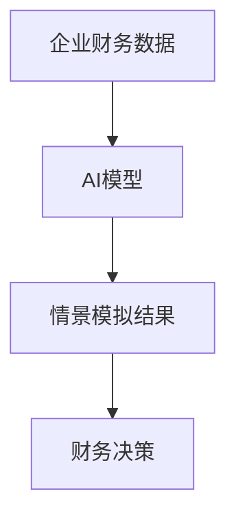
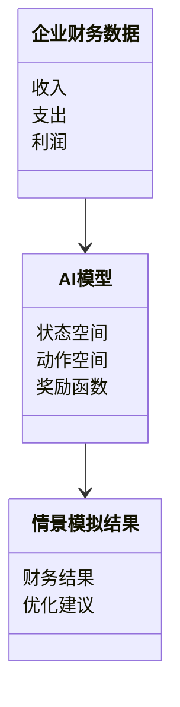
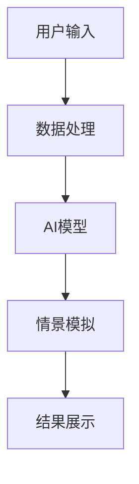
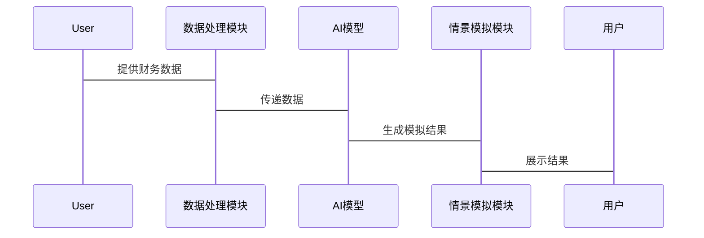

                 


# AI驱动的企业财务战略情景模拟系统

## 关键词：
AI, 财务战略, 情景模拟, 企业财务管理, 人工智能系统

## 摘要：
本文深入探讨了AI技术在企业财务战略中的应用，特别是情景模拟系统的设计与实现。通过分析传统财务战略的局限性，提出了一种基于强化学习的AI驱动情景模拟系统，能够有效优化企业的财务决策能力。文章详细介绍了系统的算法原理、系统架构、项目实战以及最佳实践，为企业的财务管理创新提供了理论和实践指导。

---

# 第1章: 问题背景与核心概念

## 1.1 问题背景

### 1.1.1 传统企业财务战略的局限性
传统的企业财务战略在实践中面临着诸多挑战，例如：
- 数据处理能力有限：难以快速处理海量数据，导致决策效率低下。
- 模型静态化：传统财务模型往往静态化，难以应对动态变化的市场环境。
- 人为误差：依赖人工分析和判断，容易受到主观因素的影响。

### 1.1.2 AI技术对企业财务管理的变革
AI技术的引入为企业的财务管理带来了革命性的变化，具体体现在：
- 数据处理能力提升：AI能够快速处理和分析大量财务数据，提高决策效率。
- 动态优化：通过实时数据分析和模型优化，AI能够帮助企业在动态环境中做出最优决策。
- 减少人为误差：AI系统能够减少人为判断的主观性，提高决策的客观性和准确性。

### 1.1.3 情景模拟在财务决策中的重要性
情景模拟是一种通过构建不同假设场景，评估各种可能结果的方法。在财务战略中，情景模拟可以帮助企业：
- 评估不同战略方案的可行性。
- 预测市场变化对企业财务状况的影响。
- 优化资源配置，提高企业的抗风险能力。

## 1.2 核心概念与定义

### 1.2.1 AI驱动的定义与特征
AI驱动的财务战略情景模拟系统通过人工智能技术，实现对企业财务数据的智能分析和情景模拟。其主要特征包括：
- **数据驱动**：系统依赖大量财务数据进行分析和建模。
- **自动化**：AI算法能够自动处理数据、生成模拟结果。
- **动态优化**：系统能够根据实时数据动态调整模拟情景。

### 1.2.2 企业财务战略的内涵
企业财务战略是指企业在一定时期内，为了实现财务目标而制定的长远规划和策略。其核心内容包括：
- 资金管理：包括融资、投资和分配。
- 风险管理：识别和评估财务风险，制定相应的应对策略。
- 绩效管理：通过财务指标评估企业绩效，优化资源配置。

### 1.2.3 情景模拟系统的功能与作用
情景模拟系统是通过构建多个假设情景，模拟企业在不同环境下的财务表现。其主要功能包括：
- **情景构建**：根据企业目标和市场环境，构建多个财务情景。
- **数据分析**：利用AI算法对不同情景下的财务数据进行分析。
- **结果评估**：评估不同情景下的财务表现，为企业决策提供支持。

## 1.3 问题解决与边界

### 1.3.1 问题解决的思路与方法
AI驱动的企业财务战略情景模拟系统的解决思路如下：
1. **数据采集**：收集企业的财务数据和市场数据。
2. **模型构建**：基于强化学习算法构建AI模型。
3. **情景模拟**：通过AI模型生成不同情景下的财务结果。
4. **结果分析**：评估不同情景下的财务表现，优化企业财务策略。

### 1.3.2 系统的边界与外延
系统的边界包括：
- **输入边界**：企业的财务数据、市场数据。
- **输出边界**：不同情景下的财务结果、优化建议。
- **功能边界**：数据处理、模型构建、情景模拟、结果分析。

### 1.3.3 核心要素与组成结构
系统的组成结构包括：
- **数据层**：包括企业财务数据和外部市场数据。
- **算法层**：基于强化学习的AI算法。
- **情景层**：构建的不同财务情景。
- **结果层**：情景模拟的结果和优化建议。

---

# 第2章: 核心概念与联系

## 2.1 AI与企业财务的结合原理

### 2.1.1 AI技术在财务分析中的应用
AI技术在财务分析中的应用主要体现在：
- **数据清洗**：通过AI算法自动清洗财务数据，提高数据质量。
- **预测建模**：利用机器学习算法预测企业的财务状况。
- **风险评估**：通过AI模型评估企业的财务风险。

### 2.1.2 情景模拟的核心算法
情景模拟的核心算法是强化学习，其工作原理如下：
- **状态空间**：表示企业财务状态，包括收入、支出、利润等。
- **动作空间**：表示企业在不同情景下的决策。
- **奖励函数**：根据财务结果评估决策的好坏。

### 2.1.3 系统架构的逻辑关系
系统的逻辑关系如下：
1. **数据输入**：企业财务数据和市场数据输入系统。
2. **模型构建**：基于强化学习算法构建AI模型。
3. **情景模拟**：生成不同情景下的财务结果。
4. **结果分析**：评估不同情景下的财务表现，优化企业财务策略。

## 2.2 核心概念对比分析

### 2.2.1 传统财务与AI驱动的对比
| 对比维度 | 传统财务 | AI驱动 |
|----------|----------|--------|
| 数据处理 | 依赖人工，效率低 | 数据驱动，效率高 |
| 模型静态化 | 静态模型，适应性差 | 动态优化，适应性强 |
| 人为误差 | 依赖主观判断，误差大 | 减少人为误差，准确性高 |

### 2.2.2 不同AI模型的特征对比
| 对比维度 | 强化学习 | 其他AI模型 |
|----------|----------|----------|
| 算法特点 | 基于奖励函数，动态调整 | 静态模型，适应性差 |
| 应用场景 | 适用于动态环境 | 适用于静态环境 |
| 优劣势 | 优势：适应性强；劣势：计算复杂 | 优势：计算简单；劣势：适应性差 |

### 2.2.3 情景模拟系统的优劣势分析
- **优势**：
  - 能够生成多种情景，全面评估财务风险。
  - 通过AI算法优化决策，提高财务效率。
- **劣势**：
  - 系统复杂，开发成本高。
  - 对数据质量和完整性要求高，数据不足时效果不佳。

## 2.3 实体关系图



---

# 第3章: 算法原理与数学模型

## 3.1 算法原理

### 3.1.1 强化学习算法简介
强化学习是一种通过试错方式来优化决策的算法。其核心思想是通过不断尝试不同的动作，逐步接近最优解。

### 3.1.2 情景模拟的实现流程
实现流程如下：
1. **初始化**：定义状态空间、动作空间和奖励函数。
2. **环境交互**：根据当前状态选择动作，并与环境交互。
3. **更新策略**：根据奖励函数更新策略，优化决策。
4. **重复迭代**：不断迭代，直到达到最优解。

### 3.1.3 算法的优化与改进
优化策略包括：
- **策略迭代**：通过不断更新策略来优化决策。
- **值迭代**：通过不断更新值函数来优化策略。

## 3.2 数学模型与公式

### 3.2.1 状态空间的定义
$$ S = \{s_1, s_2, ..., s_n\} $$

### 3.2.2 动作空间的表示
$$ A = \{a_1, a_2, ..., a_m\} $$

### 3.2.3 奖励函数的设计
$$ R(s, a) = r_1, r_2, ..., r_k $$

### 3.2.4 价值函数的定义
$$ V(s) = \max_{a \in A} Q(s, a) $$

### 3.2.5 政策函数的定义
$$ \pi(a | s) = \arg\max_{a \in A} Q(s, a) $$

## 3.3 代码实现与流程图

```mermaid
graph TD
    Start -[选择动作]-> State
    State -[环境交互]-> Reward
    Reward -[更新策略]-> End
```

### 3.3.1 Python代码实现
```python
import numpy as np

# 初始化参数
states = 5
actions = 3
Q = np.zeros((states, actions))

# 训练过程
for episode in range(100):
    state = 0
    while True:
        action = np.random.randint(0, actions)
        next_state = state + 1 if action == 1 else state
        reward = 1 if action == 1 else 0
        Q[state, action] += reward
        state = next_state
        if state == states:
            break
```

### 3.3.2 代码功能解读
- **初始化参数**：定义状态和动作的数量，初始化Q值表。
- **训练过程**：通过随机选择动作，与环境交互，更新Q值表。
- **终止条件**：当达到目标状态时，结束训练。

---

# 第4章: 系统分析与架构设计

## 4.1 系统应用场景

### 4.1.1 企业财务管理
- **资金管理**：优化企业的融资、投资和分配策略。
- **风险管理**：评估和管理企业的财务风险。
- **绩效管理**：通过财务指标评估企业绩效。

### 4.1.2 市场环境
- **经济波动**：评估经济波动对企业财务的影响。
- **行业变化**：分析行业变化对企业财务的影响。
- **政策变化**：评估政策变化对企业财务的影响。

## 4.2 系统功能设计

### 4.2.1 领域模型


### 4.2.2 系统架构设计


### 4.2.3 系统接口设计
- **输入接口**：企业财务数据、市场数据。
- **输出接口**：情景模拟结果、优化建议。

### 4.2.4 系统交互


---

# 第5章: 项目实战

## 5.1 环境安装与配置

### 5.1.1 安装Python环境
```bash
python --version
pip install numpy
pip install matplotlib
```

### 5.1.2 安装强化学习库
```bash
pip install gym
pip install tensorflow
```

## 5.2 核心代码实现

### 5.2.1 强化学习模型实现
```python
import gym
import numpy as np

env = gym.make('CustomFinancialEnv-v0')
env.seed(42)

Q = np.zeros(env.observation_space.shape)
policy = np.zeros(env.observation_space.shape)

for _ in range(1000):
    state = env.reset()
    while True:
        action = np.argmax(policy[state])
        next_state, reward, done, _ = env.step(action)
        Q[state, action] += reward
        policy[state] = Q[state] / (Q[state] > 0)
        state = next_state
        if done:
            break
```

### 5.2.2 情景模拟实现
```python
def simulate_scenario(initial_state):
    state = initial_state
    while True:
        action = np.argmax(policy[state])
        next_state, reward, done, _ = env.step(action)
        state = next_state
        if done:
            break
    return reward
```

## 5.3 代码功能解读

### 5.3.1 强化学习模型实现
- **环境初始化**：创建自定义的财务环境。
- **Q值表初始化**：初始化Q值表和策略表。
- **训练过程**：通过强化学习算法更新Q值表和策略表。
- **终止条件**：当环境结束时，停止训练。

### 5.3.2 情景模拟实现
- **初始化状态**：设定初始财务状态。
- **选择动作**：根据策略表选择动作。
- **环境交互**：与环境交互，更新状态。
- **终止条件**：当环境结束时，停止模拟。

## 5.4 实际案例分析

### 5.4.1 案例背景
某企业面临经济波动，希望通过情景模拟优化财务策略。

### 5.4.2 案例分析
- **初始状态**：企业收入下降，利润减少。
- **模拟情景**：经济复苏和经济衰退两种情景。
- **模拟结果**：经济复苏时，企业利润增加；经济衰退时，企业利润减少。

### 5.4.3 结果解读
- **经济复苏**：企业应增加投资，扩大生产。
- **经济衰退**：企业应减少支出，优化成本。

---

# 第6章: 最佳实践、小结与展望

## 6.1 最佳实践

### 6.1.1 数据质量管理
- **数据清洗**：确保数据的完整性和准确性。
- **数据预处理**：对数据进行标准化和归一化处理。

### 6.1.2 模型优化
- **超参数调优**：通过网格搜索优化模型参数。
- **模型集成**：结合多种模型提高预测精度。

## 6.2 小结

本文详细介绍了AI驱动的企业财务战略情景模拟系统的构建与应用，包括算法原理、系统架构、项目实战等内容。通过强化学习算法，系统能够生成多种情景，优化企业的财务决策能力。

## 6.3 注意事项

- **数据隐私**：确保企业数据的安全性和隐私性。
- **模型解释性**：提高模型的解释性，便于企业理解和应用。
- **持续优化**：定期更新模型，适应市场环境的变化。

## 6.4 拓展阅读

- **强化学习经典论文**：深入理解强化学习的理论基础。
- **财务领域应用案例**：学习更多AI在财务领域的实际应用案例。

---

# 结语

AI驱动的企业财务战略情景模拟系统为企业财务管理带来了新的可能性。通过强化学习算法，系统能够生成多种情景，优化企业的财务决策能力。未来，随着AI技术的不断发展，企业财务管理将更加智能化和高效化。

