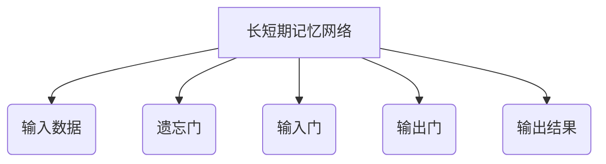
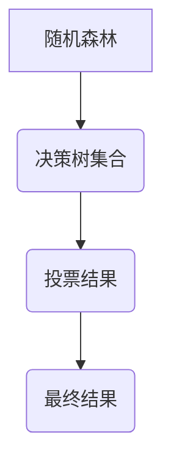
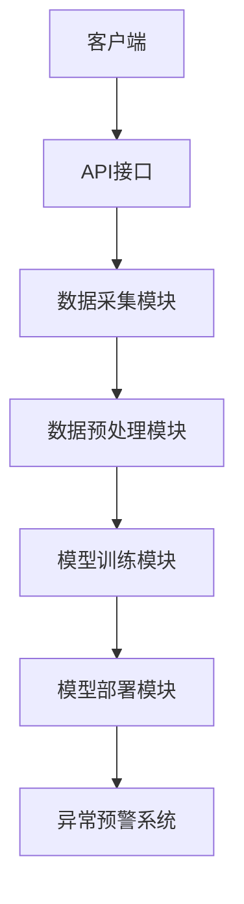
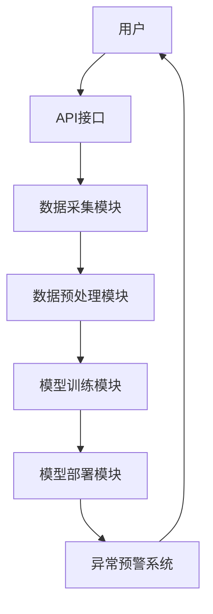

                 


# AI驱动的企业财务报表异常模式识别系统

## 关键词：AI，财务报表，异常模式识别，深度学习，随机森林

## 摘要：本文介绍了一种基于AI的企业财务报表异常模式识别系统，通过结合数据预处理、特征提取、模型训练和部署，实现对企业财务健康状况的智能监控。文章详细探讨了系统的背景、核心概念、算法原理、系统设计、项目实战及案例分析，最后总结了系统的应用价值和未来发展方向。

---

## 第1章: 企业财务报表异常模式识别的背景与意义

### 1.1 问题背景

#### 1.1.1 企业财务报表的重要性
企业财务报表是反映企业财务状况、经营成果和现金流量的重要文件，通常包括资产负债表、利润表和现金流量表。这些报表为投资者、债权人和管理层提供了决策所需的关键信息。

#### 1.1.2 异常模式识别的必要性
财务报表中的异常数据可能表明企业存在财务造假、欺诈行为或潜在的财务危机。传统的财务分析方法依赖于人工审查，效率低且容易出错。因此，利用AI技术自动识别异常模式变得尤为重要。

#### 1.1.3 AI技术在财务分析中的应用前景
AI技术，尤其是深度学习和机器学习，能够处理大量数据并发现复杂模式。在财务领域，AI可以用于欺诈检测、信用评估、风险预测和异常交易识别，极大地提高了分析效率和准确性。

### 1.2 问题描述

#### 1.2.1 财务报表异常模式的定义
财务报表异常模式指的是与企业正常经营状况不符的数据模式，可能包括收入与成本不匹配、应收账款异常增加、现金流与利润不一致等。

#### 1.2.2 异常模式识别的关键挑战
- 数据多样性：财务数据涉及多个科目，格式多样。
- 数据量大：企业通常有多年的财务数据，处理起来复杂。
- 模型泛化能力：需要在不同企业间通用，同时适应不同行业特征。

#### 1.2.3 企业财务健康评估的现状与不足
传统方法依赖财务比率分析和人工审核，主观性强且效率低下。AI技术的应用可以弥补这些不足，提高评估的客观性和效率。

### 1.3 问题解决方法

#### 1.3.1 AI技术的优势
- 高效处理大量数据，发现隐藏模式。
- 可以实时监控财务数据，及时发现异常。
- 减少人为错误，提高分析准确性。

#### 1.3.2 数据驱动的异常检测方法
通过收集和分析大量财务数据，利用统计方法和机器学习算法识别异常模式。

#### 1.3.3 结合业务场景的解决方案
将AI模型与具体业务场景结合，如实时监控、风险预警和财务审计，提供定制化的解决方案。

### 1.4 系统边界与外延

#### 1.4.1 系统的功能边界
系统主要负责财务数据的采集、处理、分析和预警，不涉及企业的其他业务系统。

#### 1.4.2 与现有财务系统的区别
现有系统通常仅用于数据录入和报告生成，而AI系统可以进行智能分析和异常预警。

#### 1.4.3 系统的适用范围与限制
适用于各类企业和金融机构，但需要足够的财务数据和计算资源支持。

### 1.5 核心概念与组成

#### 1.5.1 数据来源与处理
数据来源包括企业的财务报表、交易记录和外部市场数据。数据预处理包括数据清洗、标准化和特征提取。

#### 1.5.2 模型训练与部署
使用机器学习算法训练模型，并将模型部署到生产环境中，实时处理财务数据。

#### 1.5.3 结果反馈与优化
系统根据模型输出的结果提供预警，并根据反馈不断优化模型性能。

---

## 第2章: AI驱动的财务异常模式识别的核心概念

### 2.1 异常模式识别的原理

#### 2.1.1 数据预处理方法
- 数据清洗：去除无效数据和异常值。
- 数据转换：将数据标准化或归一化处理。
- 特征工程：提取关键特征，如收入增长率、毛利率等。

#### 2.1.2 特征提取技术
- 统计特征：如均值、方差、最大值等。
- 时间序列特征：如趋势、周期性、波动性。
- 文本特征：如财务报告中的关键词提取。

#### 2.1.3 模型训练流程
- 数据分割：将数据分为训练集、验证集和测试集。
- 模型选择：选择合适的算法，如随机森林、XGBoost或LSTM。
- 模型训练：使用训练数据训练模型，并进行交叉验证。
- 模型评估：通过准确率、召回率、F1分数等指标评估模型性能。

### 2.2 核心概念对比

#### 2.2.1 不同模型的优缺点对比
| 模型类型       | 优点                                   | 缺点                                   |
|----------------|----------------------------------------|----------------------------------------|
| 随机森林       | 高准确性，易于实现                   | 对特征工程依赖较高                   |
| LSTM           | 能处理时间序列数据，捕捉趋势         | 训练时间较长，计算资源需求高         |
| XGBoost        | 高效，适合大数据集                   | 易过拟合，需要参数调优               |

#### 2.2.2 数据特征与模型性能的关系
数据特征的选择直接影响模型的性能。高质量的特征可以提高模型的准确性和泛化能力。

#### 2.2.3 业务场景与模型选择的关联
不同业务场景需要不同的模型。例如，实时监控可能更适合使用LSTM，而离线分析可能更适合随机森林。

### 2.3 实体关系架构


---

## 第3章: 异常模式识别的算法原理

### 3.1 基于LSTM的异常检测

#### 3.1.1 LSTM原理
LSTM（长短期记忆网络）通过门控机制来处理序列数据，能够捕捉时间序列中的长期依赖关系。

#### 3.1.2 LSTM流程图



#### 3.1.3 LSTM的数学模型
$$ LSTM的输出由细胞状态和隐藏层构成，公式如下： $$
$$ f_t = \sigma(W_f \cdot [h_{t-1}, x_t] + b_f) $$
$$ i_t = \sigma(W_i \cdot [h_{t-1}, x_t] + b_i) $$
$$ c_t = f_t \odot c_{t-1} + i_t \odot g([h_{t-1}, x_t]) $$
$$ o_t = \sigma(W_o \cdot [h_{t-1}, x_t] + b_o) $$
$$ h_t = o_t \odot c_t $$

### 3.2 基于随机森林的异常检测

#### 3.2.1 随机森林原理
随机森林通过构建多棵决策树，并将结果进行集成，提高模型的准确性和鲁棒性。

#### 3.2.2 随机森林流程图



#### 3.2.3 随机森林的数学模型
$$ 随机森林通过集成学习，将多棵决策树的预测结果进行投票或平均，公式如下： $$
$$ y = \frac{1}{N} \sum_{i=1}^{N} y_i $$

---

## 第4章: 系统设计与实现

### 4.1 系统架构设计

#### 4.1.1 系统功能模块
- 数据采集模块：负责采集企业财务数据。
- 数据预处理模块：清洗和转换数据。
- 模型训练模块：训练异常检测模型。
- 异常预警模块：实时监控并预警异常情况。

#### 4.1.2 系统架构图



### 4.2 系统交互设计

#### 4.2.1 系统交互流程图



---

## 第5章: 项目实战与案例分析

### 5.1 项目实战

#### 5.1.1 环境安装
需要安装Python、TensorFlow、Scikit-learn、Pandas等库。

#### 5.1.2 核心代码实现

```python
import pandas as pd
from sklearn.ensemble import RandomForestClassifier
from sklearn.model_selection import train_test_split
from sklearn.metrics import classification_report

# 数据加载
data = pd.read_csv('financial_data.csv')

# 特征选择
features = ['revenue', 'expenses', 'net_income']
target = 'is_anomaly'

# 数据分割
X = data[features]
y = data[target]
X_train, X_test, y_train, y_test = train_test_split(X, y, test_size=0.2)

# 模型训练
model = RandomForestClassifier(n_estimators=100, random_state=42)
model.fit(X_train, y_train)

# 模型预测
y_pred = model.predict(X_test)

# 模型评估
print(classification_report(y_test, y_pred))
```

#### 5.1.3 实验结果分析
通过准确率、召回率等指标评估模型性能，并根据结果优化特征选择和模型参数。

### 5.2 案例分析

#### 5.2.1 某企业财务异常识别
通过系统分析某企业的财务数据，识别出收入与成本不匹配的异常情况，并给出预警。

#### 5.2.2 模型优化与调优
根据实际应用中的反馈，调整模型参数和特征选择，提高模型的准确性和实用性。

---

## 第6章: 总结与展望

### 6.1 系统总结
本系统通过AI技术实现了企业财务报表异常模式的智能识别，提高了财务分析的效率和准确性。

### 6.2 未来展望
未来可以进一步优化模型，引入更多数据源，如社交媒体和新闻数据，丰富模型的特征，并结合区块链技术提高数据的安全性和可信度。

### 6.3 最佳实践 tips
- 数据预处理是关键，需仔细清洗和转换数据。
- 特征选择直接影响模型性能，需结合业务场景进行选择。
- 模型部署后需持续监控和优化，确保其准确性和稳定性。

---

## 结语
AI驱动的企业财务报表异常模式识别系统为企业提供了高效、智能的财务监控工具，未来随着技术的发展，其应用将更加广泛和深入。

