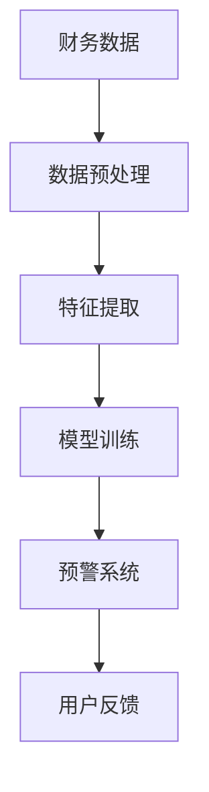
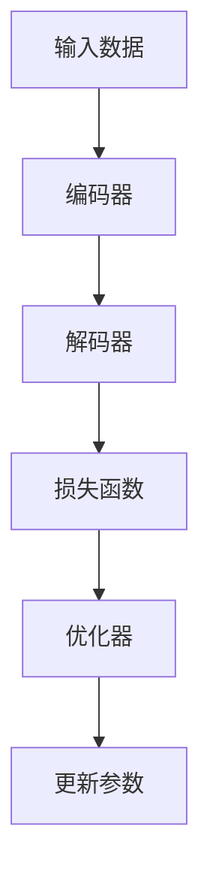
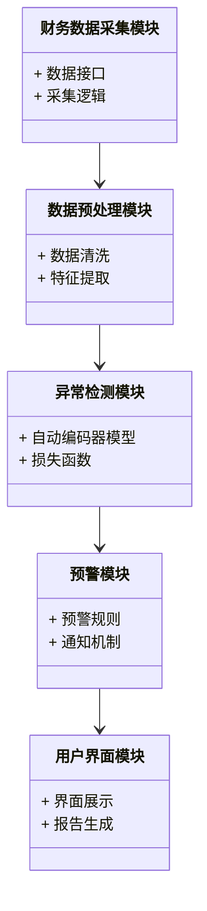
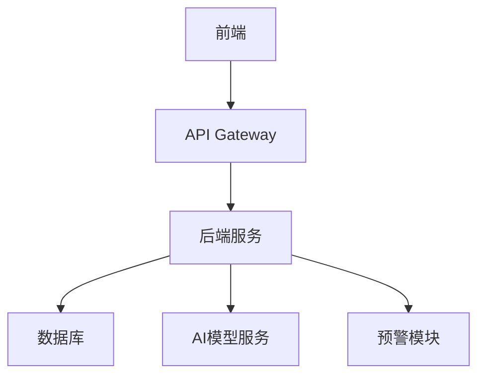
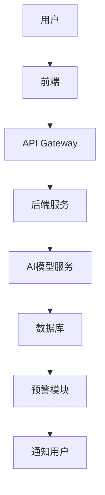

                 


# AI驱动的企业财务报表质量动态监控与预警系统

## 关键词：AI，财务报表，异常检测，预警系统，深度学习，企业监控

## 摘要：  
本文介绍了一种基于人工智能技术的企业财务报表质量动态监控与预警系统。该系统利用深度学习算法，实时分析财务数据，识别潜在的异常情况，并提供及时的预警，帮助企业提升财务风险管理能力。文章详细探讨了系统的核心概念、算法原理、架构设计以及实际应用案例，为企业财务部门和IT技术人员提供了有益的参考。

---

# 第1章: 问题背景与解决方案

## 1.1 财务报表质量监控的重要性

### 1.1.1 财务报表对企业的重要性  
财务报表是企业经营状况的晴雨表，是投资者、债权人和管理层进行决策的重要依据。高质量的财务报表能够反映企业的实际经营状况，帮助利益相关者做出正确的判断。然而，财务报表中可能存在虚假信息、数据错误或欺诈行为，这些都会影响报表的准确性，进而影响企业的决策。

### 1.1.2 财务报表质量问题对企业的影响  
财务报表质量差可能导致以下问题：  
1. 投资者基于不真实的财务数据做出错误决策，导致经济损失。  
2. 企业无法准确评估自身的经营状况，错失发展机会或盲目扩张。  
3. 欺诈行为可能导致企业声誉受损，甚至面临法律风险。  

### 1.1.3 传统财务报表监控的局限性  
传统的财务报表监控主要依赖人工审查，存在以下问题：  
1. **效率低**：人工审查需要大量时间，难以实时监控。  
2. **主观性强**：审查结果依赖于审计人员的经验和判断，容易出现疏漏。  
3. **成本高**：需要大量专业人员，增加了企业的运营成本。  
4. **覆盖面有限**：人工审查难以覆盖所有可能的异常情况，尤其是在数据量大、复杂度高的情况下。  

## 1.2 AI技术在财务监控中的应用潜力

### 1.2.1 AI技术的核心优势  
人工智能技术在财务监控中的应用具有以下优势：  
1. **高效性**：AI可以快速处理大量数据，实现实时监控。  
2. **准确性**：通过深度学习算法，AI能够发现隐藏在数据中的异常模式。  
3. **可扩展性**：AI系统可以轻松扩展，适用于不同规模的企业。  
4. **智能化**：AI能够自适应学习，不断提高识别异常的能力。  

### 1.2.2 AI在财务数据处理中的独特价值  
AI技术可以通过以下方式提升财务报表监控的效率和准确性：  
1. **自动化数据处理**：AI能够自动提取和整理财务数据，减少人工干预。  
2. **异常检测**：通过深度学习模型，AI能够识别潜在的财务造假行为和数据异常。  
3. **预测性分析**：AI可以根据历史数据预测未来的财务风险，提前制定应对策略。  

### 1.2.3 AI驱动的动态监控与预警的创新性  
与传统方法相比，AI驱动的动态监控具有以下创新点：  
1. **实时监控**：AI系统可以实时分析财务数据，及时发现异常情况。  
2. **智能化预警**：系统可以根据异常情况的严重性自动触发预警，帮助财务部门快速响应。  
3. **自适应学习**：AI模型可以根据新的数据不断优化，提高异常检测的准确率。  

---

# 第2章: 核心概念与系统架构

## 2.1 系统核心概念

### 2.1.1 数据特征分析  
数据特征分析是AI驱动的财务报表监控系统的核心环节。通过分析财务数据的特征，系统可以识别出潜在的异常模式。常见的数据特征包括：  
- **金额分布**：检查某些金额是否异常集中或分散。  
- **时间序列**：分析财务数据的时间分布，发现异常波动。  
- **比例关系**：检查财务数据中的比例关系是否合理。  

### 2.1.2 异常检测算法  
异常检测算法是系统的核心技术之一。常用的算法包括：  
1. **基于统计的方法**：如Z-score、孤立森林等。  
2. **基于机器学习的方法**：如随机森林、支持向量机（SVM）。  
3. **基于深度学习的方法**：如自动编码器（Autoencoder）、变分自编码器（VAE）。  

### 2.1.3 预警机制设计  
预警机制是系统的重要组成部分，用于将检测到的异常情况通知相关人员。预警机制的设计需要考虑以下因素：  
- **预警级别**：根据异常情况的严重性，划分不同的预警级别。  
- **预警方式**：通过邮件、短信、系统通知等方式触发预警。  
- **预警策略**：制定合理的预警规则，避免误报或漏报。  

## 2.2 系统架构与模块划分

### 2.2.1 数据采集模块  
数据采集模块负责从企业的财务系统中获取数据，常见的数据来源包括：  
- **会计系统**：如ERP系统、财务软件。  
- **业务系统**：如销售系统、采购系统。  
- **外部数据源**：如银行对账单、税务数据。  

### 2.2.2 数据预处理模块  
数据预处理模块负责对采集到的数据进行清洗和转换，确保数据的完整性和一致性。常见的预处理步骤包括：  
1. **数据清洗**：去除重复数据、填充缺失值、删除异常值。  
2. **数据转换**：将数据转换为适合模型输入的格式，如标准化、归一化。  
3. **特征提取**：从原始数据中提取有助于异常检测的特征。  

### 2.2.3 模型训练与部署模块  
模型训练与部署模块是系统的核心部分，负责训练和部署异常检测模型。常见的模型训练步骤包括：  
1. **数据划分**：将数据划分为训练集、验证集和测试集。  
2. **模型训练**：使用训练数据训练深度学习模型。  
3. **模型评估**：通过验证集和测试集评估模型的性能。  
4. **模型部署**：将训练好的模型部署到生产环境，实时处理财务数据。  

### 2.2.4 预警与反馈模块  
预警与反馈模块负责根据模型的输出结果触发预警，并将预警信息反馈给相关人员。常见的反馈机制包括：  
- **实时通知**：通过邮件、短信等方式通知财务部门。  
- **可视化界面**：在系统界面上显示异常情况，并提供详细的分析报告。  
- **自动响应**：系统可以根据预警信息自动启动相应的处理流程，如冻结账户、暂停交易等。  

## 2.3 核心概念对比分析

### 2.3.1 传统方法与AI方法的对比  
以下是传统方法与AI方法在财务报表监控中的对比：

| 对比维度       | 传统方法                   | AI方法                     |
|----------------|----------------------------|-----------------------------|
| 效率           | 低，依赖人工审查            | 高，自动化处理               |
| 准确性         | 依赖审计人员的经验         | 高，基于深度学习模型         |
| 覆盖范围       | 有限，难以覆盖所有异常情况 | 全面，能够发现复杂异常模式   |
| 成本           | 高，需要大量专业人员        | 低，自动化处理减少人力成本   |
| 可扩展性       | 低，难以扩展                | 高，易于扩展                 |

### 2.3.2 系统实体关系图  
以下是系统实体关系图：



---

# 第3章: 异常检测算法原理

## 3.1 基于深度学习的异常检测

### 3.1.1 深度学习模型简介  
深度学习是一种基于人工神经网络的机器学习技术，具有强大的特征学习能力。常用的深度学习模型包括：  
- **自动编码器（Autoencoder）**：通过编码和解码的过程学习数据的特征表示。  
- **变分自编码器（VAE）**：结合了生成模型和变分推断，用于生成数据。  
- **图神经网络（GNN）**：适用于处理图结构数据，如社交网络、金融网络等。  

### 3.1.2 异常检测的数学模型  
自动编码器的数学模型如下：

$$
\text{编码器}：x \rightarrow z = f_{\theta}(x) \\
\text{解码器}：z \rightarrow \hat{x} = g_{\phi}(z) \\
\text{损失函数}：L = ||x - \hat{x}||
$$

其中，$x$ 是输入数据，$z$ 是编码器输出的潜在表示，$\hat{x}$ 是解码器输出的重建数据，$L$ 是损失函数。

### 3.1.3 模型训练流程  
模型训练流程如下：



优化器通常使用随机梯度下降（SGD）或Adam优化器。

## 3.2 算法实现与优化

### 3.2.1 模型训练代码实现  
以下是一个简单的自动编码器模型训练代码示例：

```python
import tensorflow as tf
from tensorflow import keras

# 定义自动编码器模型
class Autoencoder(keras.Model):
    def __init__(self, input_dim):
        super(Autoencoder, self).__init__()
        self.encoder = keras.Sequential([
            keras.layers.Dense(64, activation='relu'),
            keras.layers.Dense(32, activation='relu'),
            keras.layers.Dense(16, activation='relu')
        ])
        self.decoder = keras.Sequential([
            keras.layers.Dense(16, activation='relu'),
            keras.layers.Dense(32, activation='relu'),
            keras.layers.Dense(64, activation='relu'),
            keras.layers.Dense(input_dim, activation='sigmoid')
        ])
    
    def call(self, inputs):
        encoded = self.encoder(inputs)
        decoded = self.decoder(encoded)
        return decoded

# 编译模型
autoencoder = Autoencoder(input_dim=128)
autoencoder.compile(optimizer='adam', loss='binary_crossentropy')

# 训练模型
autoencoder.fit(x_train, x_train, epochs=100, batch_size=256, validation_data=(x_val, x_val))
```

### 3.2.2 模型调优策略  
为了提高模型的性能，可以采取以下调优策略：  
1. **调整网络结构**：尝试不同的编码器和解码器层数，优化模型的表示能力。  
2. **选择合适的激活函数**：如ReLU、ELU等，选择合适的激活函数可以提高模型的训练效果。  
3. **优化器选择**：尝试不同的优化器，如Adam、SGD等，选择最适合数据的优化器。  
4. **学习率调整**：使用学习率衰减策略，逐步降低学习率，防止模型过早收敛。  

### 3.2.3 模型性能评估  
模型性能可以通过以下指标进行评估：  
1. **重构误差**：衡量模型对数据的重建能力。  
2. **准确率**：衡量模型对正常数据的分类能力。  
3. **召回率**：衡量模型对异常数据的检测能力。  
4. **F1分数**：综合准确率和召回率的调和平均数。  

## 3.3 算法流程图  
以下是异常检测算法的流程图：


---

# 第4章: 系统分析与架构设计

## 4.1 问题场景介绍  
本章将从实际问题出发，介绍企业财务报表质量动态监控与预警系统的应用场景。例如，某企业可能面临以下问题：  
1. **财务数据量大**：企业的财务数据可能来自多个系统，数据量大且复杂。  
2. **异常情况隐蔽**：财务造假行为可能隐藏在正常的交易中，难以被人工发现。  
3. **实时监控需求**：企业需要实时监控财务数据，及时发现异常情况。  

## 4.2 项目介绍

### 4.2.1 项目目标  
本项目的目标是开发一个基于AI的财务报表质量动态监控与预警系统，实现以下功能：  
1. 实时监控企业的财务数据，发现异常情况。  
2. 提供预警信息，帮助财务部门快速响应。  
3. 自动生成异常报告，便于后续分析和处理。  

### 4.2.2 系统功能设计  
以下是系统的功能模块图：



### 4.2.3 系统架构设计  
以下是系统的架构图：



## 4.3 系统接口设计

### 4.3.1 API接口设计  
以下是系统的主要API接口：

| 接口名称         | 接口描述                   |
|------------------|---------------------------|
| 数据采集接口     | 从财务系统中获取数据       |
| 数据预处理接口   | 对数据进行清洗和转换       |
| 异常检测接口     | 使用AI模型检测异常情况     |
| 预警触发接口     | 根据异常情况触发预警       |
| 报告生成接口     | 生成异常报告               |

### 4.3.2 交互流程图  
以下是系统的交互流程图：



---

# 第5章: 项目实战

## 5.1 环境安装

### 5.1.1 安装Python和相关库  
安装Python和以下库：  
- **TensorFlow**：用于深度学习模型的训练。  
- **Keras**：用于构建深度学习模型。  
- **Pandas**：用于数据处理。  
- **Matplotlib**：用于数据可视化。  
- **Flask**：用于构建Web接口。  

### 5.1.2 安装Jupyter Notebook  
安装Jupyter Notebook，用于编写和运行代码。

## 5.2 系统核心实现

### 5.2.1 数据采集模块实现  
以下是数据采集模块的代码示例：

```python
import pandas as pd
import requests

def fetch_financial_data(api_key):
    url = f"https://api.example.com/financial_data?api_key={api_key}"
    response = requests.get(url)
    data = response.json()
    df = pd.DataFrame(data)
    return df

data = fetch_financial_data("your_api_key")
```

### 5.2.2 数据预处理模块实现  
以下是数据预处理模块的代码示例：

```python
import pandas as pd
import numpy as np

def preprocess_data(df):
    # 删除缺失值
    df.dropna(inplace=True)
    # 填充异常值
    df.replace(to_replace=np.inf, value=0, inplace=True)
    return df

processed_data = preprocess_data(data)
```

### 5.2.3 异常检测模块实现  
以下是异常检测模块的代码示例：

```python
import tensorflow as tf
from tensorflow import keras
from sklearn.model_selection import train_test_split

# 划分训练集和测试集
x_train, x_val, x_test = train_test_split(processed_data, test_size=0.2)

# 编译模型
autoencoder = Autoencoder(input_dim=processed_data.shape[1])
autoencoder.compile(optimizer='adam', loss='binary_crossentropy')

# 训练模型
autoencoder.fit(x_train, x_train, epochs=100, batch_size=256, validation_data=(x_val, x_val))
```

### 5.2.4 预警模块实现  
以下是预警模块的代码示例：

```python
import pandas as pd
import requests

def trigger_alarm(anomaly_score):
    if anomaly_score > 0.95:
        requests.post("http://localhost:5000/trigger_alarm", json={"score": anomaly_score})

# 示例调用
trigger_alarm(0.96)
```

## 5.3 项目小结  
通过本项目的实现，我们可以看到AI技术在企业财务报表质量动态监控与预警系统中的巨大潜力。通过深度学习模型，我们可以实现高效的异常检测和预警，帮助企业提升财务风险管理能力。

---

# 第6章: 最佳实践与注意事项

## 6.1 最佳实践  
1. **数据质量**：确保数据的完整性和准确性，这是模型性能的基础。  
2. **模型调优**：根据实际需求调整模型参数，优化模型性能。  
3. **实时监控**：确保系统能够实时处理数据，及时发现异常情况。  
4. **用户反馈**：收集用户的反馈，不断优化系统的功能和性能。  

## 6.2 小结  
通过本文的介绍，我们了解了AI驱动的企业财务报表质量动态监控与预警系统的核心概念、算法原理和系统架构。同时，我们还通过实际案例展示了系统的实现过程，为企业的财务风险管理提供了新的思路。

## 6.3 注意事项  
1. **数据隐私**：在处理财务数据时，需要注意数据隐私保护，确保数据的安全性。  
2. **模型解释性**：复杂的深度学习模型可能缺乏解释性，需要结合其他方法提高模型的可解释性。  
3. **系统稳定性**：确保系统的稳定性和可靠性，避免因系统故障导致数据丢失或误报。  

## 6.4 拓展阅读  
1. **《Deep Learning》——Ian Goodfellow  
2. **《Hands-On Machine Learning with Scikit-Learn, Keras, and TensorFlow》——Aurélien Géron  
3. **《Financial Statement Analysis and Security Valuation》——Bruce J. Dennis  

---

# 结语  
AI技术正在 revolutionizing 企业财务报表质量监控与预警领域，通过深度学习算法，企业可以实现高效、准确的异常检测和风险预警。未来，随着AI技术的不断发展，财务报表质量动态监控与预警系统将更加智能化、自动化，为企业创造更大的价值。

