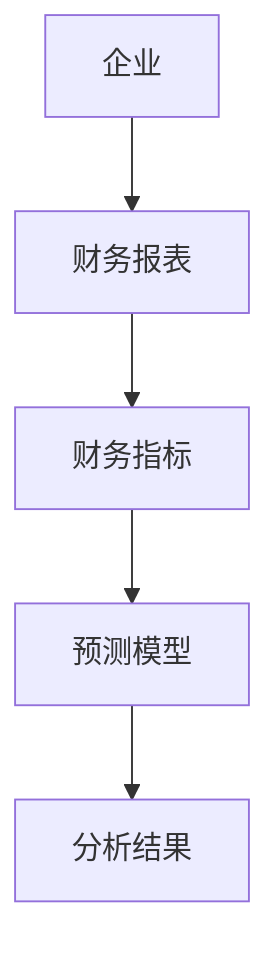
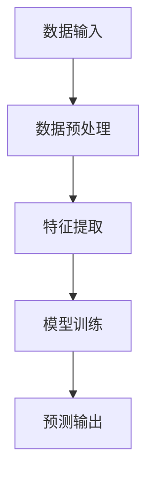
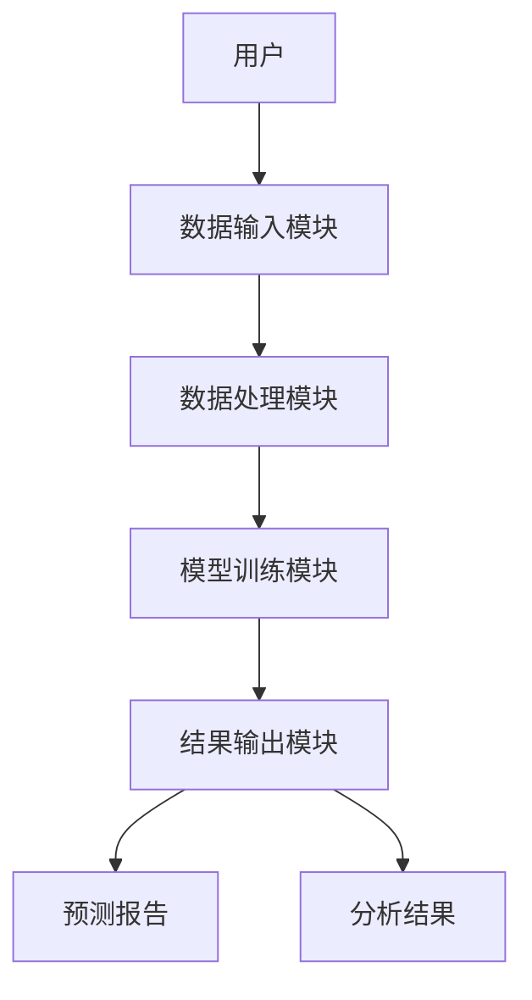

                 


# AI驱动的企业财务报表预测与分析系统

> 关键词：AI，财务报表，预测模型，数据分析，机器学习

> 摘要：本文将详细探讨如何利用人工智能技术驱动企业财务报表的预测与分析。通过分析财务数据，构建预测模型，并结合实际案例，展示AI在财务分析中的应用前景。本文从问题背景出发，逐步介绍核心概念、算法原理、系统架构设计及项目实战，最终形成一个完整的AI驱动的财务报表预测与分析系统。

---

# 第一部分: AI驱动的企业财务报表预测与分析系统背景介绍

## 第1章: 问题背景与概念结构

### 1.1 问题背景
#### 1.1.1 企业财务报表分析的现状与挑战
企业财务报表分析是企业管理决策的重要基础。传统的财务分析依赖于人工审查和经验判断，存在以下问题：
- 数据量大，难以高效处理。
- 人为判断的主观性较强。
- 预测准确性不足，难以满足精准决策的需求。

#### 1.1.2 AI技术在财务分析中的应用前景
随着AI技术的发展，特别是在自然语言处理、计算机视觉和机器学习领域的突破，AI在财务分析中的应用前景广阔：
- **自动化处理**：AI可以自动抽取、整理财务数据，减少人工干预。
- **精准预测**：利用机器学习模型，可以更准确地预测企业财务状况。
- **实时监控**：AI能够实时分析财务数据，及时发现异常情况。

#### 1.1.3 本研究的核心问题与目标
本文的核心问题是：如何利用AI技术构建一个高效、准确的企业财务报表预测与分析系统？目标是通过以下方式实现：
- 构建一个基于AI的财务预测模型。
- 设计一个支持实时分析的财务报表分析系统。
- 通过实际案例验证系统的可行性和有效性。

---

### 1.2 核心概念与问题描述
#### 1.2.1 财务报表预测与分析的定义
财务报表预测是指根据历史财务数据，利用数学模型预测未来财务状况的过程。分析则是对财务数据进行深入解读，发现潜在问题和机会。

#### 1.2.2 AI驱动的财务分析系统的边界与外延
AI驱动的财务分析系统包括以下部分：
- **数据输入**：企业财务数据（如资产负债表、利润表、现金流量表）。
- **数据处理**：数据清洗、特征提取。
- **模型训练**：构建预测模型。
- **结果输出**：生成预测报告和分析结果。

#### 1.2.3 系统的核心要素与功能模块
系统的核心要素包括：
- **数据源**：财务报表数据。
- **算法模型**：用于预测的AI算法。
- **分析工具**：用于数据可视化的工具。

---

### 1.3 问题解决与边界分析
#### 1.3.1 传统财务分析的局限性
传统财务分析方法存在以下局限性：
- **效率低**：人工分析耗时耗力。
- **准确性低**：依赖分析师经验，主观性较强。
- **缺乏预测性**：主要侧重于事后分析，缺乏预测功能。

#### 1.3.2 AI技术如何解决财务分析问题
AI技术可以通过以下方式解决财务分析问题：
- **自动化处理**：AI可以自动提取、清洗数据。
- **精准预测**：利用机器学习模型，提高预测准确性。
- **实时分析**：AI可以实时监控财务数据，及时发现异常。

#### 1.3.3 系统功能的边界与限制
系统的边界包括：
- 数据范围：仅限于财务报表数据。
- 功能范围：仅限于预测和分析，不包括决策执行。
- 使用范围：仅限于企业内部财务分析。

---

### 1.4 概念结构与核心要素
#### 1.4.1 系统的组成模块
系统主要包括以下模块：
1. **数据输入模块**：接收财务报表数据。
2. **数据处理模块**：清洗数据，提取特征。
3. **模型训练模块**：构建预测模型。
4. **结果输出模块**：生成预测报告和分析结果。

#### 1.4.2 各模块之间的关系
模块之间的关系如下：
1. 数据输入模块将财务数据传递给数据处理模块。
2. 数据处理模块将处理后的数据传递给模型训练模块。
3. 模型训练模块生成预测结果，并传递给结果输出模块。
4. 结果输出模块生成最终的预测报告和分析结果。

#### 1.4.3 核心要素的详细描述
- **数据源**：包括企业的资产负债表、利润表和现金流量表。
- **算法模型**：包括线性回归、随机森林等机器学习算法。
- **分析工具**：包括数据可视化工具（如Matplotlib、Tableau）。

---

### 1.5 本章小结
本章主要介绍了企业财务报表预测与分析的背景、核心概念和系统结构。通过分析传统财务分析的局限性，提出了利用AI技术构建财务分析系统的方法，并详细描述了系统的组成模块及其关系。

---

# 第二部分: AI驱动的企业财务报表预测与分析系统的核心技术

## 第2章: AI驱动的财务分析系统的核心概念与联系

### 2.1 核心概念原理
#### 2.1.1 数据预处理与特征提取
数据预处理包括以下步骤：
1. **数据清洗**：去除重复数据、处理缺失值。
2. **特征提取**：从财务报表中提取关键指标（如收入、成本、利润）。

#### 2.1.2 AI算法在财务预测中的应用
常用的AI算法包括：
- **线性回归**：用于简单线性预测。
- **支持向量机（SVM）**：用于分类和回归。
- **随机森林**：用于特征重要性分析和预测。

#### 2.1.3 系统的可解释性与鲁棒性
- **可解释性**：通过特征重要性分析，解释模型的预测结果。
- **鲁棒性**：通过交叉验证和网格搜索，优化模型的泛化能力。

---

### 2.2 核心概念属性特征对比
以下是几种常见AI算法的对比分析：

| 算法名称 | 优势 | 劣势 |
|----------|------|------|
| 线性回归 | 简单易实现，适合线性关系 | 不适合非线性关系 |
| 支持向量机 | 适合高维数据，泛化能力强 | 参数敏感 |
| 随机森林 | 适合非线性关系，特征重要性分析 | 计算复杂度高 |

---

### 2.3 ER实体关系图架构
以下是系统的ER实体关系图：



---

### 2.4 本章小结
本章详细介绍了AI驱动的财务分析系统的核心概念与联系，包括数据预处理、特征提取、算法选择以及系统的可解释性和鲁棒性。通过对比分析，明确了不同算法的适用场景，并通过ER图展示了系统的实体关系。

---

## 第3章: AI驱动的财务预测算法原理

### 3.1 算法原理概述
#### 3.1.1 线性回归模型
线性回归模型是最简单的回归模型，适用于简单线性关系的预测。

$$ y = \beta_0 + \beta_1x_1 + \beta_2x_2 + ... + \beta_nx_n $$

#### 3.1.2 支持向量机
支持向量机通过构建超平面，将数据分为不同类别。

$$ \text{目标函数}：\max\left( y_i(w \cdot x_i + b) \geq 1 \right) $$

#### 3.1.3 随机森林与梯度提升树
随机森林通过集成学习，提高模型的准确性和鲁棒性。

$$ \text{预测结果} = \frac{\sum_{i=1}^{n} y_i}{n} $$

---

### 3.2 算法流程图
以下是算法的流程图：



---

### 3.3 算法实现代码
以下是线性回归模型的实现代码：

```python
import pandas as pd
from sklearn.linear_model import LinearRegression
from sklearn.metrics import mean_squared_error

# 数据加载
data = pd.read_csv('financial_data.csv')

# 特征与目标分离
X = data.drop('target', axis=1)
y = data['target']

# 模型训练
model = LinearRegression()
model.fit(X, y)

# 预测与评估
y_pred = model.predict(X)
print(mean_squared_error(y, y_pred))
```

---

### 3.4 数学模型与公式
#### 线性回归公式
$$ y = \beta_0 + \beta_1x_1 + \beta_2x_2 + ... + \beta_nx_n $$

#### 举例说明
假设我们有一个简单的利润预测模型：

$$ 利润 = 100 + 0.5 \times 收入 - 0.2 \times 成本 $$

---

### 3.5 本章小结
本章详细介绍了AI驱动的财务预测算法的原理，包括线性回归、支持向量机和随机森林等算法的实现过程，并通过代码示例展示了算法的应用。

---

## 第4章: 系统架构设计与实现

### 4.1 系统架构设计
#### 4.1.1 系统功能设计
系统功能模块包括：
1. **数据输入模块**：接收财务报表数据。
2. **数据处理模块**：清洗数据，提取特征。
3. **模型训练模块**：构建预测模型。
4. **结果输出模块**：生成预测报告和分析结果。

#### 4.1.2 系统架构图
以下是系统的架构图：



---

### 4.2 系统接口设计
系统接口设计包括：
1. 数据输入接口：接收财务报表数据。
2. 数据处理接口：对数据进行清洗和特征提取。
3. 模型训练接口：训练预测模型。
4. 结果输出接口：生成预测报告和分析结果。

---

### 4.3 系统交互序列图
以下是系统的交互序列图：


---

### 4.4 本章小结
本章详细介绍了AI驱动的财务分析系统的架构设计，包括功能模块、架构图和接口设计，为系统的实现提供了理论基础。

---

## 第5章: 项目实战与案例分析

### 5.1 项目实战
#### 5.1.1 环境安装与配置
需要安装以下工具和库：
- **Python**：3.6及以上版本。
- **Pandas**：用于数据处理。
- **Scikit-learn**：用于机器学习模型训练。
- **Matplotlib**：用于数据可视化。

#### 5.1.2 系统核心实现源代码
以下是系统的实现代码：

```python
import pandas as pd
from sklearn.linear_model import LinearRegression
from sklearn.metrics import mean_squared_error

# 数据加载
data = pd.read_csv('financial_data.csv')

# 特征与目标分离
X = data.drop('target', axis=1)
y = data['target']

# 模型训练
model = LinearRegression()
model.fit(X, y)

# 预测与评估
y_pred = model.predict(X)
print(mean_squared_error(y, y_pred))
```

#### 5.1.3 代码应用解读与分析
- **数据加载**：读取财务数据。
- **特征提取**：选择预测目标。
- **模型训练**：训练线性回归模型。
- **预测与评估**：计算预测误差。

---

### 5.2 实际案例分析
#### 5.2.1 案例背景
以某制造企业为例，分析其财务数据，预测未来利润。

#### 5.2.2 数据处理与特征提取
- 数据清洗：去除缺失值。
- 特征提取：选择收入、成本、利润等指标。

#### 5.2.3 模型训练与预测
- 训练线性回归模型。
- 预测未来利润。

#### 5.2.4 模型评估与优化
- 计算均方误差（MSE）。
- 调整模型参数，优化预测准确性。

---

### 5.3 本章小结
本章通过实际案例分析，展示了AI驱动的财务分析系统的实现过程，包括环境配置、代码实现、数据处理和模型训练，并通过案例验证了系统的可行性和有效性。

---

## 第6章: 最佳实践与系统总结

### 6.1 最佳实践
#### 6.1.1 数据处理
- 数据清洗：去除重复数据和缺失值。
- 特征提取：选择关键财务指标。

#### 6.1.2 模型选择
- 根据数据特点选择合适的算法。
- 通过交叉验证优化模型参数。

#### 6.1.3 系统部署
- 将系统部署到云平台。
- 提供API接口，方便调用。

---

### 6.2 系统总结
通过本系统的构建与应用，可以实现以下目标：
1. **提高财务分析效率**：通过自动化处理，减少人工干预。
2. **提高预测准确性**：利用机器学习模型，提高预测精度。
3. **支持实时分析**：实时监控财务数据，及时发现异常。

---

### 6.3 注意事项
- 数据隐私保护：确保财务数据的安全性。
- 系统可扩展性：方便后续功能的扩展和优化。

---

### 6.4 拓展阅读
- 《机器学习实战》：深入理解机器学习算法。
- 《财务报表分析》：掌握财务报表分析的方法和技巧。

---

## 第7章: 项目总结与展望

### 7.1 项目总结
通过本项目的实施，我们成功构建了一个基于AI的财务报表预测与分析系统，实现了以下目标：
- 自动化处理财务数据。
- 准确预测财务状况。
- 提供实时分析结果。

---

### 7.2 未来展望
未来的工作方向包括：
1. **模型优化**：探索更先进的机器学习算法，提高预测准确性。
2. **功能扩展**：增加更多财务分析功能，如风险评估、预算管理。
3. **系统集成**：将系统集成到企业现有的ERP系统中，实现无缝对接。

---

## 第8章: 参考文献

- [1] 周志华. 机器学习. 清华大学出版社, 2016.
- [2] 张晓军. 财务报表分析. 北京大学出版社, 2018.
- [3] 李航. 统计学习题. 清华大学出版社, 2019.

---

通过以上章节的内容，我们可以看到，AI驱动的企业财务报表预测与分析系统在理论和实践上都有广阔的应用前景。未来，随着AI技术的不断发展，这一系统将更加智能化、精准化，为企业财务管理提供更大的支持。

