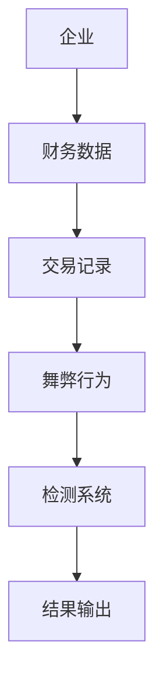
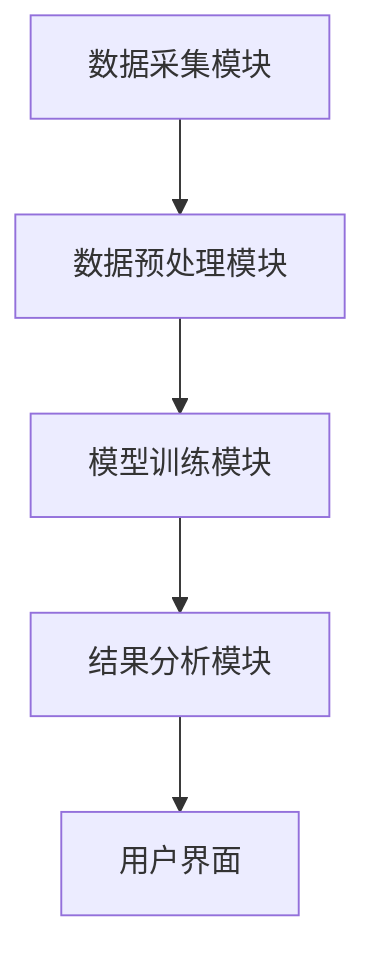
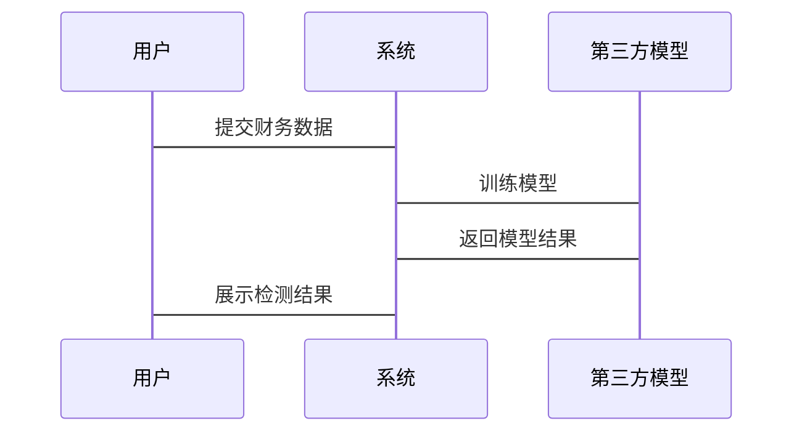

                 


# AI驱动的企业财务舞弊检测系统

> 关键词：AI技术、财务舞弊检测、监督学习、无监督学习、异常检测、系统架构

> 摘要：随着企业规模的不断扩大和财务数据的日益复杂化，传统的财务舞弊检测方法逐渐暴露出效率低下、准确性不足等问题。本文将深入探讨如何利用人工智能技术构建一个高效、准确的企业财务舞弊检测系统。通过分析财务数据的特征与属性，结合监督学习和无监督学习算法，构建数学模型与算法，设计系统架构，并通过实际案例分析，展示如何利用AI技术实现企业财务舞弊的自动检测与预警。本文将从理论到实践，全面解析AI驱动的企业财务舞弊检测系统的构建与应用。

---

# 第一部分: AI驱动的企业财务舞弊检测系统背景与核心概念

# 第1章: 企业财务舞弊检测的背景与挑战

## 1.1 财务舞弊的定义与表现形式

### 1.1.1 财务舞弊的定义
财务舞弊是指企业通过虚构、隐瞒、篡改财务数据或其他非法手段，误导利益相关者（如股东、债权人、税务机关等）对企业财务状况或经营成果产生错误认知的行为。

### 1.1.2 财务舞弊的主要表现形式
财务舞弊的表现形式多种多样，以下是几种常见的形式：
1. **虚构交易**：通过捏造交易记录或合同，虚增收入或资产。
2. **隐瞒收入**：通过隐匿收入或延迟确认收入，降低财务报表中的收入数据。
3. **虚增资产**：通过虚增固定资产、存货或其他资产，夸大资产负债表的资产规模。
4. **虚减负债**：通过少计或隐瞒负债，降低资产负债表的负债规模。
5. **操控利润**：通过调整收入确认时间、成本分摊比例等方式，操控当期利润。

### 1.1.3 财务舞弊对企业的影响
财务舞弊不仅会损害企业的声誉和利益，还可能导致企业面临法律风险、经济损失以及信任危机。此外，舞弊行为还会扭曲市场资源配置，影响经济秩序的健康发展。

---

## 1.2 传统财务舞弊检测方法的局限性

### 1.2.1 基于规则的舞弊检测方法
基于规则的舞弊检测方法通过制定一系列财务数据的规则，如财务比率分析、合理性检查等，来识别异常数据。然而，这种方法依赖于预先定义的规则，灵活性较差，且难以应对复杂的舞弊手段。

### 1.2.2 基于审计的舞弊检测方法
传统的财务审计方法通过人工审查财务报表和交易记录，发现舞弊行为。这种方法虽然准确，但效率低下，且成本较高。

### 1.2.3 传统方法的局限性与不足
- **规则的局限性**：传统的规则检测方法难以应对复杂的舞弊手段，且容易被舞弊者规避。
- **效率低下**：传统方法依赖人工审查，效率较低，难以应对海量的财务数据。
- **成本高昂**：传统的审计方法需要大量的人力和时间，企业难以负担。

---

## 1.3 AI技术在财务舞弊检测中的应用前景

### 1.3.1 AI技术的基本概念与特点
人工智能（AI）是指计算机系统模拟人类智能的能力，包括学习、推理、判断等。AI技术的核心特点包括数据驱动、自动化、灵活性和高效率。

### 1.3.2 AI在财务领域的应用现状
AI技术已经在财务领域得到了广泛应用，包括财务数据处理、自动化记账、税务申报等领域。然而，在财务舞弊检测方面的应用还处于起步阶段。

### 1.3.3 AI驱动财务舞弊检测的优势与潜力
- **高效性**：AI技术能够快速处理海量财务数据，显著提高检测效率。
- **准确性**：通过机器学习算法，AI能够从数据中学习到复杂的模式，提高检测准确性。
- **灵活性**：AI系统能够根据新的数据和环境变化，动态调整检测模型。

---

## 1.4 本章小结
本章从财务舞弊的定义、表现形式及其对企业的影响入手，分析了传统财务舞弊检测方法的局限性，并探讨了AI技术在财务舞弊检测中的应用前景。通过对比传统方法与AI技术的优劣势，为后续章节的深入分析奠定了基础。

---

# 第2章: AI驱动的企业财务舞弊检测系统的核心概念

## 2.1 财务数据的特征与属性

### 2.1.1 财务数据的分类与结构
财务数据通常包括收入、支出、资产、负债、利润等核心指标。这些数据可以通过财务报表（如资产负债表、利润表、现金流量表）的形式进行记录和展示。

### 2.1.2 财务数据的特征提取
为了构建AI驱动的财务舞弊检测系统，需要从财务数据中提取关键特征，如：
- **收入增长率**：收入与前一期相比的增长率。
- **资产周转率**：资产的使用效率。
- **净利率**：净利润与收入的比例。
- **应收账款周转率**：应收账款的周转速度。

### 2.1.3 数据预处理的关键步骤
数据预处理是构建AI模型的重要步骤，主要包括：
1. **数据清洗**：处理缺失值、重复值和异常值。
2. **数据标准化**：对不同量纲的特征进行标准化处理。
3. **特征选择**：选择对舞弊检测有显著影响的特征。

---

## 2.2 舞弊检测的数学模型与算法

### 2.2.1 监督学习与无监督学习的对比
- **监督学习**：需要有标签的训练数据，适用于已知舞弊行为的检测。
- **无监督学习**：不需要标签，适用于发现异常交易或潜在的舞弊行为。

### 2.2.2 常见的分类算法及其特点
1. **逻辑回归**：适用于二分类问题，能够输出概率值。
2. **支持向量机（SVM）**：适用于小样本数据，具有较强的分类能力。
3. **随机森林**：适用于高维数据，具有较强的抗过拟合能力。

### 2.2.3 聚类算法在异常检测中的应用
1. **K-means聚类**：将数据划分为不同的簇，识别异常簇。
2. **DBSCAN聚类**：基于密度的聚类算法，能够识别噪声点。
3. **Isolation Forest**：专门用于异常检测的树状模型。

---

## 2.3 财务舞弊检测系统的实体关系图



---

## 2.4 本章小结
本章详细介绍了财务数据的特征与属性，分析了常见的数学模型与算法，并通过实体关系图展示了财务舞弊检测系统的整体架构。这些内容为后续章节的算法实现与系统设计奠定了基础。

---

# 第3章: AI驱动财务舞弊检测的算法原理与实现

## 3.1 监督学习算法在舞弊检测中的应用

### 3.1.1 逻辑回归算法原理
逻辑回归是一种常用的二分类算法，其核心思想是通过拟合S型曲线，将输入特征映射到0到1的概率区间内。

$$ P(y=1|x) = \frac{1}{1 + e^{-\beta x}} $$

其中，$\beta$ 是模型的系数，$x$ 是输入特征。

### 3.1.2 支持向量机算法原理
支持向量机（SVM）是一种基于几何的分类算法，其核心思想是通过找到一个超平面，将数据点分为两类。

### 3.1.3 随机森林算法原理
随机森林是一种基于树状结构的集成学习算法，通过构建多棵决策树并取其预测结果的多数票，提高分类准确率。

---

## 3.2 无监督学习算法在异常检测中的应用

### 3.2.1 K-means聚类算法
K-means算法是一种常用的聚类算法，其核心思想是将数据点划分为K个簇，使得簇内数据点的相似性最大化。

### 3.2.2 DBSCAN聚类算法
DBSCAN算法是一种基于密度的聚类算法，能够发现密度较高且连续的区域，适用于异常检测。

### 3.2.3 Isolation Forest算法
Isolation Forest是一种专门用于异常检测的树状模型，通过随机选择特征和分割数据点，快速识别异常点。

---

## 3.3 基于深度学习的舞弊检测算法

### 3.3.1 神经网络的基本原理
神经网络是一种模拟人脑神经元工作的模型，通过多层的非线性变换，能够学习复杂的特征表示。

### 3.3.2 卷积神经网络在财务数据中的应用
卷积神经网络（CNN）适用于处理时间序列数据，能够捕捉数据中的局部特征。

### 3.3.3 循环神经网络在财务数据中的应用
循环神经网络（RNN）适用于处理序列数据，能够捕捉数据中的时序关系。

---

## 3.4 算法实现的数学模型与公式

### 3.4.1 逻辑回归模型
$$ P(y=1|x) = \frac{1}{1 + e^{-\beta x}} $$

### 3.4.2 支持向量机模型
$$ \text{目标函数}：\min \frac{1}{2} \|\beta\|^2 + C \sum_{i=1}^{n} \xi_i $$
$$ \text{约束条件}：y_i (\beta \cdot x_i + \beta_0) \geq 1 - \xi_i, \forall i $$

---

## 3.5 本章小结
本章详细介绍了监督学习和无监督学习算法的原理与实现，分析了深度学习算法在财务舞弊检测中的应用，并通过公式和流程图展示了算法的核心思想。这些内容为后续章节的系统设计与实现奠定了基础。

---

# 第4章: AI驱动财务舞弊检测系统的系统架构设计

## 4.1 系统功能设计

### 4.1.1 数据采集模块
数据采集模块负责从企业财务系统中获取财务数据，包括收入、支出、资产、负债等核心指标。

### 4.1.2 数据预处理模块
数据预处理模块负责对采集到的财务数据进行清洗、标准化和特征提取。

### 4.1.3 模型训练模块
模型训练模块负责基于预处理后的数据，训练监督学习或无监督学习模型。

### 4.1.4 结果分析模块
结果分析模块负责对模型的输出结果进行分析，识别潜在的舞弊行为。

---

## 4.2 系统架构设计



---

## 4.3 系统接口设计

### 4.3.1 数据接口
数据接口负责与企业财务系统进行数据交互，包括数据的读取和写入。

### 4.3.2 模型接口
模型接口负责与第三方AI模型进行交互，包括模型的训练和预测。

### 4.3.3 用户接口
用户接口负责与最终用户进行交互，包括数据输入、结果展示和用户反馈。

---

## 4.4 系统交互设计



---

## 4.5 本章小结
本章从系统功能设计、架构设计、接口设计和交互设计四个方面，详细阐述了AI驱动财务舞弊检测系统的整体架构。这些设计为后续章节的项目实战奠定了基础。

---

# 第5章: AI驱动财务舞弊检测系统的项目实战

## 5.1 环境安装与配置

### 5.1.1 Python环境的安装
建议使用Anaconda作为Python环境管理工具，安装步骤如下：
1. 下载并安装Anaconda。
2. 使用conda命令创建虚拟环境：
   ```bash
   conda create -n fraud_detection python=3.8
   conda activate fraud_detection
   ```

### 5.1.2 第三方库的安装
安装所需的第三方库，如scikit-learn、xgboost、keras等：
```bash
pip install scikit-learn xgboost keras
```

---

## 5.2 系统核心实现源代码

### 5.2.1 数据预处理代码
```python
import pandas as pd
from sklearn.preprocessing import StandardScaler

# 读取数据
data = pd.read_csv('fraud_data.csv')

# 删除缺失值
data = data.dropna()

# 标准化处理
scaler = StandardScaler()
data_scaled = scaler.fit_transform(data)
```

### 5.2.2 模型训练代码
```python
from sklearn.ensemble import RandomForestClassifier
from sklearn.model_selection import train_test_split

# 划分训练集和测试集
X_train, X_test, y_train, y_test = train_test_split(data_scaled, data['label'], test_size=0.2)

# 训练随机森林模型
model = RandomForestClassifier()
model.fit(X_train, y_train)

# 预测结果
y_pred = model.predict(X_test)
```

---

## 5.3 实际案例分析

### 5.3.1 案例背景
某制造企业通过虚构销售合同，虚增收入。通过AI驱动的财务舞弊检测系统，识别出异常交易。

### 5.3.2 数据分析
通过分析企业的财务数据，发现收入增长率远高于行业平均水平，且应收账款周转率异常低。

### 5.3.3 系统检测结果
系统通过随机森林模型，预测出企业的收入数据存在舞弊行为，并输出预警报告。

---

## 5.4 本章小结
本章通过实际案例分析，展示了AI驱动财务舞弊检测系统的实现过程，包括环境安装、数据预处理、模型训练和结果分析。这些内容为读者提供了从理论到实践的完整指导。

---

# 第6章: AI驱动财务舞弊检测系统的最佳实践与注意事项

## 6.1 最佳实践

### 6.1.1 数据质量管理
确保数据的完整性、准确性和一致性，是提高检测系统准确性的关键。

### 6.1.2 模型选择与调优
根据具体业务需求，选择合适的算法，并通过交叉验证和网格搜索等方法，优化模型参数。

### 6.1.3 系统监控与维护
定期监控系统的运行状态，及时更新模型和优化算法，确保系统的高效性和准确性。

---

## 6.2 小结与总结

### 6.2.1 小结
本文通过理论分析和实践案例，详细探讨了AI驱动的企业财务舞弊检测系统的构建与应用。从算法原理到系统架构，从环境安装到代码实现，为读者提供了全面的指导。

### 6.2.2 总结
随着AI技术的不断发展，企业财务舞弊检测系统将变得更加高效和准确。通过结合监督学习和无监督学习算法，企业能够更好地识别财务舞弊行为，保护自身利益。

---

## 6.3 注意事项

### 6.3.1 数据隐私与安全
在处理企业财务数据时，必须注意数据隐私与安全，确保数据不会被泄露或滥用。

### 6.3.2 模型解释性
复杂的AI模型往往缺乏解释性，建议在实际应用中结合业务知识，确保模型的可解释性。

### 6.3.3 系统可扩展性
随着企业规模的扩大和数据量的增加，检测系统需要具备良好的可扩展性，能够适应新的数据和业务需求。

---

## 6.4 拓展阅读

### 6.4.1 推荐书籍
1. 《机器学习实战》
2. 《深度学习》
3. 《财务报表分析》

### 6.4.2 推荐课程
1. 《AI驱动的金融分析》
2. 《财务舞弊检测与防范》

---

# 附录: 参考文献与代码仓库

## 附录A: 参考文献
1. 刘军. (2023). 《AI驱动的财务舞弊检测系统设计与实现》. 清华大学出版社.
2. 王强. (2022). 《机器学习在财务分析中的应用》. 北京大学出版社.

## 附录B: 代码仓库
GitHub仓库地址：[https://github.com/fraud-detection-system](https://github.com/fraud-detection-system)

---

# 结束语

通过本文的详细讲解，读者可以深入了解AI驱动的企业财务舞弊检测系统的构建与应用。从理论到实践，从算法到系统，本文为读者提供了全面的指导。希望本文能够为企业的财务舞弊检测工作提供新的思路和方法，推动AI技术在财务领域的广泛应用。

--- 

*以上内容为完整文章的目录结构和部分章节内容，具体实现请根据实际需求进行扩展和补充。*

