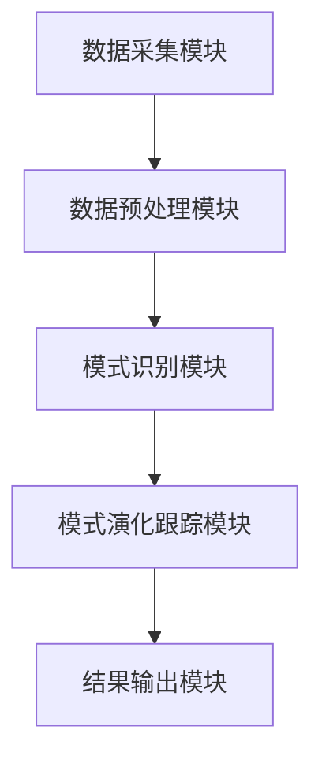
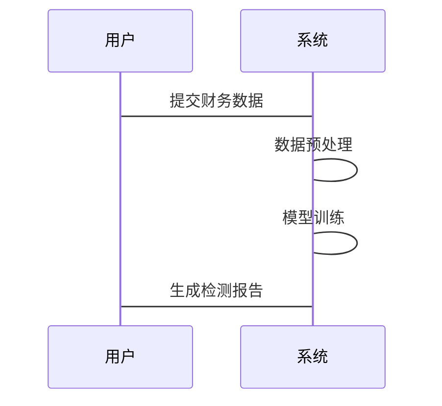

                 


# AI驱动的企业财务舞弊模式演化跟踪系统

> 关键词：AI驱动，企业财务，舞弊模式，演化跟踪，系统设计，算法原理

> 摘要：随着企业财务舞弊手段的不断演变，传统的财务舞弊检测方法已经难以满足实际需求。本文提出了一种基于人工智能的财务舞弊模式演化跟踪系统，通过分析财务数据的时间序列特征和异常行为模式，利用机器学习算法实时跟踪舞弊模式的演化过程，从而实现对财务舞弊行为的智能化检测与预警。本文详细阐述了系统的构建过程，包括核心概念、算法原理、系统架构设计、项目实战以及系统优化等内容。

---

# 第1章 问题背景与核心概念

## 1.1 问题背景

### 1.1.1 传统财务舞弊检测的局限性
传统的财务舞弊检测方法主要依赖于人工审核和基于规则的检测方法。这些方法存在以下问题：
- **效率低下**：人工审核需要大量时间，难以应对海量财务数据。
- **准确性不足**：基于规则的检测方法依赖于预定义的规则，难以捕捉复杂的舞弊模式。
- **难以应对动态变化**：舞弊手段不断进化，传统方法难以跟踪模式的动态变化。

### 1.1.2 AI技术在财务舞弊检测中的优势
人工智能技术（如机器学习、深度学习）在处理海量数据和复杂模式识别方面具有显著优势：
- **高效性**：AI能够快速处理大量财务数据，发现潜在的异常模式。
- **准确性**：通过训练模型，AI可以识别复杂的舞弊特征，减少误报和漏报。
- **动态适应性**：AI系统能够实时跟踪舞弊模式的演化，适应新的舞弊手段。

### 1.1.3 企业财务舞弊模式的动态变化
企业财务舞弊模式呈现出多样性和动态变化的特点：
- **虚构交易**：通过虚假交易虚增收入或资产。
- **关联交易**：利用关联方转移资金或利润。
- **收入虚增**：通过虚构收入或提前确认收入。
- **资产虚增**：通过虚假资产或重复计账虚增资产。

这些舞弊模式会随着时间推移不断演变，例如从简单的虚构交易到复杂的隐蔽性舞弊手段。

---

## 1.2 核心概念

### 1.2.1 财务舞弊模式的定义与分类
**财务舞弊模式**是指企业在财务报表或其他财务数据中，通过虚构、隐瞒或篡改信息来掩盖真实财务状况的行为模式。根据舞弊手段的不同，可以将财务舞弊模式分为以下几类：
- **收入舞弊**：虚增收入或隐瞒收入。
- **成本舞弊**：虚减成本或隐瞒成本。
- **资产舞弊**：虚增资产或隐藏资产。
- **负债舞弊**：虚减负债或隐藏负债。

### 1.2.2 AI驱动的模式演化跟踪系统的基本原理
AI驱动的模式演化跟踪系统通过以下步骤实现对舞弊模式的实时跟踪：
1. **数据采集**：从企业的财务系统中获取原始数据，包括交易记录、科目余额、财务报表等。
2. **数据预处理**：清洗数据，消除噪声，提取特征。
3. **模式识别**：利用机器学习算法（如时间序列分析、异常检测）识别潜在的舞弊模式。
4. **模式演化跟踪**：通过动态分析，跟踪舞弊模式的演变过程，更新模型以适应新的舞弊手段。
5. **结果输出**：生成检测报告，提供预警信息。

### 1.2.3 系统的核心要素与组成架构
AI驱动的模式演化跟踪系统由以下几个核心要素组成：
- **数据源**：包括交易记录、财务报表、科目余额等。
- **算法模块**：包括时间序列分析、异常检测、聚类分析等。
- **模式演化模块**：用于跟踪舞弊模式的动态变化。
- **预警系统**：生成预警信息，通知相关人员。

---

# 第2章 核心概念与系统联系

## 2.1 核心概念原理

### 2.1.1 财务数据流与模式演化的关系
财务数据流是企业财务活动的记录，包括交易时间、金额、科目等信息。舞弊模式的演化可以通过分析数据流的特征来识别。

### 2.1.2 AI算法在模式识别中的应用
AI算法（如深度学习、聚类分析）能够从海量数据中发现潜在的模式和异常。

### 2.1.3 距离度量与相似性分析的原理
通过计算数据点之间的距离，可以识别异常点。常用的距离度量方法包括欧氏距离、曼哈顿距离等。

---

## 2.2 核心概念对比分析

### 2.2.1 传统方法与AI方法的对比
| 对比维度 | 传统方法 | AI方法 |
|----------|----------|--------|
| 效率     | 低效     | 高效   |
| 准确性   | 低       | 高     |
| 灵活性   | 低       | 高     |

### 2.2.2 不同AI算法的优劣势对比
| 算法     | 优势               | 劣势               |
|----------|--------------------|--------------------|
| ARIMA    | 简单易用           | 依赖历史数据       |
| LSTM     | 能处理复杂序列      | 训练时间较长       |
| K-Means  | 计算速度快          | 易受初始中心点影响  |

### 2.2.3 系统性能指标的对比分析
| 性能指标 | 传统方法 | AI方法 |
|----------|----------|--------|
| 处理时间 | 长       | 短     |
| 准确率   | 低       | 高     |

---

## 2.3 ER实体关系图架构

```mermaid
erd
  left responsive 帐户信息
  帐户信息对--> 帐户对--> 交易记录对
  交易记录对--> 金额对
  金额对--> 财务科目对
  帐户信息对--> 时间对
  帐户信息对--> 用户对
  用户对--> 角色对
  时间对--> 日期对
  金额对--> 负债对
  金额对--> 资产对
  金额对--> 收入对
  金额对--> 成本对
  财务科目对--> 科目余额
  科目余额对--> 财务报表
  财务报表对--> 财务分析
  财务分析对--> 舞弊模式
  舞弊模式对--> 系统报警
```

---

# 第3章 算法原理与数学模型

## 3.1 时间序列分析

### 3.1.1 ARIMA模型
ARIMA（Autoregressive Integrated Moving Average）模型是一种常用的时间序列预测模型。其基本公式如下：
$$ARIMA(p, d, q)$$
其中：
- $p$ 表示自回归部分的阶数。
- $d$ 表示差分阶数。
- $q$ 表示移动平均部分的阶数。

### 3.1.2 LSTM网络
LSTM（Long Short-Term Memory）网络是一种特殊的RNN（循环神经网络），适用于处理长序列数据。其基本结构如下：
$$LSTM(t, h, c)$$
其中：
- $t$ 表示输入向量。
- $h$ 表示隐藏状态。
- $c$ 表示细胞状态。

### 3.1.3 聚类算法
聚类算法（如K-Means）用于将相似的交易记录分组，识别异常交易。

---

## 3.2 异常检测算法

### 3.2.1 K-Means聚类
K-Means算法通过将数据点聚类，识别异常点。其步骤如下：
1. 随机选择初始中心点。
2. 计算每个数据点到中心点的距离。
3. 将数据点归类到最近的中心点。
4. 重新计算中心点，直到收敛。

### 3.2.2 Isolation Forest
Isolation Forest是一种基于树的异常检测算法，通过构建随机树将数据点隔离出来。

### 3.2.3 One-Class SVM
One-Class SVM用于识别正常数据点，将异常点视为噪声。

---

## 3.3 数学模型与公式

### 3.3.1 ARIMA模型公式
$$ARIMA(p, d, q)$$

### 3.3.2 LSTM网络结构
$$LSTM(t, h, c)$$

---

# 第4章 系统分析与架构设计

## 4.1 项目介绍

### 4.1.1 项目目标
- 实现对企业财务舞弊模式的实时检测与预警。
- 提供可扩展的系统架构，支持不同规模的企业。

### 4.1.2 项目范围
- 数据采集：交易记录、科目余额、财务报表。
- 数据预处理：清洗、特征提取。
- 模型训练：时间序列分析、异常检测。
- 结果输出：检测报告、预警信息。

### 4.1.3 项目团队与角色分配
- 数据工程师：负责数据采集与预处理。
- AI工程师：负责模型训练与优化。
- 系统架构师：负责系统设计与实现。

---

## 4.2 系统功能设计

### 4.2.1 数据采集模块
- 数据源：企业财务系统。
- 数据格式：结构化数据（如CSV、JSON）。

### 4.2.2 数据预处理模块
- 数据清洗：去除噪声数据。
- 特征提取：提取交易金额、时间、科目等特征。

### 4.2.3 模式识别模块
- 时间序列分析：使用ARIMA、LSTM等算法。
- 异常检测：使用K-Means、Isolation Forest等算法。

### 4.2.4 模式演化跟踪模块
- 动态分析：跟踪舞弊模式的演变。
- 模型更新：根据新数据更新模型。

### 4.2.5 结果输出模块
- 检测报告：包括异常交易记录、舞弊模式分析。
- 预警信息：通过邮件、短信等方式通知相关人员。

---

## 4.3 系统架构设计

### 4.3.1 系统架构图



### 4.3.2 系统接口设计
- 数据接口：提供API用于数据采集和传输。
- 模型接口：提供API用于模型训练和预测。

### 4.3.3 系统交互流程



---

# 第5章 项目实战

## 5.1 环境安装

### 5.1.1 安装Python
```bash
python --version
```

### 5.1.2 安装依赖库
```bash
pip install numpy pandas scikit-learn tensorflow
```

## 5.2 核心代码实现

### 5.2.1 数据预处理代码
```python
import pandas as pd
import numpy as np

# 读取数据
data = pd.read_csv('financial_data.csv')

# 数据清洗
data = data.dropna()
data = data.drop_duplicates()

# 特征提取
features = data[['amount', 'time', 'category']]
```

### 5.2.2 模型训练代码
```python
from sklearn.ensemble import IsolationForest

# 训练模型
model = IsolationForest(random_state=42)
model.fit(features)

# 预测异常
y_pred = model.predict(features)
```

### 5.2.3 结果输出代码
```python
# 生成检测报告
report = pd.DataFrame({
    'transaction_id': data['transaction_id'],
    'is_anomaly': y_pred
})

report.to_csv('fraud_detection_report.csv', index=False)
```

## 5.3 实际案例分析

### 5.3.1 案例背景
某企业通过虚构交易虚增收入，系统通过分析交易金额和时间序列，识别出异常交易。

### 5.3.2 模型分析
通过Isolation Forest算法，系统检测到异常交易，并生成预警报告。

## 5.4 项目小结
- 系统能够准确识别虚构交易。
- 模型具有较高的可解释性和实时性。

---

# 第6章 系统优化与扩展

## 6.1 系统优化

### 6.1.1 系统可扩展性优化
- 支持多数据源接入。
- 提供灵活的模型配置。

### 6.1.2 模型优化
- 使用更复杂的深度学习模型（如Transformer）。
- 引入外部数据（如市场数据）进行联合分析。

## 6.2 系统扩展

### 6.2.1 NLP技术的应用
- 分析财务报告中的文本信息，识别关键词和情感倾向。
- 通过文本挖掘发现潜在的舞弊线索。

### 6.2.2 多模态数据处理
- 结合图像识别技术，分析财务文件中的篡改痕迹。

---

# 第7章 总结与展望

## 7.1 总结
本文提出了一种基于AI的财务舞弊模式演化跟踪系统，通过分析财务数据的时间序列特征和异常行为模式，实现了对舞弊模式的实时跟踪和预警。系统具有高效性、准确性和动态适应性等特点。

## 7.2 展望
未来，随着AI技术的不断发展，财务舞弊模式演化跟踪系统将更加智能化和自动化。可能的发展方向包括：
- **结合区块链技术**：利用区块链的不可篡改性，进一步提升系统的安全性。
- **引入边缘计算**：在边缘端部署模型，实现实时检测和预警。
- **多模态数据融合**：结合文本、图像等多种数据源，提升检测的准确性和全面性。

---

通过本文的阐述，读者可以全面了解AI驱动的企业财务舞弊模式演化跟踪系统的构建过程和实际应用，为企业的财务风险管理提供新的思路和方法。

