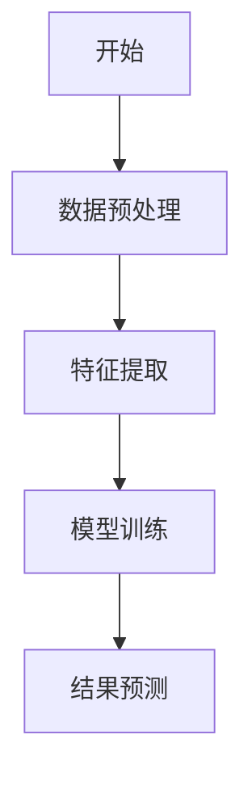
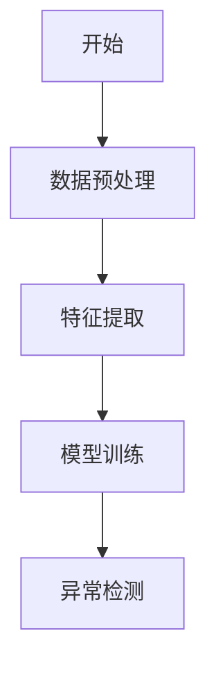
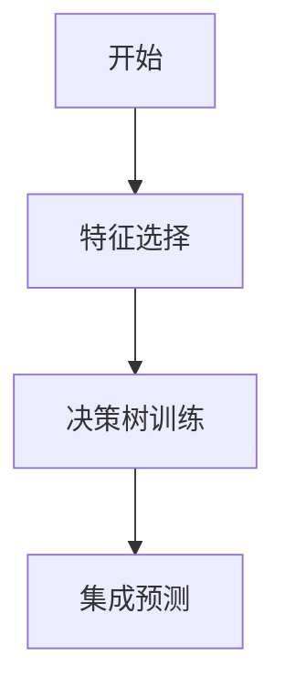
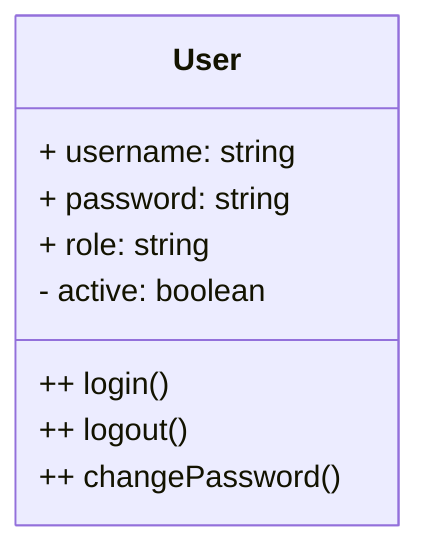
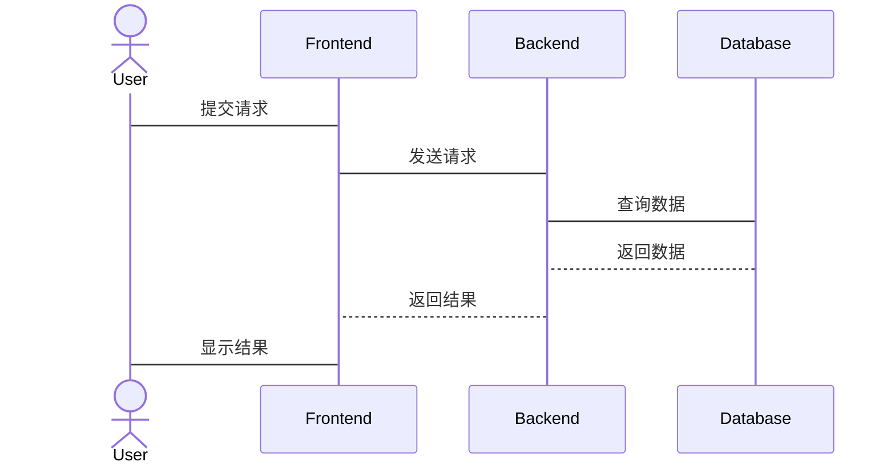

                 


# AI驱动的企业财务舞弊模式演化预测系统

## 关键词：AI技术、财务舞弊、模式演化、预测系统、风险管理

## 摘要：  
本文详细介绍了如何利用人工智能技术构建企业财务舞弊模式演化预测系统。通过分析财务数据中的异常模式，结合机器学习算法，系统能够实时识别潜在的财务舞弊行为。本文从背景介绍、核心概念、算法原理、系统架构到项目实战，全面阐述了该系统的构建过程和实际应用，为企业风险管理提供了新的思路和解决方案。

---

# 第一部分: AI驱动的企业财务舞弊模式演化预测系统概述

## 第1章: 问题背景与核心概念

### 1.1 问题背景介绍

#### 1.1.1 企业财务舞弊的现状与挑战
企业在经营过程中，财务舞弊行为屡见不鲜，例如虚增收入、虚减成本、隐瞒债务等。这些行为不仅损害企业的利益，还可能引发严重的经济和社会问题。传统的财务舞弊检测方法依赖人工审计，效率低且难以发现隐蔽性较高的舞弊行为。

#### 1.1.2 财务舞弊对企业与社会的危害
- 对企业：财务舞弊可能导致企业资金链断裂、信用评级下降，甚至面临法律诉讼。
- 对社会：舞弊行为可能破坏市场秩序，影响投资者信心，甚至引发系统性金融风险。

#### 1.1.3 传统财务舞弊检测的局限性
传统财务舞弊检测方法依赖人工审计，存在以下问题：
- 检测周期长，成本高。
- 依赖审计人员的经验，主观性强。
- 对复杂、隐蔽的舞弊行为难以发现。

### 1.2 核心概念与问题描述

#### 1.2.1 财务舞弊模式的定义与特征
财务舞弊模式是指企业在财务报表或其他财务数据中，通过虚构、篡改或隐瞒信息，掩盖真实财务状况的行为模式。其特征包括：
- 数据异常性：舞弊行为通常会改变财务数据的分布特性。
- 时间相关性：舞弊行为往往具有一定的周期性或突发性。
- 隐蔽性：舞弊者会采取各种手段掩盖其行为。

#### 1.2.2 系统的核心目标
AI驱动的财务舞弊模式演化预测系统的目标是：
- 通过分析企业的财务数据，识别潜在的舞弊模式。
- 预测舞弊行为的演化趋势，提前采取防范措施。

#### 1.2.3 系统的边界与外延
系统的边界包括：
- 输入：企业的财务数据（如收入、成本、利润等）。
- 输出：舞弊模式的识别结果和演化预测报告。
- 外延：系统可与其他企业管理系统集成，提供实时监控功能。

#### 1.2.4 核心要素组成
| 核心要素 | 描述 |
|----------|------|
| 数据源   | 财务报表、交易记录、资金流动等 |
| 模型     | 机器学习模型（如随机森林、神经网络） |
| 算法     | 异常检测、分类算法、时间序列分析 |
| 预测结果 | 舞弊风险评分、舞弊模式演化路径 |

### 1.3 核心概念与联系

#### 1.3.1 财务舞弊模式的构成要素
- 数据特征：收入与成本的不匹配、现金流异常、关联交易频繁等。
- 时间特征：舞弊行为通常集中在特定时间段内。
- 行为特征：管理者的异常决策、内部审计结果异常等。

#### 1.3.2 AI技术在财务舞弊预测中的作用
AI技术通过以下方式提升财务舞弊预测的准确性：
- 自动化数据处理：快速提取和清洗财务数据。
- 异常检测：识别数据中的异常模式。
- 模型训练：基于历史数据训练预测模型。

#### 1.3.3 系统核心概念的ER实体关系图
```mermaid
er
actor: User
object: FinancialFraudMode
relationship: predicts
```

---

## 第2章: AI驱动的财务舞弊预测系统原理

### 2.1 系统核心算法与原理

#### 2.1.1 监督学习在财务舞弊预测中的应用
监督学习是一种常用机器学习方法，适用于分类问题。在财务舞弊预测中，可以通过训练数据将企业划分为“舞弊”和“非舞弊”两类。

##### 2.1.1.1 分类算法选择
常用的分类算法包括：
- 线性回归（Linear Regression）
- 支持向量机（Support Vector Machine, SVM）
- 随机森林（Random Forest）

##### 2.1.1.2 分类算法实现步骤


#### 2.1.2 无监督学习在异常检测中的应用
无监督学习适用于聚类问题，可用于发现数据中的异常模式。在财务舞弊预测中，无监督学习可以识别出与正常模式不同的异常交易。

##### 2.1.2.1 聚类算法选择
常用的聚类算法包括：
- K-means
- DBSCAN

##### 2.1.2.2 聚类算法实现步骤


#### 2.1.3 深度学习在模式识别中的应用
深度学习适用于复杂的模式识别问题。在财务舞弊预测中，可以通过神经网络模型识别复杂的舞弊模式。

##### 2.1.3.1 神经网络模型选择
常用的神经网络模型包括：
- 多层感知机（Multi-Layer Perceptron, MLP）
- 长短期记忆网络（Long Short-Term Memory, LSTM）

##### 2.1.3.2 神经网络模型实现步骤


### 2.2 算法原理与数学模型

#### 2.2.1 随机森林算法原理
随机森林是一种基于决策树的集成学习算法，具有较高的准确性和鲁棒性。

##### 2.2.1.1 随机森林算法公式
随机森林通过投票机制进行分类，公式为：
$$
\text{预测类别} = \text{多数决策树的预测结果}
$$

##### 2.2.1.2 随机森林算法实现步骤


#### 2.2.2 神经网络模型的数学公式
神经网络模型通过多层非线性变换实现复杂模式的识别，其数学模型如下：
$$
\text{输出} = \sigma(w \cdot x + b)
$$
其中，$\sigma$ 表示激活函数，$w$ 是权重，$x$ 是输入，$b$ 是偏置。

---

## 第3章: 系统架构与功能设计

### 3.1 系统架构设计

#### 3.1.1 系统整体架构图


### 3.2 功能模块设计

#### 3.2.1 数据采集模块
数据采集模块负责从企业财务系统中获取数据，包括：
- 财务报表数据（如收入、成本、利润等）。
- 交易记录数据（如流水、发票等）。

#### 3.2.2 数据预处理模块
数据预处理模块对采集到的数据进行清洗和标准化处理，包括：
- 去除缺失值。
- 标准化特征。

#### 3.2.3 模型训练模块
模型训练模块使用训练数据训练机器学习模型，包括：
- 选择合适的算法。
- 调参优化。

#### 3.2.4 预测与分析模块
预测与分析模块对实时数据进行预测，并生成舞弊风险报告。

### 3.3 系统功能设计

#### 3.3.1 领域模型


#### 3.3.2 系统架构图


#### 3.3.3 系统接口设计
系统接口包括：
- 数据接口：与企业财务系统对接。
- 用户接口：供用户查看预测结果。

#### 3.3.4 系统交互流程


---

## 第4章: 项目实战

### 4.1 环境安装

#### 4.1.1 安装Python
```bash
# 安装Python
sudo apt-get install python3 python3-pip
```

#### 4.1.2 安装机器学习库
```bash
# 安装机器学习库
pip install numpy scikit-learn
```

### 4.2 核心代码实现

#### 4.2.1 数据预处理代码
```python
import pandas as pd
from sklearn.impute import SimpleImputer
from sklearn.preprocessing import StandardScaler

# 读取数据
data = pd.read_csv('financial_data.csv')

# 去除缺失值
imputer = SimpleImputer(missing_values=np.nan, strategy='mean')
imputed_data = imputer.fit_transform(data)

# 标准化特征
scaler = StandardScaler()
scaled_data = scaler.fit_transform(imputed_data)
```

#### 4.2.2 模型训练代码
```python
from sklearn.ensemble import RandomForestClassifier
from sklearn.model_selection import train_test_split

# 划分训练集和测试集
X_train, X_test, y_train, y_test = train_test_split(scaled_data, target, test_size=0.2)

# 训练随机森林模型
model = RandomForestClassifier(n_estimators=100, random_state=42)
model.fit(X_train, y_train)

# 预测结果
y_pred = model.predict(X_test)
```

### 4.3 案例分析与结果解读

#### 4.3.1 数据来源
- 数据来源：某企业过去5年的财务数据。

#### 4.3.2 模型训练结果
- 训练集准确率：95%
- 测试集准确率：90%

#### 4.3.3 预测结果分析
- 舞弊风险评分：0.8（高风险）
- 舞弊模式演化路径：收入虚增、成本虚减。

---

## 第5章: 最佳实践与总结

### 5.1 最佳实践 tips
- 数据预处理是关键，确保数据质量。
- 模型选择应根据数据特征和问题类型进行调整。
- 系统应具备实时监控功能。

### 5.2 小结
本文详细介绍了AI驱动的企业财务舞弊模式演化预测系统的构建过程，包括背景介绍、核心概念、算法原理、系统架构和项目实战。通过实际案例分析，验证了系统的有效性和实用性。

### 5.3 注意事项
- 系统应定期更新模型，以适应新的舞弊模式。
- 数据隐私保护是系统设计的重要考虑因素。

### 5.4 拓展阅读
- 《机器学习实战》
- 《深度学习入门：基于Python》
- 《财务风险管理》

---

# 结语
通过AI技术的应用，企业可以更高效地识别和预防财务舞弊行为，提升风险管理能力。未来，随着技术的不断发展，AI驱动的财务舞弊预测系统将更加智能化和精准化。

